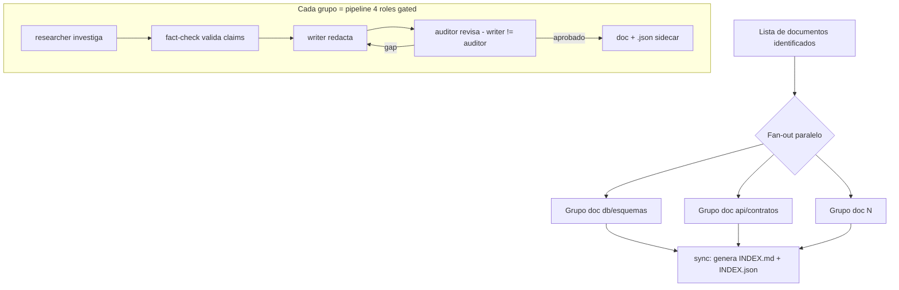

# /xdd doc-granular — Documentacion atomica maxima

> **Principio 1 — Cero deuda tecnica:** Sin evaluacion. Cada dominio tecnico tiene
> su carpeta. Cada subdominio tiene su documento. No hay "esto es obvio" ni "no merece
> doc separado". Si existe como dominio tecnico, tiene carpeta. Si existe como
> subdominio, tiene su propio archivo atomico.
>
> **Principio 2 — Atomicidad maxima:** 1 carpeta = 1 dominio tecnico. 1 doc = 1
> subdominio especifico. Un documento de auth NO contiene esquemas de DB. Un doc de
> migraciones NO contiene estrategia de CI/CD. Cada archivo puede ser leido de forma
> independiente por un sub-agente sin necesitar otro archivo del mismo dominio.
>
> **Principio 3 — Granularidad maxima:** Cada documento contiene TODO lo necesario
> para que un sub-agente implemente ese subdominio sin hacer preguntas: schemas
> completos, algoritmos, casos borde, contratos de integracion, Gherkin, Mermaid.
>
> **Pipeline worker → auditor:** quien escribe NO aprueba. El auditor rechaza si
> falta atomicidad, profundidad, o el doc mezcla subdominios.

---

## 0. Pre-flight

1. Verificar que `acuerdos/idea/` tiene los 14 artefactos del briefing cerrado.
2. Leer `acuerdos/memoria/MEMORY.md` + journal mas reciente (Art. 3).
3. Registrar inicio en `acuerdos/memoria/sprint-NN.md`.

Si `acuerdos/idea/` incompleto: ABORT — ejecutar `/xdd briefing` primero.

---

## 1. IDENTIFICACION DE DOMINIOS Y SUBDOMINIOS

El agente lee TODOS los artefactos de `acuerdos/idea/` + `acuerdos/wireframes/` +
`acuerdos/design/`.

### Estructura de salida esperada

```
acuerdos/proyecto/
  <dominio-1>/
    <subdominio-1-1>.md
    <subdominio-1-2>.md
    <subdominio-1-N>.md
  <dominio-2>/
    <subdominio-2-1>.md
    ...
  INDEX.md          ← mapa maestro con trazabilidad bidireccional
```

### Criterio de carpeta (dominio)

Una carpeta se crea cuando: el dominio tiene suficiente complejidad tecnica para
generar 2 o mas documentos atomicos distintos. Si un dominio genera solo 1 doc,
igual se crea la carpeta para consistencia y futura expansion.

### Criterio de documento (subdominio)

Un documento se crea cuando: el subdominio es una unidad tecnica separable que
un sub-agente puede implementar o consultar de forma independiente.

**Regla de atomicidad:** Si dos conceptos requieren conocimiento diferente para
implementarse, son subdominios distintos y necesitan documentos separados.

### Ejemplo de descomposicion para proyecto tipico (NO es plantilla fija)

El agente identifica los suyos leyendo el briefing. Este ejemplo ilustra el nivel:

```
acuerdos/proyecto/
  db/
    esquemas.md           ← tablas, columnas, tipos, constraints, indices
    relaciones.md         ← FK, cardinalidad, diagramas ER
    migraciones.md        ← estrategia, herramienta, scripts rollback
    seeds.md              ← datos iniciales, fixtures por ambiente
    optimizacion.md       ← queries criticos, indices compuestos, explain plans
  api/
    contratos.md          ← OpenAPI completo, versionado
    endpoints-auth.md     ← rutas de autenticacion con request/response
    endpoints-recursos.md ← CRUD de recursos del dominio con schemas
    errores.md            ← catalogo de errores normalizados (codigo, mensaje, accion)
    rate-limiting.md      ← estrategia, limites por endpoint, headers
  auth/
    flujos.md             ← diagramas de secuencia OAuth/JWT/sesiones
    tokens.md             ← estructura JWT, claims, TTL, refresh
    rbac.md               ← roles, permisos, guards, matrices de acceso
    sesiones.md           ← almacenamiento, invalidacion, concurrencia
  dominio-negocio/
    modelo.md             ← entidades, agregados, invariantes (DDD)
    eventos.md            ← domain events, emisores, consumidores
    state-machines.md     ← estados, transiciones, guards por entidad
    algoritmos.md         ← logica de negocio no trivial (pseudocodigo real)
  ui/
    componentes.md        ← catalogo, props, estados, variantes
    flujos-navegacion.md  ← mapa de pantallas, transiciones
    tokens-diseno.md      ← referencia a acuerdos/design/tokens.md
    accesibilidad.md      ← WCAG, aria-labels, contraste, teclado
    responsive.md         ← breakpoints, layout, comportamiento mobile
  seguridad/
    modelo-amenazas.md    ← STRIDE por componente (THR-NNN)
    controles.md          ← controles implementados por amenaza
    secretos.md           ← gestion de secrets, rotacion, almacenamiento
    auditoria.md          ← logs de auditoria, eventos a registrar
  observabilidad/
    logging.md            ← estructura de logs, niveles, campos obligatorios
    metricas.md           ← metricas de negocio y tecnicas, SLIs
    alertas.md            ← reglas de alerta, umbrales, runbook
    tracing.md            ← distributed tracing, spans, correlacion
  testing/
    estrategia.md         ← piramide de tests, cobertura objetivo por capa
    fixtures.md           ← datos de prueba, factories, seeds de test
    mocks.md              ← que se mockea, contratos de mocks
    e2e.md                ← escenarios criticos E2E, setup de entorno
  cicd/
    pipeline.md           ← stages, gates, parallelism
    ambientes.md          ← dev/staging/prod, diferencias, configuracion
    despliegue.md         ← estrategia (blue/green, canary), rollback
    secretos-cicd.md      ← manejo de credenciales en CI, vault
  integraciones/
    <servicio-externo-1>.md  ← contrato, autenticacion, errores, retry
    <servicio-externo-2>.md
  performance/
    benchmarks.md         ← SLOs, SLAs, umbrales de latencia
    caching.md            ← estrategia, TTL, invalidacion, patrones
    escalado.md           ← horizontal/vertical, triggers, limites
```

**El agente NO usa esta lista como plantilla.** La construye desde el briefing.
Proyectos simples: 5-8 dominios, 15-25 docs. Complejos: 15+ dominios, 60-120 docs.

---

## 2. PIPELINE WORKER → AUDITOR POR DOCUMENTO

Por cada documento se despliega un GRUPO de 4 roles independiente, en paralelo across todos
los documentos (xdd-orchestrate parallel_then_sync). Dentro del grupo, los 4 roles corren
como pipeline gated: investiga, valida claims, escribe, audita — con writer != auditor.
Cada documento tiene su propio grupo trabajando simultaneamente; el INDEX se genera en el
sync final cuando todos los grupos cerraron (ver seccion 3).

### PASO 1 — INVESTIGA (worker: specialized-researcher)

El researcher LEE primero `acuerdos/idea/idea.md` seccion "Prompt de investigacion": esa
tabla declara que temas/links investigar y que preguntas responder (el contrato de entrada
generado en el briefing). De ahi obtiene la direccion. Sin ese prompt, no hay que investigar.

```
Tarea: investigar el subdominio "<carpeta>/<nombre>.md" para el proyecto
Contexto:
  - acuerdos/idea/idea.md (Prompt de investigacion — QUE investigar)
  - acuerdos/idea/<artefactos-relevantes>.md (dimensiones del briefing)
Output: acuerdos/research/<carpeta>/<nombre>/investigacion.md
  - Responder las preguntas del prompt de investigacion relevantes a este subdominio
  - Mejores practicas especificas del subdominio
  - Patrones recomendados para el stack del proyecto
  - Riesgos conocidos y mitigaciones
  - Referencias (RFCs, docs oficiales, ejemplos reales)
```

### PASO 2 — VALIDA CLAIMS (worker: fact-check)

Ejecutar `/xdd fact-check` sobre `acuerdos/research/<carpeta>/<nombre>/investigacion.md`.
Claims con veredicto FALSO o ENGANOSO: excluir del documento.
Output: `acuerdos/research/<carpeta>/<nombre>/investigacion-validada.md`

### PASO 3 — ESCRIBE (worker: engineering-technical-writer)

Con base en investigacion validada + briefing relevante + wireframes si aplica.

Cada documento debe contener (nivel maximo — no hay secciones opcionales):

```markdown
# <Titulo del subdominio>

> Una linea: que cubre este doc y que NO cubre (fronteras del subdominio).

## 1. Vision general
<Contexto del subdominio en el proyecto. Por que existe. Decisiones tomadas en briefing.>

## 2. Diagrama de arquitectura
\`\`\`mermaid
<diagrama especifico al subdominio: flowchart, sequenceDiagram, stateDiagram, classDiagram, ER>
\`\`\`

## 3. Schemas y estructuras de datos
<SQL / TypeScript / Zod / JSON Schema completos — no resumidos. Todo campo con tipo, constraints, comentarios>

## 4. Algoritmos y logica de negocio
<Pseudocodigo o codigo real para logica no trivial. Complejidad, precondiciones, postcondiciones>

## 5. Casos borde y manejo de errores
<Tabla: caso borde, comportamiento esperado, codigo de error, recovery>

## 6. Contratos de integracion con otros subdominios
<Que expone este subdominio. Que consume. Interfaces exactas con tipos>

## 7. Escenarios de prueba (Gherkin)
\`\`\`gherkin
Feature: <subdominio>
  Scenario: Happy path — <descripcion>
  Scenario: Error — <descripcion>
  Scenario: Borde — <descripcion>
\`\`\`

## 8. Glosario del subdominio
<Tabla: termino, definicion exacta en este proyecto>

## 9. Trazabilidad
<Briefing fuente: artefacto.md seccion X. Docs relacionados: <carpeta>/<otro>.md>
```

**Rechazo inmediato (auditor no lee el contenido si):**
- Falta el bloque Mermaid
- Tiene emojis
- Tiene menos de 80 lineas
- Mezcla dos subdominios (viola atomicidad)
- Una seccion es solo bullets sin desarrollo

### PASO 4 — AUDITA (auditor: engineering-reviewer)

El auditor NO es quien escribio. Verifica las 9 secciones obligatorias + criterios:

1. **Atomicidad**: el documento cubre exactamente 1 subdominio. Si mezcla 2+: RECHAZA.
2. **Fronteras declaradas**: la primera linea declara que cubre y que NO cubre.
3. **Diagrama Mermaid**: presente y especifico al subdominio (no generico del proyecto).
4. **Schemas completos**: no resumidos. Todos los campos. No dice "ver otro doc".
5. **Casos borde**: tabla presente, no solo "manejo de errores pendiente".
6. **Gherkin**: happy path + error + borde presentes.
7. **Granularidad**: un sub-agente puede implementar desde este doc sin preguntas.
8. **Trazabilidad**: referencia al artefacto del briefing que origino este doc.
9. **DOC_STANDARD v2.0**: 0 emojis, min 80 lineas, tablas para datos estructurados.

Si hay gaps: auditor lista → writer corrige → auditor re-verifica. Max 3 iteraciones.
Si no cierra en 3: escalar al usuario con lista de gaps abiertos.

Cada gap encontrado: registrar en `acuerdos/lecciones/sprint-NN.md`.

Gate por documento:
```bash
xdd-gate.py set-author --phase spec --author "engineering-technical-writer"
xdd-gate.py approve --phase spec --approver "engineering-reviewer"
```

### PASO 5 — INDEXA (post-sync — cuando TODOS los docs estan aprobados)

Generar `acuerdos/proyecto/INDEX.md`:

```markdown
# INDEX — Documentacion del Proyecto

> Atomicidad maxima: 1 carpeta = 1 dominio, 1 doc = 1 subdominio.
> Trazabilidad bidireccional. Worker != auditor en cada documento.

## Mapa de dominios

\`\`\`mermaid
flowchart TD
  B[Briefing] --> D1[db/]
  B --> D2[api/]
  B --> D3[auth/]
  ...
\`\`\`

## Inventario completo

| Carpeta | Documento | Subdominio | Briefing origen | Lineas | Estado |
|---------|-----------|------------|-----------------|--------|--------|
| db/ | esquemas.md | Esquemas SQL | stack.md | 180 | Aprobado |
| db/ | migraciones.md | Estrategia migracion | stack.md | 95 | Aprobado |
| api/ | contratos.md | OpenAPI | arquitectura.md | 220 | Aprobado |
...

## Trazabilidad bidireccional

### Por artefacto de briefing → documentos generados
- `stack.md` → db/esquemas.md, db/migraciones.md, cicd/pipeline.md
- `auth.md` → auth/flujos.md, auth/tokens.md, auth/rbac.md

### Por documento → artefacto de briefing
- db/esquemas.md ← stack.md (seccion Base de datos), arquitectura.md
- auth/flujos.md ← auth.md, seguridad.md
```

---

## 3. ORQUESTACION — grupo de 4 roles por documento, en paralelo

`parallel_then_sync` despliega un GRUPO de 4 roles independiente POR DOCUMENTO, en paralelo
across todos los documentos. Dentro de cada grupo, los 4 roles corren como pipeline gated
(researcher -> fact-check -> writer -> auditor; writer != auditor). El sync final genera el
INDEX cuando todos los grupos terminaron.



```python
# xdd-orchestrate.py parallel_then_sync
{
  "pattern": "parallel_then_sync",
  "parallel_tasks": [
    # Un GRUPO de 4 roles por DOCUMENTO (no solo el researcher)
    {
      "doc": "db/esquemas",
      "pipeline": [
        {"agent": "specialized-researcher", "role": "investiga"},
        {"agent": "fact-check", "role": "valida claims"},
        {"agent": "engineering-technical-writer", "role": "escribe"},
        {"agent": "engineering-reviewer", "role": "audita (!= writer)"}
      ]
    },
    {
      "doc": "api/contratos",
      "pipeline": [
        {"agent": "specialized-researcher", "role": "investiga"},
        {"agent": "fact-check", "role": "valida claims"},
        {"agent": "engineering-technical-writer", "role": "escribe"},
        {"agent": "engineering-reviewer", "role": "audita (!= writer)"}
      ]
    }
    # ... un grupo de 4 roles por cada documento identificado
  ],
  "sync_task": {
    "agent": "engineering-technical-writer",
    "task": "generar INDEX.md + INDEX.json con trazabilidad bidireccional"
  }
}
```

Cada grupo es autonomo: investiga su tema, valida, escribe y se auto-audita sin depender de
otros grupos. La separacion writer != auditor (segregacion del gate) se aplica DENTRO de
cada grupo. El sync espera a que TODOS los grupos cierren antes de indexar.

---

## 4. GATE DE CIERRE

```
[ ] Estructura de carpetas creada (mkdir acuerdos/proyecto/<dominio>/ por cada dominio)
[ ] INDEX.md existe con inventario completo y trazabilidad bidireccional
[ ] Cada documento tiene firma de aprobacion (auditor != writer)
[ ] 0 gaps abiertos en ningun documento
[ ] Ningun documento mezcla subdominios (atomicidad verificada)
[ ] Cada documento tiene min 80 lineas, Mermaid, y Gherkin
```

Verificacion:
```bash
# Contar carpetas de dominio
ls -d acuerdos/proyecto/*/ | wc -l

# Contar documentos totales (excl. INDEX.md)
find acuerdos/proyecto -name "*.md" ! -name "INDEX.md" | wc -l

# Verificar atomicidad con discipline-check
for doc in $(find acuerdos/proyecto -name "*.md" ! -name "INDEX.md"); do
  python3 scripts/xdd-discipline-check.py doc --doc "$doc" || echo "FALLO: $doc"
done

# Verificar 0 emojis
python3 -c "
import re; from pathlib import Path
pat = re.compile('[\U0001F000-\U0001FAFF\U00002600-\U000027BF]+', re.UNICODE)
bad = [str(f) for f in Path('acuerdos/proyecto').rglob('*.md') if pat.search(f.read_text(errors='replace'))]
print('FALLO emojis:', bad) if bad else print('OK: 0 emojis')
"

# Gate status
python3 scripts/xdd-gate.py status
```

Al cerrar: registrar en `acuerdos/memoria/sprint-NN.md` el numero de carpetas,
documentos, lineas totales. Proxima etapa: `/xdd historias`.

---

## 5. POST-FLIGHT

```
/xdd historias
```

Lee `acuerdos/proyecto/` (estructura de carpetas completa) + `acuerdos/wireframes/`
y genera historias de usuario con 4 artefactos cada una.

---

## Agentes delegados

| Agente | Rol |
|--------|-----|
| `specialized-researcher` | Investiga cada subdominio (PASO 1) |
| `engineering-technical-writer` | Escribe cada documento (PASO 3) |
| `engineering-reviewer` | Audita cada documento — NUNCA el mismo que escribio (PASO 4) |
| `product-manager` | Audita alineacion con briefing en docs de producto/dominio-negocio |
