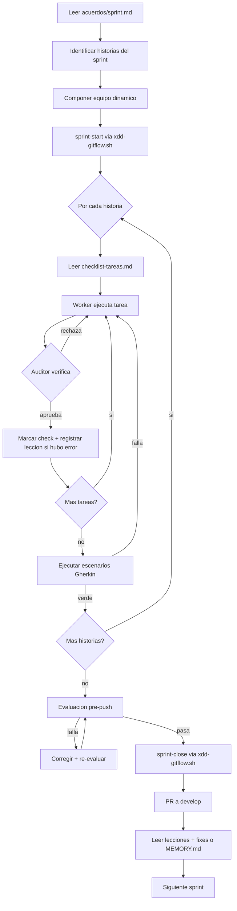

# /xdd sprint — Ciclo completo de sprint

> **Principio (cero deuda tecnica):** El agente no asume nada. Toda tarea del
> checklist se ejecuta. El auditor verifica cada check. Los errores se registran
> en lecciones antes del push. Sin atajos.
>
> **Patron worker → auditor:** Cada historia tiene su equipo de implementacion
> (workers especializados) + un auditor permanente. El auditor marca checks
> completados, rechaza implementaciones incompletas e itera hasta cerrar.

## 0. Pre-flight

1. Verificar que `acuerdos/sprint.md` existe (generado por `/xdd historias`).
2. Leer `acuerdos/sprint.md` para identificar el sprint a ejecutar.
3. Si `--sprint=NN` no se pasa: tomar el primer sprint sin branch en git.
4. Verificar que la branch del sprint anterior esta mergeada en develop:
   ```bash
   bash scripts/xdd-gitflow.sh sprint-start --sprint=NN --title=<titulo>
   # xdd-gitflow.sh verifica el sprint anterior automaticamente
   ```
5. Leer `acuerdos/memoria/MEMORY.md` + `acuerdos/memoria/sprint-NN.md` anterior (Art. 3).

---

## 1. LECTURA DE LA HISTORIA

El agente lee TODAS las historias asignadas al sprint actual en `acuerdos/sprint.md`:

```bash
# Extraer historias del sprint NN de acuerdos/sprint.md
grep -A 20 "Sprint NN" acuerdos/sprint.md
```

Por cada historia del sprint, leer:
- `acuerdos/historia-usuario-N/propuesta.md`
- `acuerdos/historia-usuario-N/requisitos-escenarios.md`
- `acuerdos/historia-usuario-N/escenario-tecnico.md`
- `acuerdos/historia-usuario-N/checklist-tareas.md`

---

## 2. COMPOSICION DEL EQUIPO DINAMICO

El agente analiza `escenario-tecnico.md` de cada historia e identifica los componentes:

| Componente detectado | Agente worker asignado |
|---|---|
| Frontend / UI | `engineering-frontend-developer` |
| Backend / API | `engineering-backend-developer` |
| Base de datos / migraciones | `engineering-database-architect` |
| Autenticacion / sesiones | `engineering-security-engineer` |
| Infraestructura / Docker / CI | `engineering-devops-engineer` |
| Integraciones externas / APIs | `engineering-api-designer` |
| Tests BDD / Playwright | `testing-workflow-optimizer` |
| Contratos de API | `testing-contract-testing-engineer` |

**Fijos en todos los sprints:**
- `engineering-code-reviewer` — auditor permanente (NUNCA el mismo que implementa)
- `engineering-qa-engineer` — evaluador pre-push

El equipo se registra al inicio del sprint en `acuerdos/memoria/sprint-NN.md`:

```markdown
## Equipo del Sprint

| Rol | Agente | Historia(s) |
|-----|--------|-------------|
| Frontend worker | engineering-frontend-developer | HU-1, HU-3 |
| Backend worker | engineering-backend-developer | HU-1, HU-2 |
| Auditor | engineering-code-reviewer | todas |
| Evaluador pre-push | engineering-qa-engineer | todas |
```

---

## 3. EJECUCION DEL CHECKLIST (TDD — tests primero)

Por cada historia del sprint, ejecutar el checklist atomico en orden:

### Regla estricta de orden TDD:
1. Tests primero (Rojo) — antes de implementar
2. Implementacion minima (Verde)
3. Refactor manteniendo verde

### Ciclo por tarea del checklist:

```
[Worker lee tarea del checklist]
      ↓
[Worker ejecuta tarea]
      ↓
[Auditor verifica tarea completada]
      ↓
  ¿Aprobada? ──NO──→ [Worker corrige] ──→ [Auditor re-verifica] (max 3x)
      │
     SI
      ↓
[Auditor marca [x] en checklist-tareas.md]
      ↓
[Si es error del worker] → registrar en acuerdos/lecciones/sprint-NN.md
```

**El auditor registra en lecciones CUALQUIER:**
- Tarea ejecutada incorrectamente (con la correccion aplicada)
- Test que paso sin implementacion real (test frágil)
- Asuncion del worker no documentada en escenario-tecnico.md
- Control de seguridad omitido o implementado incorrectamente

**Formato de registro en lecciones:**

```markdown
### [CATEGORIA] Titulo — YYYY-MM-DD
**Contexto:** Historia HU-N, tarea X del checklist.
**Problema:** Que fallo o se omitio.
**Causa raiz:** Por que el worker erro.
**Leccion:** Regla para evitar en proximas historias.
**Aplica a:** Ambito.
```

---

## 4. VERIFICACION DE ESCENARIOS GHERKIN

Una vez completo el checklist de una historia, ejecutar los escenarios de `requisitos-escenarios.md`:

```bash
# Ejecutar tests BDD si framework configurado
npx playwright test  # o vitest --run  # o pytest
```

Si algun escenario falla:
1. Identificar causa: implementacion o test desactualizado
2. Corregir implementacion (no el test — el test es la especificacion)
3. Re-ejecutar hasta verde
4. Si el test contradice la implementacion acordada: escalar al usuario

---

## 5. EVALUACION PRE-PUSH

Antes de cerrar el sprint, el evaluador (`engineering-qa-engineer`) ejecuta:

### 5.1 Tests completos

```bash
python3 -m pytest -q                    # tests Python
bats tests/*.bats 2>/dev/null || true   # tests bash
```

Si algun test falla: BLOQUEAR push. Worker corrige. Re-ejecutar.

### 5.2 Shield audit

```bash
python3 scripts/xdd-shield.py audit --ci
```

0 CRITICAL obligatorio. Si hay CRITICAL: BLOQUEAR push. Corregir primero.

### 5.3 Validacion .gitignore

```bash
bash scripts/xdd-gitflow.sh pre-push
```

Artefactos X-DD (acuerdos/, memoria.md, lecciones.md, .xdd/) NO deben estar staged.

### 5.4 Reporte de evaluacion

El evaluador escribe en `acuerdos/memoria/sprint-NN.md`:

```markdown
## Evaluacion Pre-Push

| Check | Resultado |
|-------|-----------|
| Tests | N passed, 0 failed |
| Shield | 0 CRITICAL, N warnings |
| .gitignore | limpio |
| Gitleaks | limpio |
| Timestamp | YYYY-MM-DD HH:MM UTC |
```

Si todos los checks pasan: APROBADO para push.

---

## 6. GITFLOW — CIERRE DEL SPRINT

```bash
bash scripts/xdd-gitflow.sh sprint-close --sprint=NN
```

Esto:
1. Crea `acuerdos/memoria/sprint-NN.md` (si no existe)
2. Push a `feature/sprint-NN-<titulo>`
3. Crea PR a develop (auto-merge en dev-solo, reviewer en collab)

Gate de fase:
```bash
xdd-gate.py set-author --phase build --author "engineering-technical-writer"
xdd-gate.py approve --phase build --approver "engineering-code-reviewer"
```

---

## 7. POST-SPRINT — LECTURA DE LECCIONES

Una vez mergeada la PR:

1. Leer `acuerdos/lecciones/sprint-NN.md`
2. Por cada leccion:
   - Tipo BUG (implementacion incorrecta): proponer fix en proximo sprint como HT (historia tecnica de fix)
   - Tipo PROCESO (gap de metodologia): actualizar `acuerdos/memoria/MEMORY.md` con la decision
   - Tipo HERRAMIENTAS: proponer nueva skill en `skills/<name>/SKILL.md`

3. Actualizar `acuerdos/memoria/MEMORY.md` con hechos duraderos del sprint

4. Preparar para siguiente sprint:
   ```bash
   # Verificar que develop tiene la PR mergeada
   git checkout develop && git pull
   # Iniciar siguiente sprint
   bash scripts/xdd-gitflow.sh sprint-start --sprint=NN+1 --title=<proximo-titulo>
   ```

---

## 8. DIAGRAMA DE FLUJO DEL CICLO



---

## Agentes del ciclo

| Agente | Rol | Permanente |
|--------|-----|-----------|
| Orquestador | Coordina el ciclo completo | Si |
| Workers especializados | Implementan segun componente detectado | Por sprint |
| `engineering-code-reviewer` | Auditor — verifica checks, jamas implementa | Si |
| `engineering-qa-engineer` | Evaluador pre-push — tests + shield + gitignore | Si |
