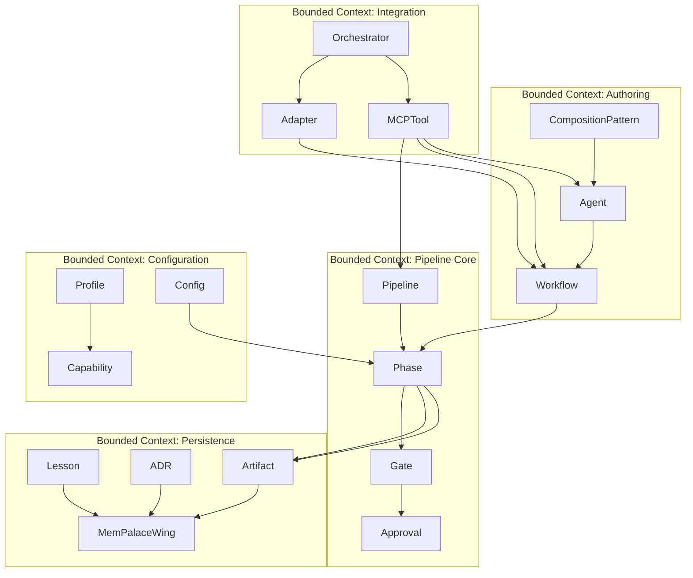

# DOMAIN — X-DD v0.1.0 (Domain-Driven Design)

> Modelo de dominio del propio X-DD aplicado a sí mismo (dogfooding, ADR-0001).
> Ubiquitous language usado en SPEC, FEATURES, ADRs, workflows y código.

## Bounded Contexts

---

## Entidades principales

### Pipeline
**Concepto raíz.** Secuencia inmutable de 6 fases (Constitución Art. 9). No se pueden añadir, quitar ni reordenar fases.

- **Atributos:** `version` (semver), `phases: List[Phase]`.
- **Invariantes:** `len(phases) == 6`; `phases` siempre en orden Briefing→Spec→Plan→Build→QA→Retro.

### Phase
Etapa del pipeline. Cada una produce artefactos específicos y requiere aprobación para avanzar.

- **Atributos:** `id` (`briefing|spec|plan|build|qa|retro`), `artifacts: List[Artifact]`, `gate: Gate`.
- **Invariantes:** `id` única en el pipeline; `artifacts` ≥ 1 documento markdown obligatorio.

### Gate
Mecanismo de control que valida la transición entre fases. A partir de v0.1.0 firmado con HMAC-SHA256 (ADR-0006).

- **Atributos:** `status: Status` (PENDIENTE | EN_REVIEW | APROBADO | RECHAZADO), `checksums: Dict[Artifact, str]`, `signature: HMAC256`, `approvers: List[Approval]`.
- **Invariantes:** transición permitida solo si fase anterior está APROBADO; firma válida contra `.xdd/.gate-key`; checksums coinciden con artefactos actuales.

### Approval
Evento de aprobación de una fase. Inmutable una vez registrado.

- **Atributos:** `approver: str`, `timestamp: datetime`, `comment?: str`.

### Workflow
Receta ejecutable que orquesta agentes para producir uno o más artefactos. Markdown plano en `.agent/workflows/*.md`.

- **Atributos:** `name` (slug), `description` (frontmatter obligatorio), `precondition: Gate.validate(from_phase)`, `postcondition: Gate.validate(to_phase)`, `agents: List[Agent]`.
- **Invariantes:** frontmatter `description:` obligatorio (lint); entrada en catálogo obligatoria.

### Agent
Especialista IA con prompt, skills y constraints. Catalogado en `prompts/agents/registry.json` (Sprint 5).

- **Atributos:** `id`, `category`, `skills: List[str]`, `constraints: List[str]`, `prompt_file: Path`, `ide_compat: List[str]`.
- **Invariantes:** `prompt_file` existe; `id` único en el registry.

### CompositionPattern
Patrón de orquestación de múltiples agentes (lead + specialists).

- **Atributos:** `name`, `lead: Agent.id`, `specialists: List[Agent.id]`, `orchestration: sequential | parallel_then_sync`, `gate_between: str`.

### Profile
Manifesto declarativo del **tipo de producto** que es el proyecto consumidor. Estable, cambia raramente.

- **Atributos:** `profile: saas | mobile | lib | internal | custom`, `capabilities: Dict[str, bool]`, `stacks: Dict[str, Optional[str]]`.
- **Invariantes:** `profile` único; coexiste con `Config` sin overlap (ADR-0002).

### Config
Configuración **operacional** del proyecto: cómo se integran las herramientas. Cambia con cada bump.

- **Atributos:** `xdd_version`, `mempalace.{enabled,version_constraint,index,triggers,fallback,mcp}`, `pipeline.{gates,phases}`, `agents.{registry,max_concurrent,fallback_strategy,orchestration_pattern}`, `ide_adapters.generate_for`.
- **Invariantes:** validable contra `schemas/xdd.config.schema.json` (Sprint 3).

### Capability
Característica activable según `Profile`: i18n, feature_flags, analytics, privacy, observability, finops, mobile_release, perf_budget, a11y, end_user_docs, api_contract, contract_test, db_migrate, data_pipeline, ml_eval, dr_drill.

### Adapter
Generador de configuración específica por IDE desde el SSoT (`prompts/` y `.agent/workflows/`).

- **Atributos:** `ide: claude-code | opencode`, `output_paths: List[Path]`, `transform: (workflow, agent) -> str`.
- **Invariantes:** v0.1.0 solo soporta `claude-code` y `opencode` (ADR-0007). Otros IDEs vía MCP.

### MCPTool
Herramienta expuesta por el MCP server propio de X-DD (Sprint 6, ADR-0005).

- **Atributos:** `name`, `input_schema: JSONSchema`, `output_schema: JSONSchema`, `handler: callable`.
- **Conjunto mínimo v0.1.0:** `xdd_validate_phase`, `xdd_transition_phase`, `xdd_list_workflows`, `xdd_invoke_workflow`, `xdd_list_agents`, `xdd_get_phase_artifacts`.

### Orchestrator
Programa cliente (Claude Code, OpenCode, Cursor, etc.) que ejecuta workflows y agentes.

- **Atributos:** `name`, `protocol: slash_command | mcp | rules_file`, `auth_required: bool`.

### Artifact
Documento producido por una fase. Versionable.

- **Atributos:** `path: Path`, `phase: Phase`, `checksum: SHA256`, `producer: Workflow.id`.

### MemPalaceWing
Agrupación de proyecto/persona en MemPalace (concepto nativo). X-DD indexa los artefactos en el wing del proyecto consumidor.

- **Atributos:** `name: str` (default: nombre del proyecto), `rooms: List[str]` (temas), `drawers: List[str]` (contenido indexado).

### Lesson
Aprendizaje registrado tras un sprint o cierre de fase. Vive en `lecciones.md`.

- **Atributos:** `category: ARQUITECTURA | SEGURIDAD | DOMINIO | TESTING | DEVOPS | PROCESO | HERRAMIENTAS`, `context`, `problem`, `root_cause`, `lesson`, `applies_to`, `date`.

### ADR
Architecture Decision Record formato Nygard. Vive en `docs/adr/NNNN-*.md`.

- **Atributos:** `number: int`, `title`, `status: Propuesto | Aceptado | Reemplazado | Deprecado`, `context`, `decision`, `alternatives`, `consequences`, `review_plan`.
- **Invariantes:** numeración secuencial sin huecos; nunca se borra (se marca como Reemplazado/Deprecado).

---

## Value Objects

| VO | Definición |
|----|-----------|
| `Status` | Enum: `PENDIENTE` / `EN_REVIEW` / `APROBADO` / `RECHAZADO`. Inmutable. |
| `SemVer` | Tripleta `MAJOR.MINOR.PATCH` con sufijo opcional (`-dev`, `-rc1`). |
| `SHA256` | Hash hex de 64 chars o truncado a 16. |
| `HMAC256` | Mensaje firmado con `secrets.token_bytes(32)` (la `.gate-key`). |

---

## Agregados

- **PipelineRun:** `Pipeline + Phase[] + Gate[] + Artifact[]`. Raíz: Pipeline. Cluster transaccional para validar transiciones.
- **AgentCatalog:** `Agent[] + CompositionPattern[]` desde `registry.json`. Raíz: Agent.
- **ProjectConfig:** `Profile + Config`. Raíz: Profile (más estable).

---

## Ubiquitous Language (glosario)

- **APROBADO** — estado de fase que permite transición (con firma HMAC desde v0.1.0).
- **Briefing** — Fase 1: requirements, FEATURES.md, .feature stubs.
- **Spec** — Fase 2: SPEC.md, DOMAIN.md, THREATS.md.
- **Plan** — Fase 3: PLAN.md organizado por features.
- **Build** — Fase 4: src/ + tests/ con TDD/STDD/SecDD.
- **QA** — Fase 5: QA_REPORT.md con SAST + DAST + BDD/ATDD ejecutables.
- **Retro** — Fase 6: lecciones.md + memoria.md actualizados.
- **Dogfooding** — aplicar X-DD al propio X-DD (ADR-0001).
- **Wing** — agrupación de proyecto en MemPalace.
- **MCP** — Model Context Protocol; vía preferida de integración (ADR-0005).
- **Gate** — control entre fases; programático con HMAC desde v0.1.0.

---

## Reglas invariantes del dominio

1. **Una pasada del Pipeline = una `PipelineRun`.** No hay re-ejecución parcial sin nueva instancia.
2. **`Phase.gate.status == APROBADO`** es precondición de la siguiente fase.
3. **`Phase.gate.signature` debe verificarse contra la `.gate-key` actual** o el gate se considera roto (RECHAZADO automático).
4. **Cada `Workflow` declara su precondition y postcondition** explícitas via `xdd-gate.py` (Sprint 4).
5. **Cada `Agent` está catalogado en el `registry.json`** y solo se invoca desde ahí (Sprint 5).
6. **Toda decisión arquitectónica produce un `ADR` antes de implementarse.**
7. **`Profile` es declarativo; `Config` es operacional** — nunca se duplican campos (ADR-0002).
