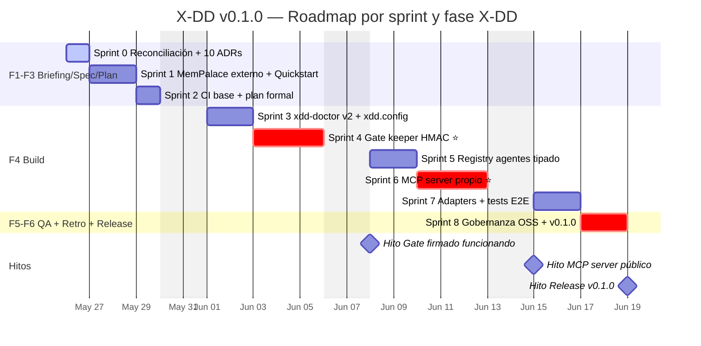
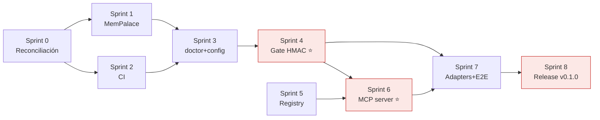

# PROJ-MASTER-PLAN — X-DD v0.1.0

> Carta Gantt del release v0.1.0. Mantenida por `/xdd-trace`.
> Cada cierre de sprint marca tareas como `done` y actualiza fechas reales.

## Resumen

- **Release:** v0.1.0
- **Sprints:** 8 + Sprint 0 (Reconciliación)
- **Esfuerzo estimado:** ~17.5 días de trabajo
- **Plan macro:** [MEJORAS-X-DD.md](MEJORAS-X-DD.md) + anexo v1.2
- **SPEC:** [.xdd/briefing/SPEC.md](.xdd/briefing/SPEC.md)
- **Features:** [.xdd/briefing/FEATURES.md](.xdd/briefing/FEATURES.md)
- **ADRs:** [docs/adr/](docs/adr/)

## Gantt

## Estado por sprint

| Sprint | Estado | Fase X-DD | Inicio plan | Cierre plan | Inicio real | Cierre real | PR |
|--------|--------|-----------|-------------|-------------|-------------|-------------|-----|
| 0 Reconciliación | ✅ done | F1 Briefing | 2026-05-26 | 2026-05-26 | 2026-05-26 | 2026-05-26 | [#1](https://github.com/Cucholambr3ta/x-dd/pull/1) |
| 1 MemPalace externo + Quickstart | ✅ done | F2 Spec | 2026-05-27 | 2026-05-28 | 2026-05-26 | 2026-05-26 | [#2](https://github.com/Cucholambr3ta/x-dd/pull/2) |
| 2 CI base + plan formal | ✅ done | F3 Plan | 2026-05-29 | 2026-05-29 | 2026-05-26 | 2026-05-26 | [#3](https://github.com/Cucholambr3ta/x-dd/pull/3) |
| 3 xdd-doctor v2 + xdd.config | ✅ done | F4 Build (1/5) | 2026-06-01 | 2026-06-02 | 2026-05-26 | 2026-05-26 | [#4](https://github.com/Cucholambr3ta/x-dd/pull/4) |
| 4 Gate keeper HMAC ⭐ | ✅ done | F4 Build (2/5) | 2026-06-03 | 2026-06-05 | 2026-05-26 | 2026-05-26 | [#5](https://github.com/Cucholambr3ta/x-dd/pull/5) |
| 5 Registry agentes tipado | ✅ done | F4 Build (3/5) | 2026-06-08 | 2026-06-09 | 2026-05-26 | 2026-05-26 | [#7](https://github.com/Cucholambr3ta/x-dd/pull/7) |
| 6 MCP server propio ⭐ | ✅ done | F4 Build (4/5) | 2026-06-10 | 2026-06-12 | 2026-05-26 | 2026-05-26 | [#8](https://github.com/Cucholambr3ta/x-dd/pull/8) |
| 7 Adapters + Hooks + Manifests + E2E ⭐ | ✅ done | F4 Build (5/5) + F5 QA | 2026-06-15 | 2026-06-17 | 2026-05-26 | 2026-05-26 | [#9](https://github.com/Cucholambr3ta/9) |
| 8 Gobernanza OSS + 3-tier docs + agent.yaml ⭐ | ✅ done | F6 Retro init | 2026-06-17 | 2026-06-19 | 2026-05-26 | 2026-05-26 | [#10](https://github.com/Cucholambr3ta/x-dd/pull/10) |
| 9 Continuous Learning (instincts + /evolve + SQLite) | ✅ done | F4 ext | 2026-06-20 | 2026-06-23 | 2026-05-26 | 2026-05-26 | [#11](https://github.com/Cucholambr3ta/x-dd/pull/11) |
| 10 Skills + Eval-harness + xdd-talk-compact | ✅ done | F4 ext | 2026-06-24 | 2026-06-29 | 2026-05-26 | 2026-05-26 | [#12](https://github.com/Cucholambr3ta/x-dd/pull/12) |
| 11 Multi-agent orchestration runtime | ✅ done | F4 ext | 2026-06-30 | 2026-07-03 | 2026-05-26 | 2026-05-26 | [#13](https://github.com/Cucholambr3ta/x-dd/pull/13) |
| 12 AgentShield + Shannon dep + rename | ✅ done | F4 ext + F5 audit | 2026-07-04 | 2026-07-05 | 2026-05-26 | 2026-05-26 | [#14](https://github.com/Cucholambr3ta/x-dd/pull/14) |
| 13 White-labeling (branding + 4 personas) | ✅ done | F6 ext | 2026-07-06 | 2026-07-08 | 2026-05-26 | 2026-05-26 | [#15](https://github.com/Cucholambr3ta/x-dd/pull/15) |
| **14** Workspace mode + Wizard interactivo | ⏳ pendiente | F6 ext | 2026-07-09 | 2026-07-11 | — | — | — |
| **Release** v0.1.0 tag firmado | ⏳ pendiente | Release | 2026-07-12 | 2026-07-12 | — | — | — |

Leyenda: 🔄 en curso · ✅ done · ⏳ pendiente · ❌ blocked

## Tareas detalladas por sprint

Ver [.xdd/briefing/FEATURES.md](.xdd/briefing/FEATURES.md) y secciones por sprint en
[el plan macro](MEJORAS-X-DD.md).

## Dependencias críticas

## Historial de actualizaciones

| Fecha | Cambio | Autor |
|-------|--------|-------|
| 2026-05-26 | Creación inicial al cerrar Sprint 0 | aplacencia |
| 2026-05-26 | Sprint 0 mergeado (PR #1); Sprint 1 en curso | aplacencia |
| 2026-05-26 | Sprint 1 mergeado (PR #2, squash c5be687); Sprint 2 en curso | aplacencia |
| 2026-05-26 | Sprint 2 mergeado (PR #3, squash ed9eed7); Sprint 3 en curso | aplacencia |
| 2026-05-26 | Sprint 3 mergeado (PR #4, squash 3310f8b); Sprint 4 en curso (gate ⭐) | aplacencia |
| 2026-05-26 | Sprint 4 mergeado (PR #5, squash 5c4d26c); Sprint 5 en curso | aplacencia |
| 2026-05-26 | Fix PR #6 (CI markdownlint relax) mergeado; política cambiada a `delete_branch_on_merge=false` para preservar trazabilidad por sprint | aplacencia |
| 2026-05-26 | Sprint 5 mergeado (PR #7, squash b24582a); Sprint 6 en curso (MCP server ⭐) | aplacencia |
| 2026-05-26 | Sprint 6 mergeado (PR #8, squash 572326f); Sprint 7 ampliado en curso (adapters+hooks+manifests, inspiración ECC) | aplacencia |
| 2026-05-26 | Plan actualizado a estrategia MAXIMALISTA (Sprints 7-12 todos para v0.1.0, ~23 días extra) | aplacencia |
| 2026-05-26 | Sprint 7 ampliado mergeado (PR #9, squash b6669a4); Sprint 8 en curso (gobernanza + 3-tier docs) | aplacencia |
| 2026-05-26 | Sprint 8 ampliado mergeado (PR #10, squash adede3b); Sprint 9 en curso (continuous learning) | aplacencia |
| 2026-05-26 | Sprints 13 (White-labeling) y 14 (Workspace+Wizard) nuevos agregados al plan v0.1.0; total ~36d | aplacencia |
| 2026-05-26 | Sprint 9 mergeado (PR #11, 88d87ce); Sprint 10 en curso (Skills + Eval + caveman MIT) | aplacencia |
| 2026-05-26 | Sprint 10 mergeado (PR #12); Sprint 11 en curso (orchestration runtime) | aplacencia |
| 2026-05-26 | Sprint 11 mergeado (PR #13, 16c856c); Sprint 12 en curso (AgentShield + Shannon dep) | aplacencia |
| 2026-05-26 | Sprint 12 mergeado (PR #14, 4f9a165); Sprint 13 en curso (white-labeling) | aplacencia |
| 2026-05-26 | Sprint 13 mergeado (PR #15, 4abfb58). Pendiente S14 + release v0.1.0 | aplacencia |
| 2026-05-27 | fix/docs-sync-s9-s13 — sync doc drift detectado en 9 files post-S13 | aplacencia |
