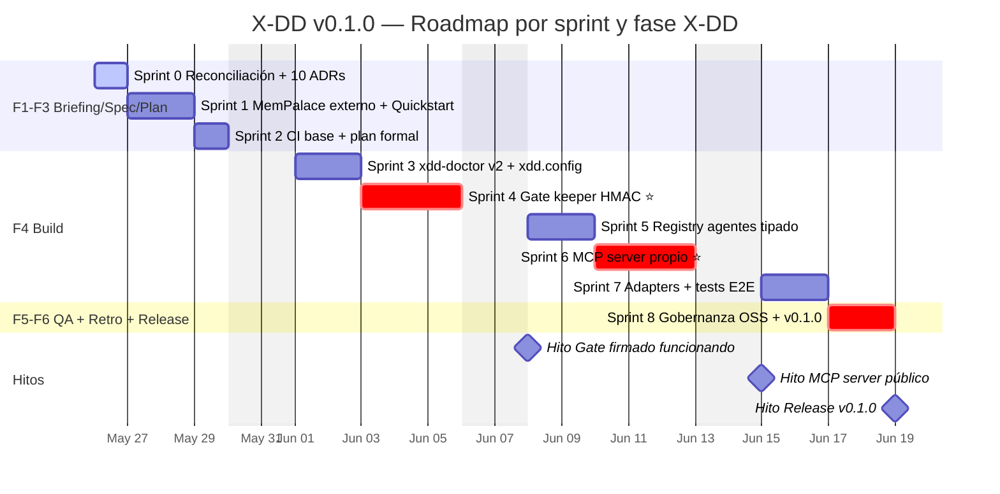
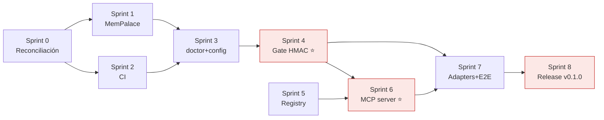

# PROJ-MASTER-PLAN — X-DD v0.1.0

> Carta Gantt del release v0.1.0. Mantenida por `/xdd-trace`.
> Cada cierre de sprint marca tareas como `done` y actualiza fechas reales.

## Resumen

- **Release:** v0.1.0
- **Sprints:** 8 + Sprint 0 (Reconciliación)
- **Esfuerzo estimado:** ~17.5 días de trabajo
- **Plan macro:** [MEJORAS-X-DD.md](MEJORAS-X-DD.md) + anexo v1.2
- **SPEC:** [.xdd/briefing/SPEC.md](.xdd/briefing/SPEC.md)
- **Features:** [.xdd/briefing/FEATURES.md](.xdd/briefing/FEATURES.md)
- **ADRs:** [docs/adr/](docs/adr/)

## Gantt

## Estado por sprint

| Sprint | Estado | Fase X-DD | Inicio plan | Cierre plan | Inicio real | Cierre real | PR |
|--------|--------|-----------|-------------|-------------|-------------|-------------|-----|
| 0 Reconciliación | ✅ done | F1 Briefing | 2026-05-26 | 2026-05-26 | 2026-05-26 | 2026-05-26 | [#1](https://github.com/Cucholambr3ta/x-dd/pull/1) |
| 1 MemPalace externo + Quickstart | ✅ done | F2 Spec | 2026-05-27 | 2026-05-28 | 2026-05-26 | 2026-05-26 | [#2](https://github.com/Cucholambr3ta/x-dd/pull/2) |
| 2 CI base + plan formal | 🔄 En curso | F3 Plan | 2026-05-29 | 2026-05-29 | 2026-05-26 | — | _pendiente_ |
| 3 xdd-doctor v2 + xdd.config | ⏳ | F4 Build (1/5) | 2026-06-01 | 2026-06-02 | — | — | — |
| 4 Gate keeper HMAC ⭐ | ⏳ | F4 Build (2/5) | 2026-06-03 | 2026-06-05 | — | — | — |
| 5 Registry agentes tipado | ⏳ | F4 Build (3/5) | 2026-06-08 | 2026-06-09 | — | — | — |
| 6 MCP server propio ⭐ | ⏳ | F4 Build (4/5) | 2026-06-10 | 2026-06-12 | — | — | — |
| 7 Adapters + tests E2E | ⏳ | F4-5 | 2026-06-15 | 2026-06-16 | — | — | — |
| 8 Gobernanza OSS + v0.1.0 | ⏳ | F6 Retro + Release | 2026-06-17 | 2026-06-18 | — | — | — |

Leyenda: 🔄 en curso · ✅ done · ⏳ pendiente · ❌ blocked

## Tareas detalladas por sprint

Ver [.xdd/briefing/FEATURES.md](.xdd/briefing/FEATURES.md) y secciones por sprint en
[el plan macro](MEJORAS-X-DD.md).

## Dependencias críticas

## Historial de actualizaciones

| Fecha | Cambio | Autor |
|-------|--------|-------|
| 2026-05-26 | Creación inicial al cerrar Sprint 0 | aplacencia |
| 2026-05-26 | Sprint 0 mergeado (PR #1); Sprint 1 en curso | aplacencia |
| 2026-05-26 | Sprint 1 mergeado (PR #2, squash c5be687); Sprint 2 en curso | aplacencia |
