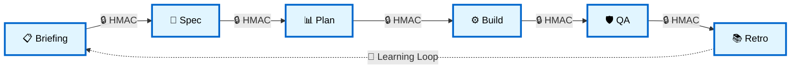
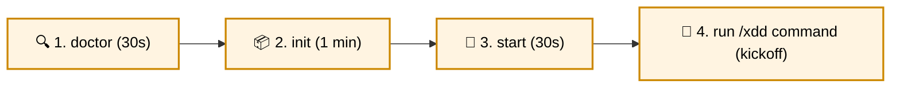
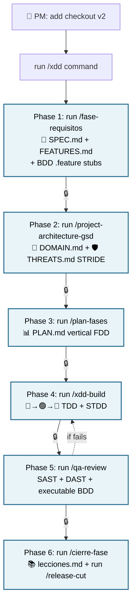
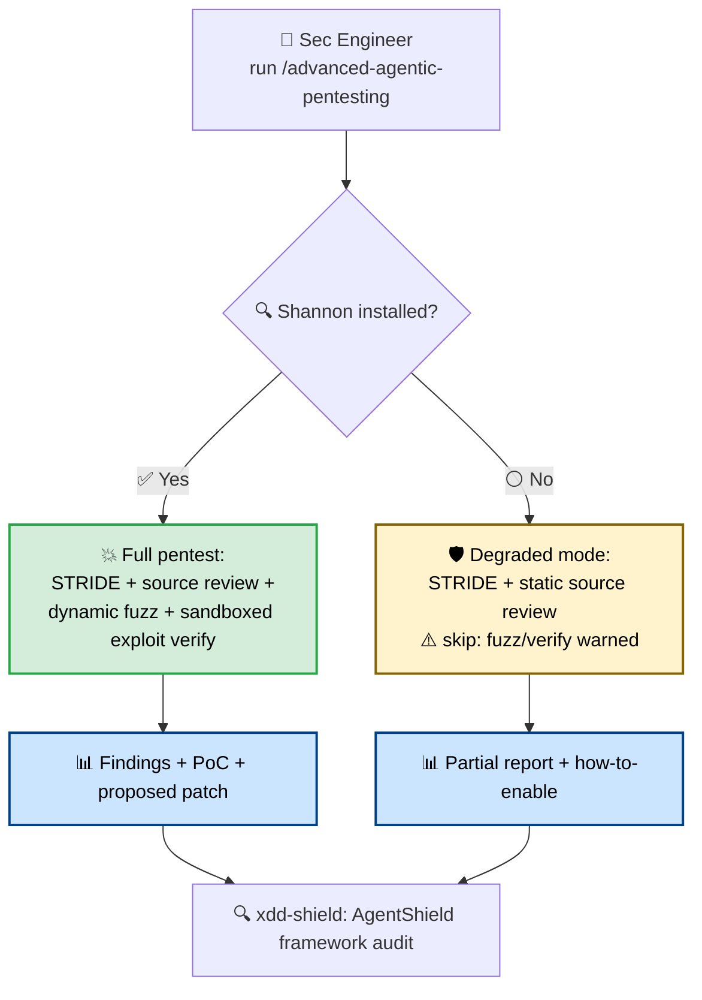
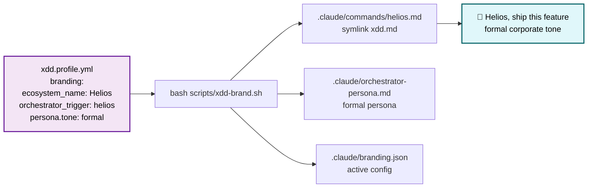
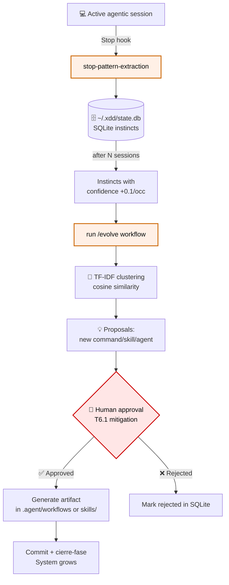
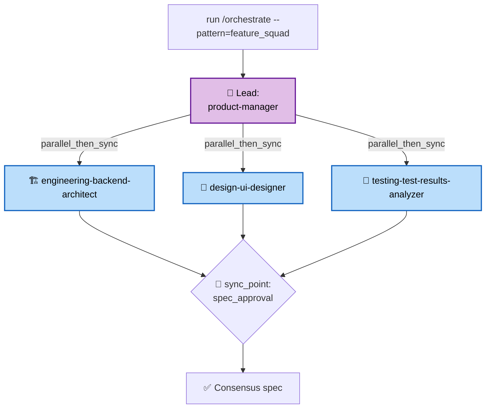
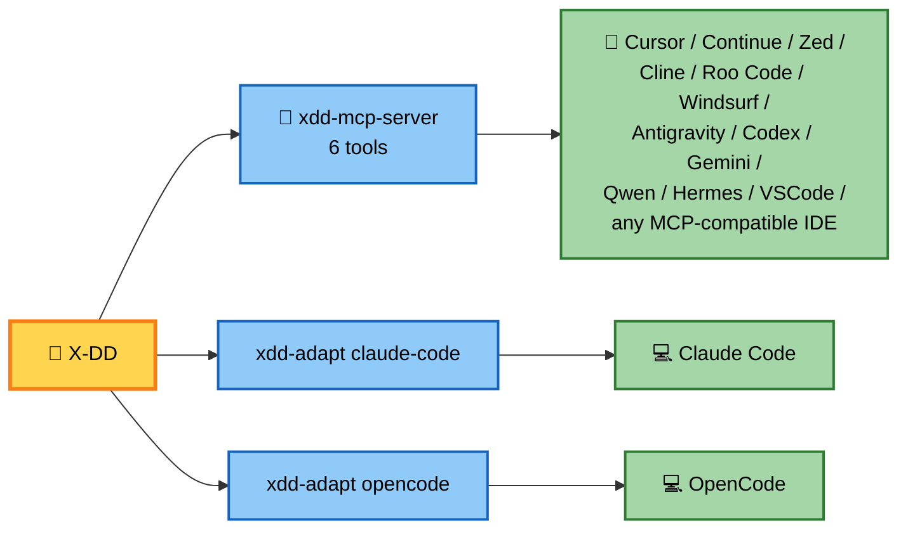
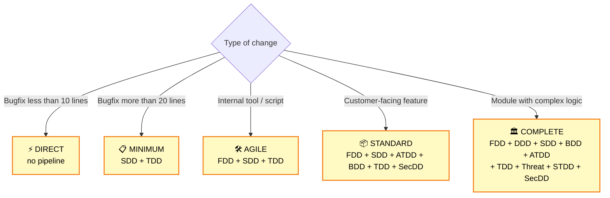
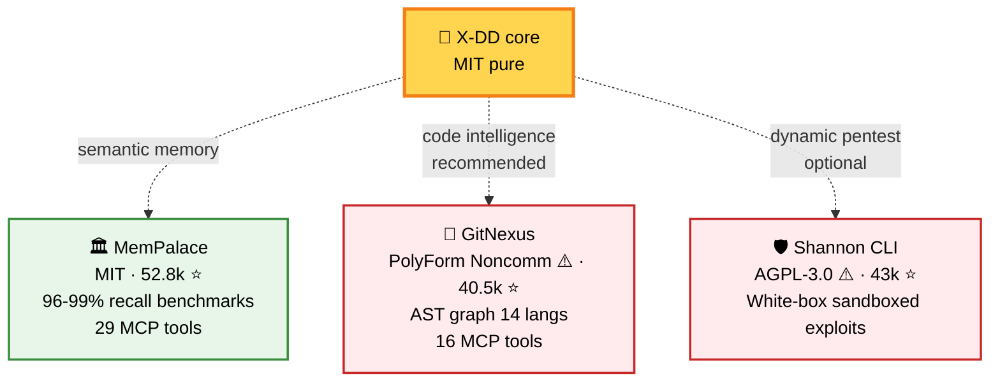

<div align="center">

# 🚀 X-DD

<sub>🌐 **Languages:** [🇪🇸 Español](README.md) · [🇺🇸 English](README.en.md) · [🇧🇷 Português](README.pt-BR.md)</sub>

## AI-powered development with formal discipline — without sacrificing speed

**Gated pipeline · Cryptographic signing · Multi-IDE · Visible dogfooding**

For teams already using Claude Code, Cursor, or OpenCode who want **zero technical debt** + **cryptographic audit trail** + **agents that learn on their own**.

<br/>

[](LICENSE)
[](RELEASES/)
[](tests/)
[](.agent/workflows/)
[](docs/equipo.md)
[](docs/adr/)

<br/>

### 🎯 [**Get started in 4 minutes →**](#-4-minutes-to-start)

<sub>Compatible with **7 IDEs auto-adapt + universal MCP**. No vendor lock-in. No hidden traps.</sub>

</div>

> ⚠️ **Pre-release (v0.1.0-rc).** Functional + dogfooded in maintainer's production. API/manifests/CLI may break until final signed tag `v0.1.0`. Early adopters: pin commit SHA. Issues: [github.com/Cucholambr3ta/x-dd/issues](https://github.com/Cucholambr3ta/x-dd/issues).

---

## 💔 The known problem

```text
❌ Pure vibe-coding                    ❌ Traditional heavy process

   ⚡ high initial velocity              🐌 anti-AI bureaucracy
   💸 tech debt explodes by month 3      🥱 doesn't leverage agent speed
   🔍 unauditable decisions              📋 friction without value
   🐛 production bugs                    ⏰ slow time-to-ship
```

**Result:** teams trapped between speed and quality.

---

## ✨ The X-DD solution

**6-phase gated pipeline with HMAC cryptographic signing.** Agentic speed + enterprise auditability.

> *"Big brain. Formal process. Concise output."*



Each arrow = **HMAC-SHA256 signed transition**. No signature = no progression. **Auditable. Non-editable.**

---

## 🎁 What you get

<table>
<tr>
<td width="33%" align="center" valign="top">

### 🔒 Cryptographic<br/>**audit trail**

Every gate HMAC-SHA256 signed.<br/>"APPROVED" auditable, non-editable.<br/>**Unique in the space.**

*No competitor has it.*

</td>
<td width="33%" align="center" valign="top">

### 🚀 Speed<br/>**without chaos**

180 specialized agents.<br/>51 production-ready workflows.<br/>**Discipline with agentic speed.**

*From idea to signed release.*

</td>
<td width="33%" align="center" valign="top">

### 🌍 Any<br/>**IDE/Assistant**

7 IDEs auto-config + more via MCP.<br/>No vendor lock-in.<br/>**1 framework, all agents.**

*Claude, Cursor, OpenCode, Continue, Zed, Windsurf, Antigravity, Codex, Gemini...*

</td>
</tr>
</table>

---

## 💎 Numbers that matter

<div align="center">

| 📊 Metric | Value |
|---|---|
| Green tests | **330+** (pytest + bats + E2E, S0-25) |
| Production workflows | **51** runnable as slash commands |
| Specialized agents | **180** in 15 categories |
| Nygard ADRs documented | **36** architectural decisions |
| Event-driven hooks | **8** (security + quality + learning) |
| Install profiles | **6** (minimal → full) |
| Supported IDEs | **7 auto-adapt + más vía MCP** (Claude Code, Cursor, OpenCode, VSCode+Copilot, Windsurf, Antigravity, Codex + Continue, Zed, Cline, Gemini... vía MCP) |
| Closed sprints | **26** (public visible dogfooding, S0-25) |
| AgentShield self-audit | **0 crit/high** with `--severity=high` ✅ |

</div>

---

## ⚡ 4 minutes to start



```bash
# Linux / macOS / WSL
bash scripts/xdd-doctor.sh                              # 1) verify environment
bash scripts/xdd-init.sh /your/project --profile=core   # 2) bootstrap
cd /your/project && bash scripts/xdd-start.sh           # 3) start MemPalace + GitNexus + orchestrator
# 4) in your IDE/assistant: run the /xdd command        # 4) pipeline begins

# Windows
.\install.ps1 -Dest C:\projects\my-app -Profile core
```

**Stuck?** The doctor tells you exactly what's missing.

---

## 🎬 Real use cases (no slides)

<details open>
<summary><b>🚀 Case 1: Ship a checkout feature (3 days → 1 day with X-DD)</b></summary>



**Result:** code + tests 80%+ coverage + modeled THREATS + cryptographic audit trail + user-facing release notes. **Zero accumulated tech debt.**

</details>

<details>
<summary><b>🛡️ Case 2: Hybrid pentest — finds vulnerabilities traditional QA misses</b></summary>



**Result:** apps with SAST + DAST + threat model + sandboxed exploits + verified patches. Shannon CLI is **optional** (AGPL-3.0 with user consent). Without Shannon, X-DD degrades gracefully.

</details>

<details>
<summary><b>🎨 Case 3: White-labeling — distribute X-DD as your internal product</b></summary>



**Result:** your org has "Helios" (or whatever name you choose). Automatic X-DD upstream attribution. 4 persona presets: technical / friendly / casual / formal. **One organization = one identity.**

</details>

<details>
<summary><b>🧠 Case 4: Continuous Learning — the system improves itself</b></summary>



**Result:** after 50 sessions, X-DD learned your patterns and suggests new skills/agents. **NEVER auto-promotes. Human signs every decision.**

</details>

<details>
<summary><b>🏢 Case 5: Multi-agent orchestration — a complete virtual team</b></summary>



**Result:** PM + Backend + UI + QA collaborating in parallel. Formal sync. **Replaces a 30-min standup with an executable workflow.**

</details>

---

## 🏆 Why X-DD vs alternatives?

<div align="center">

**The space is crowded. But only X-DD combines formal discipline + cryptographic signing + visible dogfooding.**

</div>

| Capability | **X-DD** | Spec-Kit (106k⭐) | OpenSpec (51k⭐) | BMAD (48k⭐) | Mastra (24k⭐) |
|---|---|---|---|---|---|
| Formal 6-phase gated pipeline | ✅ | partial 4 phases | ❌ "fluid" | ❌ | ❌ |
| **🔒 HMAC-signed gates** | **✅ UNIQUE** | ❌ | ❌ | ❌ | ❌ |
| **🛡️ DOMAIN + THREATS in Phase 2** | **✅ mandatory** | ❌ | ❌ | ❌ | ❌ |
| **🔍 AgentShield self-audit** | **✅ UNIQUE** | ❌ | ❌ | ❌ | ❌ |
| **📖 Visible committed dogfooding** | **✅ UNIQUE** | ❌ | ❌ | ❌ | ❌ |
| 11 formal Nygard ADRs | ✅ | partial | ❌ | ❌ | ❌ |
| Own MCP server | ✅ 6 tools | ❌ | ❌ | ❌ | ✅ |
| Multi-IDE | ✅ 13+ | ✅ 30+ | ✅ 25+ | ✅ several | ✅ |
| Continuous Learning (instincts) | ✅ | ❌ | ❌ | ❌ | ❌ |
| Eval-harness 5 grader types | ✅ | ❌ | ❌ | ❌ | ✅ |
| Multi-agent orchestration runtime | ✅ | ❌ | ❌ | Party Mode | ✅ |
| Per-org white-labeling | ✅ + personas | partial | ❌ | ❌ | ❌ |
| **License purity** | **MIT pure** | MIT | MIT | NOASSERT ⚠️ | NOASSERT ⚠️ |

<div align="center">

**Spec-Kit has 106k stars. X-DD just started. But X-DD is the only one with real cryptographic audit trail.**

</div>

---

## 🎨 Persona × Compression — adapt X-DD to your culture

White-labeling (Sprint 13) + xdd-talk-compact (Sprint 10) = combinable 4×4 matrix:

|  | `technical` | `friendly` | `casual` | `formal` |
|---|---|---|---|---|
| `compact: off` | default | accessible | informal | corporate |
| `compact: lite` | no filler | + emojis ok | less formal | concentrated professional |
| `compact: standard` | concise | brief conversational | shortcuts | executive |
| `compact: ultra` | telegraphic | shortcuts emoji | caveman | concise executive |

**Casual startup:** `casual + ultra`. **Regulated fintech:** `formal + standard`. **Dev consultancy:** `technical + lite`.

---

## 🔌 Compatible with any AI assistant



**1 shared MCP server vs N per-IDE adapters.** Sustainable maintainability. No vendor lock-in.

---

## 📦 Choose your level — scale with need

<table>
<tr>
<th>Profile</th><th>For what</th><th>Command</th>
</tr>
<tr>
<td><b>🌱 minimal</b></td>
<td>Try X-DD without commitment</td>
<td><code>--profile=minimal</code></td>
</tr>
<tr>
<td><b>⭐ core</b></td>
<td><b>Recommended to start</b></td>
<td><code>--profile=core</code></td>
</tr>
<tr>
<td><b>🚀 developer</b></td>
<td>Active dev with AI</td>
<td><code>--profile=developer</code></td>
</tr>
<tr>
<td><b>🛡️ security</b></td>
<td>SecDD focus</td>
<td><code>--profile=security</code></td>
</tr>
<tr>
<td><b>🔬 research</b></td>
<td>Eval + continuous learning</td>
<td><code>--profile=research</code></td>
</tr>
<tr>
<td><b>💎 full</b></td>
<td>Full adoption</td>
<td><code>--profile=full</code></td>
</tr>
</table>

---

## 🌳 Which methodologies to use? — decision tree



**X-DD Constitution Art. 8:** not every task needs the full pipeline. **Adaptable, not rigid.**

---

## ⚠️ What X-DD is NOT (honesty)

- ❌ **Not an application framework.** Doesn't replace React/Express/Django.
- ❌ **Not a test runner.** It orchestrates Vitest/Playwright/pytest.
- ❌ **Not MemPalace.** Consumes it as an optional MIT external dep.
- ❌ **Doesn't require Claude Code.** Works with 13+ assistants via MCP.
- ❌ **Doesn't send data to the cloud.** Local-first. Code stays in the team.
- ❌ **Not monorepo-compatible without adaptation** (Sprint 15 roadmap).

---

## 🛡️ Governance principles

- 🎯 **Zero Ambiguity** — system halts if any parameter is undefined
- 🔒 **Gated Pipeline** — `"APROBADO"` HMAC-SHA256 signed ([ADR-0006](docs/adr/0006-gate-keeper-firma-hmac.md))
- 📐 **Spec First** — no `src/` exists without an approved `SPEC.md`
- 🧪 **TDD First** — no business function exists without its prior test
- 🌍 **Absolute Portability** — no absolute paths; everything relative to `./`
- 👁️ **Visible Dogfooding** — X-DD walks through its 6 phases in public ([ADR-0001](docs/adr/0001-dogfooding-visible-commiteable.md))

---

## 🔗 Optional external integrations



> ⚠️ **GitNexus is PolyForm Noncommercial 1.0.0.** Personal/research/non-profit use is free. Commercial use requires paid license. X-DD never bundles it. Disclaimer in [ADR-0033](docs/adr/0033-gitnexus-tier1-companion.md) + [DEPENDENCIES.md](DEPENDENCIES.md).
>
> ⚠️ **Shannon is AGPL-3.0.** Your X-DD project is **NOT contaminated** by using Shannon via the hybrid wrapper. X-DD never bundles it. The decision is yours. Full disclaimer in [docs/PENTEST.md](docs/PENTEST.md).

---

## 📚 Documentation by your role

<table>
<tr>
<th>If you are...</th>
<th>Start here</th>
</tr>
<tr>
<td>🆕 <b>New developer</b></td>
<td><a href="the-shortform-guide.md"><code>the-shortform-guide.md</code></a> · 15-min visual Quickstart</td>
</tr>
<tr>
<td>🔬 <b>Power user / Architect</b></td>
<td><a href="the-longform-guide.md"><code>the-longform-guide.md</code></a> · Exhaustive reference</td>
</tr>
<tr>
<td>🛡️ <b>Security engineer</b></td>
<td><a href="the-security-guide.md"><code>the-security-guide.md</code></a> · Threat model + SecDD + hardening</td>
</tr>
<tr>
<td>🎨 <b>Org adopter / branding</b></td>
<td><a href="docs/BRANDING.md"><code>docs/BRANDING.md</code></a> · White-labeling + 4 personas</td>
</tr>
<tr>
<td>🔌 <b>IDE integrator</b></td>
<td><a href="docs/MCP_INTEGRATION.md"><code>docs/MCP_INTEGRATION.md</code></a> · MCP setup per IDE</td>
</tr>
<tr>
<td>🏛️ <b>Decision maker</b></td>
<td><a href="docs/adr/"><code>docs/adr/</code></a> · 11 Nygard ADRs explain the "why"</td>
</tr>
<tr>
<td>📊 <b>PM / project lead</b></td>
<td><a href="PROJ-MASTER-PLAN.md"><code>PROJ-MASTER-PLAN.md</code></a> · Gantt + public sprints</td>
</tr>
<tr>
<td>🤝 <b>Contributor</b></td>
<td><a href="CONTRIBUTING.md"><code>CONTRIBUTING.md</code></a> · How to add workflow/agent/skill/hook</td>
</tr>
</table>

---

## 🚀 Get started now

```bash
# 1) Verify environment
make doctor

# 2) Bootstrap your first project
bash scripts/xdd-init.sh /path/my-project --profile=core

# 3) Start
cd /path/my-project && bash scripts/xdd-start.sh

# 4) In your IDE/AI assistant: run the /xdd command
```

**Want to see X-DD applied to itself?** Check [`.xdd/`](.xdd/) — 6 signed phases, public, auditable.

---

<div align="center">

### 🌟 X-DD is for you if...

✅ You want **agentic speed** + **formal discipline**
✅ You need **cryptographic audit trail** for compliance
✅ You work on a **multi-IDE team** (Claude Code + Cursor + ...)
✅ You care about **visible dogfooding** over marketing
✅ You prefer **pure MIT** over ambiguous licenses
✅ You want a framework **that improves itself** (instincts + /evolve)

<br/>

### 🚫 X-DD is NOT for you if...

❌ You want **vibe-coding without discipline** (use Claude Code directly)
❌ Your organization **rejects formal process discipline**
❌ You need a **web dashboard** today (v0.2.0 roadmap)
❌ You want **lock-in on a single IDE** (X-DD is multi-IDE by design)

<br/>

---

<sub>**X-DD** · *Cross-Driven Development System* · MIT · Build with discipline, ship with speed.</sub>

[⭐ Star on GitHub](https://github.com/Cucholambr3ta/x-dd) ·
[📖 15-min Quickstart](the-shortform-guide.md) ·
[🐛 Issues](https://github.com/Cucholambr3ta/x-dd/issues) ·
[🤝 Contribute](CONTRIBUTING.md) ·
[💬 Discussions](https://github.com/Cucholambr3ta/x-dd/discussions)

</div>
