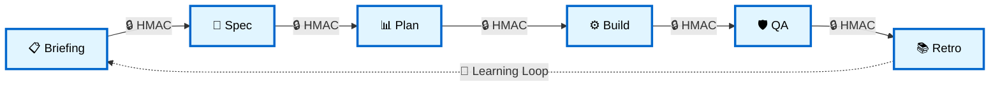
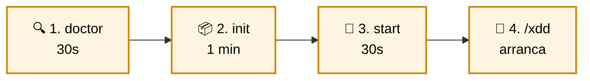
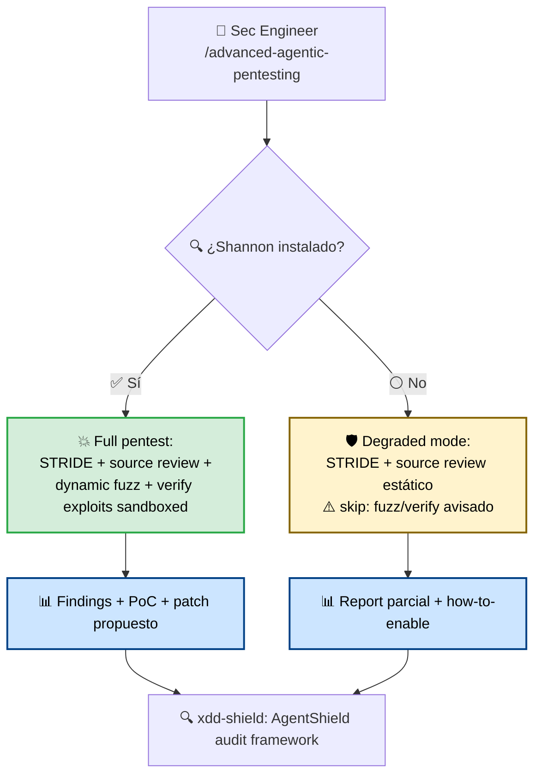
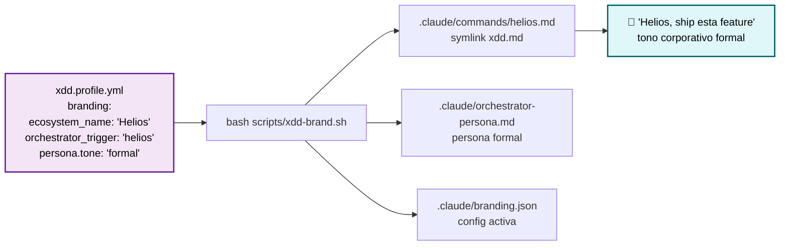
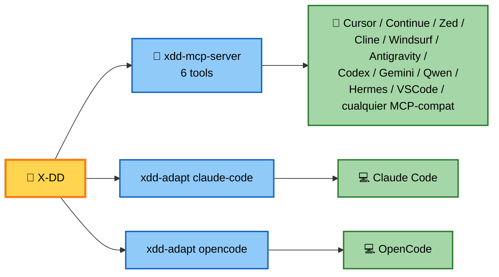
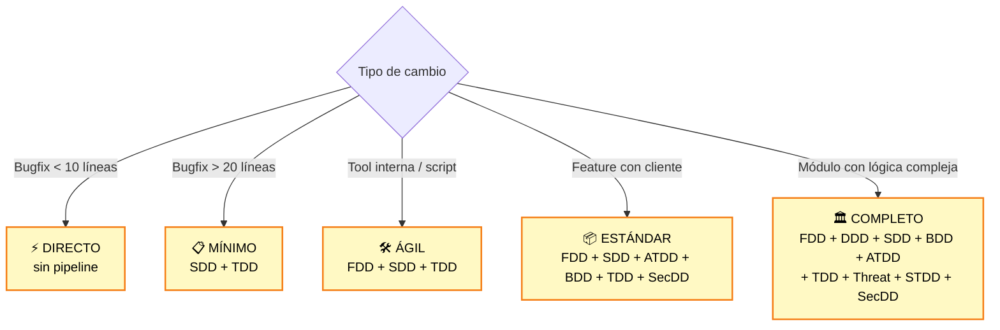
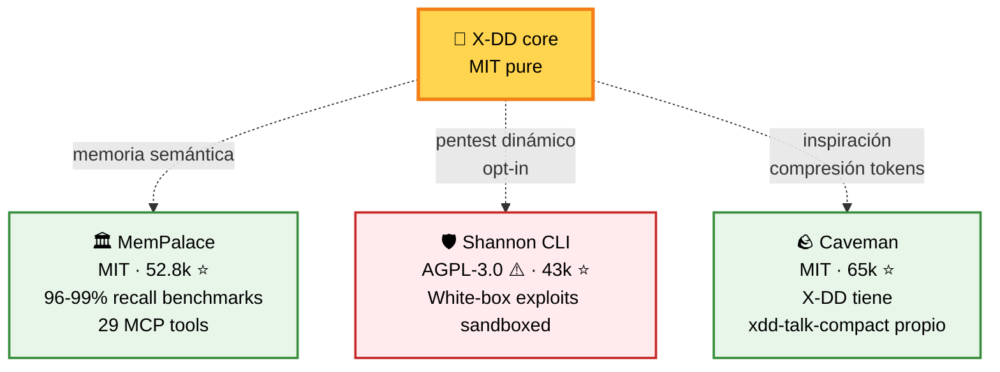

<div align="center">

# 🚀 X-DD

## Ship code AI-powered con disciplina formal — sin sacrificar velocidad

**Pipeline gated · Firma criptográfica · Multi-IDE · Dogfooding visible**

Para equipos que ya usan Claude Code, Cursor u OpenCode y quieren **deuda técnica zero** + **audit trail criptográfico** + **agentes que se mejoran solos**.

<br/>

[](LICENSE)
[](tests/)
[](.agent/workflows/)
[](docs/equipo.md)
[](docs/adr/)

<br/>

### 🎯 [**Empezá en 4 minutos →**](#-4-minutos-y-estás-shippeando)

<sub>Compatible con **13+ IDEs/asistentes IA**. Ningún vendor lock-in. Sin trampas.</sub>

</div>

---

## 💔 El problema que ya conocés

```
❌ Vibe-coding puro                    ❌ Proceso pesado tradicional
   "code first, ask questions never"      "12-week Scrum sprints"
                                          
   ⚡ velocidad inicial alta             🐌 burocracia anti-IA
   💸 deuda técnica explota mes 3        🥱 no aprovecha velocidad agentes
   🔍 decisiones inauditables             📋 friction sin valor
   🐛 bugs en prod                        ⏰ time-to-ship lento
```

### **¿Resultado?** Equipos atrapados entre velocidad y calidad.

---

## ✨ La solución X-DD

**Pipeline gated de 6 fases con firma criptográfica HMAC.** Velocidad agéntica + auditabilidad enterprise.

> *"Brain still big. Process formal. Mouth small."*



Cada flecha = **transición firmada HMAC-SHA256**. Sin firma = sin paso. **Auditable. No editable.**

---

## 🎁 Lo que te llevás a casa

<table>
<tr>
<td width="33%" align="center" valign="top">

### 🔒 Audit trail<br/>**criptográfico**

Cada gate firmado HMAC-SHA256.<br/>"APROBADO" auditable, no editable.<br/>**Único en su clase.**

*Ningún competidor lo tiene.*

</td>
<td width="33%" align="center" valign="top">

### 🚀 Velocidad<br/>**sin caos**

180 agentes especializados.<br/>51 workflows production-ready.<br/>**Vibe-coding con barandas.**

*De idea a release con firma.*

</td>
<td width="33%" align="center" valign="top">

### 🌍 Cualquier<br/>**IDE/Asistente**

13+ soportados vía MCP.<br/>Sin vendor lock-in.<br/>**1 framework, todos los agentes.**

*Claude, Cursor, OpenCode, Continue, Zed, Windsurf, Antigravity, Codex, Gemini...*

</td>
</tr>
</table>

---

## 💎 Números que importan

<div align="center">

| 📊 Métrica | Valor |
|---|---|
| Tests verdes | **160+** (pytest + bats + E2E) |
| Workflows production | **51** ejecutables como slash commands |
| Agentes especializados | **180** en 15 categorías |
| ADRs Nygard documentados | **11** decisiones arquitectónicas |
| Hooks event-driven | **8** (security + quality + learning) |
| Install profiles | **6** (minimal → full) |
| IDEs soportados | **13+** (Claude Code, Cursor, OpenCode, Continue, Zed, Cline, Windsurf, Antigravity, Codex, Gemini, Qwen, Hermes, Copilot...) |
| Sprints cerrados | **15** (dogfooding visible público) |
| AgentShield audit propio | **0 crit/high** con `--severity=high` ✅ |

</div>

---

## ⚡ 4 minutos y estás shippeando



```bash
# Linux / macOS / WSL
bash scripts/xdd-doctor.sh                              # ① verifica entorno
bash scripts/xdd-init.sh /tu/proyecto --profile=core    # ② bootstrap
cd /tu/proyecto && bash scripts/xdd-start.sh            # ③ arranca MemPalace + orquestador
# → en tu IDE/asistente: /xdd                           # ④ pipeline empieza

# Windows
.\install.ps1 -Dest C:\proyectos\mi-app -Profile core
```

**¿Stuck?** El doctor te dice exactamente qué te falta.

---

## 🎬 Casos de uso reales (no slides)

<details open>
<summary><b>🚀 Caso 1: Shipping una feature de checkout (3 días → 1 día con X-DD)</b></summary>

```mermaid
flowchart TD
    U[👤 PM: 'agregar checkout v2'] --> CMD[/xdd]
    CMD --> F1[Fase 1: /fase-requisitos<br/>📄 SPEC.md + FEATURES.md<br/>+ .feature stubs BDD]
    F1 -->|🔒| F2[Fase 2: /project-architecture-gsd<br/>📐 DOMAIN.md + 🛡️ THREATS.md STRIDE]
    F2 -->|🔒| F3[Fase 3: /plan-fases<br/>📊 PLAN.md vertical FDD]
    F3 -->|🔒| F4[Fase 4: /xdd-build<br/>🔴→🟢→🔵 TDD + STDD]
    F4 -->|🔒| F5[Fase 5: /qa-review<br/>SAST + DAST + BDD ejecutable]
    F5 -->|🔒| F6[Fase 6: /cierre-fase<br/>📚 lecciones.md + /release-cut]

    F5 -.->|si falla| F4

    classDef phase fill:#e8f4f8,stroke:#2c6e91,color:#000,stroke-width:2px
    class F1,F2,F3,F4,F5,F6 phase
```

**Outcome:** código + tests 80%+ coverage + THREATS modelado + audit trail criptográfico + release notes user-facing. **Cero deuda técnica acumulada.**

</details>

<details>
<summary><b>🛡️ Caso 2: Pentest híbrido — encontrá vulns que tu QA no ve</b></summary>



**Outcome:** apps con SAST + DAST + threat model + exploits sandbox + parches verificados. Shannon CLI es **opcional** (AGPL-3.0 user opt-in). Sin Shannon X-DD degrada elegantemente.

</details>

<details>
<summary><b>🎨 Caso 3: White-labeling — vendé X-DD como tu producto interno</b></summary>



**Outcome:** tu org tiene "Helios" (o como quieras). Atribución X-DD upstream automática. 4 personas presets: technical / friendly / casual / formal. **Una organización = una identidad.**

</details>

<details>
<summary><b>🧠 Caso 4: Continuous Learning — el sistema mejora solo</b></summary>

```mermaid
flowchart TD
    SES[💻 Sesión agéntica activa] -->|hook Stop| EXT[stop-pattern-extraction]
    EXT --> DB[(🗄️ ~/.xdd/state.db<br/>SQLite instincts)]
    DB -->|tras N sesiones| ACC[Instincts con<br/>confidence ↑0.1/occ]

    ACC --> EVOL[/evolve workflow]
    EVOL --> CLUST[🧬 TF-IDF clustering<br/>cosine similarity]
    CLUST --> PROP[💡 Propuestas:<br/>command/skill/agent nuevos]

    PROP --> HUM{👤 Aprobación humana<br/>T6.1 mitigación}
    HUM -->|✅ Aprobado| GEN[Genera artefacto<br/>en .agent/workflows o skills/]
    HUM -->|❌ Rechazado| REJ[Marca rejected en SQLite]

    GEN --> COMMIT[Commit + /cierre-fase<br/>Sistema crece]

    classDef hook fill:#fff0e6,stroke:#cc6600,color:#000,stroke-width:2px
    classDef human fill:#ffe6e6,stroke:#cc0000,color:#000,stroke-width:2px
    class EXT,EVOL hook
    class HUM human
```

**Outcome:** después de 50 sesiones, X-DD aprendió tus patrones y te sugiere skills/agents nuevos. **NUNCA auto-promueve. Humano firma cada decisión.**

</details>

<details>
<summary><b>🏢 Caso 5: Multi-agent orchestration — un equipo virtual completo</b></summary>

```mermaid
flowchart TD
    CMD[/orchestrate --pattern=feature_squad] --> LEAD[👔 Lead:<br/>product-manager]
    LEAD -->|parallel_then_sync| P1[🏗️ engineering-backend-architect]
    LEAD -->|parallel_then_sync| P2[🎨 design-ui-designer]
    LEAD -->|parallel_then_sync| P3[🧪 testing-test-results-analyzer]
    P1 --> SYNC{🤝 sync_point:<br/>spec_approval}
    P2 --> SYNC
    P3 --> SYNC
    SYNC --> DONE[✅ Spec consensuado]

    classDef lead fill:#e1bee7,stroke:#6a1b9a,color:#000,stroke-width:2px
    classDef spec fill:#bbdefb,stroke:#1565c0,color:#000,stroke-width:2px
    class LEAD lead
    class P1,P2,P3 spec
```

**Outcome:** PM + Backend + UI + QA colaborando en paralelo. Sync formal. **Reemplaza standup de 30 min por workflow ejecutable.**

</details>

---

## 🏆 ¿Por qué X-DD vs alternativas?

<div align="center">

**El espacio está poblado. Pero solo X-DD combina disciplina formal + firma criptográfica + dogfooding visible.**

</div>

| Capacidad | **X-DD** | Spec-Kit (106k⭐) | OpenSpec (51k⭐) | BMAD (48k⭐) | Mastra (24k⭐) |
|---|---|---|---|---|---|
| Pipeline gated formal 6 fases | ✅ | parcial 4 fases | ❌ "fluid" | ❌ | ❌ |
| **🔒 Gate firmado HMAC** | **✅ ÚNICO** | ❌ | ❌ | ❌ | ❌ |
| **🛡️ DOMAIN + THREATS Fase 2** | **✅ obligatorio** | ❌ | ❌ | ❌ | ❌ |
| **🔍 AgentShield audit propio** | **✅ ÚNICO** | ❌ | ❌ | ❌ | ❌ |
| **📖 Dogfooding visible commiteable** | **✅ ÚNICO** | ❌ | ❌ | ❌ | ❌ |
| 11 ADRs Nygard formales | ✅ | parcial | ❌ | ❌ | ❌ |
| MCP server propio | ✅ 6 tools | ❌ | ❌ | ❌ | ✅ |
| Multi-IDE | ✅ 13+ | ✅ 30+ | ✅ 25+ | ✅ varios | ✅ |
| Continuous Learning (instincts) | ✅ | ❌ | ❌ | ❌ | ❌ |
| Eval-harness 5 grader types | ✅ | ❌ | ❌ | ❌ | ✅ |
| Multi-agent orchestration runtime | ✅ | ❌ | ❌ | Party Mode | ✅ |
| White-labeling per-org | ✅ + personas | parcial | ❌ | ❌ | ❌ |
| **License purity** | **MIT pure** | MIT | MIT | NOASSERT ⚠️ | NOASSERT ⚠️ |

<div align="center">

**Spec-Kit tiene 106k stars. X-DD recién arranca. Pero X-DD es el único con audit trail criptográfico real.**

</div>

---

## 🎨 Persona × Compresión — adaptá X-DD a tu cultura

White-labeling (Sprint 13) + xdd-talk-compact (Sprint 10) = matriz 4×4 combinable:

|  | `technical` | `friendly` | `casual` | `formal` |
|---|---|---|---|---|
| `compact: off` | default | accesible | informal | corporativo |
| `compact: lite` | sin filler | + emojis ok | menos formal | profesional concentrado |
| `compact: standard` | concise | conversacional breve | shortcuts | ejecutivo |
| `compact: ultra` | telegraphic | shortcuts emoji | caveman | conciso ejecutivo |

**Startup casual:** `casual + ultra`. **Fintech regulada:** `formal + standard`. **Consultora dev:** `technical + lite`.

---

## 🔌 Compatible con cualquier asistente IA



**1 MCP server compartido vs N adapters per-IDE.** Mantenibilidad sostenible. Sin vendor lock-in.

---

## 📦 Elegí tu nivel — escala con tu necesidad

<table>
<tr>
<th>Perfil</th><th>Para qué</th><th>Comando</th>
</tr>
<tr>
<td><b>🌱 minimal</b></td>
<td>Probar X-DD sin compromiso</td>
<td><code>--profile=minimal</code></td>
</tr>
<tr>
<td><b>⭐ core</b></td>
<td><b>Recomendado para empezar</b></td>
<td><code>--profile=core</code></td>
</tr>
<tr>
<td><b>🚀 developer</b></td>
<td>Dev activo con IA</td>
<td><code>--profile=developer</code></td>
</tr>
<tr>
<td><b>🛡️ security</b></td>
<td>SecDD focus</td>
<td><code>--profile=security</code></td>
</tr>
<tr>
<td><b>🔬 research</b></td>
<td>Eval + continuous learning</td>
<td><code>--profile=research</code></td>
</tr>
<tr>
<td><b>💎 full</b></td>
<td>Adopción completa</td>
<td><code>--profile=full</code></td>
</tr>
</table>

---

## 🌳 ¿Qué metodologías usar? — árbol de decisión



**Constitución X-DD Art. 8:** no toda tarea necesita el pipeline completo. **Adaptable, no rígido.**

---

## ⚠️ Lo que X-DD NO es (sé honesto)

- ❌ **No es un framework de aplicación.** No reemplaza React/Express/Django.
- ❌ **No es un test runner.** Orquesta Vitest/Playwright/pytest.
- ❌ **No es MemPalace.** Lo consume como dep externa MIT opcional.
- ❌ **No requiere Claude Code.** Funciona con 13+ asistentes vía MCP.
- ❌ **No envía datos a la nube.** Local-first. Tu código no sale de tu equipo.
- ❌ **No es compatible con monorepos sin adaptación** (roadmap Sprint 15).

---

## 🛡️ Principios de gobernanza (la "letra chica" que importa)

- 🎯 **Ambigüedad Cero** — sistema se detiene si hay parámetros indefinidos
- 🔒 **Gated Pipeline** — `"APROBADO"` firmado HMAC-SHA256 ([ADR-0006](docs/adr/0006-gate-keeper-firma-hmac.md))
- 📐 **Spec First** — no existe `src/` sin `SPEC.md` previo aprobado
- 🧪 **TDD First** — no existe función de negocio sin su test previo
- 🌍 **Portabilidad Absoluta** — sin rutas absolutas; todo relativo a `./`
- 👁️ **Dogfooding Visible** — X-DD pasa por sus 6 fases en público ([ADR-0001](docs/adr/0001-dogfooding-visible-commiteable.md))

---

## 🔗 Integraciones opcionales (con full disclosure)



> ⚠️ **Shannon es AGPL-3.0.** Tu proyecto X-DD **NO se contamina** por usar Shannon vía wrapper híbrido. X-DD nunca lo bundle. Decisión es tuya. Disclaimer completo en [docs/PENTEST.md](docs/PENTEST.md).

---

## 📚 Documentación según tu rol

<table>
<tr>
<th>Sos...</th>
<th>Empezá acá</th>
</tr>
<tr>
<td>🆕 <b>Developer nuevo</b></td>
<td><a href="the-shortform-guide.md"><code>the-shortform-guide.md</code></a> · 15 min Quickstart visual</td>
</tr>
<tr>
<td>🔬 <b>Power user / Architect</b></td>
<td><a href="the-longform-guide.md"><code>the-longform-guide.md</code></a> · Referencia exhaustiva</td>
</tr>
<tr>
<td>🛡️ <b>Security engineer</b></td>
<td><a href="the-security-guide.md"><code>the-security-guide.md</code></a> · Threat model + SecDD + hardening</td>
</tr>
<tr>
<td>🎨 <b>Org adopter / branding</b></td>
<td><a href="docs/BRANDING.md"><code>docs/BRANDING.md</code></a> · White-labeling + 4 personas</td>
</tr>
<tr>
<td>🔌 <b>IDE integrator</b></td>
<td><a href="docs/MCP_INTEGRATION.md"><code>docs/MCP_INTEGRATION.md</code></a> · Setup MCP por IDE</td>
</tr>
<tr>
<td>🏛️ <b>Decision maker</b></td>
<td><a href="docs/adr/"><code>docs/adr/</code></a> · 11 ADRs Nygard explican el "por qué"</td>
</tr>
<tr>
<td>📊 <b>PM / project lead</b></td>
<td><a href="PROJ-MASTER-PLAN.md"><code>PROJ-MASTER-PLAN.md</code></a> · Gantt + sprints públicos</td>
</tr>
<tr>
<td>🤝 <b>Contributor</b></td>
<td><a href="CONTRIBUTING.md"><code>CONTRIBUTING.md</code></a> · Cómo añadir workflow/agent/skill/hook</td>
</tr>
</table>

---

## 🚀 Empezá ahora mismo

```bash
# 1. Verificá entorno
make doctor

# 2. Bootstrap tu primer proyecto
bash scripts/xdd-init.sh /ruta/mi-proyecto --profile=core

# 3. Arrancá
cd /ruta/mi-proyecto && bash scripts/xdd-start.sh

# 4. En tu IDE/asistente IA: /xdd
```

**¿Querés ver X-DD aplicado a sí mismo?** Mirá [`.xdd/`](.xdd/) — 6 fases firmadas, públicas, auditables.

---

<div align="center">

### 🌟 X-DD es para vos si...

✅ Querés **velocidad agéntica** + **disciplina formal**
✅ Necesitás **audit trail criptográfico** para compliance
✅ Trabajás en **equipo multi-IDE** (Claude Code + Cursor + ...)
✅ Te importa **dogfooding visible** sobre marketing
✅ Preferís **MIT puro** sobre licencias ambiguas
✅ Querés un framework **que mejora solo** (instincts + /evolve)

<br/>

### 🚫 X-DD NO es para vos si...

❌ Querés **vibe-coding sin disciplina** (usá Claude Code directo)
❌ Tu org **rechaza disciplina formal** de proceso
❌ Necesitás **dashboard web** ya hoy (roadmap v0.2.0)
❌ Querés **lock-in en un solo IDE** (X-DD es multi-IDE por diseño)

<br/>

---

<sub>**X-DD** · *Cross-Driven Development System* · MIT · Built with discipline, shipped with speed.</sub>

[⭐ Star en GitHub](https://github.com/Cucholambr3ta/x-dd) ·
[📖 Quickstart 15min](the-shortform-guide.md) ·
[🐛 Issues](https://github.com/Cucholambr3ta/x-dd/issues) ·
[🤝 Contribuir](CONTRIBUTING.md) ·
[💬 Discussions](https://github.com/Cucholambr3ta/x-dd/discussions)

</div>
