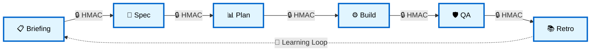
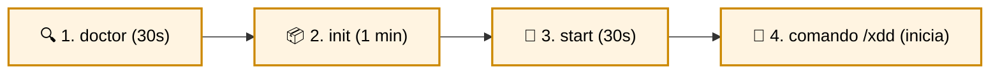
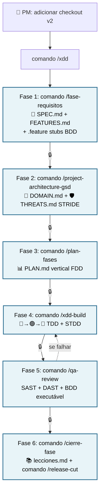
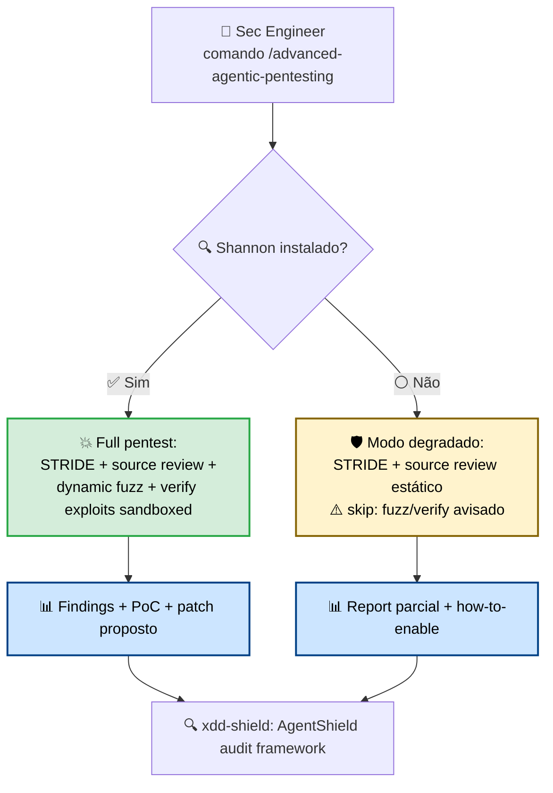
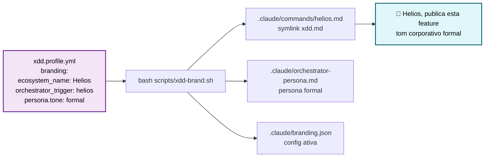
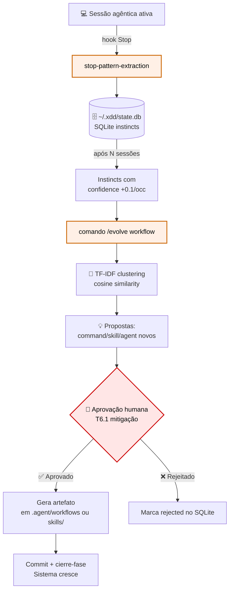
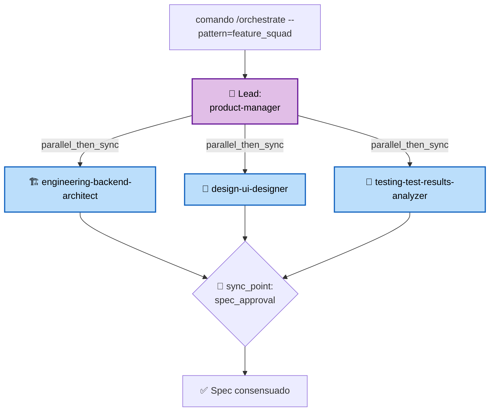
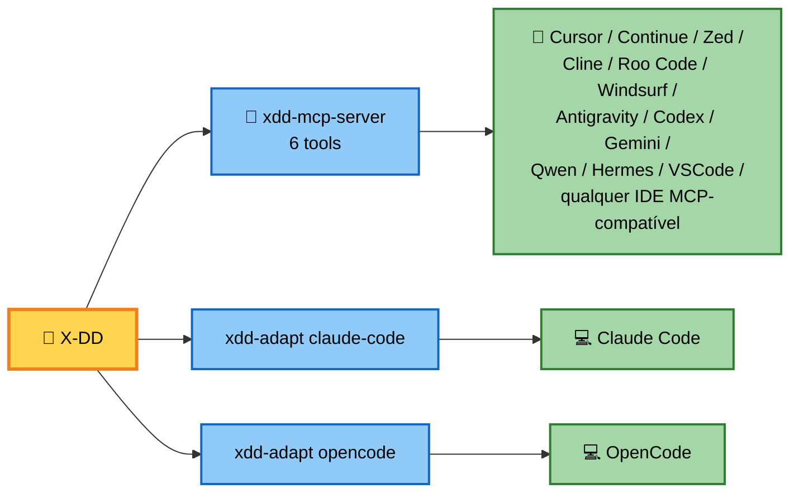
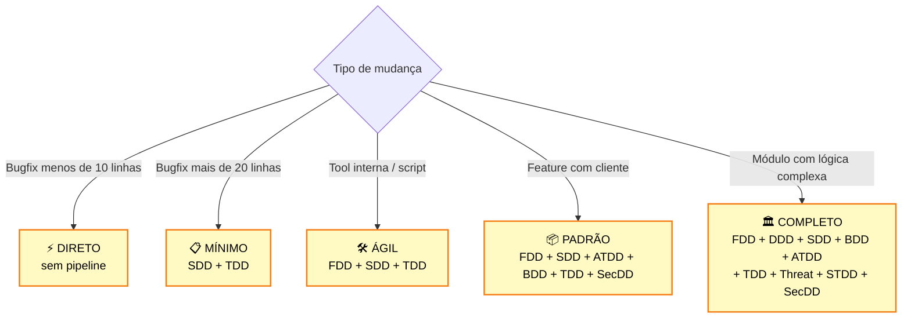
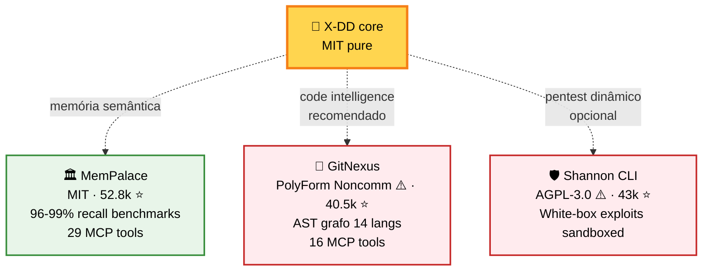

<div align="center">

# 🚀 X-DD

<sub>🌐 **Idiomas:** [🇪🇸 Español](README.md) · [🇺🇸 English](README.en.md) · [🇧🇷 Português](README.pt-BR.md)</sub>

## Desenvolvimento AI-powered com disciplina formal — sem sacrificar velocidade

**Pipeline gated · Assinatura criptográfica · Multi-IDE · Dogfooding visível**

Para times que já usam Claude Code, Cursor ou OpenCode e buscam **zero dívida técnica** + **trilha de auditoria criptográfica** + **agentes que aprendem sozinhos**.

<br/>

[](LICENSE)
[](RELEASES/)
[](tests/)
[](.agent/workflows/)
[](docs/equipo.md)
[](docs/adr/)

<br/>

### 🎯 [**Comece em 4 minutos →**](#-4-minutos-para-começar)

<sub>Compatível com **7 IDEs auto-adapt + MCP universal**. Sem vendor lock-in. Sem armadilhas ocultas.</sub>

</div>

> ⚠️ **Pre-release (v0.1.0-rc).** Funcional + dogfooded em produção do maintainer. API/manifests/CLI podem quebrar até tag final assinada `v0.1.0`. Early adopters: pin commit SHA. Issues: [github.com/Cucholambr3ta/x-dd/issues](https://github.com/Cucholambr3ta/x-dd/issues).

---

## 💔 O problema conhecido

```text
❌ Vibe-coding puro                    ❌ Processo pesado tradicional

   ⚡ alta velocidade inicial            🐌 burocracia anti-IA
   💸 dívida técnica explode no mês 3    🥱 não aproveita velocidade dos agentes
   🔍 decisões inauditáveis              📋 fricção sem valor
   🐛 bugs em produção                   ⏰ time-to-ship lento
```

**Resultado:** times presos entre velocidade e qualidade.

---

## ✨ A solução X-DD

**Pipeline gated de 6 fases com assinatura criptográfica HMAC.** Velocidade agêntica + auditabilidade enterprise.

> *"Cérebro grande. Processo formal. Saída concisa."*



Cada seta = **transição assinada HMAC-SHA256**. Sem assinatura = sem avanço. **Auditável. Não editável.**

---

## 🎁 O que você ganha

<table>
<tr>
<td width="33%" align="center" valign="top">

### 🔒 Trilha de auditoria<br/>**criptográfica**

Cada gate assinado HMAC-SHA256.<br/>"APROVADO" auditável, não editável.<br/>**Único no espaço.**

*Nenhum concorrente tem.*

</td>
<td width="33%" align="center" valign="top">

### 🚀 Velocidade<br/>**sem caos**

180 agentes especializados.<br/>51 workflows production-ready.<br/>**Disciplina com velocidade agêntica.**

*De ideia a release assinado.*

</td>
<td width="33%" align="center" valign="top">

### 🌍 Qualquer<br/>**IDE/Assistente**

7 IDEs auto-config + mais via MCP.<br/>Sem vendor lock-in.<br/>**1 framework, todos os agentes.**

*Claude, Cursor, OpenCode, Continue, Zed, Windsurf, Antigravity, Codex, Gemini...*

</td>
</tr>
</table>

---

## 💎 Números que importam

<div align="center">

| 📊 Métrica | Valor |
|---|---|
| Testes verdes | **330+** (pytest + bats + E2E, S0-25) |
| Workflows produção | **51** executáveis como slash commands |
| Agentes especializados | **180** em 15 categorias |
| ADRs Nygard documentados | **36** decisões arquiteturais |
| Hooks event-driven | **8** (security + quality + learning) |
| Install profiles | **6** (minimal → full) |
| IDEs suportados | **7 auto-adapt + más vía MCP** (Claude Code, Cursor, OpenCode, VSCode+Copilot, Windsurf, Antigravity, Codex + Continue, Zed, Cline, Gemini... vía MCP) |
| Sprints fechados | **26** (dogfooding visível público, S0-25) |
| AgentShield audit próprio | **0 crit/high** com `--severity=high` ✅ |

</div>

---

## ⚡ 4 minutos para começar



```bash
# Linux / macOS / WSL
bash scripts/xdd-doctor.sh                              # 1) verifica ambiente
bash scripts/xdd-init.sh /seu/projeto --profile=core    # 2) bootstrap
cd /seu/projeto && bash scripts/xdd-start.sh            # 3) inicia MemPalace + GitNexus + orquestrador
# 4) no seu IDE/assistente: executar o comando /xdd     # 4) pipeline começa

# Windows
.\install.ps1 -Dest C:\projetos\meu-app -Profile core
```

**Travado?** O doctor indica exatamente o que falta.

---

## 🎬 Casos de uso reais (sem slides)

<details open>
<summary><b>🚀 Caso 1: Publicar uma feature de checkout (3 dias → 1 dia com X-DD)</b></summary>



**Resultado:** código + testes 80%+ coverage + THREATS modelado + trilha de auditoria criptográfica + release notes user-facing. **Zero dívida técnica acumulada.**

</details>

<details>
<summary><b>🛡️ Caso 2: Pentest híbrido — encontra vulnerabilidades que o QA tradicional não vê</b></summary>



**Resultado:** apps com SAST + DAST + threat model + exploits sandbox + patches verificados. Shannon CLI é **opcional** (AGPL-3.0 com consentimento do usuário). Sem Shannon, X-DD degrada elegantemente.

</details>

<details>
<summary><b>🎨 Caso 3: White-labeling — distribua X-DD como seu produto interno</b></summary>



**Resultado:** sua organização tem "Helios" (ou o nome que escolher). Atribuição X-DD upstream automática. 4 personas presets: technical / friendly / casual / formal. **Uma organização = uma identidade.**

</details>

<details>
<summary><b>🧠 Caso 4: Continuous Learning — o sistema melhora sozinho</b></summary>



**Resultado:** após 50 sessões, X-DD aprendeu seus padrões e sugere skills/agents novos. **NUNCA promove automaticamente. O humano assina cada decisão.**

</details>

<details>
<summary><b>🏢 Caso 5: Multi-agent orchestration — um time virtual completo</b></summary>



**Resultado:** PM + Backend + UI + QA colaborando em paralelo. Sync formal. **Substitui standup de 30 min por workflow executável.**

</details>

---

## 🏆 Por que X-DD vs alternativas?

<div align="center">

**O espaço está povoado. Mas só X-DD combina disciplina formal + assinatura criptográfica + dogfooding visível.**

</div>

| Capacidade | **X-DD** | Spec-Kit (106k⭐) | OpenSpec (51k⭐) | BMAD (48k⭐) | Mastra (24k⭐) |
|---|---|---|---|---|---|
| Pipeline gated formal 6 fases | ✅ | parcial 4 fases | ❌ "fluid" | ❌ | ❌ |
| **🔒 Gate assinado HMAC** | **✅ ÚNICO** | ❌ | ❌ | ❌ | ❌ |
| **🛡️ DOMAIN + THREATS Fase 2** | **✅ obrigatório** | ❌ | ❌ | ❌ | ❌ |
| **🔍 AgentShield audit próprio** | **✅ ÚNICO** | ❌ | ❌ | ❌ | ❌ |
| **📖 Dogfooding visível commitado** | **✅ ÚNICO** | ❌ | ❌ | ❌ | ❌ |
| 11 ADRs Nygard formais | ✅ | parcial | ❌ | ❌ | ❌ |
| MCP server próprio | ✅ 6 tools | ❌ | ❌ | ❌ | ✅ |
| Multi-IDE | ✅ 13+ | ✅ 30+ | ✅ 25+ | ✅ vários | ✅ |
| Continuous Learning (instincts) | ✅ | ❌ | ❌ | ❌ | ❌ |
| Eval-harness 5 grader types | ✅ | ❌ | ❌ | ❌ | ✅ |
| Multi-agent orchestration runtime | ✅ | ❌ | ❌ | Party Mode | ✅ |
| White-labeling per-org | ✅ + personas | parcial | ❌ | ❌ | ❌ |
| **License purity** | **MIT pure** | MIT | MIT | NOASSERT ⚠️ | NOASSERT ⚠️ |

<div align="center">

**Spec-Kit tem 106k stars. X-DD recém começou. Mas X-DD é o único com trilha de auditoria criptográfica real.**

</div>

---

## 🎨 Persona × Compressão — adapta X-DD à sua cultura

White-labeling (Sprint 13) + xdd-talk-compact (Sprint 10) = matriz 4×4 combinável:

|  | `technical` | `friendly` | `casual` | `formal` |
|---|---|---|---|---|
| `compact: off` | default | acessível | informal | corporativo |
| `compact: lite` | sem filler | + emojis ok | menos formal | profissional concentrado |
| `compact: standard` | concise | conversacional breve | shortcuts | executivo |
| `compact: ultra` | telegraphic | shortcuts emoji | caveman | conciso executivo |

**Startup casual:** `casual + ultra`. **Fintech regulada:** `formal + standard`. **Consultoria dev:** `technical + lite`.

---

## 🔌 Compatível com qualquer assistente IA



**1 MCP server compartilhado vs N adapters per-IDE.** Manutenibilidade sustentável. Sem vendor lock-in.

---

## 📦 Escolha seu nível — escala com a necessidade

<table>
<tr>
<th>Perfil</th><th>Para que</th><th>Comando</th>
</tr>
<tr>
<td><b>🌱 minimal</b></td>
<td>Testar X-DD sem compromisso</td>
<td><code>--profile=minimal</code></td>
</tr>
<tr>
<td><b>⭐ core</b></td>
<td><b>Recomendado para começar</b></td>
<td><code>--profile=core</code></td>
</tr>
<tr>
<td><b>🚀 developer</b></td>
<td>Dev ativo com IA</td>
<td><code>--profile=developer</code></td>
</tr>
<tr>
<td><b>🛡️ security</b></td>
<td>SecDD focus</td>
<td><code>--profile=security</code></td>
</tr>
<tr>
<td><b>🔬 research</b></td>
<td>Eval + continuous learning</td>
<td><code>--profile=research</code></td>
</tr>
<tr>
<td><b>💎 full</b></td>
<td>Adoção completa</td>
<td><code>--profile=full</code></td>
</tr>
</table>

---

## 🌳 Quais metodologias usar? — árvore de decisão



**Constituição X-DD Art. 8:** nem toda tarefa precisa do pipeline completo. **Adaptável, não rígido.**

---

## ⚠️ O que X-DD NÃO é (honestidade)

- ❌ **Não é um framework de aplicação.** Não substitui React/Express/Django.
- ❌ **Não é um test runner.** Orquestra Vitest/Playwright/pytest.
- ❌ **Não é MemPalace.** Consome como dep externa MIT opcional.
- ❌ **Não requer Claude Code.** Funciona com 13+ assistentes via MCP.
- ❌ **Não envia dados para a nuvem.** Local-first. O código não sai do time.
- ❌ **Não é compatível com monorepos sem adaptação** (roadmap Sprint 15).

---

## 🛡️ Princípios de governança

- 🎯 **Ambiguidade Zero** — o sistema para se há parâmetros indefinidos
- 🔒 **Gated Pipeline** — `"APROBADO"` assinado HMAC-SHA256 ([ADR-0006](docs/adr/0006-gate-keeper-firma-hmac.md))
- 📐 **Spec First** — não existe `src/` sem `SPEC.md` prévio aprovado
- 🧪 **TDD First** — não existe função de negócio sem seu teste prévio
- 🌍 **Portabilidade Absoluta** — sem rotas absolutas; tudo relativo a `./`
- 👁️ **Dogfooding Visível** — X-DD passa pelas suas 6 fases em público ([ADR-0001](docs/adr/0001-dogfooding-visible-commiteable.md))

---

## 🔗 Integrações externas opcionais



> ⚠️ **GitNexus é PolyForm Noncommercial 1.0.0.** Uso pessoal/research/non-profit grátis. Comercial requer paid license. X-DD nunca o bundle. Disclaimer em [ADR-0033](docs/adr/0033-gitnexus-tier1-companion.md) + [DEPENDENCIES.md](DEPENDENCIES.md).
>
> ⚠️ **Shannon é AGPL-3.0.** Seu projeto X-DD **NÃO se contamina** por usar Shannon via wrapper híbrido. X-DD nunca o bundle. A decisão é sua. Disclaimer completo em [docs/PENTEST.md](docs/PENTEST.md).

---

## 📚 Documentação conforme seu papel

<table>
<tr>
<th>Se você é...</th>
<th>Comece aqui</th>
</tr>
<tr>
<td>🆕 <b>Developer novo</b></td>
<td><a href="the-shortform-guide.md"><code>the-shortform-guide.md</code></a> · 15 min Quickstart visual</td>
</tr>
<tr>
<td>🔬 <b>Power user / Architect</b></td>
<td><a href="the-longform-guide.md"><code>the-longform-guide.md</code></a> · Referência exaustiva</td>
</tr>
<tr>
<td>🛡️ <b>Security engineer</b></td>
<td><a href="the-security-guide.md"><code>the-security-guide.md</code></a> · Threat model + SecDD + hardening</td>
</tr>
<tr>
<td>🎨 <b>Org adopter / branding</b></td>
<td><a href="docs/BRANDING.md"><code>docs/BRANDING.md</code></a> · White-labeling + 4 personas</td>
</tr>
<tr>
<td>🔌 <b>IDE integrator</b></td>
<td><a href="docs/MCP_INTEGRATION.md"><code>docs/MCP_INTEGRATION.md</code></a> · Setup MCP por IDE</td>
</tr>
<tr>
<td>🏛️ <b>Decision maker</b></td>
<td><a href="docs/adr/"><code>docs/adr/</code></a> · 11 ADRs Nygard explicam o "por quê"</td>
</tr>
<tr>
<td>📊 <b>PM / project lead</b></td>
<td><a href="PROJ-MASTER-PLAN.md"><code>PROJ-MASTER-PLAN.md</code></a> · Gantt + sprints públicos</td>
</tr>
<tr>
<td>🤝 <b>Contributor</b></td>
<td><a href="CONTRIBUTING.md"><code>CONTRIBUTING.md</code></a> · Como adicionar workflow/agent/skill/hook</td>
</tr>
</table>

---

## 🚀 Comece agora

```bash
# 1) Verifica ambiente
make doctor

# 2) Bootstrap seu primeiro projeto
bash scripts/xdd-init.sh /rota/meu-projeto --profile=core

# 3) Inicia
cd /rota/meu-projeto && bash scripts/xdd-start.sh

# 4) No seu IDE/assistente IA: executar o comando /xdd
```

**Quer ver X-DD aplicado a si mesmo?** Veja [`.xdd/`](.xdd/) — 6 fases assinadas, públicas, auditáveis.

---

<div align="center">

### 🌟 X-DD é para você se...

✅ Quer **velocidade agêntica** + **disciplina formal**
✅ Precisa de **trilha de auditoria criptográfica** para compliance
✅ Trabalha em **time multi-IDE** (Claude Code + Cursor + ...)
✅ Te importa **dogfooding visível** sobre marketing
✅ Prefere **MIT puro** sobre licenças ambíguas
✅ Quer um framework **que melhora sozinho** (instincts + /evolve)

<br/>

### 🚫 X-DD NÃO é para você se...

❌ Quer **vibe-coding sem disciplina** (use Claude Code direto)
❌ Sua organização **rejeita disciplina formal** de processo
❌ Precisa de **dashboard web** hoje (roadmap v0.2.0)
❌ Quer **lock-in num único IDE** (X-DD é multi-IDE por design)

<br/>

---

<sub>**X-DD** · *Cross-Driven Development System* · MIT · Build with discipline, ship with speed.</sub>

[⭐ Star no GitHub](https://github.com/Cucholambr3ta/x-dd) ·
[📖 Quickstart 15min](the-shortform-guide.md) ·
[🐛 Issues](https://github.com/Cucholambr3ta/x-dd/issues) ·
[🤝 Contribuir](CONTRIBUTING.md) ·
[💬 Discussions](https://github.com/Cucholambr3ta/x-dd/discussions)

</div>
