# Flujo Completo X-DD — Del briefing al deploy

> Documento maestro del funcionamiento end-to-end de X-DD. Explica cada fase, que
> produce, que la valida, y como fluye la informacion. Cumple DOC_STANDARD v2.0.

**Version:** 1.0 | **Fecha:** 2026-06-04 | **Audiencia:** quien quiera entender X-DD a fondo

---

## 1. Vision general — que es X-DD

X-DD (Cross-Driven Development) es un framework de desarrollo agentico que integra 9
metodologias *-Driven Development como capas sobre un pipeline gated de 6 fases. No
inventa metodologia nueva: las orquesta.

Tres pilares lo sostienen:

| Pilar | Que significa | Donde vive |
|-------|---------------|------------|
| Pipeline gated | 6 fases, ninguna se salta, cada una firmada HMAC | `xdd-gate.py` |
| Cero deuda tecnica | Sin evaluacion: si es dominio tecnico, tiene doc | `doc-granular.md` |
| Atomicidad + JSON/MD | 1 carpeta = 1 dominio, 1 doc = 1 concepto, .json compacto | `xdd-doc-sync.py` |

---

## 2. El pipeline de 6 fases (vista macro)

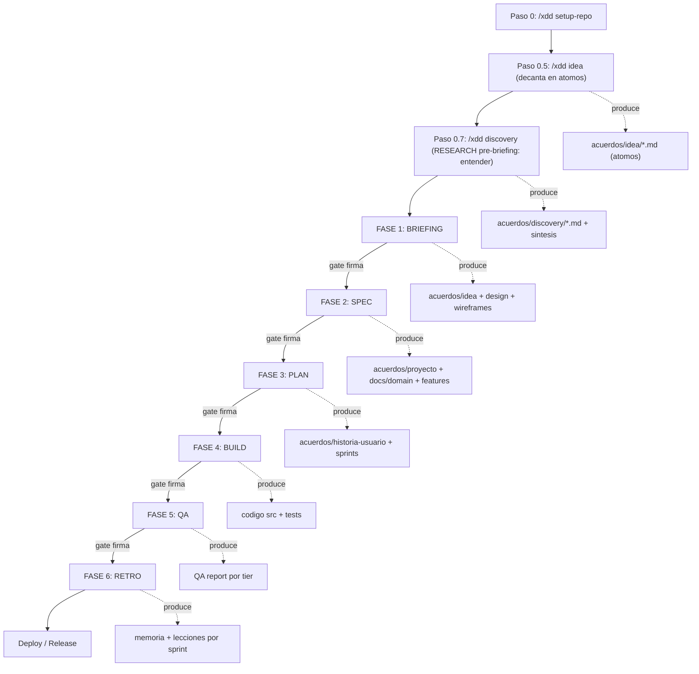

Regla inquebrantable: el gate de la fase N exige que las fases 0..N-1 esten APROBADO
con firma valida. No hay forma de saltar una fase (escape hatch `XDD_SKIP_CHAIN=1`
solo para dev-solo, con warning visible).

---

## 3. Los dos arboles de archivos (arquitectura clave)

X-DD mantiene dos arboles paralelos. Entender esto es entender X-DD.

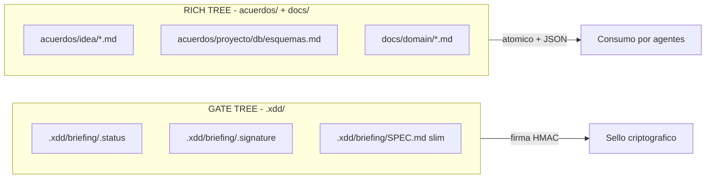

| Arbol | Path | Contenido | Quien lo firma |
|-------|------|-----------|----------------|
| GATE TREE | `.xdd/<fase>/` | Artefactos slim + metadatos del gate | HMAC-SHA256 |
| RICH TREE | `acuerdos/` + `docs/` | Contenido atomico human-facing | discipline-check |

Por que importa: dividir o atomizar el RICH TREE nunca rompe el gate, porque
`PHASE_ARTIFACTS` (en `xdd-gate.py`) apunta solo al GATE TREE.

---

## 4. FASE 1 — BRIEFING (arbol bloqueante de 16 dimensiones)

El briefing es un arbol de preguntas que NO cierra hasta que las 16 dimensiones estan
respondidas y cada pantalla tiene su wireframe HTML aprobado.

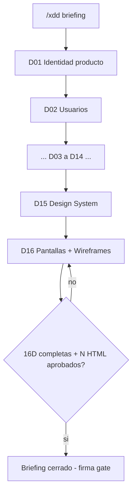

Salida (toda atomica):

| Carpeta | Contenido | Cantidad |
|---------|-----------|----------|
| `acuerdos/idea/` | 14 artefactos (1 por dimension D01-D14) | 14 docs |
| `acuerdos/design/` | tokens.md + components.md + assets.md (D15) | 3 docs |
| `acuerdos/wireframes/` | 1 HTML por pantalla (D16) | N HTML |

Dato clave: los wireframes viven DENTRO del briefing, no en fase separada. El HTML
aprobado es la regla de diseno inmutable para el agente de build.

---

## 5. FASE 2 — SPEC (doc-granular: documentacion atomica maxima)

Al cerrar el briefing, el agente lee TODOS los artefactos y genera documentacion tecnica
atomica. Principio cero deuda: si es un dominio tecnico, tiene su carpeta; si es un
subdominio, tiene su archivo.

> **Dos research distintos.** El PASO 1 INVESTIGA de doc-granular es el RESEARCH
> post-briefing (`acuerdos/research/<dominio>/`): investiga COMO construir cada dominio
> tecnico. Es distinto del DISCOVERY pre-briefing (`acuerdos/discovery/`), que investigo
> QUE es la idea antes de preguntar. Discovery = entender; research = como construir.

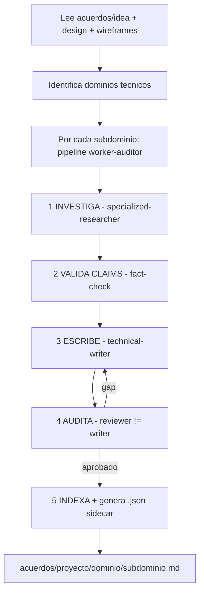

Estructura de salida (2 niveles de atomicidad):

```
acuerdos/proyecto/
  db/
    esquemas.md / .json       <- 1 subdominio = 1 doc
    migraciones.md / .json
    relaciones.md / .json
  api/
    contratos.md / .json
    errores.md / .json
  auth/
    flujos.md / .json
    rbac.md / .json
  INDEX.md / INDEX.json        <- mapa maestro
```

Cada doc tiene 9 secciones obligatorias: vision, Mermaid, schemas, algoritmos, casos
borde, contratos, Gherkin, glosario, trazabilidad. El auditor rechaza si falta Mermaid,
hay emojis, tiene menos de 80 lineas, o mezcla subdominios.

Paralelo: tambien produce `docs/domain/` (DDD por aggregate) y `docs/features/` (FDD por
feature). El numero de docs lo decide el proyecto: 15-20 simple, 50-120 complejo.

---

## 6. FASE 3 — PLAN (historias de usuario + sprints)

El agente lee `acuerdos/proyecto/` + wireframes y genera historias. Cada historia es
atomica: su propia carpeta con 4 artefactos.

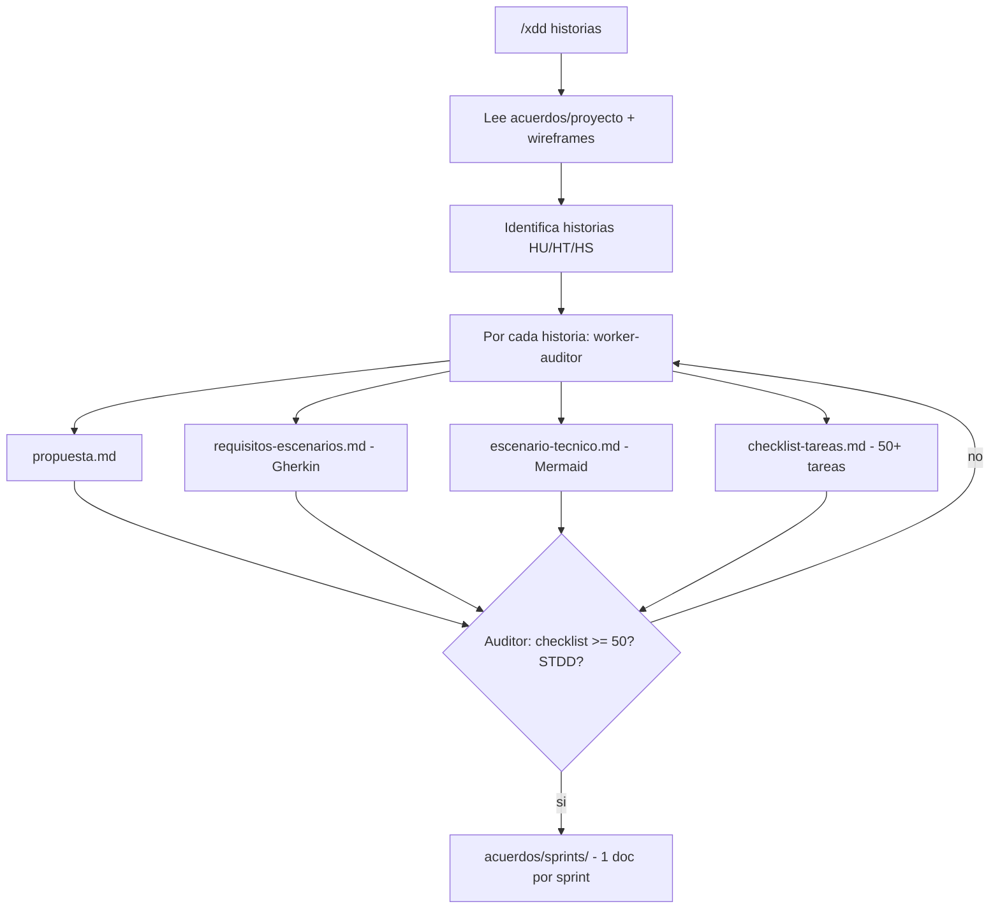

Salida:

| Artefacto | Path | Atomicidad |
|-----------|------|------------|
| Historia (4 docs) | `acuerdos/historia-usuario-N/` | 1 carpeta por historia |
| Plan de sprints | `acuerdos/sprints/sprint-NN.md` | 1 doc por sprint |
| Indice sprints | `acuerdos/sprints/INDEX.json` | navegable por agente |

Tipos de historia: HU (usuario), HT (tecnica), HS (seguridad). Checklist minimo 50
tareas atomicas — incluye TDD, STDD (security tests), observabilidad, docs.

---

## 7. FASE 4 — BUILD (ciclo de sprint con equipos dinamicos)

Por cada sprint, el orquestador crea un equipo de subagentes segun los componentes
tecnicos, ejecuta el checklist con un auditor permanente, y cierra con GitFlow.

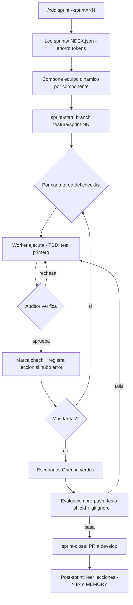

Equipo dinamico: si la historia tiene UI -> frontend-developer; si tiene API ->
backend-developer + api-designer; si tiene auth -> security-engineer. Fijos siempre:
`engineering-code-reviewer` (auditor, nunca implementa) + `engineering-qa-engineer`
(evaluador pre-push).

Patron worker-auditor: quien produce NO aprueba. Es la segregacion del gate (Inc 1)
aplicada a nivel de cada tarea.

---

## 8. FASE 5 — QA (validacion estratificada por tiers)

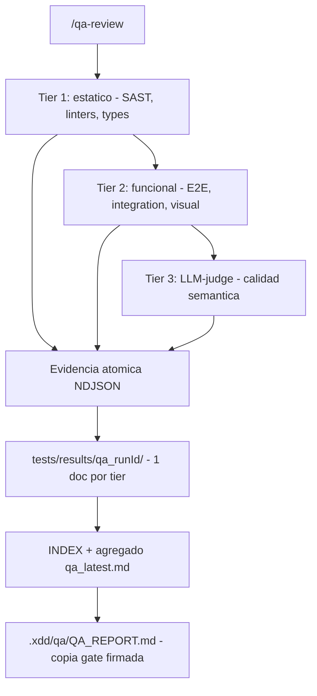

| Tier | Que valida | Costo | Tiempo |
|------|-----------|-------|--------|
| Tier 1 | SAST, linters, type checks | Gratis | <30s |
| Tier 2 | E2E, integration, visual | ~0-1 USD | 5-20min |
| Tier 3 | Calidad semantica, consistencia | ~0.15-0.5 USD | 1-2min |

La evidencia NDJSON es atomica (1 finding por linea). El reporte se atomiza en 3 docs
por tier. La copia gate `.xdd/qa/QA_REPORT.md` queda como agregado firmado.

---

## 9. FASE 6 — RETRO (cierre + learning loop)

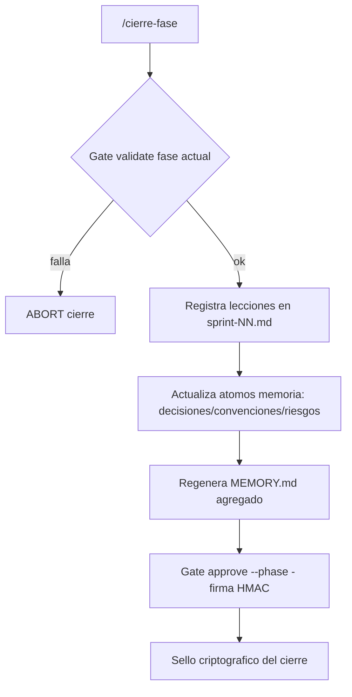

Salida atomica:

| Artefacto | Path |
|-----------|------|
| Lecciones del sprint | `acuerdos/lecciones/sprint-NN.md` |
| Memoria del sprint | `acuerdos/memoria/sprint-NN.md` |
| Hechos persistentes | `acuerdos/memoria/{decisiones,convenciones,riesgos}.md` |
| Indice lecciones | `acuerdos/lecciones/INDEX.md` |

Learning loop: las lecciones se leen al inicio de cada fase (Constitucion Art. 3) para
no repetir errores.

---

## 10. El gate keeper (corazon del pipeline)

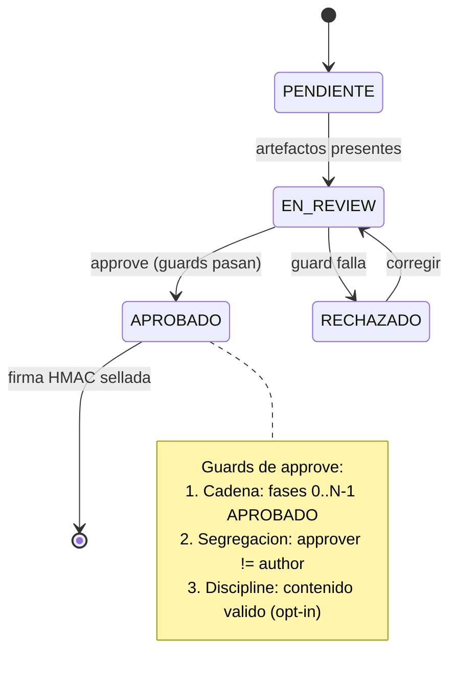

Tres guards en cada `approve`:

| Guard | Que verifica | Escape hatch |
|-------|--------------|--------------|
| Cadena | Fases previas APROBADO + validas | `XDD_SKIP_CHAIN=1` |
| Segregacion | Aprobador != autor del artefacto | `XDD_SKIP_SEGREGATION=1` |
| Disciplina | Contenido cumple SDD/FDD/DDD/etc | `XDD_SKIP_DISCIPLINE=1` |

La firma HMAC-SHA256 cubre (fase, checksums, aprobador, timestamp). El checksum excluye
los metarchivos del gate (.status/.signature/.approvers) para no ser circular.

---

## 11. Sistema JSON/MD de ahorro de tokens

Cada `.md` atomico tiene un `.json` sidecar generado por `xdd-doc-sync.py`.

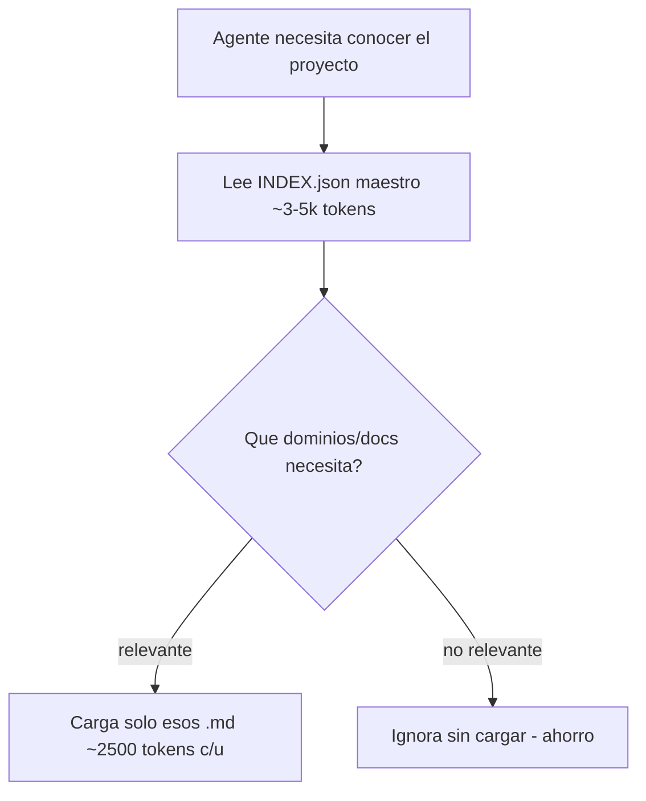

| Metrica | Antes | Despues |
|---------|-------|---------|
| Conocer 80 docs | ~200k tokens (cargar todos) | ~3-5k tokens (INDEX.json) |
| Ahorro navegando | — | ~95-99% |

El MD es fuente de verdad (calidad completa). El JSON es indice compacto: resumen,
secciones, entidades, trazabilidad, tokens, checksum. Si el MD cambia sin re-sync,
`verify` detecta el drift por checksum.

---

## 12. Las 9 disciplinas y donde entran

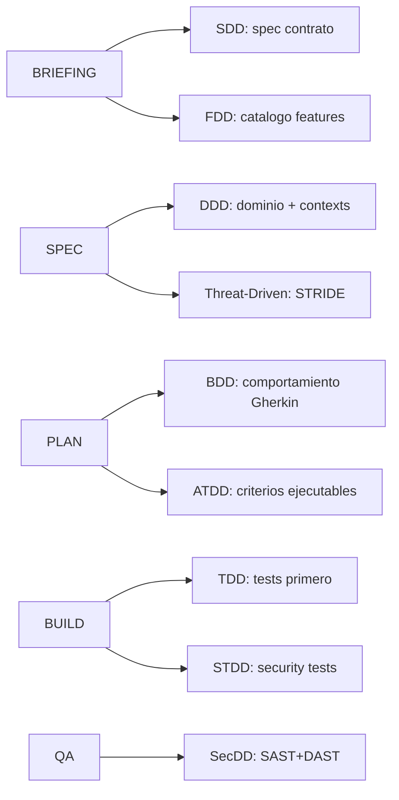

Son 9 disciplinas, cada una con su doc atomico en `docs/disciplinas/`:

| # | Disciplina | Aporta | Fase | Doc atomico |
|---|------------|--------|------|-------------|
| 1 | SDD | La spec es el contrato | Briefing->Spec | `docs/disciplinas/SDD.md` |
| 2 | FDD | Catalogo features trazable | Spec->Plan | `docs/disciplinas/FDD.md` |
| 3 | DDD | Modelo dominio + contexts | Spec | `docs/disciplinas/DDD.md` |
| 4 | BDD | Comportamiento en Gherkin (Given/When/Then) | Plan->Build | `docs/disciplinas/BDD.md` |
| 5 | ATDD | Criterios de aceptacion ejecutables como gate | Plan->Build | `docs/disciplinas/ATDD.md` |
| 6 | TDD | Tests primero (Rojo->Verde->Refactor) | Build | `docs/disciplinas/TDD.md` |
| 7 | STDD | Security tests como ciudadanos de 1a clase | Build->QA | `docs/disciplinas/STDD.md` |
| 8 | SecDD | SAST + DAST + secrets scanning | Build->QA | `docs/disciplinas/SecDD.md` |
| 9 | Threat-Driven | STRIDE guia el diseno | Spec+QA | `docs/disciplinas/THREAT-DRIVEN.md` |

> BDD y ATDD entran en la misma fase (Plan->Build) pero son disciplinas distintas:
> BDD describe el comportamiento esperado en lenguaje de negocio (Gherkin); ATDD
> convierte los criterios de aceptacion en tests ejecutables que bloquean el gate.

---

## 13. Estructura completa de un proyecto X-DD

```
proyecto/
  .xdd/                       <- GATE TREE (firmado HMAC)
    briefing/ spec/ plan/ build/ qa/ retro/
  acuerdos/                   <- RICH TREE atomico
    idea/                     14 artefactos del briefing
    design/                   tokens, components, assets
    wireframes/               N HTML
    research/                 investigacion por dominio
    proyecto/                 N carpetas dominio / M docs subdominio
    historia-usuario-N/       4 artefactos por historia
    sprints/                  1 doc por sprint + INDEX.json
    memoria/                  decisiones/convenciones/riesgos + sprint-NN
    lecciones/                sprint-NN + INDEX
  docs/
    domain/                   DDD por aggregate + UBIQUITOUS_LANGUAGE
    features/                 FDD por feature
    privacy/                  PII por categoria
    disciplinas/              9 disciplinas atomicas
  api/openapi/fragments/      1 yaml por recurso
  openapi.yaml                raiz generada (merge de fragments)
  src/ tests/                 codigo y pruebas
```

---

## 14. Comandos clave del pipeline

| Comando | Fase | Que hace |
|---------|------|----------|
| `/xdd briefing` | 1 | Arbol 16D + wireframes |
| `/xdd doc-granular` | 2 | Docs atomicos por dominio |
| `/xdd historias` | 3 | Historias + sprints |
| `/xdd sprint --sprint=NN` | 4 | Ciclo de sprint completo |
| `/qa-review` | 5 | Validacion por tiers |
| `/cierre-fase` | 6 | Cierre + learning loop |
| `xdd-gate.py validate/approve` | todas | Gate keeper |
| `xdd-doc-sync.py sync-all` | todas | Genera JSON sidecars |
| `xdd-discipline-check.py folder` | todas | Valida atomicidad |

---

## 15. Flujo de extremo a extremo (resumen ejecutable)

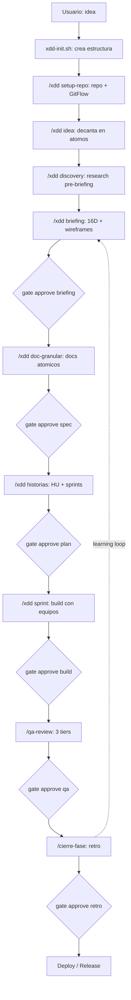

Cada gate es bloqueante. Cada fase produce artefactos atomicos con su JSON sidecar.
El learning loop alimenta las lecciones de vuelta al inicio.

---

## 16. Glosario

| Termino | Definicion |
|---------|------------|
| Gate keeper | Sistema que firma HMAC y valida cada fase (`xdd-gate.py`) |
| Atomicidad | 1 carpeta = 1 dominio, 1 doc = 1 concepto |
| Worker-auditor | Quien produce no aprueba; segregacion de roles |
| Sidecar JSON | Indice compacto .json derivado de cada .md |
| GATE TREE | `.xdd/` — artefactos firmados |
| RICH TREE | `acuerdos/` + `docs/` — contenido atomico |
| Cero deuda tecnica | Sin evaluacion: si es dominio tecnico, tiene doc |
| Cadena (gate) | Fase N exige fases 0..N-1 aprobadas |
| Segregacion (gate) | Aprobador != autor del artefacto |
