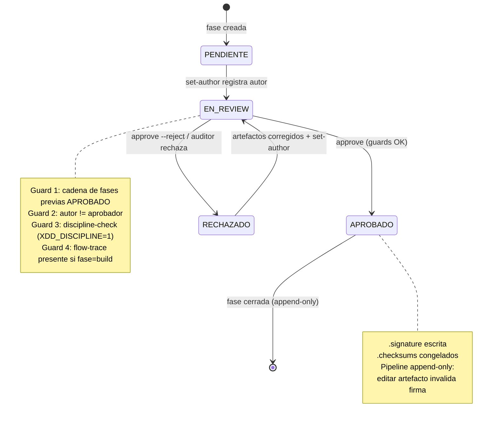

# Gate Keeper — `xdd-gate.py`

> Guardian programatico del pipeline X-DD con firma HMAC-SHA256.
> Implementa [ADR-0006](adr/0006-gate-keeper-firma-hmac.md). Disponible desde Sprint 4 (v0.1.0).

---

## 1. Vision general

El gate keeper es el mecanismo de integridad central del pipeline X-DD. Su funcion es doble:
firmar cada aprobacion de fase con una clave criptografica local, y verificar que ningun
artefacto ha sido alterado despues de la firma.

Sin firma criptografica, `"APROBADO"` escrito en un archivo es trivialmente editable
por cualquier humano o agente con acceso al repo. Eso convierte el gate en convencion,
no en control.

### 1.1 Que firma

Cada llamada a `approve` captura una fotografia criptografica del estado de la fase:
los checksums SHA-256 de todos los artefactos listados en `PHASE_ARTIFACTS[phase]`, el
nombre del aprobador, y el timestamp ISO-8601 UTC. Esos cuatro elementos se serializan
en un payload canonico JSON (sorted keys, sin espacios) y se firman con HMAC-SHA256 usando
la clave secreta `.xdd/.gate-key`. La firma se guarda en `.xdd/<phase>/.signature`.

### 1.2 Que valida

`validate --phase X` relee los artefactos en disco, recalcula sus checksums, reconstruye
el payload canonico con los datos almacenados en `.checksums` y `.approvers`, y compara
el HMAC resultante con la `.signature` guardada. Cualquier discrepancia — texto editado,
archivo renombrado, aprobador alterado — produce un hash distinto y la validacion falla.

### 1.3 Por que HMAC-SHA256

HMAC-SHA256 fue elegido sobre firmas asimetricas (GPG) porque:

- La clave nunca sale del proyecto; no requiere infraestructura PKI.
- Es lo suficientemente fuerte para detectar manipulaciones internas (el modelo de amenaza
  asume que el atacante no tiene acceso a `.gate-key`, no que es un adversario externo
  con criptanalisis activo).
- `hmac.compare_digest` (Python stdlib) protege contra timing attacks sin dependencias extra.
- La implementacion completa cabe en `scripts/xdd-gate.py` sin bibliotecas de terceros.

La limitacion: quien tenga la clave puede firmar como cualquier aprobador. GPG en commits
es el complemento recomendado para autenticacion de identidad publica (Sprint 8).

---

## 2. FSM del pipeline

El gate keeper implementa una maquina de estados estrictamente secuencial. Cada fase
avanza de `PENDIENTE` a `EN_REVIEW` a `APROBADO` (o retrocede a `RECHAZADO`). Ningun
`approve` se ejecuta fuera de orden: todas las fases previas deben estar `APROBADO` con
firma valida antes de poder firmar la siguiente.



### 2.1 Guard 1 — Cadena de fases previas

Antes de firmar la fase N, `approve` verifica que TODAS las fases `0..N-1` esten
`APROBADO` con firma valida (reusa internamente `_validate_phase`). Si falta una,
el comando termina con exit 1 y lista las fases bloqueantes.

```
[ERROR] plan: BLOQUEADO — cadena de fases incompleta:
  - fase previa 'briefing' no aprobada/valida
  - fase previa 'spec' no aprobada/valida
```

Escape hatch: `XDD_SKIP_CHAIN=1` (warning visible, auditable).

### 2.2 Guard 2 — Separacion autor != aprobador

El agente o humano que produce el artefacto registra su identidad con `set-author`
antes de la revision. Al aprobar, si el aprobador coincide con el autor registrado,
el comando termina con exit 1.

```
[ERROR] spec: BLOQUEADO — aprobador 'alice' es el autor del artefacto de 'spec'.
```

Escape hatch: `XDD_SKIP_SEGREGATION=1` (permite entornos dev-solo, warning visible).

### 2.3 Guard 3 — Discipline check

Si `XDD_DISCIPLINE=1`, el gate invoca `xdd-discipline-check.py check_phase(root, phase)`
que valida el contenido semantico de cada artefacto segun la disciplina X-DD que le
corresponde (SDD, FDD, BDD, etc.). Cualquier gap de contenido bloquea la firma.

Escape hatch: `XDD_SKIP_DISCIPLINE=1`.

### 2.4 Guard 4 — Flow evidence (fase build)

Si `.xdd/build/flow.json` existe, la fase `build` exige que tambien exista
`.xdd/build/flow-trace.json` con `step_count > 0` y `result` no vacio. Garantiza
que "build verde" significa "flujo ejecutado", no solo "archivos presentes".

---

## 3. Protocolo HMAC-SHA256

### 3.1 Formato del payload canonico

El payload se serializa como JSON compacto (sin espacios, claves ordenadas):

```json
{"approver":"alice","checksums":{".xdd/spec/DOMAIN.md":"a1b2c3d4e5f60001",".xdd/spec/THREATS.md":"ff00aa11bb22cc33"},"phase":"spec","timestamp":"2025-06-04T12:00:00+00:00"}
```

Reglas de canonicalizacion:
- `json.dumps(..., sort_keys=True, separators=(",", ":"))`
- `checksums`: dict con rutas relativas al project root como claves, SHA-256[:16] hex como valores, ordenado por clave.
- `timestamp`: ISO-8601 UTC con timezone offset `+00:00` (producido por `utcnow_iso()`).
- Codificacion: UTF-8.

### 3.2 Algoritmo

```
signature = HMAC-SHA256(key=.gate-key bytes, msg=payload.encode("utf-8")).hexdigest()
```

Implementacion en `scripts/xdd-gate.py`:

```python
def sign_payload(key: bytes, phase: str, checksums: dict,
                 approver: str, timestamp: str) -> str:
    payload = json.dumps(
        {"phase": phase, "checksums": dict(sorted(checksums.items())),
         "approver": approver, "timestamp": timestamp},
        sort_keys=True, separators=(",", ":"),
    )
    return hmac.new(key, payload.encode("utf-8"), hashlib.sha256).hexdigest()
```

La verificacion usa `hmac.compare_digest` para evitar timing attacks:

```python
valid = hmac.compare_digest(stored_sig, computed_sig)
```

### 3.3 Checksums de artefactos

Cada artefacto se hashea con SHA-256 completo, luego se trunca a 16 caracteres hex.
El truncado es intencional: detectar manipulacion, no resistir colision deliberada
(la firma HMAC sobre el payload completo cubre ese vector).

Para directorios (ej. `.xdd/build/`), se excluyen los meta-archivos del gate
(`.status`, `.checksums`, `.signature`, `.approvers`, `.author`) y se acumulan
rutas relativas + bytes de todos los archivos restantes en orden lexicografico.

### 3.4 Gestion de la clave

- Ubicacion: `.xdd/.gate-key` (debe estar en `.gitignore`).
- Generacion: `secrets.token_bytes(32)` — 256 bits de entropia CSPRNG.
- Permisos: `chmod 0600` al crear.
- Scope: una clave por proyecto. No hay multi-key ni rotacion gradual en v0.1.0.
- La clave NO contiene nonce; el timestamp del payload actua como elemento de unicidad
  por aprobacion (ventana de replay: ver seccion 6.1).

---

## 4. Comandos CLI

Todos los comandos aceptan `--json` para salida machine-readable y
`--project-root PATH` para apuntar a otro directorio raiz.

| Comando | Argumentos requeridos | Efecto | Exit code | Ejemplo |
|---|---|---|---|---|
| `init` | ninguno | Genera `.xdd/.gate-key` (256-bit, idempotente) | 0 siempre | `python3 scripts/xdd-gate.py init` |
| `validate` | `--phase X` | Verifica status APROBADO + artefactos presentes + checksums + firma HMAC | 0 OK / 1 falla | `python3 scripts/xdd-gate.py validate --phase spec` |
| `transition` | `--phase X --to Y` | Verifica que `X->Y` es secuencial y `X` esta APROBADO | 0 OK / 1 bloqueado | `python3 scripts/xdd-gate.py transition --phase briefing --to spec` |
| `set-author` | `--phase X --author NAME` | Registra el autor del artefacto en `.xdd/X/.author` (pre-requisito de approve) | 0 OK / 2 falta autor | `python3 scripts/xdd-gate.py set-author --phase spec --author writer-agent` |
| `approve` | `--phase X --approver NAME` | Aplica guards, captura checksums, firma HMAC, escribe `.status`/`.checksums`/`.signature`/`.approvers` | 0 OK / 1 bloqueado / 2 falta key o approver | `python3 scripts/xdd-gate.py approve --phase spec --approver alice` |
| `status` | ninguno | Tabla de las 6 fases con estado / autor / aprobador / firma valida | 0 siempre | `python3 scripts/xdd-gate.py status --json` |

### 4.1 Variable de entorno para aprobador

Si `--approver` no se pasa, el comando busca `XDD_APPROVER` en el entorno:

```bash
export XDD_APPROVER="aplacencia"
python3 scripts/xdd-gate.py approve --phase briefing
```

Si ninguno de los dos esta definido, el comando termina con exit 2 y mensaje de error.

### 4.2 Salida machine-readable

`--json` emite un objeto JSON por linea. Util para integracion con CI/CD o
`xdd-orchestrate.py`:

```bash
python3 scripts/xdd-gate.py status --json | jq '.phases[] | select(.status != "APROBADO")'
```

---

## 5. Escape hatches y overrides

Estas variables deshabilitan guards especificos del gate. Cada uso queda registrado
en la salida estandar con un prefijo `[WARNING]` visible. Su uso en produccion
debe documentarse en `CHANGELOG.md` (seccion Security).

| Variable | Efecto | Cuando usar | Riesgo | Advertencia visible |
|---|---|---|---|---|
| `XDD_SKIP_CHAIN=1` | Omite la verificacion de que fases previas esten APROBADO | Desarrollo local, reset de pipeline, migracion de proyecto existente | Permite firmar fases fuera de orden; pipeline queda inconsistente | `[WARNING] XDD_SKIP_CHAIN activo — cadena de fases no verificada` |
| `XDD_SKIP_SEGREGATION=1` | Permite que el autor sea el mismo que el aprobador | Proyectos de un solo desarrollador, demos, CI sin multi-rol | Elimina separacion de privilegios; un agente puede aprobar su propio trabajo | `[WARNING] XDD_SKIP_SEGREGATION activo — autor == aprobador permitido` |
| `XDD_SKIP_DISCIPLINE=1` | Omite las validaciones de contenido de `xdd-discipline-check.py` | Fases de bootstrap, documentacion en WIP, proyectos pre-DOC_STANDARD | Permite firmar artefactos con contenido incompleto | `[WARNING] XDD_SKIP_DISCIPLINE activo — discipline-check omitido` |
| `XDD_DISCIPLINE=1` | Activa (opt-in) las validaciones de contenido | Pipeline completo en proyectos maduros | Sin riesgo adicional; puede bloquear fases con documentacion incompleta | ninguna (es activacion, no bypass) |

Ninguna de estas variables afecta la firma HMAC en si: aunque se use `XDD_SKIP_CHAIN`,
la firma se calcula y se guarda normalmente. El override solo controla si el guard
bloquea la ejecucion de `approve`.

---

## 6. Modelo de amenazas del gate

El gate keeper mitiga amenazas de la categoria STRIDE T1 (Spoofing), T2 (Tampering)
y T3 (Repudiation) descritas en [.xdd/spec/THREATS.md](../.xdd/spec/THREATS.md)
vector V4. Las siguientes subsecciones detallan cada vector especifico al gate y
sus contramedidas.

### 6.1 Replay attack

**Descripcion:** un atacante captura una firma HMAC valida de una aprobacion previa
e intenta reutilizarla para una fase con artefactos distintos.

**Mitigacion:** el payload canonico incluye `timestamp` (ISO-8601 UTC al momento de
la aprobacion). Para que un replay tenga exito, el atacante necesitaria alterar
`.checksums` y `.approvers` para que coincidan exactamente con los valores del payload
original — pero entonces `validate` detectaria que los checksums en disco no coinciden
con los artefactos actuales. El timestamp no es una ventana de tiempo (no hay TTL);
actua como nonce de sesion: cada aprobacion genera un timestamp unico, haciendo cada
firma unica incluso para el mismo conjunto de artefactos aprobado dos veces.

**Limitacion residual:** si el atacante puede revertir los artefactos al estado exacto
del momento de la aprobacion original Y tiene acceso a `.signature` y `.checksums`,
el replay es posible. Contramedida adicional recomendada: commits GPG-signed en git.

### 6.2 Rotacion de clave

**Descripcion:** si `.gate-key` se compromete (commit accidental, log filtrado,
acceso no autorizado al filesystem), todas las firmas existentes siguen siendo
verificables por el atacante.

**Procedimiento de rotacion:**

```bash
# 1. Backup defensivo
cp .xdd/.gate-key ~/safe/xdd-gate-key.bak.$(date +%s)

# 2. Eliminar la actual
rm .xdd/.gate-key

# 3. Re-generar con nueva entropia
python3 scripts/xdd-gate.py init

# 4. Re-aprobar TODAS las fases ya aprobadas (sus firmas viejas son invalidas)
export XDD_APPROVER="aplacencia"
export XDD_SKIP_CHAIN=1
for phase in briefing spec plan build qa retro; do
  test -d .xdd/$phase && \
  grep -q "APROBADO" .xdd/$phase/.status 2>/dev/null && \
  python3 scripts/xdd-gate.py approve --phase $phase
done
unset XDD_SKIP_CHAIN

# 5. Documentar en docs/CHANGELOG.md seccion Security con fecha y causa
```

**Impacto en firmas existentes:** inmediato — cualquier `validate` con la clave
nueva sobre firmas creadas con la clave vieja fallara con `FIRMA INVALIDA`. Por eso
el paso 4 es obligatorio antes de volver a operar el pipeline.

**Sin registro automatico:** no hay auditoria automatica de rotaciones de clave.
Documentar manualmente en CHANGELOG.md es el unico rastro. Esto es una limitacion
conocida de v0.1.0 (ver seccion 9).

### 6.3 Corrupcion del log de aprobaciones

**Descripcion:** `.approvers` es append-only (cada `approve` agrega una linea
`name / timestamp_iso`). Si el archivo se trunca o edita, `validate` lo detecta
porque el HMAC fue calculado incluyendo el approver del payload — pero solo detecta
que la firma actual no coincide con lo que hay en disco, no que el archivo fue
modificado entre N aprobaciones.

**Deteccion:** `validate` reporta `FIRMA INVALIDA` si `.approvers` no contiene
exactamente el approver usado en el ultimo `approve`. Para fases con multiples
aprobadores historicos (si se re-aprueba), solo la ultima firma es verificable.

**Recovery:** si `.approvers` se corrompe pero `.signature` y `.checksums` estan
intactos, reconstruir con el aprobador correcto requiere saber quien aprobo y cuando
(buscar en git log si los archivos estaban en el index). Si no es recuperable,
ejecutar el procedimiento de re-aprobacion completo (ver seccion 7.2).

### 6.4 Timing attack en comparacion HMAC

**Descripcion:** implementaciones naive de comparacion de strings (`sig1 == sig2`)
son vulnerables a ataques de tiempo: el atacante puede medir diferencias de
nanosegundos para deducir cuantos caracteres coinciden.

**Mitigacion:** `xdd-gate.py` usa exclusivamente `hmac.compare_digest(a, b)` para
toda comparacion de firmas. Esta funcion de la stdlib de Python garantiza tiempo
constante independientemente del contenido de las cadenas.

```python
# Correcto — tiempo constante
valid = hmac.compare_digest(stored_sig, computed_sig)

# INCORRECTO — no usar
valid = stored_sig == computed_sig
```

### 6.5 Author == approver bypass

**Descripcion:** un agente o humano podria intentar registrarse como autor y luego
aprobar su propio trabajo, eliminando la separacion de privilegios.

**Mitigacion:** el Guard 2 (seccion 2.2) bloquea `approve` si `--approver` coincide
con el contenido de `.xdd/<phase>/.author`. El bloqueo es exit 1 con mensaje explicito.
`XDD_SKIP_SEGREGATION=1` permite el bypass pero emite un `[WARNING]` visible que
queda en cualquier log de CI/CD, haciendo el evento auditable.

---

## 7. Procedimientos de recovery

### 7.1 Log (.approvers) corrupto

Si `.approvers` fue editado manualmente o se trunco:

1. Verificar el contenido esperado en git: `git log --oneline .xdd/<phase>/.approvers`.
2. Restaurar desde git: `git checkout HEAD -- .xdd/<phase>/.approvers`.
3. Ejecutar `validate --phase X` para confirmar que la firma sigue siendo valida.
4. Si git no tiene la version correcta, ejecutar re-aprobacion (seccion 7.2).

### 7.2 Firma invalida por artefacto alterado

Si `validate` reporta `Checksum mismatch`:

1. Identificar el artefacto alterado en la salida de `validate --phase X --json`.
2. Si la alteracion fue intencional (correccion legitima): ejecutar
   `set-author --phase X --author <corrector>` y luego
   `approve --phase X --approver <auditor>` con un aprobador distinto.
   La nueva firma reemplaza la anterior; el pipeline sigue valido.
3. Si la alteracion fue no intencional o maliciosa: restaurar desde git y
   ejecutar `validate` para confirmar integridad antes de continuar.

### 7.3 Clave perdida (.gate-key no existe o corrompida)

Si `.gate-key` se pierde y no hay backup:

1. Ejecutar `python3 scripts/xdd-gate.py init` para generar una nueva clave.
2. Ejecutar el procedimiento de rotacion completo (seccion 6.2, pasos 4 y 5).
3. Todas las fases APROBADO necesitan re-aprobacion; `validate` fallara hasta entonces.

### 7.4 Checksum mismatch sin edicion visible

Si `validate` falla pero los artefactos parecen intactos:

1. Verificar que no haya cambios de line-endings (CRLF vs LF): git puede alterar
   bytes al hacer checkout en Windows. Usar `.gitattributes` con `* text=auto`.
2. Verificar que no haya archivos adicionales en el directorio que no existian
   al momento de la aprobacion (para fases con directorio, todos los archivos
   no-meta se incluyen en el hash).
3. Si el problema persiste, re-aprobar la fase afectada.

---

## 8. Ejemplos de payload

### 8.1 Payload valido

Fase `spec` aprobada por `alice` el 2025-06-04 con dos artefactos:

```json
{
  "approver": "alice",
  "checksums": {
    ".xdd/spec/DOMAIN.md": "a1b2c3d4e5f60001",
    ".xdd/spec/THREATS.md": "ff00aa11bb22cc33"
  },
  "phase": "spec",
  "timestamp": "2025-06-04T12:00:00+00:00"
}
```

Serializado canonico (sin espacios, claves ordenadas):

```
{"approver":"alice","checksums":{".xdd/spec/DOMAIN.md":"a1b2c3d4e5f60001",".xdd/spec/THREATS.md":"ff00aa11bb22cc33"},"phase":"spec","timestamp":"2025-06-04T12:00:00+00:00"}
```

Firma resultante (ejemplo con clave hipotetica):

```
3d9f2a1c8e7b4056ab12cd34ef567890abcdef1234567890abcdef1234567890
```

### 8.2 Payload invalido — artefacto alterado

El mismo payload pero `.xdd/spec/THREATS.md` fue editado despues de la aprobacion.
El checksum almacenado en `.checksums` dice `ff00aa11bb22cc33`, pero el archivo en
disco produce `deadbeef00112233`. La verificacion calcula:

```json
{
  "approver": "alice",
  "checksums": {
    ".xdd/spec/DOMAIN.md": "a1b2c3d4e5f60001",
    ".xdd/spec/THREATS.md": "deadbeef00112233"
  },
  "phase": "spec",
  "timestamp": "2025-06-04T12:00:00+00:00"
}
```

El HMAC de este payload es diferente a la `.signature` guardada. `validate` reporta:

```
[ERROR] spec: FALLA
  - Checksum mismatch en .xdd/spec/THREATS.md: stored=ff00aa11bb22cc33 current=deadbeef00112233
  - Firma HMAC invalida
```

### 8.3 Diferencia en checksum mismatch vs firma invalida

| Caso | Checksums en disco == .checksums | .signature valida | Diagnostico |
|---|---|---|---|
| Todo intacto | SI | SI | APROBADO |
| Artefacto editado | NO | NO | Checksum mismatch + firma invalida |
| Solo .checksums editado | SI (forzado) | NO | Firma invalida (checksums alterados) |
| Solo .signature editada | SI | NO | Firma invalida |
| .approvers editado | SI | NO | Firma invalida (approver no coincide) |

---

## 9. Artefactos en `.xdd/<fase>/`

| Archivo | Proposito | Commiteable | Origen |
|---|---|---|---|
| `<documentos>.md` | Artefactos de la fase | SI | Workflows X-DD |
| `.status` | `PENDIENTE` / `EN_REVIEW` / `APROBADO` / `RECHAZADO` | SI | `approve` lo escribe |
| `.checksums` | SHA-256 (16 hex) por artefacto, snapshot al aprobar | SI | `approve` |
| `.approvers` | `name / timestamp_iso` por linea, append-only | SI | `approve` |
| `.author` | nombre del autor del artefacto | SI | `set-author` |
| `.signature` | HMAC-SHA256 hex del payload canonico | SI | `approve` |
| `.gate-key` (raiz `.xdd/`) | Clave HMAC 256-bit | NO (gitignored) | `init` (`secrets.token_bytes(32)`) |

Politica completa en [ADR-0009](adr/0009-politica-versionado-xdd-directorio.md).

---

## 10. Integracion en workflows

Todos los workflows en `.agent/workflows/` siguen este patron:

```markdown
## Pre-condicion (gate)
python3 scripts/xdd-gate.py transition --phase <fase_actual> --to <fase_destino>
Si exit != 0, detener ejecucion y reportar al usuario.

## Ejecucion
... [pasos del workflow] ...

## Post-condicion
python3 scripts/xdd-gate.py validate --phase <fase_destino>
```

Sprint 4 introduce el patron en el gate keeper mismo; Sprint 7 cierra cobertura
en todos los workflows criticos.

---

## 11. Flujo tipico de uso

```bash
export XDD_APPROVER="aplacencia"

# 1. Producir artefactos de la fase con workflows X-DD
#    (ejemplo: /fase-requisitos genera SPEC.md, FEATURES.md)

# 2. Registrar autor
python3 scripts/xdd-gate.py set-author --phase briefing --author writer-agent

# 3. Aprobar la fase (aprobador distinto al autor)
python3 scripts/xdd-gate.py approve --phase briefing
# -> [OK] APROBADO por aplacencia (2025-06-04T12:00:00+00:00), firma HMAC-SHA256 3d9f2a...

# 4. Antes de empezar la siguiente fase, validar transicion
python3 scripts/xdd-gate.py transition --phase briefing --to spec
# -> [OK] transicion permitida.

# 5. Si alguien edita un artefacto tras la aprobacion, validate lo detecta
echo "tampered" >> .xdd/briefing/SPEC.md
python3 scripts/xdd-gate.py validate --phase briefing
# -> [ERROR] briefing: FALLA
#    - Checksum mismatch en .xdd/briefing/SPEC.md: stored=abc... current=def...
#    - Firma HMAC invalida
```

---

## 12. Limitaciones conocidas

La siguiente tabla documenta las limitaciones activas de la version actual.

| Limitacion | Alcance | Version objetivo |
|---|---|---|
| Clave unica por proyecto, sin rotacion gradual | Colaboracion multi-maquina automatizada imposible sin re-aprobacion total | V2.0 |
| No es firma GPG — integridad sin autenticacion de identidad publica | Un atacante con la clave puede firmar como cualquier approver | Complemento: GPG en commits (Sprint 8) |
| Sin auditoria automatica de rotaciones de clave | Los eventos de rotacion deben documentarse manualmente en CHANGELOG | V2.0 |
| Un solo approver por firma | Workflows multi-firma (quorum) no soportados | V2.0 |

---

## 13. Tests

Suite completa en [tests/test_gate.py](../tests/test_gate.py): init idempotente,
approve con/sin key/approver, validate detecta tampering en artefactos/firmas/keys,
transition secuencial vs no-secuencial.

Enforcement FSM en [tests/test_gate_fsm.py](../tests/test_gate_fsm.py): 9 casos —
cadena de fases (plan bloqueado sin briefing/spec), separacion autor != aprobador,
overrides `XDD_SKIP_CHAIN` / `XDD_SKIP_SEGREGATION`, set-author, status con
autor/aprobador.

```bash
python3 -m pytest tests/test_gate.py tests/test_gate_fsm.py -v
```
