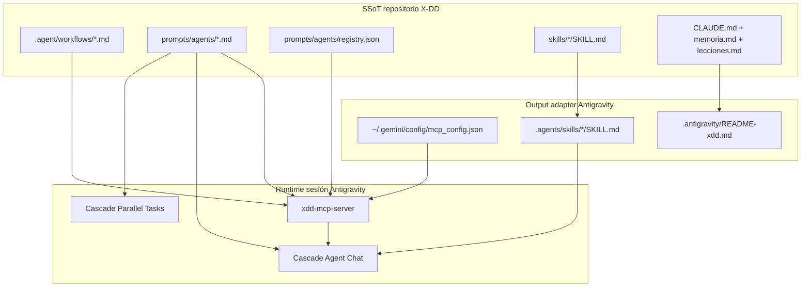
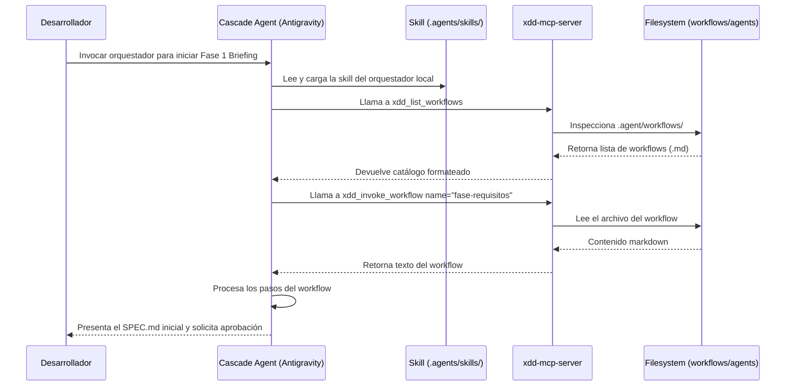

# Guía Antigravity — Agentes, Skills y Workflows compatibles con X-DD

**Proyecto:** `personal/x-dd/` — sistema multi-IDE install-once  
**IDE:** Antigravity (Google — basado en Gemini + Cascade)  
**Versión doc:** 1.0  
**Fecha:** 2026-05-28  
**Estado adapter:** Implementado en `scripts/xdd-adapt.sh` (`adapt_antigravity`)  
**Referencias internas:** ADR-0034, ADR-0035, ADR-0036, `docs/IDE_SETUP.md`, `docs/MCP_INTEGRATION.md`

---

## 1. Propósito de este documento

Este documento constituye la **ficha técnica oficial de Antigravity** dentro del ecosistema de integración multi-IDE de X-DD. Sirve como complemento y paridad documental de las guías ya existentes para el resto de asistentes y entornos soportados (tales como Claude Code, OpenCode, Cursor, VSCode Copilot y Codex).

**Audiencia:** Agentes de desarrollo, arquitectos de software e ingenieros de procesos que implementan el adapter universal (`scripts/xdd-adapt.sh`) o que interactúan en sesiones interactivas de Cascade dentro del IDE Antigravity.

**Objetivo:** Garantizar que, al inicializar un proyecto con X-DD en Antigravity, la configuración del Model Context Protocol (MCP) y la sincronización de las habilidades se realicen de forma automática, sin requerir pasos manuales y manteniendo una semántica idéntica a la del resto de IDEs.

---

## 2. Verdad técnica sobre Antigravity (limitaciones del IDE)

Antigravity opera bajo su propio paradigma de extensibilidad agéntica basado en **Cascade** (el motor de orquestación de Gemini). No comparte el mismo comportamiento de ejecución que Claude Code u OpenCode, por lo que es mandatorio asumir las siguientes limitaciones técnicas y de diseño nativas:

| Capacidad | Claude Code / OpenCode / Copilot | Antigravity |
|-----------|----------------------------------|-------------|
| **Slash commands locales (`/workflow`)** | ✅ Vía archivos en carpetas del IDE | ❌ **No soportado** |
| **Registro automático de comandos slash** | ✅ Copia directa a comandos/prompts | ❌ **No soportado** |
| **Rules basadas en archivos de texto** | ✅ Rules de sistema locales | ❌ (Usa MCP / Skills nativas) |
| **Skills locales auto-descubiertas** | Vía convención IDE | ✅ `.agents/skills/` (plural) |
| **Integración MCP** | ✅ `mcp_servers.json` estándar | ✅ `mcp_config.json` con metakey custom |
| **Delegación paralela / Subagentes** | Limitado | ✅ Cascade Runtime nativo |

**Consecuencia directa de diseño:** En Antigravity, el orquestador principal X-DD y sus workflows asociados se invocan estrictamente a través de herramientas de contexto del **MCP server** (`xdd_invoke_workflow`) o mediante el panel de **Skills locales** sincronizadas, omitiendo el uso de slash commands manuales.

---

## 3. Arquitectura X-DD → Antigravity

El flujo de materialización y ejecución entre la fuente única de verdad (SSoT) de X-DD y el runtime de Antigravity se organiza de la siguiente manera:



**Principio de diseño:** El repositorio X-DD mantiene la SSoT de forma agnóstica al IDE. El script de adaptación universal escribe la configuración MCP en la ubicación global del usuario y copia físicamente las skills adaptándolas a la estructura plural `.agents/skills/` que requiere Antigravity.

---

## 4. Matriz comparativa multi-IDE (Antigravity en contexto)

| Concepto X-DD | Claude Code | OpenCode | Cursor | Windsurf | VSCode Copilot | **Antigravity** | Codex |
|---|---|---|---|---|---|---|---|
| **Trigger orquestador** | `/trigger` | `/trigger` | `@trigger` + MCP | MCP tool | `/trigger` (Chat) | **MCP tool / Skill** | `/trigger` (desc) |
| **Workflows locales** | `.claude/commands/` | `.opencode/command/` | No (SSoT + MCP) | No (SSoT + MCP) | `.github/prompts/` | **No (SSoT + MCP)** | `references/` |
| **Agentes indexados** | MCP + prompts | `docs/equipo.md` | MCP + prompts | MCP | MCP + prompts | **MCP only** | `agents-index.json` |
| **Skills sincronizadas** | Manual | Manual | `.cursor/skills/` | Manual | Manual | **`.agents/skills/`** | `~/.codex/skills/` |
| **Gobernanza** | `CLAUDE.md` | `AGENTS.md` | `.cursor/rules/` | `.windsurf/rules/` | `.vscode/tasks.json` | **`.agents/skills/`** | SKILL orchestrator |
| **MCP config key** | `mcpServers` | (vía MCP) | `mcpServers` | `mcpServers` | `servers` | **`mcpServers`** | N/A |
| **Scope install** | Project-local | Project-local | Project-local | Project-local | Project-local | **Global MCP / Local Skills** | Global skills |

---

## 5. Workflows — diseño SSoT y consumo en Antigravity

### 5.1 SSoT (Single Source of Truth)
Los workflows de X-DD se definen en el directorio canónico `.agent/workflows/<nombre>.md`. Cada archivo debe incluir obligatoriamente el frontmatter de descripción técnica para ser catalogado por el servidor MCP:

```markdown
---
description: Coordina la fase 1 de Briefing elicitando requisitos del usuario.
---
# /fase-requisitos

## Pasos
1. Validar parámetros de entrada...
```

Las convenciones de portabilidad prohíben estrictamente el uso de rutas absolutas del host en estos archivos. Su validación se realiza mediante `scripts/lint-workflows.sh`.

### 5.2 Mecanismo de consumo en Antigravity
Dado que Antigravity no puede interpretar comandos slash basados en archivos de texto locales, la invocación de workflows se delega a las herramientas expuestas por `xdd-mcp-server`:

1. **`xdd_list_workflows`:** Cascade inspecciona el catálogo dinámico de workflows con sus respectivas descripciones asociadas.
2. **`xdd_invoke_workflow`:** Retorna el contenido exacto del archivo de workflow (`name="fase-requisitos"`).
3. **Interpretación:** De acuerdo con la directiva de seguridad **T6.3**, el servidor MCP jamás ejecuta el workflow en una subshell; devuelve el contenido en texto plano para que el agente en Cascade lo interprete y guíe la sesión bajo la supervisión del desarrollador.

---

## 6. Agentes — diseño SSoT y consumo en Antigravity

### 6.1 Catálogo y Registry
Los perfiles de agente se diseñan en Markdown bajo `prompts/agents/<categoria>/` y se compilan en la SSoT machine-readable `prompts/agents/registry.json`. El validador `validate-registry.py --strict` asegura la integridad del grafo de dependencias de los agentes.

Para habilitar la interoperabilidad en Antigravity, la entrada del agente en el registry debe tener declarado `"mcp"` dentro de la lista de `ide_compat`:

```json
{
  "id": "engineering-backend-architect",
  "name": "Backend Architect",
  "category": "engineering",
  "ide_compat": ["claude-code", "opencode", "mcp"],
  "prompt_file": "prompts/agents/engineering/engineering-backend-architect.md"
}
```

### 6.2 Adopción de rol en Cascade
Cascade no posee una interfaz nativa para la inyección estática de personas de agentes. El orquestador X-DD en runtime ejecuta las siguientes fases para la delegación:
1. Llama a `xdd_list_agents` vía MCP para encontrar el perfil idóneo.
2. Lee el prompt del agente desde `prompt_file` (vía lectura local del FS).
3. Asume el rol y los constraints temporales definidos en el perfil del especialista seleccionado.

---

## 7. Skills — convención nativa de Antigravity

### 7.1 Directorio de Skills
Antigravity busca y carga habilidades empaquetadas localmente en el directorio de trabajo del proyecto bajo la carpeta:
`./.agents/skills/`

> [!IMPORTANT]
> A diferencia de OpenCode, que utiliza la ruta en singular `.agent/skills/`, Antigravity requiere estrictamente la nomenclatura plural `.agents/skills/`. Los symlinks o alias no son válidos debido a políticas de seguridad del entorno de ejecución de Gemini.

### 7.2 Estructura de Skill compatible
Cada skill se empaqueta en una subcarpeta propia y contiene un archivo `SKILL.md` con frontmatter Markdown estándar:

```markdown
---
name: xdd-compact
description: Provider-agnostic context compaction. Use when context exceeds 80% budget.
---
# xdd-compact
Habilidad para la reducción y compactación dinámica del contexto...
```

El frontmatter de las skills de X-DD incluye metadatos enriquecidos (como `origin`, `inspired_by` y `triggers`). Antigravity lee únicamente los campos `name` y `description`, ignorando los campos extra de forma segura sin interrumpir el cargado.

---

## 8. Capa Antigravity — output del adapter

El adapter universal (`scripts/xdd-adapt.sh`) provee soporte completo para el target `antigravity`.

### 8.1 Detección automática en `xdd-init.sh`
Durante la inicialización del proyecto, `xdd-init.sh` detecta la presencia del IDE buscando la existencia de carpetas de configuración nativas o del propio directorio del proyecto:
```bash
[ -d "$HOME/.gemini" ] || [ -d ".antigravity" ]
```

### 8.2 Comando de adaptación manual
Para regenerar la configuración de Antigravity en cualquier momento:
```bash
bash scripts/xdd-adapt.sh antigravity --dest=<workspace>/mi-proyecto --trigger=helios
```

### 8.3 Archivos y configuraciones generados
El adapter realiza las siguientes modificaciones en el host y en el workspace:

#### A) Inserción en `mcp_config.json`
Modifica el archivo de configuración global del usuario en `~/.gemini/config/mcp_config.json` (configurable mediante `XDD_ANTIGRAVITY_HOME`). Inserta la definición del plugin Cascade con la metakey necesaria para el runtime:

```json
{
  "mcpServers": {
    "helios": {
      "$typeName": "exa.cascade_plugins_pb.CascadePluginCommandTemplate",
      "command": "python3",
      "args": ["-m", "xdd-mcp-server"],
      "cwd": "<workspace>/mi-proyecto",
      "env": {}
    }
  }
}
```

*Nota:* Si el wrapper global del servidor MCP (`~/.local/bin/xdd-mcp-server`) está instalado en el sistema (Sprint 25, ADR-0035), el adapter omite la clave `"cwd"`, permitiendo que el servidor MCP se ejecute dinámicamente sobre el workspace activo del IDE.

#### B) Materialización de Skills locales
Copia físicamente todas las carpetas del SSoT `skills/*` del framework al directorio de trabajo en `.agents/skills/`.

#### C) README de integración
Genera el archivo explicativo de arquitectura local en `.antigravity/README-xdd.md`.

---

## 9. MCP Server denominador común — las 6 tools

El servidor MCP (`xdd-mcp-server`) es una implementación en Python (stdlib pura) que expone las siguientes herramientas a Cascade:

1. **`xdd_validate_phase`:** Verifica la firma digital HMAC-SHA256 del estado de la fase actual.
2. **`xdd_transition_phase`:** Valida la progresión secuencial del ciclo de vida del desarrollo.
3. **`xdd_list_workflows`:** Expone los metadatos y descripciones de los workflows de desarrollo.
4. **`xdd_invoke_workflow`:** Provee la especificación del workflow al agente.
5. **`xdd_list_agents`:** Retorna la lista filtrada de agentes especialistas del registry.
6. **`xdd_get_phase_artifacts`:** Permite leer los artefactos validados de la fase activa aplicando una whitelist estricta sobre el directorio de datos `.xdd/`.

---

## 10. Flujo de sesión completo en Antigravity

El ciclo de interacción típico para ejecutar un workflow de desarrollo en Antigravity se describe a continuación:



---

## 11. Reglas de diseño SSoT multi-IDE (incluyendo Antigravity)

Al agregar o modificar componentes del ecosistema de X-DD, es obligatorio verificar los siguientes puntos para evitar la fragmentación entre IDEs:

### Workflows
- [ ] Definidos únicamente en `.agent/workflows/*.md`.
- [ ] Frontmatter con el campo `description:` completado.
- [ ] Rutas de archivo relativas (`./` o `../`). No usar referencias absolutas del host.

### Agentes
- [ ] Ficheros de prompt en `prompts/agents/`.
- [ ] Declaración de compatibilidad `"mcp"` en `ide_compat` dentro de `registry.json`.
- [ ] Registro compilado sin errores con `validate-registry.py --strict`.

### Skills
- [ ] Estructura dentro de `skills/<name>/SKILL.md`.
- [ ] Campos de frontmatter `name` y `description` provistos como subset mínimo para Codex/Cursor/Antigravity.
- [ ] La descripción redactada en tercera persona y con límites claros.

---

## 12. Comparación de Adapters: Antigravity vs Cursor vs Codex

| Capacidad / Feature | Antigravity | Cursor | Codex |
|---------------------|-------------|--------|-------|
| **Ubicación MCP config** | Global (`~/.gemini/config/`) | Local (`.cursor/mcp.json`) | N/A (Solo CLI/global) |
| **Soporte wrapper global** | ✅ Integrado sin `cwd` | ❌ Solo `cwd` absoluto hoy | ✅ Sincronización global |
| **Copia física de Skills** | ✅ Auto a `.agents/skills/` | ❌ Requiere copia manual | ✅ Auto a `~/.codex/skills/` |
| **Rules de contexto** | ❌ (Usa Skills) | ✅ `.cursor/rules/` (.mdc) | ❌ (Usa SKILL orchestrator) |
| **README de ayuda local** | ✅ `.antigravity/README-xdd.md`| ❌ No generado | ✅ `.codex/README-xdd.md` |

---

## 13. Instalación End-to-End

### 13.1 Instalación automática
La inicialización del framework configura el entorno de forma nativa:
```bash
bash scripts/xdd-init.sh /ruta/proyecto --profile=developer
```
El script detectará la presencia de Antigravity en el sistema y disparará la subrutina `adapt_antigravity`.

### 13.2 Instalación manual
Si requiere forzar la adaptación únicamente para este IDE en un proyecto ya existente:
1. Ejecute el script de adaptación para Antigravity:
   ```bash
   bash scripts/xdd-adapt.sh antigravity --dest=/ruta/proyecto
   ```
2. Abra el panel de **Manage MCP Servers** en la configuración de Cascade dentro del IDE.
3. Asegúrese de que el servidor con el trigger de su perfil se encuentre listado y haga clic en **Refresh** para recargar la configuración.

---

## 14. Troubleshooting

| Síntoma | Causa probable | Solución |
|---------|----------------|----------|
| **Cascade no encuentra las herramientas de X-DD** | El archivo `mcp_config.json` no se ha recargado o el path de `python3` no es accesible. | Verifique la entrada en `~/.gemini/config/mcp_config.json`. Presione el botón **Refresh** en el panel de control de MCP del IDE. |
| **Las skills de X-DD no aparecen en el IDE** | Las carpetas de skills fueron copiadas a `.agent/skills/` (singular) en lugar de `.agents/skills/` (plural). | Ejecute de nuevo `xdd-adapt.sh antigravity` para forzar la materialización correcta en plural. |
| **Error: command not found al arrancar MCP** | El wrapper global en `~/.local/bin/` no está en el `PATH` del sistema o el repositorio base se ha movido. | Corra `bash scripts/xdd-mcp-install-global.sh` para reinstalar y registrar el wrapper con el path actualizado. |
| **Error: typeName PB incorrecto** | La versión del IDE requiere la metakey específica de Cascade Plugin. | Compruebe que la entrada en `mcp_config.json` contenga la clave `"$typeName": "exa.cascade_plugins_pb.CascadePluginCommandTemplate"`. |

---

## 15. Checklist para el Agente Diseñador

### En el SSoT de X-DD
- [ ] No crear archivos `skill.yaml` o `agent.yaml` adicionales.
- [ ] Utilizar únicamente el validador estático escrito en Python (`validate-registry.py`).
- [ ] Comprobar que no se hayan introducido rutas absolutas del host de desarrollo en los prompts de los agentes.

### En el script de adaptación
- [ ] Conservar la integración del wrapper global sin `cwd` estático si está disponible en el entorno.
- [ ] Mantener la generación del README explicativo en `.antigravity/README-xdd.md`.

---

## 16. Referencias

### Documentación oficial y externa
- Especificación oficial de integración en Antigravity: [https://antigravity.google](https://antigravity.google)
- Especificación del protocolo MCP: [https://spec.modelcontextprotocol.io](https://spec.modelcontextprotocol.io)

### Recursos internos del repositorio
- [Matriz general de adapters](./IDE_SETUP.md)
- [ADR-0034 — Universal IDE Adapter](./adr/0034-universal-ide-adapter.md)
- [ADR-0035 — Global Install Architecture](./adr/0035-global-install-architecture.md)
- [ADR-0036 — Codex Adapter Global Skills](./adr/0036-codex-adapter-global-skills.md)
- [ADR-0037 — Windsurf Adapter Parity](./adr/0037-windsurf-adapter-parity.md)
- [Manual de integración de MCP](./MCP_INTEGRATION.md)
- [Guía Cursor](./GUIA_CURSOR_AGENTES_SKILLS_WORKFLOWS.md)
- [Guía Windsurf](./GUIA_WINDSURF_AGENTES_SKILLS_WORKFLOWS.md)
- [Guía VSCode + Copilot Chat](./GUIA_VSCODE_AGENTES_SKILLS_WORKFLOWS.md)

---

## 17. Resumen ejecutivo (TL;DR)

1. **Sin comandos slash nativos:** Antigravity no interpreta comandos slash basados en archivos de texto locales; interactúa únicamente vía MCP y Skills.
2. **SSoT preservada:** Los workflows y agentes residen de forma única en `.agent/workflows/` y `prompts/agents/`, consumiéndose en runtime a través del servidor MCP.
3. **Nomenclatura plural obligatoria:** Las skills locales se deben ubicar en `./.agents/skills/` (formato plural) con su respectivo `SKILL.md`.
4. **Configuración global de MCP:** El adapter escribe en la ruta centralizada del usuario `~/.gemini/config/mcp_config.json`.
5. **Metakey custom de Cascade:** Es obligatorio declarar la clave `"$typeName": "exa.cascade_plugins_pb.CascadePluginCommandTemplate"` en la entrada de configuración de cada servidor MCP en Antigravity.
6. **Desacoplamiento de CWD:** El uso del wrapper global `~/.local/bin/xdd-mcp-server` elimina la necesidad de fijar un CWD estático en la configuración del IDE.
7. **Sincronización automática:** El comando `xdd-adapt.sh antigravity` materializa las skills en la ubicación correcta y realiza el merge de la configuración en un solo paso libre de fricciones.
