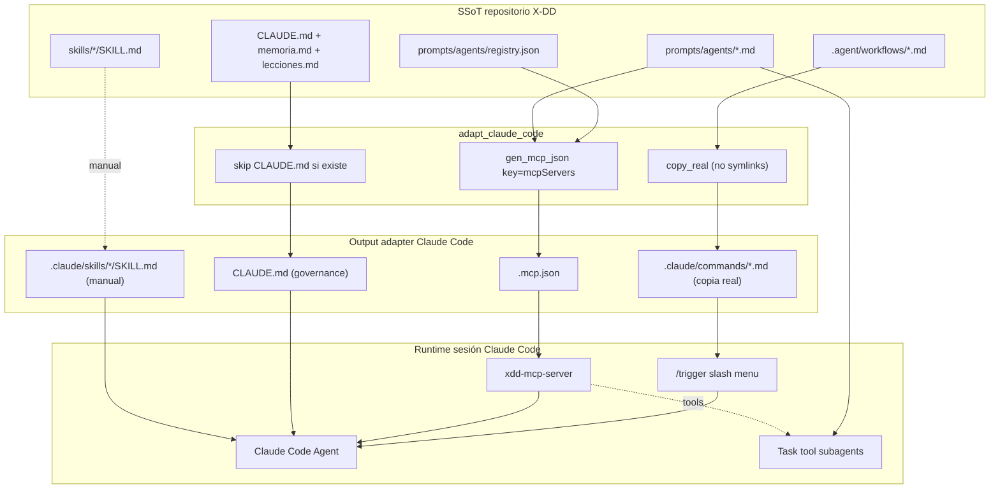
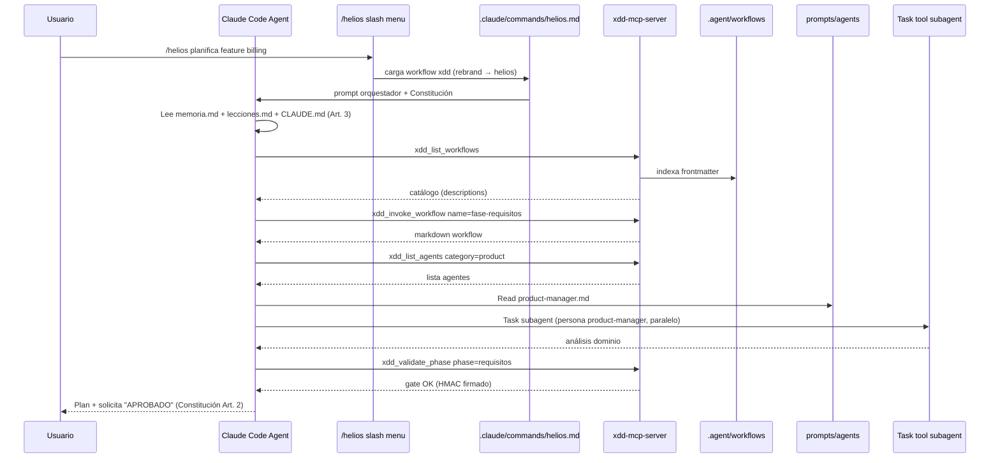

# Guía Claude Code — Agentes, Skills y Workflows compatibles con X-DD

**Proyecto:** `personal/x-dd/` — sistema multi-IDE install-once  
**IDE:** Claude Code (Anthropic)  
**Versión doc:** 1.0  
**Fecha:** 2026-05-28  
**Estado adapter:** ✅ Implementado en `scripts/xdd-adapt.sh` (`adapt_claude_code`, líneas 185-194) — **orquestador primario**  
**Referencias internas:** ADR-0034, ADR-0035, ADR-0036, ADR-0037, `docs/IDE_SETUP.md`, `docs/MCP_INTEGRATION.md`

---

## 1. Propósito de este documento

Ficha técnica granular de **Claude Code** dentro de la serie multi-IDE de X-DD. Claude Code es el **orquestador primario** del framework — el `CLAUDE.md` raíz (`CLAUDE.md:1-3`) declara explícitamente:

> *"Este manifiesto define el contexto operativo y gobernanza para Claude Code y otros agentes cuando trabajan en un proyecto X-DD."*

Complementa las guías equivalentes ya recopiladas:

- Cursor (rules `.mdc` + MCP)
- OpenCode (slash + `AGENTS.md` + `.opencode/command/`)
- Windsurf (workflows nativos + MCP merge global, ADR-0037)
- VSCode + Copilot (prompt files)
- Antigravity (MCP global + `.agents/skills/`)
- Codex (skills global + orchestrator pattern)

**Audiencia:** agente/desarrollador que mantiene `xdd-adapt.sh`, el SSoT de workflows/agents/skills y la gobernanza X-DD multi-IDE.

**Objetivo:** que tras `xdd-init.sh`, Claude Code funcione con **paridad completa** (slash nativos + MCP + governance), sin pasos manuales.

---

## 2. Verdad técnica sobre Claude Code (capacidades nativas)

Claude Code es la **referencia funcional** del adapter X-DD — es el IDE con capacidades más completas. No tiene gaps significativos:

| Capacidad | Claude Code | Cursor | Windsurf | Antigravity |
|-----------|-------------|--------|----------|-------------|
| Slash commands custom (`/workflow`) | ✅ `.claude/commands/*.md` nativo | ❌ | ✅ `.windsurf/workflows/` | ❌ |
| Registro automático de N workflows | ✅ copia real desde SSoT | ❌ rule única | ✅ workflows nativos | ❌ MCP only |
| Subagents paralelos | ✅ **Task tool nativo** | ✅ | Limitado | Limitado |
| Skills convención | ✅ `.claude/skills/<name>/SKILL.md` | ✅ `.cursor/skills/` | ⚠️ (vía MCP) | ✅ `.agents/skills/` |
| MCP tools | ✅ `.mcp.json` project-local | ✅ | ✅ (global `~/.codeium/`) | ✅ (global `~/.gemini/`) |
| Governance manifest | ✅ `CLAUDE.md` (lectura automática) | Parcial | Parcial | Vía skills |
| Symlinks en config | ❌ **RECHAZADOS** (ADR-0034 root cause) | ❌ | ❌ | ❌ |

**Consecuencia de diseño:** Claude Code recibe el output **más completo** del adapter — slash commands reales + MCP project-local + `CLAUDE.md` governance. Es el baseline que el resto de adapters intenta replicar.

**Lección crítica (ADR-0034:22-23, `docs/IDE_SETUP.md:38`):** Claude Code **rechaza symlinks** en `.claude/commands/`. El adapter usa **copia real** (`copy_real()` en `scripts/xdd-adapt.sh:123-130`). Trade-off: pierde DRY, gana visibilidad de `/trigger` en el menú.

---

## 3. Arquitectura X-DD → Claude Code



**Principio rector:** escribir **una vez** en SSoT; materializar **slash commands reales** que Claude Code carga del menú; exponer catálogos (workflows, agents, gates) vía MCP; usar **CLAUDE.md** como ley local de gobernanza (Constitución Art. 3).

---

## 4. Matriz comparativa multi-IDE (Claude Code como referencia)

| Concepto X-DD | **Claude Code** | OpenCode | Cursor | Windsurf | VSCode+Copilot | Codex | Antigravity |
|---|---|---|---|---|---|---|---|
| **Trigger orquestador** | **`/trigger` slash nativo ✅** | `/trigger` | `@trigger` + MCP | `/trigger` workflow | `/trigger` Copilot Chat | `/trigger` description | MCP tool |
| **Workflows materializados** | **`.claude/commands/*.md`** | `.opencode/command/*.md` | No (SSoT+MCP) | `.windsurf/workflows/*.md` | `.github/prompts/*.prompt.md` | `references/workflows-index.md` | No (MCP) |
| **Agentes indexados** | **MCP + prompts SSoT** | `docs/equipo.md` | MCP + prompts | MCP + prompts | MCP + prompts | `agents-index.json` | MCP |
| **Skills sincronizadas** | **`.claude/skills/` (manual hoy)** | Manual | `.cursor/skills/` (gap) | (vía MCP) | (vía MCP) | `~/.codex/skills/` global | `.agents/skills/` auto |
| **Gobernanza** | **`CLAUDE.md` (skip si existe)** | `AGENTS.md` | rule `.mdc` | rule `.md` | prompt frontmatter | SKILL orchestrator | MCP + skills |
| **MCP config path** | **`.mcp.json` project-local** | (vía MCP) | `.cursor/mcp.json` | `~/.codeium/mcp_config.json` (global, ADR-0037) | `.vscode/mcp.json` | N/A | `~/.gemini/config/mcp_config.json` (global) |
| **MCP config key** | **`mcpServers`** | (vía MCP) | `mcpServers` | `mcpServers` | `servers` | N/A | `$typeName` Cascade |
| **Scope install** | **Project-local + opt global** | Project-local | Project-local | Project + global MCP | Project-local | Global skills | Global MCP + project skills |

---

## 5. Workflows — diseño SSoT y consumo en Claude Code

### 5.1 SSoT (Single Source of Truth)

**Ubicación canónica:** `.agent/workflows/<nombre>.md` (ver `.agent/workflows/README.md:1-22`).

**Formato obligatorio (frontmatter Markdown — NO YAML separado):**

```markdown
---
description: Resumen corto de qué hace el workflow.
---
# /nombre-workflow

## Pasos
1. ...
```

**Convenciones** (`.agent/workflows/README.md:12-22`):

| Regla | Detalle |
|-------|---------|
| Nombre archivo = nombre comando | `plan-fases.md` → `/plan-fases` |
| Frontmatter | Campo `description:` obligatorio |
| Portabilidad | **Prohibidas** rutas absolutas del host (Constitución) |
| Catálogo humano | `prompts/workflows/03_workflows_catalog.md` |
| Validación | `bash scripts/lint-workflows.sh` antes de commit |

**Workflows principales** (`.agent/workflows/README.md:30-38`):

| Comando | Fase | Propósito |
|---------|------|-----------|
| `/xdd` | Todas | Orquestador principal |
| `/fase-requisitos` | 1 | Briefing |
| `/project-architecture-gsd` | 2 | Spec + DOMAIN + THREATS |
| `/plan-fases` | 3 | Plan por features |
| `/xdd-build` | 4 | Build con TDD/STDD |
| `/qa-review` | 5 | QA 3-Tier |
| `/cierre-fase` | 6 | Retro + lecciones |

### 5.2 Qué hace `adapt_claude_code()` con los workflows

A diferencia de Cursor/Antigravity, Claude Code **SÍ materializa** workflows como slash commands. Implementación exacta (`scripts/xdd-adapt.sh:185-194`):

```bash
adapt_claude_code() {
  echo "[xdd-adapt] target: claude-code → $DEST/.claude/commands/ (copia real)"
  copy_commands "$DEST/.claude/commands" "md"
  gen_mcp_json "$DEST/.mcp.json" "mcpServers"
  if [ ! -e "$DEST/CLAUDE.md" ]; then
    write_file "$DEST/CLAUDE.md" "# Proyecto integrado con X-DD\n\n..."
  else
    echo "[xdd-adapt] SKIP CLAUDE.md (ya existe)"
  fi
}
```

**3 pasos atómicos:**

1. `copy_commands "$DEST/.claude/commands" "md"` — copia REAL (no symlink, ADR-0034) de cada `.agent/workflows/*.md` a `.claude/commands/<base>.md`
2. `gen_mcp_json "$DEST/.mcp.json" "mcpServers"` — escribe `.mcp.json` project-local con key `mcpServers`
3. `CLAUDE.md` — escribe stub governance **solo si NO existe** (preserva governance custom del proyecto)

### 5.3 Helper `copy_commands` y rebrand de trigger

`scripts/xdd-adapt.sh:156-183`:

```bash
copy_commands() {
  local dst_dir="$1" ext="$2"
  for wf in "$WF_DIR"/*.md; do
    local base; base=$(basename "$wf" .md)
    case "$base" in readme|README) continue ;; esac
    local outname
    if [ "$base" = "xdd" ] && [ "$TRIGGER" != "xdd" ]; then
      outname="$TRIGGER"   # rebrand: xdd.md → helios.md
    else
      outname="$base"
    fi
    copy_real "$wf" "$dst_dir/${outname}.${ext}"
    # ...
    # Rebrand de cabecera: # /xdd → # /<trigger> + description
  done
}
```

**Resolución de trigger** (`scripts/xdd-adapt.sh:90-108`): `--trigger` flag > `xdd.profile.yml` → `branding.orchestrator_trigger` > `"xdd"` default.

### 5.4 Anti-patterns workflows en Claude Code

- ❌ **Symlinks** en `.claude/commands/` — Claude Code los rechaza ("No matching commands", ADR-0034 root cause lección)
- ❌ Editar `.claude/commands/*.md` directamente — son copias materializadas; editar SSoT en `.agent/workflows/` y re-correr adapter
- ❌ Más de un README en el SSoT con cabecera `# /xxx` que confunda el menú
- ❌ Rutas absolutas del host en el contenido del workflow (Constitución, "Portabilidad Absoluta")

### 5.5 Re-sync tras editar SSoT

```bash
# Tras editar .agent/workflows/<nombre>.md:
bash scripts/xdd-adapt.sh claude-code --dest=/ruta/proyecto
# Re-arrancar Claude Code → /<trigger> refrescado
```

`copy_commands` es **idempotente** — overwrite siempre (`cp` en `copy_real` no preserva timestamps de comparación).

---

## 6. Agentes — diseño SSoT y consumo en Claude Code

### 6.1 SSoT

**Archivos de persona:** `prompts/agents/<categoria>/<categoria>-<nombre>.md`

**Registry machine-readable:** `prompts/agents/registry.json` — 180 agentes en 15 categorías:

```
academic, design, engineering, finance, game-development, marketing,
paid-media, product, project-management, sales, security,
spatial-computing, specialized, support, testing
```

**Entry típica:**

```json
{
  "id": "engineering-backend-architect",
  "name": "Backend Architect",
  "category": "engineering",
  "description": "...",
  "prompt_file": "prompts/agents/engineering/engineering-backend-architect.md",
  "ide_compat": ["claude-code", "opencode", "mcp"],
  "skills": [],
  "constraints": [],
  "triggers": [],
  "fallback_agent": null
}
```

**Pipeline de mantenimiento:**

```bash
# 1. Crear/editar .md en prompts/agents/<cat>/
python3 scripts/migrate-agents-to-registry.py
python3 scripts/validate-registry.py --strict
bash scripts/generate-equipo.sh   # docs/equipo.md (humano)
```

**Campo crítico para Claude Code:** `ide_compat` debe incluir `"claude-code"` (consumo directo de slash + MCP) **y** `"mcp"`.

### 6.2 Qué hace Claude Code con los agentes

Claude Code tiene **dos vías nativas** de consumo de agentes X-DD:

| Mecanismo | Rol |
|-----------|-----|
| **MCP `xdd_list_agents`** | Discovery filtrable por categoría (input `{category?}`) |
| **Lectura directa `prompt_file`** | Orquestador adopta la persona del agente |
| **Task tool nativo** | **Subagents paralelos en runtime Claude Code** — delegación técnica con contexto aislado |
| **`docs/equipo.md`** (opcional) | Directorio humano (lo genera `generate-equipo.sh`; `CLAUDE.md:8` referencia) |

**Patrón recomendado de delegación con Task tool:**

1. Orquestador llama `xdd_list_agents` (MCP) → catálogo filtrado
2. Selecciona ID según dominio/tarea
3. Lee el `prompt_file` completo (Read tool)
4. **Delega a Task tool subagent** con persona inyectada — ejecución paralela sin contaminar contexto principal
5. Recolecta resultados → continúa orquestación

### 6.3 Composition patterns (multi-agente paralelo)

El registry soporta composición:

```json
{
  "name": "security_review",
  "lead": "engineering-code-reviewer",
  "specialists": ["engineering-security-engineer"],
  "orchestration": "sequential",
  "gate_between": "peer_review"
}
```

**Ventaja Claude Code vs Cursor/otros:** las `specialists` pueden invocarse **en paralelo nativo** vía Task tool — `xdd-orchestrate.py` (Sprint 11) soporta modos `sequential | parallel | parallel_then_sync`.

### 6.4 Diferencia vs otros adapters

| IDE | Index local generado por adapter |
|-----|----------------------------------|
| OpenCode | `docs/equipo.md` (`adapt_opencode` lo regenera desde registry) |
| Codex | `references/agents-index.json` en skill orchestrator global |
| **Claude Code** | **Ninguno auto** — MCP runtime + opcionalmente `docs/equipo.md` manual |

`adapt_claude_code()` **NO** genera `docs/equipo.md` (solo `adapt_opencode()` lo hace). El user puede correr `bash scripts/generate-equipo.sh` por separado si quiere directorio humano.

---

## 7. Skills — diseño SSoT y consumo en Claude Code

### 7.1 Convención nativa Claude Code

**Ubicaciones válidas:**

| Scope | Path |
|-------|------|
| Proyecto (compartido en repo) | `.claude/skills/<nombre>/SKILL.md` |
| Personal (todas las sesiones) | `~/.claude/skills/<nombre>/SKILL.md` |

**Estructura de carpeta** (confirmada en este mismo repo: `.claude/skills/gitnexus/`):

```
.claude/skills/
  gitnexus/
    gitnexus-exploring/SKILL.md
    gitnexus-impact-analysis/SKILL.md
    gitnexus-debugging/SKILL.md
    gitnexus-refactoring/SKILL.md
    gitnexus-guide/SKILL.md
    gitnexus-cli/SKILL.md
```

### 7.2 Frontmatter — requisitos Claude Code

**Mínimo obligatorio:**

```yaml
---
name: mi-skill
description: Qué hace la skill. Use when user mentions X, Y, or Z.
---
```

| Campo | Reglas |
|-------|--------|
| `name` | lowercase, guiones, max 64 chars, único |
| `description` | tercera persona, incluir triggers/WHEN para auto-discovery |

### 7.3 Frontmatter enriquecido X-DD (compatible)

X-DD usa metadata extra en `skills/*/SKILL.md` (6 skills SSoT: `agent-eval, xdd-ai-review, xdd-compact, xdd-fs-context, xdd-sandbox, xdd-talk-compact`):

```yaml
---
name: xdd-compact
description: Provider-agnostic context compaction...
origin: x-dd
inspired_by: LLMLingua-2
category: context-engineering
when_to_use:
  - Pre-LLM call si context exceede 80% del budget
triggers:
  - "/compact"
  - "compact context"
---
```

**Claude Code ignora campos extra** pero no rompe (mismo subset compatible que Codex/Cursor).

### 7.4 SSoT X-DD vs materialización Claude Code

| | SSoT | Destino Claude Code |
|---|---|---|
| Skills framework X-DD (6) | `skills/<name>/SKILL.md` | `.claude/skills/<name>/SKILL.md` |
| GitNexus skills (6) | `.claude/skills/gitnexus/` (ya en repo) | mismo path |
| Caveman / otras user-global | `~/.claude/skills/` | mismo |

### 7.5 Gap del adapter actual

| IDE | `xdd-adapt` sincroniza skills SSoT |
|-----|-------------------------------------|
| Antigravity | ✅ `skills/` → `.agents/skills/` (ADR-0035) |
| Codex | ✅ `skills/` → `~/.codex/skills/` (ADR-0036) |
| **Claude Code** | ❌ **No implementado** — manual hoy |
| Cursor | ❌ idem |

**Workaround manual:**

```bash
mkdir -p .claude/skills
cp -r skills/* .claude/skills/
```

**Recomendación para el agente diseñador:** extender `adapt_claude_code()` con sync skills (patrón idéntico a `adapt_antigravity()` y `adapt_codex()`). Backlog explícito en sección 15.

### 7.6 Anti-patterns skills en Claude Code

- ❌ Crear 180 skills (una por agente) — satura discovery (lección Codex ADR-0036:42 aplicable)
- ❌ `disable-model-invocation: true` en skills que deben auto-dispararse
- ❌ Description vaga ("Helps with code") — el agente no las descubre por triggers
- ❌ Description en primera persona ("I can help you...") — convención IDE = tercera persona
- ❌ Symlinks en `.claude/skills/` — Claude Code los rechaza (misma lección que `.claude/commands/`)

---

## 8. Capa Claude Code — output del adapter

### 8.1 Detección automática (`xdd-init.sh`)

Claude Code se considera **siempre presente** (orquestador primario X-DD). No requiere flag de detección — `xdd-init.sh` corre `xdd-adapt claude-code` por default (opt-out: `XDD_NO_ADAPT=1`).

### 8.2 Comando manual

```bash
bash scripts/xdd-adapt.sh claude-code --dest=/ruta/proyecto
bash scripts/xdd-adapt.sh claude-code --dest=/ruta/proyecto --trigger=helios
bash scripts/xdd-adapt.sh claude-code --dest=/ruta/proyecto --dry-run
```

**Resolución de trigger:** `--trigger` flag > `xdd.profile.yml` → `branding.orchestrator_trigger` > `"xdd"` default.

### 8.3 Archivos generados hoy

#### A) `.claude/commands/<workflow>.md` (N archivos, copia real)

Cada `.agent/workflows/*.md` se copia 1:1 (excepto `README.md`). El workflow principal `xdd.md` se renombra a `<trigger>.md` y se reescribe la cabecera + description (`scripts/xdd-adapt.sh:170-178`).

```markdown
---
description: Orquestador Principal X-DD (trigger /helios).
---
# /helios

## Pasos
1. Lee memoria.md (Art. 3 Constitución)
2. ...
```

**Claude Code los carga al arrancar** → aparecen en menú `/`.

#### B) `.mcp.json` project-local (`scripts/xdd-adapt.sh:134-151`)

```json
{
  "mcpServers": {
    "helios": {
      "command": "python3",
      "args": ["-m", "xdd-mcp-server"],
      "cwd": "/ruta/absoluta/al/proyecto"
    }
  }
}
```

| Aspecto | Detalle |
|---------|---------|
| Key JSON | **`mcpServers`** (estándar Anthropic, coincide con `~/.claude/mcp_servers.json` doc oficial `docs/MCP_INTEGRATION.md:53-65`) |
| Nombre del server | igual al `TRIGGER` (default `xdd`, custom `helios`, etc.) |
| `cwd` | Proyecto destino — MCP server lee `.xdd/` local (T4.3 mitigación) |
| Alternativa Sprint 25 | Wrapper global `~/.local/bin/xdd-mcp-server` sin `cwd` fijo (ADR-0035) |

#### C) `CLAUDE.md` governance (solo si NO existe)

`scripts/xdd-adapt.sh:189-193`:

```bash
if [ ! -e "$DEST/CLAUDE.md" ]; then
  write_file "$DEST/CLAUDE.md" "# Proyecto integrado con X-DD\n\nWorkflows: \`.claude/commands/\` (copia real desde \`.agent/workflows/\`).\nMCP: \`.mcp.json\` apunta a xdd-mcp-server.\nMemoria: \`memoria.md\` · Lecciones: \`lecciones.md\` · Config: \`xdd.profile.yml\`.\n\nDocs: https://github.com/Cucholambr3ta/x-dd"
else
  echo "[xdd-adapt] SKIP CLAUDE.md (ya existe)"
fi
```

**Decisión de diseño:** **preservar** `CLAUDE.md` del proyecto destino si ya existe (governance custom prevalece). El stub X-DD solo aplica a proyectos vírgenes.

### 8.4 Archivos recomendados (no generados hoy — backlog adapter)

| Archivo | Propósito |
|---------|-----------|
| `.claude/skills/<name>/SKILL.md` (6 skills SSoT) | Sync automático desde `skills/` (patrón Antigravity/Codex) |
| `.claude/README-xdd.md` | Trigger, MCP, gaps, re-sync (patrón Codex/Antigravity) |
| `docs/equipo.md` | Directorio humano (hoy solo lo genera `adapt_opencode`) |
| `.claude/settings.json` enrichment | Allowlist Bash commands X-DD frecuentes (reduce permission prompts) |

### 8.5 Wrapper global Sprint 25 / ADR-0035 (compat Claude Code)

Si `~/.local/bin/xdd-mcp-server` está instalado (`bash scripts/xdd-mcp-install-global.sh`):

```json
{
  "mcpServers": {
    "xdd": {
      "command": "~/.local/bin/xdd-mcp-server"
    }
  }
}
```

- **Sin `cwd` fijo** — el server resuelve workflows/registry **local-first** (`get_workflows_dir(os.getcwd())`) con fallback al ROOT global
- Beneficio: workspace switching en Claude Code (cambiar de proyecto) → MCP arranca correctamente en el activo
- `xdd_get_phase_artifacts` mantiene cwd strict per-project (T4.3 hardened)

**Estado actual:** el adapter `adapt_claude_code()` **no detecta** automáticamente el wrapper global (a diferencia de `adapt_antigravity()` y `adapt_windsurf()` post-ADR-0037). Gap menor — pendiente.

---

## 9. MCP server — denominador común

Todos los IDEs MCP-capable (incluido Claude Code) consumen las **6 tools** del `xdd-mcp-server` (`docs/MCP_INTEGRATION.md:19-29`):

| Tool | Input | Output |
|------|-------|--------|
| `xdd_validate_phase` | `{phase}` | Status + checksums + firma HMAC |
| `xdd_transition_phase` | `{from_phase, to_phase}` | Valida transición secuencial |
| `xdd_list_workflows` | `{}` | Lista workflows + `description` del frontmatter |
| `xdd_invoke_workflow` | `{name}` | **Contenido markdown del workflow (NO ejecuta — T6.3 mitigación)** |
| `xdd_list_agents` | `{category?}` | Registry filtrable |
| `xdd_get_phase_artifacts` | `{phase}` | Whitelist `.xdd/<fase>/` (T4.3 mitigación) |

**Smoke test:**

```bash
python3 -m xdd-mcp-server --check       # 6 tools
python3 -m xdd-mcp-server --version     # xdd-mcp-server v0.1.0-dev
```

**Setup Claude Code** (`docs/MCP_INTEGRATION.md:51-65`): el adapter genera `.mcp.json` project-local. Alternativa user-global: `~/.claude/mcp_servers.json` (o `claude mcp add ...`).

---

## 10. Flujo de sesión completo en Claude Code



**Mensajes de activación válidos:**

- `/helios quiero planificar la feature X` (slash nativo — vía adapter copia real)
- `/fase-requisitos` (workflow específico también es slash)
- Invocación directa MCP: pedir `xdd_invoke_workflow` con name

---

## 11. Reglas de diseño SSoT multi-IDE (incluyendo Claude Code)

Al crear artefactos en `personal/x-dd/`, aplicar para que **todos** los IDEs los consuman:

### Workflows

- [ ] Markdown en `.agent/workflows/`
- [ ] Frontmatter `description:` presente
- [ ] Sin rutas absolutas del host
- [ ] Entrada en catálogo `prompts/workflows/03_workflows_catalog.md`
- [ ] Pasa `lint-workflows.sh`
- [ ] **Cabecera `# /xdd`** en el workflow principal (rebrand automático del adapter)

### Agentes

- [ ] Markdown en `prompts/agents/<cat>/`
- [ ] Entry en `registry.json` con `ide_compat: ["claude-code", "opencode", "mcp"]`
- [ ] `prompt_file` relativo al proyecto
- [ ] Pasa `validate-registry.py --strict`

### Skills

- [ ] Carpeta `skills/<name>/SKILL.md`
- [ ] Frontmatter **`name` + `description` siempre** (subset mínimo Codex/Cursor/Claude Code)
- [ ] Description incluye triggers/WHEN en tercera persona
- [ ] Metadata extra opcional — Claude Code la ignora sin romper

### Orquestador

- [ ] `.agent/workflows/xdd.md` es la fuente del slash principal
- [ ] Adapter rebrand-ea cabecera + filename según `TRIGGER`
- [ ] **NO symlinks** en `.claude/commands/` (ADR-0034)
- [ ] MCP config con key `mcpServers`

### Portabilidad (Constitución X-DD)

- [ ] Rutas relativas (`./`, `../`) en todo contenido versionable del SSoT
- [ ] `xdd-adapt.sh` puede escribir `cwd` absoluto en `.mcp.json` (aceptable: es config generada local)

---

## 12. Comparación adapter: Claude Code como baseline funcional

| Feature | **Claude Code (HOY)** | OpenCode | Cursor | Windsurf | Antigravity | Codex |
|---------|-----------------------|----------|--------|----------|-------------|-------|
| Slash commands materializados | ✅ `.claude/commands/*.md` copia real | ✅ `.opencode/command/*.md` | ❌ | ✅ `.windsurf/workflows/*.md` | ❌ | ❌ (description-based) |
| MCP config | ✅ project `.mcp.json` `mcpServers` | (vía MCP) | ✅ `.cursor/mcp.json` | ✅ merge global `~/.codeium/` | ✅ merge global `~/.gemini/` | N/A |
| Wrapper global Sprint 25 detect | ❌ pendiente | N/A | ❌ pendiente | ✅ ADR-0037 | ✅ ADR-0035 | N/A |
| Governance manifest | ✅ `CLAUDE.md` skip-si-existe | ✅ `AGENTS.md` | rule `.mdc` | rule `.md` | (via skills) | SKILL orchestrator |
| Sync skills SSoT | ❌ manual | ❌ manual | ❌ manual | ❌ (vía MCP) | ✅ `.agents/skills/` | ✅ `~/.codex/skills/` |
| Agents index local | ❌ MCP only | ✅ `docs/equipo.md` | ❌ MCP only | ❌ MCP only | (via skills) | ✅ `agents-index.json` |
| README local | ❌ | ❌ | ❌ | ✅ `.windsurf/README-xdd.md` | ✅ `.antigravity/README-xdd.md` | ✅ `.codex/README-xdd.md` |
| Subagents Task tool paralelo | ✅ **nativo** | Limitado | ✅ | Limitado | Limitado | Limitado |

**Lectura clave:** Claude Code es **el más completo en slash + MCP + governance**, pero **comparte con Cursor el gap de skills sync**. Backlog adapter prioritario: sección 15.

---

## 13. Instalación end-to-end

### 13.1 Install automático (xdd-init)

```bash
bash scripts/xdd-init.sh /tu/proyecto --profile=developer
# → Claude Code siempre detectado → genera:
#    .claude/commands/*.md (copia real)
#    .mcp.json (mcpServers)
#    CLAUDE.md (si no existe)
```

### 13.2 Pasos post-install (Claude Code)

1. **Reiniciar Claude Code** en el proyecto (es **necesario** para que el menú `/` descubra los nuevos commands)
2. Verificar slash: tipear `/` → debe aparecer `/<trigger>` (default `/xdd`) + 54 workflows
3. Verificar MCP: pedir al agente `xdd_list_workflows` → debe responder con catálogo
4. (Manual hoy) Sync skills SSoT:
   ```bash
   mkdir -p .claude/skills && cp -r skills/* .claude/skills/
   ```
5. (Opcional) Instalar wrapper global Sprint 25:
   ```bash
   bash scripts/xdd-mcp-install-global.sh
   bash scripts/xdd-mcp-install-global.sh --check
   ```

### 13.3 Re-sync tras editar SSoT

| Cambio en SSoT | Acción Claude Code |
|----------------|--------------------|
| Editaste `.agent/workflows/<wf>.md` | `xdd-adapt claude-code` → reiniciar Claude Code |
| Editaste agente | `migrate-agents-to-registry.py` → MCP refresca al re-arrancar server |
| Cambiaste trigger/branding | `xdd-adapt claude-code --trigger=nuevo` → reiniciar |
| Editaste skill SSoT | re-copiar a `.claude/skills/` (manual hoy) |
| Actualizaste X-DD upstream | `xdd-adapt claude-code` + re-copiar skills + opcional re-run `xdd-mcp-install-global.sh` |

---

## 14. Troubleshooting

| Síntoma | Causa probable | Fix |
|---------|----------------|-----|
| `/xdd` no aparece en menú slash | Versión vieja con symlink, o no reiniciaste Claude Code | Re-correr `xdd-adapt claude-code` (copia real) + reiniciar IDE |
| `/xdd` no aparece en subproyecto | `.claude/commands/` solo a nivel CWD, no hereda padre | `xdd-adapt claude-code --dest=subproyecto` |
| MCP tools no aparecen | `.mcp.json` ausente, malformado o `cwd` incorrecto | Verificar `.mcp.json` apunta a proyecto con `xdd-mcp-server/` |
| MCP no encuentra workflows | `cwd` apunta a proyecto sin `.agent/workflows/` | Corregir `cwd` o usar wrapper global (ADR-0035) |
| `CLAUDE.md` sobrescrito por adapter | Borraste el archivo o el SKIP no aplicó | Adapter **preserva** si existe; restaurar de git |
| Skills X-DD no se activan | No copiadas a `.claude/skills/` | `cp -r skills/* .claude/skills/` |
| `xdd-mcp-server` not found | PYTHONPATH / wrapper global no instalado | `bash scripts/xdd-doctor.sh` o `bash scripts/xdd-mcp-install-global.sh` |
| Workflow muestra `# /xdd` aunque trigger es `helios` | Rebrand fallido (python3 ausente) | Verificar `command -v python3`; re-correr adapter |
| Commands desactualizados tras editar SSoT | No re-corriste adapter | `xdd-adapt claude-code` es idempotente — re-run + reinicia IDE |
| Task tool no encuentra agente | No invocó MCP primero | Patrón: `xdd_list_agents` → Read `prompt_file` → Task subagent |

---

## 15. Checklist para el agente diseñador

### SSoT (creación de artefactos)

- [ ] Workflows en `.agent/workflows/` con frontmatter y lint OK
- [ ] Agentes en `prompts/agents/` con registry validado e `ide_compat: ["claude-code","mcp"]`
- [ ] Skills en `skills/` con `name` + `description` mínimos
- [ ] Sin rutas absolutas en contenido versionable

### Adapter Claude Code (`adapt_claude_code` — estado vs backlog)

- [x] Copia real workflows → `.claude/commands/*.md` (ya hecho — `scripts/xdd-adapt.sh:187`)
- [x] Generar `.mcp.json` con `mcpServers` (ya hecho — `:188`)
- [x] Escribir `CLAUDE.md` stub si no existe (ya hecho — `:189-193`)
- [x] Rebrand cabecera + filename según trigger (ya hecho — `copy_commands :170-178`)
- [ ] **Sync skills SSoT → `.claude/skills/`** (pendiente — patrón Antigravity/Codex)
- [ ] **Detectar wrapper global Sprint 25** y omitir `cwd` si presente (pendiente — patrón Antigravity/Windsurf)
- [ ] `.claude/README-xdd.md` con trigger + MCP + gaps + re-sync (pendiente — patrón Codex/Antigravity)
- [ ] `.claude/settings.json` enrichment con allowlist Bash X-DD frecuentes (opcional)
- [ ] Test bats: `tests/bats/xdd-adapt.bats` caso claude-code (copia real + skip CLAUDE.md + rebrand)

### Documentación

- [ ] Mantener sección Claude Code en `docs/IDE_SETUP.md` sincronizada
- [ ] Cuando se implemente sync skills + wrapper detect → ADR-0038 Claude Code adapter parity
- [ ] Actualizar matriz en `the-longform-guide.md`

---

## 16. Referencias

### Documentación oficial Claude Code (Anthropic)

- Slash commands: archivos `.claude/commands/*.md` cargados al arrancar
- MCP config: `~/.claude/mcp_servers.json` global o `.mcp.json` project-local con key `mcpServers` (`docs/MCP_INTEGRATION.md:53-65`)
- Skills convención: `.claude/skills/<name>/SKILL.md` con frontmatter `name` + `description`
- Task tool: subagents paralelos con contexto aislado (runtime nativo)
- MCP spec: https://spec.modelcontextprotocol.io

### Documentación X-DD interna

- `CLAUDE.md` raíz — gobernanza primaria
- `docs/IDE_SETUP.md:20-23,34-40` — matriz multi-IDE + Claude Code
- `docs/MCP_INTEGRATION.md:19-29,51-65` — 6 tools + setup Claude Code
- `docs/adr/0034-universal-ide-adapter.md` — copia real + 6 IDEs + symlink lección
- `docs/adr/0035-global-install-architecture.md` — wrapper MCP global
- `docs/adr/0036-codex-adapter-global-skills.md` — pattern orchestrator + index
- `docs/adr/0037-windsurf-adapter-parity.md` — paridad workflows + MCP merge
- `scripts/xdd-adapt.sh:185-194` — función `adapt_claude_code()`
- `scripts/xdd-adapt.sh:123-130` — `copy_real` (no symlinks)
- `scripts/xdd-adapt.sh:134-151` — `gen_mcp_json` (key `mcpServers`)
- `scripts/xdd-adapt.sh:156-183` — `copy_commands` + rebrand trigger
- `.agent/workflows/README.md` — convenciones workflows SSoT
- `lecciones.md` — `[HERRAMIENTAS] symlinks en .claude/commands rechazados por Claude Code`

### Implementación de referencia en repo (a usar como template del backlog)

- `adapt_antigravity()` — pattern copia skills a convención IDE (`.agents/skills/`) + detect wrapper global + merge MCP
- `adapt_codex()` — pattern orchestrator skill + `agents-index.json` + `workflows-index.md`
- `adapt_windsurf()` (ADR-0037) — pattern paridad workflows + MCP merge global con env var override
- `adapt_opencode()` — pattern `docs/equipo.md` desde registry

---

## 17. Resumen ejecutivo (TL;DR)

1. **Claude Code es el orquestador primario X-DD** — `CLAUDE.md` raíz lo declara explícitamente. Es el IDE con capacidades nativas más completas (slash + MCP + Task tool).
2. **Workflows:** SSoT en `.agent/workflows/`; adapter materializa **copia real** (no symlinks — ADR-0034 root cause) en `.claude/commands/*.md`. Slash nativo `/<trigger>` aparece en menú.
3. **Agentes:** SSoT en `prompts/agents/` + `registry.json` (180 agentes / 15 categorías); consumo vía MCP `xdd_list_agents` + Read `prompt_file` + **delegación paralela a Task tool subagents** (ventaja nativa Claude Code).
4. **Skills:** convención `.claude/skills/<name>/SKILL.md` con frontmatter `name` + `description`; **gap: adapter no sincroniza aún** (backlog — patrón Antigravity/Codex).
5. **MCP:** `.mcp.json` project-local con key `mcpServers` (estándar Anthropic). Wrapper global Sprint 25 (ADR-0035) disponible — adapter no lo detecta automáticamente todavía (gap menor).
6. **Governance:** `CLAUDE.md` es la ley local (Constitución Art. 3 — lectura obligatoria de `memoria.md` antes de cada iteración). Adapter **preserva** `CLAUDE.md` si existe en el proyecto destino.
7. **Backlog adapter:** sync skills + detect wrapper global + README local + `docs/equipo.md` opcional — todos siguiendo patrones ya implementados en Antigravity (ADR-0035), Codex (ADR-0036) y Windsurf (ADR-0037).

---

*Guía técnica Claude Code X-DD v1.0 — 2026-05-28*
