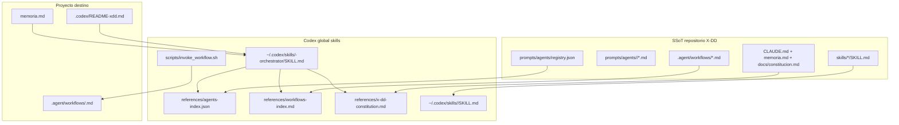
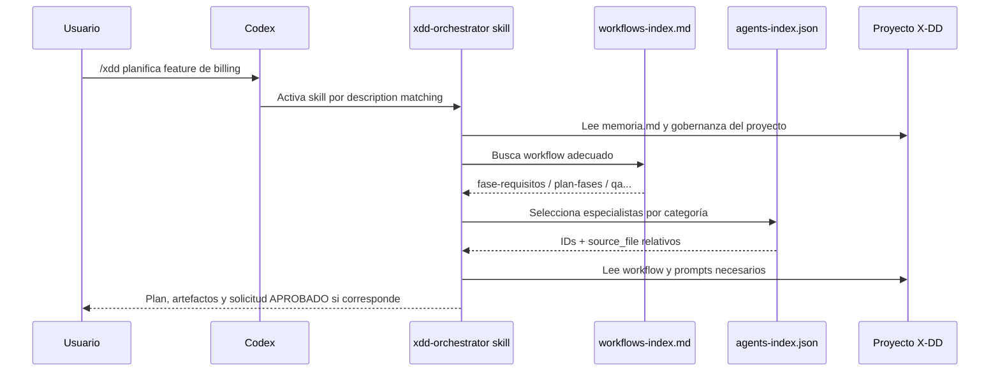

# Guía Codex — Agentes, Skills y Workflows compatibles con X-DD

**Proyecto:** `personal/x-dd/` — sistema multi-IDE install-once  
**IDE:** Codex (OpenAI CLI)  
**Versión doc:** 1.0  
**Fecha:** 2026-05-28  
**Estado adapter:** ✅ Implementado en `scripts/xdd-adapt.sh` (`adapt_codex`, líneas 433-577) — patrón orchestrator + skills globales (ADR-0036)  
**Referencias internas:** **ADR-0036** (decisión específica), ADR-0034, ADR-0035, ADR-0037, `docs/IDE_SETUP.md`, `docs/MCP_INTEGRATION.md`

---

## 1. Propósito de este documento

Este documento es la **ficha técnica granular de Codex** dentro de la serie multi-IDE de X-DD. Replica el formato de `docs/GUIA_CURSOR_AGENTES_SKILLS_WORKFLOWS.md`, pero con las reglas específicas de Codex:

- Skills **globales** en `~/.codex/skills/`
- Un solo skill orquestador: `<trigger>-orchestrator/SKILL.md`
- Índices en `references/agents-index.json` y `references/workflows-index.md`
- Activación por `description:` del frontmatter, no por slash command registry
- Sin rule, sin `@mention`, sin MCP como mecanismo Codex

**Audiencia:** agente o desarrollador que mantiene el adapter universal (`scripts/xdd-adapt.sh`) y necesita entender cómo Codex consume el SSoT consolidado de X-DD.

**Objetivo:** que al instalar X-DD, Codex pueda coordinar workflows, agentes y gates con semántica X-DD sin crear arquitectura paralela ni duplicar 180 agentes como skills.

---

## 2. Verdad técnica sobre Codex (limitaciones y diferencias)

Codex **no es** Claude Code, OpenCode, Cursor, Windsurf ni Antigravity. ADR-0036 fija diferencias no negociables:

| Capacidad | Claude Code / OpenCode / Copilot | Cursor / Windsurf | **Codex** |
|-----------|----------------------------------|-------------------|-----------|
| Slash commands custom por archivos | Sí en IDEs compatibles | Parcial / no uniforme | No hay registry local de slash |
| Activación por texto `/trigger` | Archivo command/prompt | Rule/workflow/MCP según IDE | **`description:` del skill** |
| Skills project-local | Depende del IDE | Sí en varios adapters | **No: global en `~/.codex/skills/`** |
| Rule `@mention` | No aplica | Cursor usa `@trigger` | **No aplica** |
| MCP como runtime X-DD | Sí para IDEs MCP-capable | Sí | **N/A para Codex adapter** |
| Agentes como N skills | No recomendado | No recomendado | **Prohibido por diseño ADR-0036** |
| Frontmatter extra en orchestrator | Variable | Variable | **No: solo `name` + `description`** |

**Consecuencia de diseño:** Codex recibe un **orchestrator skill global** que contiene instrucciones de coordinación y referencias compactas. El catálogo real sigue en el SSoT del repo X-DD.

---

## 3. Arquitectura X-DD → Codex



**Principio rector:** el adapter materializa una capa Codex global derivada del SSoT. No convierte agentes ni workflows en skills individuales.

---

## 4. Matriz comparativa multi-IDE (Codex en contexto)

| Concepto X-DD | Claude Code | OpenCode | Cursor | Windsurf | VSCode Copilot | Antigravity | **Codex** |
|---|---|---|---|---|---|---|---|
| **Trigger orquestador** | `/trigger` | `/trigger` | `@trigger` + MCP | workflows/MCP | `/trigger` | MCP tool | **`/trigger` textual por description matching** |
| **Mecanismo principal** | slash command | command + workflows | rules + MCP | workflows + MCP | prompt files | MCP global | **global skill** |
| **Workflows materializados** | `.claude/commands/*.md` | `.opencode/command/*.md` | No, SSoT + MCP | `.windsurf/workflows/*.md` | `.github/prompts/*.prompt.md` | No, MCP | **`references/workflows-index.md`** |
| **Agentes indexados** | MCP + prompts | `docs/equipo.md` | MCP + prompts | MCP | MCP | MCP | **`references/agents-index.json`** |
| **Skills sincronizadas** | Manual / IDE local | Manual | Pendiente en Cursor | No principal | No principal | `.agents/skills/` | **`~/.codex/skills/` global** |
| **Gobernanza** | `CLAUDE.md` | `AGENTS.md` | rule + manifest | README/rules | prompt files | MCP + README | **orchestrator SKILL + constitution ref** |
| **MCP** | Sí | Variable | Sí | Sí | Sí | Sí | **N/A en adapter Codex** |
| **Scope install** | Project-local | Project-local | Project-local | Global MCP + local workflows | Project-local | Global MCP + project skills | **Global skills + README local** |

---

## 5. Workflows — diseño SSoT y consumo en Codex

### 5.1 SSoT (Single Source of Truth)

**Ubicación canónica:** `.agent/workflows/<nombre>.md`

**Formato obligatorio:**

```markdown
---
description: Resumen corto de qué hace el workflow.
---
# /nombre-workflow

## Pasos
1. ...
```

**Convenciones:**

| Regla | Detalle |
|-------|---------|
| Nombre archivo = ID workflow | `plan-fases.md` → workflow `plan-fases` |
| Frontmatter | Campo `description:` obligatorio |
| Portabilidad | Prohibidas rutas absolutas del host |
| Catálogo humano | Mantener catálogo de workflows si aplica |
| Validación | `bash scripts/lint-workflows.sh` antes de commit |

### 5.2 Qué hace Codex con los workflows

Codex no registra `.agent/workflows/*.md` como comandos slash. `adapt_codex()` genera `references/workflows-index.md` dentro del orchestrator global con una línea por workflow:

```markdown
- **fase-requisitos** — Define catálogo FDD y criterios...
```

El orchestrator usa ese índice para decidir qué workflow cargar. Si necesita el contenido completo, usa lectura directa del proyecto o el helper `scripts/invoke_workflow.sh`, que resuelve `.agent/workflows/<name>.md` desde el project root recibido.

### 5.3 Qué NO hace `adapt_codex()`

- No copia 55 workflows como skills.
- No crea slash commands project-locales.
- No depende de `xdd-mcp-server`.
- No crea `.codex/skills/` dentro del proyecto.

### 5.4 Anti-patterns workflows en Codex

- Crear un skill por workflow.
- Editar `references/workflows-index.md` a mano como SSoT.
- Esperar que Codex lea `.agent/workflows/` sin que el orchestrator lo instruya.
- Usar rutas absolutas del host dentro de workflows versionables.

---

## 6. Agentes — diseño SSoT y consumo en Codex

### 6.1 SSoT

**Archivos de persona:** `prompts/agents/<categoria>/<categoria>-<nombre>.md`

**Registry machine-readable:** `prompts/agents/registry.json`

El registry declara versión, generador y lista de agentes. Cada entry mantiene al menos:

```json
{
  "id": "engineering-backend-architect",
  "name": "Backend Architect",
  "category": "engineering",
  "description": "...",
  "prompt_file": "prompts/agents/engineering/engineering-backend-architect.md",
  "ide_compat": ["claude-code", "opencode", "mcp"],
  "skills": [],
  "constraints": [],
  "triggers": [],
  "fallback_agent": null
}
```

Estado verificado del registry:

| Métrica | Valor |
|---------|-------|
| Agentes | 180 |
| Categorías | 15 |
| Composition patterns | 5 |
| Generador | `scripts/migrate-agents-to-registry.py` |

### 6.2 Índice Codex derivado

`adapt_codex()` transforma `prompts/agents/registry.json` en:

```text
~/.codex/skills/<trigger>-orchestrator/references/agents-index.json
```

Cada entrada queda compactada a:

```json
{
  "id": "engineering-backend-architect",
  "name": "backend-architect",
  "category": "engineering",
  "description": "Senior backend architect...",
  "source_file": "prompts/agents/engineering/engineering-backend-architect.md"
}
```

El campo `source_file` conserva ruta relativa al repo/proyecto. Codex debe cargar solo los agentes necesarios para la tarea, no todo el catálogo completo.

### 6.3 Patrón recomendado de delegación

1. Orchestrator recibe intención del usuario.
2. Consulta `references/agents-index.json`.
3. Selecciona especialistas por categoría y descripción.
4. Lee el `source_file` relativo si necesita la persona completa.
5. Coordina la ejecución en el hilo Codex, respetando gates X-DD.

### 6.4 Anti-patterns agentes en Codex

- Crear 180 skills, uno por agente.
- Copiar `prompts/agents/` completo dentro del skill.
- Convertir `registry.json` en SSoT alternativo dentro de `~/.codex/`.
- Añadir campos propietarios Codex al registry X-DD.

---

## 7. Skills — diseño SSoT y consumo en Codex

### 7.1 Convención nativa Codex

**Ubicación válida para X-DD en Codex:** `~/.codex/skills/<name>/SKILL.md`

Codex descubre skills globales leyendo el frontmatter de `SKILL.md`. Para el orchestrator, ADR-0036 exige frontmatter mínimo:

```yaml
---
name: xdd-orchestrator
description: Use when the user starts with /xdd, asks to coordinate X-DD pipeline...
---
```

**Campos permitidos en orchestrator:** `name`, `description`.

**Campos prohibidos en orchestrator:** `origin`, `triggers`, `category`, `when_to_use`, `inspired_by` u otros campos extra.

### 7.2 Orchestrator skill

Estructura generada:

```text
~/.codex/skills/<trigger>-orchestrator/
  SKILL.md
  references/
    agents-index.json
    workflows-index.md
    x-dd-constitution.md
  scripts/
    invoke_workflow.sh
```

El body de `SKILL.md` instruye:

- Coordinar pipeline X-DD de 6 fases.
- Leer `references/workflows-index.md`.
- Consultar `references/agents-index.json`.
- Validar gates HMAC antes de transiciones.
- Reportar resultado con trazabilidad.

### 7.3 6 skills X-DD copiadas globales

Además del orchestrator, `adapt_codex()` copia las 6 skills propias de X-DD:

| Skill | Origen SSoT | Destino Codex |
|-------|-------------|---------------|
| `agent-eval` | `skills/agent-eval/` | `~/.codex/skills/agent-eval/` |
| `xdd-ai-review` | `skills/xdd-ai-review/` | `~/.codex/skills/xdd-ai-review/` |
| `xdd-compact` | `skills/xdd-compact/` | `~/.codex/skills/xdd-compact/` |
| `xdd-fs-context` | `skills/xdd-fs-context/` | `~/.codex/skills/xdd-fs-context/` |
| `xdd-sandbox` | `skills/xdd-sandbox/` | `~/.codex/skills/xdd-sandbox/` |
| `xdd-talk-compact` | `skills/xdd-talk-compact/` | `~/.codex/skills/xdd-talk-compact/` |

Estas skills pueden tener metadata X-DD adicional si ya existe en el SSoT. La restricción estricta de frontmatter mínimo aplica al **orchestrator generado**, no a la definición histórica de cada skill X-DD.

### 7.4 Anti-patterns skills en Codex

- Crear N skills por agentes o por workflows.
- Generar `.codex/skills/` project-local.
- Enriquecer el frontmatter del orchestrator.
- Usar una descripción vaga que no incluya cuándo activar el orchestrator.

---

## 8. Capa Codex — output del adapter

### 8.1 Detección automática (`xdd-init.sh`)

Codex se detecta si:

```bash
command -v codex >/dev/null 2>&1 || [ -d "$HOME/.codex" ]
```

Tras bootstrap, `xdd-init.sh` ejecuta `xdd-adapt.sh codex` automáticamente, salvo opt-out:

```bash
XDD_NO_ADAPT=1 bash scripts/xdd-init.sh <proyecto>
```

### 8.2 Comando manual

```bash
bash scripts/xdd-adapt.sh codex --dest=<proyecto>
bash scripts/xdd-adapt.sh codex --dest=<proyecto> --trigger=helios
bash scripts/xdd-adapt.sh codex --dest=<proyecto> --dry-run
```

**Resolución de trigger:** `--trigger` flag > `xdd.profile.yml` → `branding.orchestrator_trigger` > `"xdd"` default.

### 8.3 Override de portabilidad

Por defecto:

```bash
~/.codex/skills/
```

Para tests o instalaciones custom:

```bash
XDD_CODEX_HOME=<directorio-codex-skills> bash scripts/xdd-adapt.sh codex --dest=<proyecto>
```

El override apunta al directorio de skills, no al directorio padre de Codex.

### 8.4 Archivos generados

| Archivo | Scope | Función |
|---------|-------|---------|
| `~/.codex/skills/<trigger>-orchestrator/SKILL.md` | Global | Skill orquestador X-DD |
| `~/.codex/skills/<trigger>-orchestrator/references/agents-index.json` | Global | Índice compacto de 180 agentes |
| `~/.codex/skills/<trigger>-orchestrator/references/workflows-index.md` | Global | Índice de workflows desde `.agent/workflows/` |
| `~/.codex/skills/<trigger>-orchestrator/references/x-dd-constitution.md` | Global | Copia de constitución si existe |
| `~/.codex/skills/<trigger>-orchestrator/scripts/invoke_workflow.sh` | Global | Helper de lectura de workflow |
| `~/.codex/skills/<skill-xdd>/` | Global | 6 skills X-DD propias |
| `.codex/README-xdd.md` | Proyecto | Nota local: Codex usa skills globales |

### 8.5 Project-local: solo README

El único output project-local funcionalmente esperado para Codex es:

```text
.codex/README-xdd.md
```

Ese archivo documenta dónde vive la skill real. No es un mecanismo de ejecución.

---

## 9. MCP server — denominador común, pero no para Codex

X-DD tiene `xdd-mcp-server` con 6 tools para IDEs MCP-capable:

| Tool | Función |
|------|---------|
| `xdd_validate_phase` | Valida fase + firma HMAC |
| `xdd_transition_phase` | Valida transición secuencial |
| `xdd_list_workflows` | Lista workflows con `description:` |
| `xdd_invoke_workflow` | Devuelve contenido workflow, no ejecuta |
| `xdd_list_agents` | Lista agentes del registry |
| `xdd_get_phase_artifacts` | Lee `.xdd/<fase>/` con whitelist |

**Codex adapter no usa MCP.** ADR-0036 define integración por skills globales directas. No añadir `.mcp.json`, server MCP ni instrucciones de tools MCP a la capa Codex.

MCP sigue siendo relevante para el sistema multi-IDE general, pero no es el contrato de Codex.

---

## 10. Flujo de sesión completo en Codex



**Mensajes de activación esperados:**

- `/xdd quiero planificar la feature X`
- `/xdd ejecuta el workflow plan-fases`
- `/xdd list agents security`
- `/xdd validate spec`

El prefijo funciona porque aparece en la `description` del skill, no porque exista un registro slash custom.

---

## 11. Reglas de diseño SSoT multi-IDE (incluyendo Codex)

Al crear o modificar artefactos X-DD, aplicar estas reglas:

### Workflows

- [ ] Markdown en `.agent/workflows/`
- [ ] Frontmatter `description:` presente
- [ ] Sin rutas absolutas del host
- [ ] Pasa `bash scripts/lint-workflows.sh`
- [ ] Re-correr `xdd-adapt codex` si el índice global debe actualizarse

### Agentes

- [ ] Markdown en `prompts/agents/<cat>/`
- [ ] Entry en `prompts/agents/registry.json`
- [ ] `prompt_file` relativo al proyecto
- [ ] Pasa `python3 scripts/validate-registry.py --strict`
- [ ] Re-correr `xdd-adapt codex` para regenerar `agents-index.json`

### Skills

- [ ] Carpeta `skills/<name>/SKILL.md`
- [ ] Frontmatter con `name` + `description`
- [ ] Description incluye cuándo usar la skill
- [ ] Para orchestrator Codex generado: no añadir campos extra

### Orquestador

- [ ] Un solo `<trigger>-orchestrator`
- [ ] Índices en `references/`
- [ ] Sin N skills por agente
- [ ] Sin N skills por workflow
- [ ] Sin MCP en la capa Codex

### Portabilidad

- [ ] Contenido versionable con rutas relativas
- [ ] Rutas globales de usuario documentadas solo como convención de IDE (`~/.codex/skills/`)
- [ ] Usar `XDD_CODEX_HOME` para tests y entornos custom

---

## 12. Comparación adapter: qué implementa Codex vs Cursor/Antigravity/Windsurf

| Feature | Cursor | Windsurf | Antigravity | **Codex** |
|---------|--------|----------|-------------|-----------|
| Trigger | `@trigger` + MCP | workflow/MCP | MCP tool | **description matching en skill** |
| Scope principal | Project-local | Local workflows + global MCP | Global MCP + project skills | **Global skills** |
| MCP config | `.cursor/mcp.json` | `~/.codeium/mcp_config.json` | `~/.gemini/config/mcp_config.json` | **N/A** |
| Workflows | SSoT + MCP | `.windsurf/workflows/` | MCP | **`references/workflows-index.md`** |
| Agents index | MCP | MCP | MCP | **`references/agents-index.json`** |
| Skills X-DD | Pendiente en guía Cursor | No principal | `.agents/skills/` | **`~/.codex/skills/`** |
| README local | Recomendado | Sí | Sí | **`.codex/README-xdd.md`** |
| Anti-pattern clave | N rules | MCP path local falso | `$typeName` incorrecto | **N skills por agente/workflow** |

Codex comparte con ADR-0035 la idea de instalación global, pero no comparte el mecanismo MCP global. Su contrato es la carpeta global de skills.

---

## 13. Instalación end-to-end

### 13.1 Install automático

```bash
bash scripts/xdd-init.sh <proyecto> --profile=developer
# Detecta Codex si existe codex en PATH o ~/.codex/
# Genera ~/.codex/skills/<trigger>-orchestrator/
```

### 13.2 Install manual

```bash
bash scripts/xdd-adapt.sh codex --dest=<proyecto>
```

Con trigger custom:

```bash
bash scripts/xdd-adapt.sh codex --dest=<proyecto> --trigger=helios
```

Con directorio de skills custom:

```bash
XDD_CODEX_HOME=<directorio-codex-skills> bash scripts/xdd-adapt.sh codex --dest=<proyecto>
```

### 13.3 Re-sync tras editar SSoT

| Cambio en SSoT | Acción Codex |
|----------------|--------------|
| Editaste workflow | `bash scripts/xdd-adapt.sh codex --dest=<proyecto>` |
| Editaste agente | Regenerar/validar registry y re-run adapter |
| Cambiaste trigger/branding | Re-run con `--trigger=<nuevo>` |
| Editaste skill X-DD | Re-run adapter; si la skill ya existe global, revisar actualización manual |
| Moviste proyecto | Re-run adapter desde el nuevo destino |

---

## 14. Troubleshooting

| Síntoma | Causa probable | Fix |
|---------|----------------|-----|
| `/trigger` no activa X-DD | Skill no instalada o `description` no matchea intención | Re-run `xdd-adapt codex`; revisar `SKILL.md` |
| Codex no ve agentes nuevos | `agents-index.json` global desactualizado | Regenerar registry y re-run adapter |
| Workflow nuevo no aparece | `workflows-index.md` global desactualizado o falta `description:` | Lint workflows y re-run adapter |
| Se creó `.codex/README-xdd.md` pero no hay skill | `XDD_CODEX_HOME` apunta a otro directorio o fallo de escritura global | Revisar destino global y permisos |
| El orchestrator tiene campos extra | Edición manual contraria a ADR-0036 | Restaurar frontmatter mínimo |
| Codex intenta usar MCP | Confusión con otros adapters | Corregir instrucciones: Codex usa skills directas |
| Skills X-DD no se actualizaron | Adapter salta skill global existente | Revisar carpeta global y decidir actualización explícita |

---

## 15. Checklist para el agente diseñador

### SSoT

- [ ] Workflows en `.agent/workflows/` con `description:`
- [ ] Agentes en `prompts/agents/` y registry validado
- [ ] Skills en `skills/` con `name` + `description`
- [ ] Sin rutas absolutas del host en contenido versionable

### Adapter Codex (`adapt_codex`)

- [ ] Crear `~/.codex/skills/<trigger>-orchestrator/`
- [ ] Generar `SKILL.md` con frontmatter solo `name` + `description`
- [ ] Generar `references/agents-index.json` desde registry
- [ ] Generar `references/workflows-index.md` desde frontmatter workflow
- [ ] Copiar `docs/constitucion.md` si existe
- [ ] Crear `scripts/invoke_workflow.sh`
- [ ] Copiar 6 skills X-DD a `~/.codex/skills/`
- [ ] Crear `.codex/README-xdd.md`
- [ ] Soportar `XDD_CODEX_HOME`

### Prohibiciones

- [ ] No crear N skills por agente
- [ ] No crear N skills por workflow
- [ ] No crear `.codex/skills/` project-local
- [ ] No añadir MCP a la capa Codex
- [ ] No añadir frontmatter extra al orchestrator

---

## 16. Referencias

### Documentación X-DD interna

- `CLAUDE.md` — gobernanza local, memoria obligatoria y portabilidad
- `docs/IDE_SETUP.md` — matriz multi-IDE con Codex como global skills
- `docs/MCP_INTEGRATION.md` — MCP para otros IDEs; Codex queda fuera de ese runtime
- `docs/adr/0036-codex-adapter-global-skills.md` — decisión específica Codex
- `docs/adr/0034-universal-ide-adapter.md` — base adapter universal
- `docs/adr/0035-global-install-architecture.md` — patrón install-once-global
- `docs/adr/0037-windsurf-adapter-parity.md` — paridad del 7-IDE set
- `docs/GUIA_CURSOR_AGENTES_SKILLS_WORKFLOWS.md` — formato replicado
- `prompts/agents/registry.json` — SSoT machine-readable de agentes

### Implementación de referencia

- `scripts/xdd-adapt.sh` — función `adapt_codex()`
- `scripts/xdd-init.sh` — auto-detect Codex
- `skills/*/SKILL.md` — 6 skills X-DD copiadas globalmente
- `.agent/workflows/*.md` — SSoT de workflows

---

## 17. Resumen ejecutivo (TL;DR)

1. **Codex usa skills globales** en `~/.codex/skills/`, no project-local.
2. **Un solo orchestrator skill**: `<trigger>-orchestrator/SKILL.md`.
3. **Activación por `description:`** del frontmatter; no slash registry custom.
4. **Agentes:** `registry.json` → `references/agents-index.json`; no 180 skills.
5. **Workflows:** `.agent/workflows/` → `references/workflows-index.md`; no 55 skills.
6. **MCP:** N/A para Codex adapter; no generar config MCP.
7. **Project-local:** solo `.codex/README-xdd.md`.
8. **Frontmatter orchestrator:** solo `name` + `description`.
9. **Portabilidad:** usar `XDD_CODEX_HOME` para tests o instalaciones custom.
10. **Re-sync:** re-run `xdd-adapt codex` tras cambios en workflows, registry o trigger.

---

*Guía técnica Codex X-DD v1.0 — 2026-05-28*
