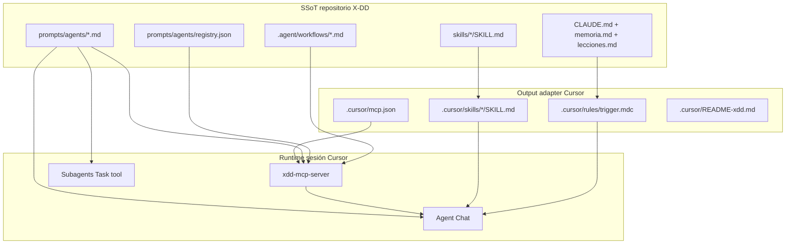
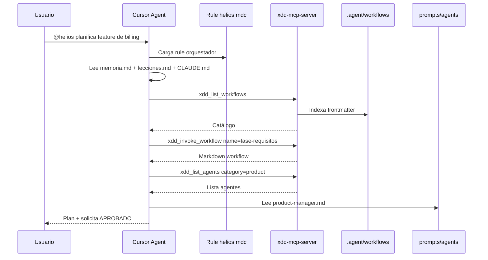

# Guía Cursor — Agentes, Skills y Workflows compatibles con X-DD

**Proyecto:** `personal/x-dd/` — sistema multi-IDE install-once  
**IDE:** Cursor (Anysphere)  
**Versión doc:** 1.0  
**Fecha:** 2026-05-28  
**Estado adapter:** Implementado parcialmente en `scripts/xdd-adapt.sh` (`adapt_cursor`)  
**Referencias internas:** ADR-0034, ADR-0035, ADR-0036, `docs/IDE_SETUP.md`, `docs/MCP_INTEGRATION.md`

---

## 1. Propósito de este documento

Este documento es la **ficha técnica granular de Cursor** dentro de la serie multi-IDE de X-DD. Complementa las guías ya recopiladas para:

- Claude Code (slash commands + `.claude/commands/`)
- OpenCode (slash + `AGENTS.md` + `.opencode/command/`)
- Antigravity (MCP global + `.agents/skills/`)
- Codex (skills global + orchestrator pattern)

**Audiencia:** agente o desarrollador que diseña/implementa el adapter universal (`xdd-adapt.sh`) y el SSoT de agentes, skills y workflows.

**Objetivo:** que al instalar X-DD en un proyecto, Cursor funcione **sin pasos manuales** (salvo gaps documentados), con la misma semántica que el resto de IDEs.

---

## 2. Verdad técnica sobre Cursor (limitaciones del IDE)

Cursor **no es** Claude Code. Antes de diseñar el adapter hay que internalizar estas limitaciones — no son bugs de X-DD:

| Capacidad | Claude Code / OpenCode / Copilot | Cursor |
|-----------|----------------------------------|--------|
| Slash commands custom (`/workflow`) | ✅ vía archivos en carpetas IDE | ❌ **No existe** |
| Registro automático de N workflows | ✅ copia a commands/prompts | ❌ **No existe** |
| Catálogo nativo de agentes | ❌ (X-DD lo resuelve) | ❌ |
| Rules con @mention | Parcial / distinto | ✅ **Mecanismo principal** |
| Skills auto-descubiertas | Vía convención IDE | ✅ `.cursor/skills/` |
| MCP tools | ✅ | ✅ `.cursor/mcp.json` |
| Subagents paralelos | Limitado | ✅ Task tool nativo |

**Consecuencia de diseño:** en Cursor, el orquestador X-DD se activa con **`@<trigger>`** (rule) y/o **MCP `xdd_invoke_workflow`**, nunca con `/trigger` nativo.

---

## 3. Arquitectura X-DD → Cursor



**Principio rector:** escribir **una vez** en SSoT; materializar solo lo que Cursor exige en su formato nativo; usar **MCP** como API universal para catálogos (workflows, agentes, gates).

---

## 4. Matriz comparativa multi-IDE (Cursor en contexto)

| Concepto X-DD | Claude Code | OpenCode | **Cursor** | Codex | Antigravity |
|---|---|---|---|---|---|
| **Trigger orquestador** | `/trigger` | `/trigger` | **`@trigger` + MCP** | `/trigger` (description) | MCP tool |
| **Workflows materializados** | `.claude/commands/*.md` | `.opencode/command/*.md` | **No — SSoT + MCP** | `references/workflows-index.md` | No — MCP |
| **Agentes indexados** | MCP + prompts | `docs/equipo.md` | **MCP + prompts** | `agents-index.json` | MCP |
| **Skills sincronizadas** | Manual / `.claude/skills` | Manual | **`.cursor/skills/` (gap: manual hoy)** | `~/.codex/skills/` global | `.agents/skills/` auto |
| **Gobernanza** | `CLAUDE.md` | `AGENTS.md` | **`CLAUDE.md` + rule `.mdc`** | SKILL orchestrator | MCP + skills |
| **MCP config key** | `mcpServers` | (vía MCP) | **`mcpServers`** | N/A | `$typeName` en `~/.gemini/` |
| **Scope install** | Project-local | Project-local | **Project-local** | Global skills | Global MCP + project skills |

---

## 5. Workflows — diseño SSoT y consumo en Cursor

### 5.1 SSoT (Single Source of Truth)

**Ubicación canónica:** `.agent/workflows/<nombre>.md`

**Formato obligatorio:**

```markdown
---
description: Resumen corto de qué hace el workflow.
---
# /nombre-workflow

## Pasos
1. ...
```

**Convenciones:**

| Regla | Detalle |
|-------|---------|
| Nombre archivo = ID workflow | `plan-fases.md` → workflow `plan-fases` |
| Frontmatter | Campo `description:` obligatorio |
| Portabilidad | **Prohibidas** rutas absolutas del host (`/home/...`) |
| Catálogo humano | Documentar en `prompts/workflows/03_workflows_catalog.md` |
| Validación | `bash scripts/lint-workflows.sh` antes de commit |

**Diferencia con catálogo descriptivo:**

| | `.agent/workflows/` | `prompts/workflows/` |
|---|---|---|
| Propósito | Ejecutable por orquestador | Documentación legible |
| Invocable | Sí (vía MCP o lectura) | No |

### 5.2 Qué hace Cursor con los workflows

Cursor **no registra** archivos markdown como comandos slash. Tres vías de consumo:

#### Vía A — MCP (recomendada, ya implementada)

Tools del `xdd-mcp-server`:

| Tool | Input | Output |
|------|-------|--------|
| `xdd_list_workflows` | `{}` | Lista workflows + `description` del frontmatter |
| `xdd_invoke_workflow` | `{ "name": "plan-fases" }` | **Contenido markdown completo** del workflow |

**Seguridad (T6.3):** `xdd_invoke_workflow` **devuelve texto, NO ejecuta**. El agente Cursor interpreta y actúa. Jamás añadir `xdd_exec` o `xdd_shell`.

#### Vía B — Lectura directa de archivo

El agente lee `.agent/workflows/plan-fases.md` con herramienta Read. Funciona pero es menos discoverable que MCP.

#### Vía C — Rule orquestador

La rule `.cursor/rules/<trigger>.mdc` instruye al agente a consultar `.agent/workflows/` al iniciar sesión.

### 5.3 Qué NO hace `adapt_cursor()` hoy

A diferencia de `adapt_claude_code()` y `adapt_opencode()`, **`adapt_cursor()` NO ejecuta `copy_commands()`**. Los workflows no se duplican a `.cursor/`. Esto es **correcto por diseño** — Cursor no tendría uso para esas copias.

### 5.4 Anti-patterns workflows en Cursor

- ❌ Esperar `/plan-fases` como slash nativo
- ❌ Crear 54 rules `.mdc` (una por workflow) — satura el rule picker
- ❌ Duplicar workflows fuera de `.agent/workflows/`
- ❌ Symlinks en paths de config (Cursor puede rechazarlos, misma lección que Claude Code)

---

## 6. Agentes — diseño SSoT y consumo en Cursor

### 6.1 SSoT

**Archivos de persona:** `prompts/agents/<categoria>/<categoria>-<nombre>.md`

**Ejemplo frontmatter mínimo:**

```yaml
---
name: Backend Architect
description: Senior backend architect specializing in scalable system design...
color: blue
emoji: 🏗️
---
```

**Registry machine-readable:** `prompts/agents/registry.json`

**Entry típica en registry:**

```json
{
  "id": "engineering-backend-architect",
  "name": "Backend Architect",
  "category": "engineering",
  "description": "...",
  "prompt_file": "prompts/agents/engineering/engineering-backend-architect.md",
  "ide_compat": ["claude-code", "opencode", "mcp"],
  "skills": [],
  "constraints": [],
  "triggers": [],
  "fallback_agent": null
}
```

**Pipeline de mantenimiento:**

```bash
# 1. Crear/editar .md en prompts/agents/
python3 scripts/migrate-agents-to-registry.py
python3 scripts/validate-registry.py --strict
bash scripts/generate-equipo.sh   # regenera docs/equipo.md (humano)
```

**Campo crítico para Cursor:** `ide_compat` debe incluir **`"mcp"`**. Cursor no tiene adapter propio de agentes; consume vía MCP.

### 6.2 Qué hace Cursor con los agentes

Cursor **no tiene UI de selección de agentes** ni registry nativo. Mecanismos disponibles:

| Mecanismo | Rol en X-DD |
|-----------|-------------|
| **MCP `xdd_list_agents`** | Discovery filtrable (`category` opcional) |
| **Leer `prompt_file`** | Orquestador adopta la persona del agente |
| **`AGENTS.md` en raíz** | Contexto persistente (Cursor lo puede cargar como rule/manifest) |
| **Subagents Task tool** | Delegación técnica (`explore`, `shell`, `generalPurpose`) — **runtime Cursor, no catálogo X-DD** |

**Patrón recomendado de delegación:**

1. Orquestador lista agentes vía MCP
2. Selecciona ID según dominio/tarea
3. Lee el `prompt_file` completo
4. Opcionalmente delega ejecución pesada a subagent Cursor (`Task`)

### 6.3 Diferencia vs otros adapters (gap documentado)

| IDE | Index local generado por adapter |
|-----|----------------------------------|
| OpenCode | `docs/equipo.md` desde registry |
| Codex | `references/agents-index.json` en skill orchestrator |
| **Cursor** | **Ninguno** — solo MCP en runtime |

**Implicación:** el agente Cursor debe **saber invocar MCP** o leer `docs/equipo.md` / `registry.json` manualmente. La rule orquestador debe instruir esto explícitamente.

### 6.4 Composition patterns

El registry soporta composición multi-agente:

```json
{
  "name": "security_review",
  "lead": "engineering-code-reviewer",
  "specialists": ["engineering-security-engineer"],
  "orchestration": "sequential",
  "gate_between": "peer_review"
}
```

En Cursor esto se ejecuta **en el chat del orquestador** (secuencial), no como procesos paralelos nativos — salvo que se use Task tool para specialists.

---

## 7. Skills — diseño SSoT y consumo en Cursor

### 7.1 Convención nativa Cursor

**Ubicaciones válidas:**

| Scope | Path |
|-------|------|
| Proyecto (compartido en repo) | `.cursor/skills/<nombre>/SKILL.md` |
| Personal (todas las sesiones) | `~/.cursor/skills/<nombre>/SKILL.md` |
| **PROHIBIDO** | `~/.cursor/skills-cursor/` (reservado a Cursor internamente) |

**Estructura de carpeta:**

```
.cursor/skills/
  mi-skill/
    SKILL.md          # obligatorio
    reference.md      # opcional
    examples.md       # opcional
    scripts/          # opcional (utilidades)
      validate.py
```

### 7.2 Frontmatter — requisitos Cursor

**Mínimo obligatorio:**

```yaml
---
name: mi-skill
description: Qué hace la skill. Use when user mentions X, Y, or Z.
---
```

| Campo | Reglas |
|-------|--------|
| `name` | lowercase, guiones, max 64 chars, único |
| `description` | max 1024 chars; **tercera persona**; incluir triggers/WHEN |

**Campo opcional:**

```yaml
disable-model-invocation: true
```

Si `true`, la skill solo carga cuando el usuario la nombra explícitamente. Default recomendado para skills de orquestación; omitir para skills que deben auto-dispararse.

### 7.3 Frontmatter enriquecido X-DD (compatible)

X-DD usa metadata extra en `skills/*/SKILL.md`:

```yaml
---
name: xdd-compact
description: Provider-agnostic context compaction...
origin: x-dd
inspired_by: LLMLingua-2
category: context-engineering
when_to_use:
  - Pre-LLM call si context exceede 80% del budget
triggers:
  - "/compact"
  - "compact context"
---
```

**Cursor ignora campos extra** pero **no rompe** (misma lección que Codex). El subset `name` + `description` es suficiente.

### 7.4 SSoT X-DD vs materialización Cursor

| | SSoT | Destino Cursor |
|---|---|---|
| Skills framework | `skills/<name>/SKILL.md` | `.cursor/skills/<name>/SKILL.md` |
| GitNexus skills | `.claude/skills/gitnexus/` | `.cursor/skills/gitnexus/` (copia) |

### 7.5 Gap crítico del adapter actual

| IDE | `xdd-adapt` sincroniza skills |
|-----|-------------------------------|
| Antigravity | ✅ `skills/` → `.agents/skills/` |
| Codex | ✅ `skills/` → `~/.codex/skills/` |
| **Cursor** | ❌ **No implementado** |

**Workaround manual hoy:**

```bash
mkdir -p .cursor/skills
cp -r skills/* .cursor/skills/
# Alternativa DRY (si Cursor acepta symlinks en skills — verificar):
# ln -s ../../skills/xdd-compact .cursor/skills/xdd-compact
```

**Recomendación para el agente diseñador:** extender `adapt_cursor()` copiando `skills/*/` → `.cursor/skills/` (patrón idéntico a `adapt_antigravity()` sección 2).

### 7.6 Anti-patterns skills en Cursor

- ❌ Crear 180 skills (una por agente) — satura discovery (lección Codex aplicable)
- ❌ Poner skills en `~/.cursor/skills-cursor/`
- ❌ Description vaga ("Helps with code") — el agente no las descubre
- ❌ Description en primera persona ("I can help you...")

---

## 8. Capa Cursor — output del adapter

### 8.1 Detección automática (`xdd-init.sh`)

Cursor se detecta si:

```bash
command -v cursor >/dev/null 2>&1 || [ -d ".cursor" ]
```

Tras bootstrap, `xdd-init.sh` ejecuta `xdd-adapt.sh cursor` automáticamente (opt-out: `XDD_NO_ADAPT=1`).

### 8.2 Comando manual

```bash
bash scripts/xdd-adapt.sh cursor --dest=/ruta/proyecto
bash scripts/xdd-adapt.sh cursor --dest=/ruta/proyecto --trigger=helios
bash scripts/xdd-adapt.sh cursor --dest=/ruta/proyecto --dry-run
```

**Resolución de trigger:** `--trigger` flag > `xdd.profile.yml` → `branding.orchestrator_trigger` > `"xdd"` default.

### 8.3 Archivos generados hoy

#### A) `.cursor/rules/<trigger>.mdc`

```yaml
---
description: Orquestador X-DD/helios. Pipeline gated 6 fases.
globs:
alwaysApply: false
---
# /helios — Orquestador X-DD

Para activar el orquestador, menciona @helios o invoca la tool MCP `xdd_invoke_workflow` con name="xdd".

Workflows disponibles en `.agent/workflows/`. Lee `memoria.md` + `lecciones.md` + `CLAUDE.md` al iniciar (Constitución Art. 3 y 9).

MCP server: ver `.cursor/mcp.json`.
```

| Campo | Valor recomendado | Razón |
|-------|-------------------|-------|
| `alwaysApply` | `false` | Orquestador bajo demanda, no en cada chat |
| `globs` | vacío o específico | Vacío = global @mention; con glob = file-scoped |
| `description` | Incluir "Orquestador" + trigger | Aparece en rule picker |

#### B) `.cursor/mcp.json`

```json
{
  "mcpServers": {
    "helios": {
      "command": "python3",
      "args": ["-m", "xdd-mcp-server"],
      "cwd": "/ruta/absoluta/al/proyecto"
    }
  }
}
```

| Aspecto | Detalle |
|---------|---------|
| Key JSON | **`mcpServers`** (igual Claude Code; distinto VSCode que usa `servers`) |
| `cwd` | Proyecto destino — MCP lee `.xdd/` local |
| Alternativa Sprint 25 | Wrapper global `~/.local/bin/xdd-mcp-server` sin `cwd` fijo (ADR-0035) |

### 8.4 Archivos recomendados (no generados hoy — backlog adapter)

| Archivo | Propósito |
|---------|-----------|
| `.cursor/skills/<trigger>-orchestrator/SKILL.md` | Orquestador como skill discoverable (patrón Codex adaptado a project-local) |
| `.cursor/skills/*` (6 skills X-DD) | Copia desde `skills/` SSoT |
| `.cursor/README-xdd.md` | Explicar trigger, MCP, gaps, re-sync |
| `docs/equipo.md` | Índice humano de agentes (opcional; OpenCode ya lo genera) |

---

## 9. MCP server — denominador común

Todos los IDEs MCP-capable (incluido Cursor) consumen las mismas 6 tools:

| Tool | Función |
|------|---------|
| `xdd_validate_phase` | Valida fase + firma HMAC |
| `xdd_transition_phase` | Valida transición secuencial entre fases |
| `xdd_list_workflows` | Catálogo workflows |
| `xdd_invoke_workflow` | Devuelve contenido workflow (NO ejecuta) |
| `xdd_list_agents` | Registry filtrable por categoría |
| `xdd_get_phase_artifacts` | Lee `.xdd/<fase>/` (whitelist paths) |

**Smoke test:**

```bash
python3 -m xdd-mcp-server --check
python3 -m xdd-mcp-server --version
```

**Setup Cursor:** Settings → MCP → habilitar server definido en `.cursor/mcp.json`. Reiniciar Cursor si tools no aparecen.

---

## 10. Flujo de sesión completo en Cursor



**Mensajes de activación válidos para el usuario:**

- `@helios quiero planificar la feature X`
- `@helios ejecuta el workflow plan-fases`
- (Si MCP habilitado) pedir explícitamente usar `xdd_invoke_workflow`

---

## 11. Reglas de diseño SSoT multi-IDE (incluyendo Cursor)

Al crear artefactos en `personal/x-dd/`, aplicar estas reglas para que **todos** los IDEs los consuman:

### Workflows

- [ ] Markdown en `.agent/workflows/`
- [ ] Frontmatter `description:` presente
- [ ] Sin rutas absolutas del host
- [ ] Entrada en catálogo `prompts/workflows/03_workflows_catalog.md`
- [ ] Pasa `lint-workflows.sh`

### Agentes

- [ ] Markdown en `prompts/agents/<cat>/`
- [ ] Entry en `registry.json` con `ide_compat` incluyendo `"mcp"`
- [ ] `prompt_file` relativo al proyecto
- [ ] Pasa `validate-registry.py --strict`

### Skills

- [ ] Carpeta `skills/<name>/SKILL.md`
- [ ] Frontmatter **`name` + `description` siempre** (subset mínimo Codex/Cursor)
- [ ] Description incluye triggers/WHEN en texto libre
- [ ] Metadata extra (`origin`, `triggers`, etc.) opcional — IDEs ricos la ignoran

### Orquestador

- [ ] **Una** rule `.mdc` por trigger — NO materializar N workflows como N rules
- [ ] Rule instruye: leer memoria, usar MCP, consultar `.agent/workflows/`
- [ ] MCP config con key `mcpServers`

### Portabilidad (Constitución Art. portabilidad)

- [ ] Rutas relativas (`./`, `../`) en todo contenido versionable
- [ ] `xdd-adapt.sh` puede escribir `cwd` absoluto en mcp.json (aceptable: es config generada local)

---

## 12. Comparación adapter: qué implementar en Cursor vs Codex/Antigravity

Para guiar al agente diseñador sobre **próximos pasos del adapter**:

| Feature | Antigravity | Codex | Cursor (hoy) | Cursor (recomendado) |
|---------|-------------|-------|--------------|----------------------|
| MCP config | ✅ merge global | N/A | ✅ project `.cursor/mcp.json` | ✅ + opción wrapper global |
| Orchestrator rule/skill | skills + MCP | SKILL global | rule `.mdc` only | rule + skill orchestrator |
| Sync skills SSoT | ✅ `.agents/skills/` | ✅ `~/.codex/skills/` | ❌ manual | ✅ `.cursor/skills/` |
| Agents index | MCP | ✅ agents-index.json | MCP only | MCP + optional `references/` en skill |
| Workflows index | MCP | ✅ workflows-index.md | MCP only | MCP (suficiente) |
| README local | ✅ `.antigravity/README-xdd.md` | ✅ `.codex/README-xdd.md` | ❌ | ✅ `.cursor/README-xdd.md` |
| Project README | — | — | — | documentar @trigger vs /trigger |

---

## 13. Instalación end-to-end

### 13.1 Install automático

```bash
bash scripts/xdd-init.sh /tu/proyecto --profile=developer
# Detecta Cursor → genera .cursor/rules/ + .cursor/mcp.json
```

### 13.2 Pasos post-install (Cursor)

1. Abrir proyecto en Cursor
2. Settings → MCP → verificar server `<trigger>` activo
3. Copiar skills (hasta extender adapter):
   ```bash
   mkdir -p .cursor/skills && cp -r skills/* .cursor/skills/
   ```
4. Probar en chat: `@<trigger> lista workflows disponibles`
5. Verificar MCP: pedir al agente que llame `xdd_list_workflows`

### 13.3 Re-sync tras editar SSoT

| Cambio en SSoT | Acción Cursor |
|----------------|---------------|
| Editaste workflow | Nada (MCP lee directo) o re-lint |
| Editaste agente | `migrate-agents-to-registry.py` |
| Cambiaste trigger/branding | `xdd-adapt.sh cursor --trigger=nuevo` |
| Editaste skill SSoT | Re-copiar a `.cursor/skills/` |
| Actualizaste X-DD upstream | `xdd-adapt.sh cursor` + re-copiar skills |

---

## 14. Troubleshooting

| Síntoma | Causa probable | Fix |
|---------|----------------|-----|
| `@trigger` no carga contexto orquestador | Rule no existe o `alwaysApply: false` sin @mention | Verificar `.cursor/rules/<trigger>.mdc` |
| MCP tools no aparecen | Server no habilitado o `cwd` incorrecto | Settings → MCP; verificar `.cursor/mcp.json` |
| MCP no encuentra workflows | `cwd` apunta a proyecto sin `.agent/workflows/` | Corregir `cwd` o usar wrapper global (ADR-0035) |
| Skills X-DD no se activan | No copiadas a `.cursor/skills/` | `cp -r skills/* .cursor/skills/` |
| Agente no encuentra especialista | No invoca MCP | Instruir en rule: usar `xdd_list_agents` |
| Usuario escribe `/trigger` y no pasa nada | Cursor no tiene slash custom | Educar: usar `@trigger` |
| `xdd-mcp-server` not found | PYTHONPATH / instalación incompleta | `bash scripts/xdd-doctor.sh` |

---

## 15. Checklist para el agente diseñador

### SSoT (creación de artefactos)

- [ ] Workflows en `.agent/workflows/` con frontmatter y lint OK
- [ ] Agentes en `prompts/agents/` con registry validado e `ide_compat: ["mcp"]`
- [ ] Skills en `skills/` con `name` + `description` mínimos
- [ ] Sin rutas absolutas en contenido versionable

### Adapter Cursor (`adapt_cursor` — backlog)

- [ ] Generar `.cursor/rules/<trigger>.mdc` (ya hecho)
- [ ] Generar `.cursor/mcp.json` con `mcpServers` (ya hecho)
- [ ] **Copiar `skills/` → `.cursor/skills/`** (pendiente — copiar patrón Antigravity)
- [ ] Generar `.cursor/README-xdd.md` (pendiente — copiar patrón Codex/Antigravity)
- [ ] Opcional: skill `<trigger>-orchestrator` project-local con `references/agents-index.json` + `workflows-index.md` (patrón Codex adaptado)
- [ ] Opcional: soporte wrapper global MCP sin `cwd` fijo (ADR-0035)
- [ ] Test bats: `tests/bats/xdd-adapt.bats` case cursor

### Documentación

- [ ] Añadir sección Cursor expandida en `docs/IDE_SETUP.md`
- [ ] Crear ADR-0037 Cursor adapter (skills sync + README) cuando se implemente backlog
- [ ] Actualizar matriz en `the-longform-guide.md`

---

## 16. Referencias

### Documentación oficial Cursor

- Rules: https://docs.cursor.com/context/rules
- MCP: https://docs.cursor.com/context/mcp

### Documentación X-DD interna

- `docs/IDE_SETUP.md` — matriz multi-IDE
- `docs/adr/0034-universal-ide-adapter.md` — decisión 6 IDEs + copia real
- `docs/adr/0035-global-install-architecture.md` — wrapper MCP global
- `docs/adr/0036-codex-adapter-global-skills.md` — pattern orchestrator + index (referencia para skill Cursor)
- `docs/MCP_INTEGRATION.md` — 6 tools + setup Cursor
- `scripts/xdd-adapt.sh` — función `adapt_cursor()` líneas ~239-258
- `.agent/workflows/README.md` — convenciones workflows SSoT
- `lecciones.md` — lección adapter IDE: leer guía oficial, frontmatter minimal, detect → adapt → README

### Implementación de referencia en repo

- `adapt_antigravity()` — pattern copia skills a convención IDE
- `adapt_codex()` — pattern orchestrator skill + agents-index + workflows-index
- `adapt_opencode()` — pattern `docs/equipo.md` desde registry

---

## 17. Resumen ejecutivo (TL;DR)

1. **Cursor no tiene slash commands** → trigger = `@<trigger>` + MCP.
2. **Workflows:** SSoT en `.agent/workflows/`; Cursor los consume vía MCP o lectura directa; **no copiar** a `.cursor/`.
3. **Agentes:** SSoT en `prompts/agents/` + `registry.json`; Cursor los consume vía MCP `xdd_list_agents` + leer `prompt_file`.
4. **Skills:** convención `.cursor/skills/<name>/SKILL.md`; frontmatter mínimo `name` + `description`; **gap: adapter no sincroniza aún**.
5. **Adapter actual** genera solo rule `.mdc` + `mcp.json` — es el más delgado de la serie; backlog = sync skills + README local.
6. **MCP es el denominador común** entre Cursor, Windsurf, Antigravity y cualquier IDE MCP-compatible.
7. **Patrón install-once:** SSoT único; `xdd-adapt cursor` materializa capa IDE; re-run idempotente tras cambios de branding/trigger.

---

*Documento generado para diseño del adapter universal X-DD. Entregar al agente arquitecto junto con las guías equivalentes de Claude Code, OpenCode, Antigravity y Codex.*
