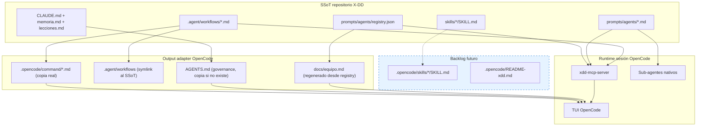
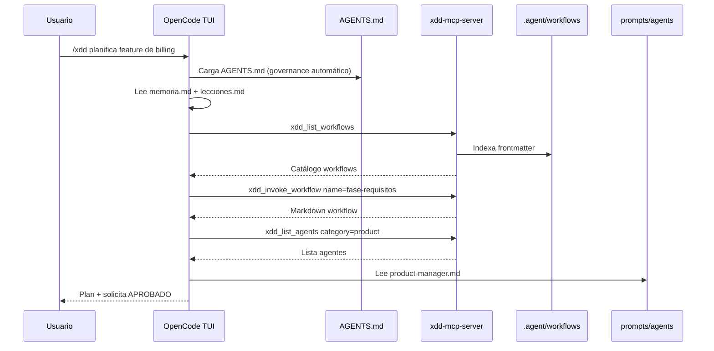

# Guía OpenCode — Agentes, Skills y Workflows compatibles con X-DD

**Proyecto:** `personal/x-dd/` — sistema multi-IDE install-once  
**IDE:** OpenCode  
**Versión doc:** 1.0  
**Fecha:** 2026-05-28  
**Estado adapter:** ✅ Implementado en `scripts/xdd-adapt.sh` (`adapt_opencode`, líneas 196-237)  
**Referencias internas:** ADR-0034, ADR-0035, ADR-0036, ADR-0037, `docs/IDE_SETUP.md`, `docs/MCP_INTEGRATION.md`

---

## 1. Propósito de este documento

Este documento es la **ficha técnica granular de OpenCode** dentro de la serie multi-IDE de X-DD. Complementa las guías ya recopiladas para:

- Claude Code (slash commands + `.claude/commands/`)
- Cursor (rules + MCP)
- Windsurf (workflows nativos + MCP global)
- Antigravity (MCP global + `.agents/skills/`)
- Codex (skills global + orchestrator pattern)
- VSCode + Copilot (prompt files + MCP)

**Audiencia:** agente o desarrollador que diseña/implementa el adapter universal (`xdd-adapt.sh`) y el SSoT de agentes, skills y workflows.

**Objetivo:** que al instalar X-DD en un proyecto, OpenCode funcione **sin pasos manuales**, con `/trigger` nativo, MCP conectado y governance `AGENTS.md` cargado automáticamente.

---

## 2. Verdad técnica sobre OpenCode (limitaciones del IDE)

OpenCode **no es** Claude Code, pero comparte suficiente de su arquitectura para heredar patrones. La tabla siguiente establece diferencias reales — no son bugs de X-DD:

| Capacidad | Claude Code | OpenCode | Cursor | Windsurf |
|-----------|------------|----------|--------|----------|
| Slash commands custom (`/workflow`) | ✅ `.claude/commands/*.md` | ✅ `.opencode/commands/*.md` | ❌ | ✅ `.windsurf/workflows/*.md` |
| Governance primario | `CLAUDE.md` | **`AGENTS.md`** (fallback `CLAUDE.md`) | `.cursor/rules/` | `.windsurf/rules/` |
| MCP config key | `mcpServers` (`~/.claude/mcp_servers.json`) | **`mcp`** (`opencode.json`) | `mcpServers` | `mcpServers` global |
| Skills auto-descubiertas | ✅ `.claude/skills/` | ✅ `.opencode/skills/` (doc) | ✅ `.cursor/skills/` | ❌ No documentado |
| Agents nativos | ❌ | ✅ `opencode.json agent` + `.opencode/agents/*.md` | ❌ | ❌ |
| `/init` generador AGENTS.md | ❌ | ✅ nativo | ❌ | ❌ |
| `instructions` array extra | ❌ | ✅ `opencode.json instructions` | ❌ | ❌ |
| Sub-agentes (Task) | Limitado | ✅ nativo (agent mode) | ✅ | ✅ |

**Consecuencia de diseño:** OpenCode es el IDE más compatible con el patrón Claude Code dentro del ecosistema X-DD, con 3 diferencias críticas: MCP key (`mcp` vs `mcpServers`), governance (`AGENTS.md` vs `CLAUDE.md`), y la existencia de agentes nativos OpenCode que **no deben confundirse** con los agentes del registry X-DD.

---

## 3. Arquitectura X-DD → OpenCode



**Principio rector:** escribir **una vez** en SSoT; materializar en `.opencode/command/` como copia real (NO symlink — misma lección que Claude Code). `AGENTS.md` = governance primario. `docs/equipo.md` = índice humano de agentes regenerable.

---

## 4. Matriz comparativa multi-IDE (OpenCode en contexto)

| Concepto X-DD | Claude Code | **OpenCode** | Cursor | Windsurf | VSCode Copilot | Antigravity | Codex |
|---|---|---|---|---|---|---|---|
| **Trigger orquestador** | `/trigger` | **`/trigger`** | `@trigger` + MCP | `/trigger` + MCP | `/trigger` | MCP tool / Skill | `/trigger` (desc) |
| **Workflows materializados** | `.claude/commands/*.md` | **`.opencode/command/*.md`** | No — SSoT + MCP | `.windsurf/workflows/*.md` | `.github/prompts/*.prompt.md` | No — MCP | `references/` |
| **Agentes indexados** | MCP + prompts | **`docs/equipo.md`** | MCP + prompts | MCP | MCP + prompts | MCP only | `agents-index.json` |
| **Skills sincronizadas** | Manual | **Manual** | `.cursor/skills/` | Manual | Manual | `.agents/skills/` | `~/.codex/skills/` |
| **Gobernanza** | `CLAUDE.md` | **`AGENTS.md`** | `CLAUDE.md` + rule | `.windsurf/rules/` | `.vscode/tasks.json` | MCP + skills | SKILL orchestrator |
| **MCP config key** | `mcpServers` | **`mcp`** | `mcpServers` | `mcpServers` (global) | `servers` | `mcpServers` | N/A |
| **Scope install** | Project-local | **Project-local** | Project-local | Project-local | Project-local | Global MCP + Local Skills | Global skills |

---

## 5. Workflows — diseño SSoT y consumo en OpenCode

### 5.1 SSoT (Single Source of Truth)

**Ubicación canónica:** `.agent/workflows/<nombre>.md`

**Formato obligatorio:**

```markdown
---
description: Resumen corto de qué hace el workflow.
---
# /nombre-workflow

## Pasos
1. ...
```

**Convenciones:**

| Regla | Detalle |
|-------|---------|
| Nombre archivo = ID workflow | `plan-fases.md` → workflow `plan-fases` |
| Frontmatter | Campo `description:` obligatorio |
| Portabilidad | **Prohibidas** rutas absolutas del host (`/home/...`) |
| Catálogo humano | Documentar en `prompts/workflows/03_workflows_catalog.md` |
| Validación | `bash scripts/lint-workflows.sh` antes de commit |

### 5.2 Qué hace OpenCode con los workflows

OpenCode **registra automáticamente** archivos `.md` en `.opencode/commands/` como slash commands `/nombre`. Misma mecánica que Claude Code. Tres vías de consumo:

#### Vía A — Slash command nativo (recomendada, ya implementada)

El adapter ejecuta `copy_commands "$DEST/.opencode/command" "md"`, copiando todos los workflows del SSoT a `.opencode/command/<name>.md`. El usuario escribe `/<nombre>` en la TUI de OpenCode y el comando se ejecuta.

`adapt_opencode()` línea 198:
```bash
copy_commands "$DEST/.opencode/command" "md"
```

#### Vía B — MCP (denominador común)

Tools del `xdd-mcp-server`:

| Tool | Input | Output |
|------|-------|--------|
| `xdd_list_workflows` | `{}` | Lista workflows + `description` del frontmatter |
| `xdd_invoke_workflow` | `{ "name": "plan-fases" }` | **Contenido markdown completo** del workflow |

**Seguridad (T6.3):** `xdd_invoke_workflow` **devuelve texto, NO ejecuta**. El agente OpenCode interpreta y actúa.

#### Vía C — Lectura directa de archivo

El agente lee `.agent/workflows/plan-fases.md` con herramienta Read. Funciona pero es menos discoverable que slash o MCP.

### 5.3 Qué NO hace `adapt_opencode()` hoy

El adapter genera copia real de workflows en `.opencode/command/` **y también** symlink en `.agent/workflows/` al SSoT. El symlink es aceptable aquí porque OpenCode **no** lee `.agent/workflows/` como slash commands — el directorio de comandos es `.opencode/command/`. El symlink sirve para lectura directa y para MCP que resuelve rutas absolutas.

### 5.4 Anti-patterns workflows en OpenCode

- ❌ Symlinks dentro de `.opencode/commands/` — OpenCode los rechaza (misma lección Claude Code)
- ❌ Editar `.opencode/command/*.md` directamente — editar SSoT y re-ejecutar `xdd-adapt`
- ❌ Rutas absolutas del host en el contenido de workflows

---

## 6. Agentes — diseño SSoT y consumo en OpenCode

### 6.1 SSoT

**Archivos de persona:** `prompts/agents/<categoria>/<categoria>-<nombre>.md`

**Ejemplo frontmatter mínimo:**

```yaml
---
name: Backend Architect
description: Senior backend architect specializing in scalable system design...
color: blue
emoji: 🏗️
---
```

**Registry machine-readable:** `prompts/agents/registry.json` (valida contra `prompts/agents/registry.schema.json`)

**Entry típica en registry:**

```json
{
  "id": "engineering-backend-architect",
  "name": "Backend Architect",
  "category": "engineering",
  "description": "...",
  "prompt_file": "prompts/agents/engineering/engineering-backend-architect.md",
  "ide_compat": ["claude-code", "opencode", "mcp"],
  "skills": [],
  "constraints": [],
  "triggers": [],
  "fallback_agent": null
}
```

**Pipeline de mantenimiento:**

```bash
# 1. Crear/editar .md en prompts/agents/
python3 scripts/migrate-agents-to-registry.py
python3 scripts/validate-registry.py --strict
bash scripts/generate-equipo.sh   # regenera docs/equipo.md (humano)
```

**Campo crítico para OpenCode:** `ide_compat` debe incluir **`"opencode"`** o **`"mcp"`**.

### 6.2 Qué hace OpenCode con los agentes

A diferencia de Claude Code, OpenCode **tiene un sistema de agentes nativo** definido en `opencode.json` (`agent` key) o `.opencode/agents/*.md`. X-DD **no usa** ese mecanismo — los agentes X-DD son personas de dominio (arquitecto, PM, security engineer), no agentes OpenCode con permisos/config de herramientas.

| Mecanismo | Rol en X-DD |
|-----------|-------------|
| **`docs/equipo.md` (generado)** | Índice humano de 180 agentes, regenerado por `adapt_opencode()` |
| **MCP `xdd_list_agents`** | Discovery filtrable (`category` opcional) |
| **Leer `prompt_file`** | Orquestador adopta la persona del agente |
| **`AGENTS.md` en raíz** | Gobernanza persistente (cargado automáticamente por OpenCode) |
| **Sub-agentes nativos OpenCode** | Runtime OpenCode, no catálogo X-DD |

**Patrón recomendado de delegación:**

1. Orquestador lista agentes vía MCP o lee `docs/equipo.md`
2. Selecciona ID según dominio/tarea
3. Lee el `prompt_file` completo
4. Opcional: delega a sub-agente OpenCode para tareas pesadas

### 6.3 Diferencia vs otros adapters

| IDE | Index local generado por adapter |
|-----|----------------------------------|
| **OpenCode** | `docs/equipo.md` desde registry |
| Codex | `references/agents-index.json` en skill orchestrator |
| Cursor | Ninguno — solo MCP en runtime |
| Antigravity | MCP only |

**Implicación:** OpenCode es el único IDE que obtiene un directorio humano de agentes como archivo versionable en el proyecto. Esto permite al agente descubrir especialistas sin llamada MCP.

### 6.4 Composition patterns

El registry soporta composición multi-agente:

```json
{
  "name": "security_review",
  "lead": "engineering-code-reviewer",
  "specialists": ["engineering-security-engineer"],
  "orchestration": "sequential",
  "gate_between": "peer_review"
}
```

En OpenCode esto se ejecuta en el chat del orquestador (secuencial) o delegando a sub-agentes nativos.

---

## 7. Skills — diseño SSoT y consumo en OpenCode

### 7.1 Convención nativa OpenCode

OpenCode soporta skills en:

| Scope | Path |
|-------|------|
| Proyecto | `.opencode/skills/<name>/SKILL.md` |
| Global | `~/.config/opencode/skills/<name>/SKILL.md` |
| **Claude Code fallback** | `~/.claude/skills/` (OpenCode lo lee) |

**Estructura de carpeta esperada por OpenCode:**

```
.opencode/skills/
  mi-skill/
    SKILL.md
```

### 7.2 Frontmatter — requisitos OpenCode

OpenCode usa el mismo estándar que Claude Code para skills:

```yaml
---
name: mi-skill
description: Qué hace la skill. Use when user mentions X, Y, or Z.
---
```

| Campo | Reglas |
|-------|--------|
| `name` | lowercase, guiones, único |
| `description` | Incluir triggers/WHEN en texto libre |

### 7.3 Frontmatter enriquecido X-DD (compatible)

X-DD usa metadata extra en `skills/*/SKILL.md`:

```yaml
---
name: xdd-compact
description: Provider-agnostic context compaction...
origin: x-dd
category: context-engineering
when_to_use:
  - Pre-LLM call si context exceede 80% del budget
triggers:
  - "/compact"
  - "compact context"
---
```

**OpenCode ignora campos extra** pero no rompe. El subset `name` + `description` es suficiente.

### 7.4 Gap crítico del adapter actual

| IDE | `xdd-adapt` sincroniza skills |
|-----|-------------------------------|
| Antigravity | ✅ `skills/` → `.agents/skills/` |
| Codex | ✅ `skills/` → `~/.codex/skills/` |
| Cursor | ❌ No implementado |
| **OpenCode** | ❌ **No implementado** |

**Workaround manual hoy:**

```bash
mkdir -p .opencode/skills
cp -r skills/* .opencode/skills/
# Alternativa: OpenCode acepta ~/.claude/skills/ como fallback
cp -r skills/* ~/.claude/skills/
```

### 7.5 Anti-patterns skills en OpenCode

- ❌ Crear 180 skills (una por agente) — satura discovery
- ❌ Description vaga ("Helps with code") — el agente no las descubre
- ❌ Description en primera persona ("I can help you...")

---

## 8. Capa OpenCode — output del adapter

### 8.1 Detección automática (`xdd-init.sh`)

OpenCode se detecta si:

```bash
command -v opencode >/dev/null 2>&1 || [ -d ".opencode" ]
```

Tras bootstrap, `xdd-init.sh` ejecuta `xdd-adapt.sh opencode` automáticamente (opt-out: `XDD_NO_ADAPT=1`).

### 8.2 Comando manual

```bash
bash scripts/xdd-adapt.sh opencode --dest=/ruta/proyecto
bash scripts/xdd-adapt.sh opencode --dest=/ruta/proyecto --trigger=helios
bash scripts/xdd-adapt.sh opencode --dest=/ruta/proyecto --dry-run
```

**Resolución de trigger:** `--trigger` flag > `xdd.profile.yml` > `branding.orchestrator_trigger` > `"xdd"` default.

### 8.3 Archivos generados HOY por `adapt_opencode()` (líneas 196-237)

#### A) `.opencode/command/<name>.md` — Slash commands

`copy_commands "$DEST/.opencode/command" "md"` genera copias reales de cada workflow en SSoT:

```markdown
---
description: Orquestador X-DD. Pipeline gated 6 fases.
---
# /xdd — Orquestador X-DD

## Pasos
...
```

| Aspecto | Detalle |
|---------|---------|
| Formato | Markdown con frontmatter `description:` |
| Copia real | ✅ NO symlink (OpenCode rechaza symlinks en commands) |
| Invocación | `/xdd`, `/fase-requisitos`, etc. en TUI OpenCode |
| Re-sync | Re-ejecutar `xdd-adapt opencode` tras editar SSoT |

#### B) `.agent/workflows` — Symlink al SSoT

```bash
ln -sf "$WF_DIR" "$DEST/.agent/workflows"
```

| Aspecto | Detalle |
|---------|---------|
| Es symlink | ✅ Aceptable aquí (no es directorio de slash commands) |
| Propósito | Lectura directa por el agente + resolución MCP |
| Riesgo | Si OpenCode cambia su comportamiento, migrar a copia real |

#### C) `AGENTS.md` — Governance manifest

```bash
cp "$ROOT/AGENTS.md" "$DEST/AGENTS.md"
```

| Aspecto | Detalle |
|---------|---------|
| Condición | Solo si NO existe (`[ ! -f "$DEST/AGENTS.md" ]`) |
| Preservación | Si el proyecto ya tiene `AGENTS.md` custom, NO se sobreescribe |
| Propósito | Gobernanza OpenCode: constitución, artefactos, scripts, GitNexus |

#### D) `docs/equipo.md` — Directorio humano de agentes

Regenerado desde `prompts/agents/registry.json` vía inline Python (líneas 215-235):

```bash
python3 - "$registry" "$DEST/docs/equipo.md" <<'PY'
# Lee registry.json, agrupa por categoría, genera markdown
PY
```

| Aspecto | Detalle |
|---------|---------|
| Formato | Markdown con categorías y 180 agentes |
| Proposito | Índice humano legible por agente OpenCode |
| Regeneración | `bash scripts/xdd-adapt.sh opencode` o `bash scripts/generate-equipo.sh` |

### 8.4 Archivos no generados hoy — backlog adapter

| Archivo | Propósito |
|---------|-----------|
| `.opencode/skills/<name>/SKILL.md` | Skills X-DD copiadas a directorio nativo OpenCode |
| `.opencode/README-xdd.md` | Explicar trigger, MCP, gaps, re-sync |

---

## 9. MCP server — denominador común

**OpenCode se conecta a `xdd-mcp-server` usando su formato nativo `mcp` en `opencode.json`:**

```json
{
  "$schema": "https://opencode.ai/config.json",
  "mcp": {
    "xdd": {
      "type": "local",
      "command": ["python3", "-m", "xdd-mcp-server"],
      "enabled": true
    }
  }
}
```

> ⚠️ **Verdad técnica:** OpenCode usa key `mcp` (no `mcpServers` como Claude Code/Cursor). Hay feature request abierto ([#28364](https://github.com/anomalyco/opencode/issues/28364)) para añadir compatibilidad con `mcpServers`. X-DD genera formato `mcp` nativo OpenCode. Si el issue se resuelve, el adapter podrá ofrecer ambos formatos.

Todos los IDEs MCP-capable consumen las mismas 6 tools:

| Tool | Función |
|------|---------|
| `xdd_validate_phase` | Valida fase + firma HMAC |
| `xdd_transition_phase` | Valida transición secuencial entre fases |
| `xdd_list_workflows` | Catálogo workflows con `description:` del frontmatter |
| `xdd_invoke_workflow` | Devuelve contenido workflow (NO ejecuta) |
| `xdd_list_agents` | Registry filtrable por categoría |
| `xdd_get_phase_artifacts` | Lee `.xdd/<fase>/` (whitelist paths) |

**Smoke test:**

```bash
python3 -m xdd-mcp-server --check
python3 -m xdd-mcp-server --version
```

**Setup OpenCode:** El adapter escribe la config MCP directamente. OpenCode lee `opencode.json` en el project root. No requiere paso manual adicional.

**3 servers complementarios recomendados por X-DD:**

| MCP Server | Tools | Función |
|------------|-------|---------|
| `xdd-mcp-server` | 6 | Gates HMAC + workflows + agents + phase artifacts |
| MemPalace | 29 | Memoria semántica (ChromaDB + SQLite) |
| GitNexus | 16 | Code intelligence (AST grafo, impact analysis) |

---

## 10. Flujo de sesión completo en OpenCode



**Mensajes de activación válidos para el usuario:**

- `/xdd quiero planificar la feature X`
- `/fase-requisitos para nueva funcionalidad de billing`
- `ejecuta el workflow plan-fases` (después de slash inicial)

---

## 11. Reglas de diseño SSoT multi-IDE (incluyendo OpenCode)

Al crear artefactos en `personal/x-dd/`, aplicar estas reglas para que **todos** los IDEs los consuman:

### Workflows

- [ ] Markdown en `.agent/workflows/`
- [ ] Frontmatter `description:` presente
- [ ] Sin rutas absolutas del host
- [ ] Entrada en catálogo `prompts/workflows/03_workflows_catalog.md`
- [ ] Pasa `lint-workflows.sh`

### Agentes

- [ ] Markdown en `prompts/agents/<cat>/`
- [ ] Entry en `registry.json` con `ide_compat` incluyendo `"opencode"` o `"mcp"`
- [ ] `prompt_file` relativo al proyecto
- [ ] Pasa `validate-registry.py --strict`

### Skills

- [ ] Carpeta `skills/<name>/SKILL.md`
- [ ] Frontmatter **`name` + `description`** siempre (subset mínimo)
- [ ] Description incluye triggers/WHEN en texto libre
- [ ] Metadata extra (`origin`, `triggers`, etc.) opcional — IDEs la ignoran

### Orquestador

- [ ] Slash command en `.opencode/command/` (copia real)
- [ ] MCP config con key `mcp` en `opencode.json`
- [ ] `AGENTS.md` con gobernanza (constitución, artefactos, scripts)

### Portabilidad (Constitución Art. portabilidad)

- [ ] Rutas relativas (`./`, `../`) en todo contenido versionable
- [ ] `xdd-adapt.sh` puede escribir `cwd` absoluto en MCP config (aceptable generado local)

---

## 12. Comparación adapter: OpenCode vs Cursor/Windsurf/Antigravity

| Feature | OpenCode (hoy) | Cursor (hoy) | Windsurf (Sprint 26) | Antigravity | Codex |
|---------|---------------|--------------|---------------------|-------------|-------|
| Slash commands | ✅ `.opencode/command/*.md` | ❌ | ✅ `.windsurf/workflows/*.md` | ❌ | ❌ |
| MCP config | ✅ `opencode.json` `mcp` key | ✅ `.cursor/mcp.json` | ✅ `~/.codeium/mcp_config.json` | ✅ `~/.gemini/config/mcp_config.json` | N/A |
| Orchestrator trigger | ✅ `/trigger` | ⚠️ `@trigger` + MCP | ✅ `/trigger` + MCP | ❌ MCP only | ✅ description-based |
| Sync skills SSoT | ❌ manual | ❌ manual | ❌ N/A (no convention) | ✅ `.agents/skills/` | ✅ `~/.codex/skills/` |
| Agents index | ✅ `docs/equipo.md` | ❌ MCP only | ❌ MCP only | ❌ MCP only | ✅ `agents-index.json` |
| Governance file | ✅ `AGENTS.md` (copia) | ✅ `CLAUDE.md` + rule | ✅ `.windsurf/rules/` | ✅ MCP + skills | ✅ SKILL orchestrator |
| README local | ❌ backlog | ❌ backlog | ✅ `.windsurf/README-xdd.md` | ✅ `.antigravity/README-xdd.md` | ✅ en skill dir |
| `.agent/` vs `.agents/` | `.agent/` singular | N/A | N/A | `.agents/` plural | N/A |

---

## 13. Instalación end-to-end

### 13.1 Install automático

```bash
bash scripts/xdd-init.sh /tu/proyecto --profile=developer
# Detecta OpenCode → genera .opencode/command/ + AGENTS.md + docs/equipo.md
```

### 13.2 Pasos post-install (OpenCode)

1. Abrir proyecto en OpenCode:
   ```bash
   cd /tu/proyecto && opencode
   ```
2. OpenCode carga automáticamente `AGENTS.md` al iniciar sesión
3. Verificar slash commands: escribe `/` en la TUI — deben aparecer `/xdd`, `/fase-requisitos`, etc.
4. Verificar MCP: pedir al agente que invoque `xdd_list_workflows`
5. Copiar skills (hasta extender adapter):
   ```bash
   mkdir -p .opencode/skills && cp -r skills/* .opencode/skills/
   ```

### 13.3 Re-sync tras editar SSoT

| Cambio en SSoT | Acción OpenCode |
|----------------|-----------------|
| Editaste workflow | `bash scripts/xdd-adapt.sh opencode` (re-copia commands) |
| Editaste agente | `python3 scripts/migrate-agents-to-registry.py && bash scripts/generate-equipo.sh` |
| Cambiaste trigger/branding | `bash scripts/xdd-adapt.sh opencode --trigger=nuevo` |
| Editaste skill SSoT | Re-copiar a `.opencode/skills/` |
| Actualizaste X-DD upstream | `bash scripts/xdd-adapt.sh opencode` |

### 13.4 Config MCP manual (si no se generó automáticamente)

Añadir a `opencode.json` en la raíz del proyecto:

```json
{
  "$schema": "https://opencode.ai/config.json",
  "mcp": {
    "xdd": {
      "type": "local",
      "command": ["python3", "-m", "xdd-mcp-server"],
      "enabled": true
    }
  }
}
```

Si se usa el wrapper global de ADR-0035:

```json
{
  "mcp": {
    "xdd": {
      "type": "local",
      "command": ["xdd-mcp-server"],
      "enabled": true
    }
  }
}
```

---

## 14. Troubleshooting

| Síntoma | Causa probable | Fix |
|---------|----------------|-----|
| `/command` no aparece en TUI | `.opencode/command/` no existe o symlink | Re-ejecutar `xdd-adapt opencode` (copia real, no symlink) |
| MCP tools no aparecen | `opencode.json` sin key `mcp` o formato incorrecto | Verificar key `mcp` (no `mcpServers`). Ver sección 9. |
| `AGENTS.md` no se carga | OpenCode busca en CWD; archivo no existe en raíz | `xdd-adapt opencode` lo genera si no existe |
| `docs/equipo.md` desactualizado | Se editó registry pero no se regeneró | `bash scripts/generate-equipo.sh` |
| Skills X-DD no se activan | No copiadas a `.opencode/skills/` | `cp -r skills/* .opencode/skills/` o usar fallback `~/.claude/skills/` |
| Agente no encuentra especialista | No invoca MCP `xdd_list_agents` | Instruir en `AGENTS.md`: usar `xdd_list_agents` |
| `xdd-mcp-server` not found | PYTHONPATH / instalación incompleta | `bash scripts/xdd-doctor.sh` |
| Symlink `.agent/workflows` roto | SSoT movido o clonado sin symlink | Re-ejecutar `xdd-adapt opencode` |
| Conflicto con agentes nativos OpenCode | X-DD crea `docs/equipo.md` pero OpenCode tiene su propio sistema | Son independientes. No mezclar. X-DD usa personas de dominio, no agentes tool-enabled. |

---

## 15. Checklist para el agente diseñador

### SSoT (creación de artefactos)

- [ ] Workflows en `.agent/workflows/` con frontmatter y lint OK
- [ ] Agentes en `prompts/agents/` con registry validado e `ide_compat: ["opencode"]` o `["mcp"]`
- [ ] Skills en `skills/` con `name` + `description` mínimos
- [ ] Sin rutas absolutas en contenido versionable

### Adapter OpenCode (`adapt_opencode` — estado actual)

- [x] Generar `.opencode/command/*.md` (copia real) — ✅ implementado
- [x] Symlink `.agent/workflows` → SSoT — ✅ implementado
- [x] Copiar `AGENTS.md` si no existe — ✅ implementado
- [x] Regenerar `docs/equipo.md` desde registry — ✅ implementado
- [ ] **Copiar `skills/` → `.opencode/skills/`** (pendiente — copiar patrón Antigravity)
- [ ] Generar `.opencode/README-xdd.md` (pendiente)
- [ ] Opcional: generar `opencode.json` completo (hoy se asume que existe)

### Verificación

- [ ] Test manual: `/trigger` aparece en TUI OpenCode
- [ ] Test manual: MCP tools listables desde OpenCode
- [ ] Test bats: `tests/bats/xdd-adapt.bats` case opencode

---

## 16. Referencias

### Documentación oficial OpenCode

- Rules / AGENTS.md: https://open-code.ai/en/docs/rules
- Custom Commands: https://opencode.ai/docs/commands/
- MCP Servers config: https://opencode.ai/docs/mcp-servers/
- Agents nativos: https://open-code.ai/en/docs/agents
- Config reference: https://opencode.ai/docs/config/
- Feature request `mcpServers`: https://github.com/anomalyco/opencode/issues/28364
- Cheat sheet: https://computingforgeeks.com/opencode-cli-cheat-sheet/

### Documentación X-DD interna

- `docs/IDE_SETUP.md` — matriz multi-IDE
- `docs/MCP_INTEGRATION.md` — 6 tools + setup `mcp` key
- `docs/adr/0034-universal-ide-adapter.md` — decisión 6 IDEs + copia real
- `docs/adr/0035-global-install-architecture.md` — wrapper MCP global
- `docs/adr/0036-codex-adapter-global-skills.md` — pattern orchestrator + index
- `scripts/xdd-adapt.sh` — función `adapt_opencode()` líneas 196-237
- `.agent/workflows/README.md` — convenciones workflows SSoT
- `prompts/agents/registry.json` + `registry.schema.json` — SSoT agentes
- `lecciones.md` — lección adapter IDE: copia real, detect → adapt → README

### Implementación de referencia en repo

- `adapt_claude_code()` — pattern copia commands a `.claude/commands/`
- `adapt_antigravity()` — pattern copia skills a `.agents/skills/`
- `adapt_codex()` — pattern orchestrator skill + agents-index

---

## 17. Resumen ejecutivo (TL;DR)

1. **OpenCode tiene slash commands nativos** → `.opencode/commands/*.md` como copia real desde SSoT. Trigger = `/trigger` en TUI.
2. **Workflows:** SSoT en `.agent/workflows/`; OpenCode los consume como slash commands (vía copia real), MCP `xdd_invoke_workflow`, o lectura directa del symlink.
3. **Agentes:** SSoT en `prompts/agents/` + `registry.json`; OpenCode obtiene `docs/equipo.md` regenerado (180 agentes indexados) + MCP `xdd_list_agents`.
4. **Skills:** convención `.opencode/skills/<name>/SKILL.md` con frontmatter mínimo `name` + `description`; **gap: adapter no sincroniza aún** — workaround manual hoy.
5. **Adapter actual** genera 4 artefactos: `.opencode/command/` (copias), `.agent/workflows` (symlink), `AGENTS.md` (governance), `docs/equipo.md` (directorio). Backlog = skills sync + README local.
6. **MCP key OpenCode es `mcp`** (no `mcpServers` como Claude Code/Cursor). Feature request #28364 busca añadir compatibilidad. X-DD genera formato nativo `mcp` con `type: "local"`.
7. **`AGENTS.md` es el governance primario** de OpenCode (vs `CLAUDE.md` para Claude Code). X-DD los separa: `AGENTS.md` = gobernanza + GitNexus, `CLAUDE.md` = root manifest. OpenCode usa `AGENTS.md` primero; `CLAUDE.md` es fallback automático.

---

*Guía técnica OpenCode X-DD v1.0 — 2026-05-28*
