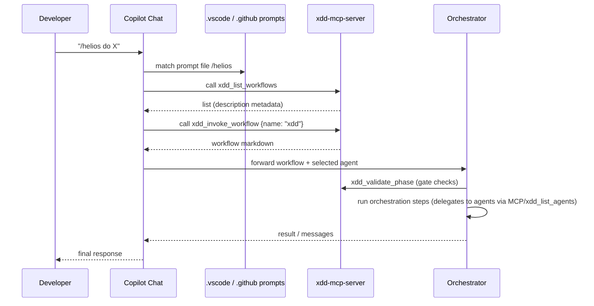

# Guía VSCode + Copilot Chat — Agentes, Skills y Workflows compatibles con X-DD

**Proyecto:** `personal/x-dd/` — sistema multi-IDE install-once
**IDE:** VSCode + Copilot Chat
**Versión doc:** 1.1
**Fecha:** 2026-05-28
**Estado adapter:** ✅ Implementado en `scripts/xdd-adapt.sh` (`adapt_vscode_copilot`, líneas 277-340)
**Referencias internas:** ADR-0034, ADR-0035, ADR-0036, ADR-0037, `docs/IDE_SETUP.md`, `docs/MCP_INTEGRATION.md`

---

Este documento es la ficha técnica del *adapter* VSCode + Copilot Chat para X-DD. Reproduce la convención SSoT de X-DD y explica qué materializar, qué delegar a MCP y cuáles son las limitaciones conocidas.

1) Propósito, audiencia y objetivo

- Propósito: definir la integración canonical entre X-DD SSoT (`.agent/workflows/`, `prompts/agents/`, `skills/`) y VSCode + Copilot Chat sin romper la gobernanza del proyecto.
- Audiencia: mantenedores del adapter (`scripts/xdd-adapt.sh`), diseñadores de agentes/skills, responsables de CI/ops.
- Objetivo: permitir instalación `xdd-init` → VSCode listo (prompt files + MCP config + tasks) respetando SSoT y sin rutas absolutas.

2) Verdad técnica sobre VSCode + Copilot Chat

Resumen: VSCode + Copilot Chat soporta prompt files, custom agents and MCP servers; su customization UX está documentada por Microsoft. Limitaciones relevantes frente a Claude Code / OpenCode:

| Capacidad | Claude Code / OpenCode | VSCode + Copilot Chat |
|---|---:|---|
| Slash commands custom (`/trigger`) | ✅ (file-based) | ✅ via prompt files in `.github/prompts/*.prompt.md` (Copilot Chat) |
| MCP server config key | `mcpServers` (Claude/others) | `servers` (Copilot/VSCode convention used by adapters) — see Microsoft docs: https://code.visualstudio.com/docs/copilot/customization/mcp-servers |
| Auto-discovery across parent repos | Partial (setting available) | ✅ `chat.useCustomizationsInParentRepositories` enables parent discovery (see docs) |
| Agent plugin marketplace | Varies | ✅ Agent Customizations editor (preview) |
| Skills convention | `skills/*/SKILL.md` (SSoT) | `skills/*/SKILL.md` (SSoT, sin destino IDE-local nativo documentado por VSCode + Copilot Chat). Adapter actual NO los copia. |

Fuente oficial (Copilot customizations, MCP servers): https://code.visualstudio.com/docs/copilot/customization/mcp-servers

3) Arquitectura X-DD → VSCode + Copilot Chat

```mermaid
flowchart TB
  subgraph SSoT[SSoT — repo X-DD]
    WF[".agent/workflows/*.md"]
    AG["prompts/agents/**/*.md"]
    REG["prompts/agents/registry.json"]
    SK["skills/*/SKILL.md"]
  end

  subgraph Adapter[VSCode adapter (xdd-adapt)]
    PROMPT[".github/prompts/*.prompt.md (Copilot)"]
    VS_MCP[".vscode/mcp.json (key: servers)"]
    VSTASKS[".vscode/tasks.json"]
    CFGSET[".vscode/settings.json (optional)"]
  end

  subgraph Runtime[Runtime]
    COPCHAT["Copilot Chat"]
    XDD_MCP["xdd-mcp-server (local or wrapper) "]
    ORCH["Orquestador / Orchestrator"]
  end

  WF --> PROMPT
  WF --> XDD_MCP
  AG --> PROMPT
  AG --> XDD_MCP
  REG --> XDD_MCP
  SK --> PROMPT
  PROMPT --> COPCHAT
  VS_MCP --> XDD_MCP
  COPCHAT --> ORCH
  XDD_MCP --> ORCH
```

4) Matriz comparativa multi-IDE (contexto)

| Concepto | Claude Code | OpenCode | Cursor | Codex | Antigravity | VSCode + Copilot Chat | Windsurf |
|---|---:|---:|---:|---:|---:|---:|---:|
| Trigger orquestador | `/trigger` | `/trigger` | `@trigger` + MCP | skill orchestrator (global) | MCP tool | `/trigger` via `.github/prompts/*.prompt.md` (copied from SSoT) | MCP / rules |
| Workflows materializados | `.claude/commands/*.md` | `.opencode/command/*.md` | SSoT + MCP | global refs | MCP | `.github/prompts/*.prompt.md` (copied from SSoT) | `.windsurf/rules/*.md` |
| MCP config key | `mcpServers` | `mcpServers` | `mcpServers` | N/A (global skills) | `mcpServers` | `servers` (VSCode convention) | `mcpServers` |
| Skills convention | `skills/*/SKILL.md` | similar | `.cursor/skills/` | `~/.codex/skills/` global | `.agents/skills/` | `skills/*/SKILL.md` (SSoT, sin destino IDE-local nativo documentado por VSCode + Copilot Chat). Adapter actual NO los copia. | `.windsurf/rules/` |

5) Workflows — SSoT + 3 vías de consumo en VSCode

- SSoT canonical: `.agent/workflows/<name>.md` with frontmatter `description:` (validate with `scripts/lint-workflows.sh`).
- Tres vías de consumo desde Copilot/VSCode:
  - MCP (`xdd_list_workflows`, `xdd_invoke_workflow`) — recomendado, discoverable.
  - Prompt files: adapter copies workflows as `.github/prompts/<name>.prompt.md` to register `/trigger` in Copilot Chat.
  - Direct file read: agent reads `.agent/workflows/<name>.md` when workspace-local discovery enabled.

6) Agentes — SSoT + MCP discovery + composition_patterns

- SSoT: `prompts/agents/<category>/*.md` + machine registry `prompts/agents/registry.json` (schema enforced by `prompts/agents/registry.schema.json`).
- Copilot/VSCode adapter pattern:
  - Use MCP tool `xdd_list_agents` for discovery at runtime.
  - When materializing, copy agent prompt files referenced by registry into `.github/agents/` **only** as derived artifacts (copy real, no symlinks).
  - Respect `ide_compat` in registry entries; ensure `mcp` and `copilot` compatibility flags are present when agent expected to appear in VSCode.

7) Skills — convención nativa + frontmatter + gap adapter actual

- SSoT canonical: `skills/<name>/SKILL.md` with frontmatter `name` and `description` minimum (X-DD policy: SKILL.md frontmatter, not skill.yaml).
- Copilot/VSCode: prefer small set of prompt files + agent skills packaged or Agent Plugins. Adapter HOY NO copia `skills/*` a `.github/skills/`. Gap de implementación documentado. Backlog: copiar `skills/*` → `.github/skills/` (patrón Antigravity `.agents/skills/`) o mecanismo alternativo si VSCode + Copilot Chat añade convención de skills nativa.
- Gap: `xdd-adapt.sh` implements `adapt_vscode_copilot()` which copies workflows to `.github/prompts/*.prompt.md` and generates `.vscode/mcp.json` (key `servers`). It currently writes `.vscode/tasks.json` and `.vscode/settings.json` if not present.

8) Capa VSCode + Copilot Chat — detección automática + comando manual + archivos generados HOY

- Detección automática: `xdd-init.sh` detects VSCode markers and runs `xdd-adapt.sh vscode-copilot`.
- Comando manual:
  - `bash scripts/xdd-adapt.sh vscode-copilot --dest=/path --trigger=helios`
  - `bash scripts/xdd-adapt.sh vscode-copilot --dry-run`
- Archivos generados hoy (by `adapt_vscode_copilot()`):
  - `.github/prompts/<trigger>.prompt.md` — prompt file materialized from `.agent/workflows/` (slash `/trigger`).
  - `.vscode/mcp.json` — MCP config (key: `servers`) pointing to `python3 -m xdd-mcp-server` with `cwd` = project.
  - `.vscode/tasks.json` — convenience tasks (doctor, start orchestrator, list workflows, gate validate).
  - `.vscode/settings.json` — terminal env placeholders (only written if not present).
- Archivos recomendados BACKLOG (no generados hoy):
  - Agent plugin package manifest for Agent Customizations editor.
  - `.github/agents/` index for quick UI discovery.

9) MCP server denominador común — las 6 tools

Copilot Chat connects to MCP servers; X-DD provides `xdd-mcp-server` exposing the canonical 6 tools:

- `xdd_list_workflows`, `xdd_invoke_workflow`, `xdd_list_agents`, `xdd_validate_phase`, `xdd_transition_phase`, `xdd_get_phase_artifacts`.

10) Flujo de sesión completo (invocación desde Copilot Chat)



11) Reglas diseño SSoT multi-IDE (checklist)

- Workflows: must live in `./.agent/workflows/*.md` with `description:` frontmatter — validate with `bash scripts/lint-workflows.sh`.
- Agents: must be `prompts/agents/*/*.md` + registry entry in `prompts/agents/registry.json` — update via `scripts/migrate-agents-to-registry.py` + `scripts/validate-registry.py --strict`.
- Skills: must remain `skills/<name>/SKILL.md` with frontmatter minimal; do NOT add `skill.yaml`.
- Adapter: materialize copies (real files) — NO symlinks.
- MCP: use `xdd-mcp-server` as single source of tools.

12) Comparación adapter: VSCode + Copilot Chat vs Cursor/Codex/Antigravity — gaps

| Área | VSCode + Copilot Chat | Gap vs others |
|---|---|---|
| Skills sync | Adapter copies SSoT to `.github/prompts/` and writes `.vscode/*` | Codex uses global skills orchestrator (different pattern) — keep minimal skills to avoid saturation |
| Agent index | Runtime via `xdd_list_agents` (MCP) | OpenCode generates `docs/equipo.md` (human-friendly index) — optional for VSCode adapter to generate |
| Rule triggers | Slash via prompt files | Cursor uses `@mention` rules (different UX) — not a gap, just different trigger model |

13) Instalación end-to-end (auto + manual + re-sync)

- Auto (recommended):

```bash
bash scripts/xdd-init.sh /tu/proyecto --profile=full
# detects VSCode and runs: bash scripts/xdd-adapt.sh vscode-copilot --dest=/tu/proyecto
```

- Manual (single project):

```bash
bash scripts/xdd-adapt.sh vscode-copilot --dest=/tu/proyecto --trigger=helios
# Re-sync after changing workflows:
bash scripts/xdd-adapt.sh vscode-copilot --dest=/tu/proyecto
```

14) Troubleshooting (síntoma / causa / fix)

| Síntoma | Causa probable | Fix |
|---|---|---|
| `/helios` no aparece en Copilot Chat | prompt file not copied / Copilot needs restart | Re-run `xdd-adapt.sh vscode-copilot` + restart VSCode; ensure `.github/prompts/<trigger>.prompt.md` exists |
| MCP calls fall back / time out | `.vscode/mcp.json` pointing to non-existing cwd or missing wrapper binary | Verify `.vscode/mcp.json` content (key `servers`), check `cwd` value or install global wrapper (`scripts/xdd-mcp-install-global.sh`) |
| Tasks missing in Command Palette | `.vscode/tasks.json` collision or workspace settings override | Open `.vscode/tasks.json` and merge; adapter writes only if file missing |

15) Checklist agente diseñador (SSoT + adapter + docs)

- [ ] Create/validate workflow in `.agent/workflows/<name>.md` with `description:`
- [ ] Add agent prompt to `prompts/agents/<cat>/<id>.md` and run `scripts/migrate-agents-to-registry.py`
- [ ] Ensure `prompts/agents/registry.json` contains `ide_compat` including `mcp` and `copilot` where appropriate
- [ ] Add skill as `skills/<name>/SKILL.md` (frontmatter `name`, `description`)
- [ ] Run `bash scripts/lint-workflows.sh` and `python3 scripts/validate-registry.py --strict`

16) Referencias (oficial VSCode + Copilot Chat + X-DD interno)

- VSCode: Customize AI / MCP servers — https://code.visualstudio.com/docs/copilot/customization/mcp-servers
- X-DD: docs/IDE_SETUP.md, docs/MCP_INTEGRATION.md, scripts/xdd-adapt.sh, ADR-0034, ADR-0035, ADR-0036
- Registry schema: `prompts/agents/registry.schema.json`

17) Resumen ejecutivo TL;DR (7 puntos)

1. VSCode + Copilot Chat supports prompt files and MCP servers; adapter uses `.github/prompts/*.prompt.md` + `.vscode/mcp.json` (key `servers`).
2. Workflows canonical remain in `.agent/workflows/*.md` (frontmatter `description:`); adapter materializes prompt files (copy real, no symlinks).
3. Discovery & runtime should prefer MCP (`xdd_mcp_server` tools) for lists & invocation to keep a single API across IDEs.
4. Skills must stay as `skills/<name>/SKILL.md` (frontmatter), not `skill.yaml`; adapter should copy or reference them but not invent new schema.
5. `scripts/xdd-adapt.sh` provides `adapt_vscode_copilot()` which generates `.github/prompts/`, `.vscode/mcp.json` (`servers`), `tasks.json` and optional `settings.json`.
6. Validation pipeline: `bash scripts/lint-workflows.sh` + `python3 scripts/validate-registry.py --strict` (stack Python, no Node/ajv).
7. Anti-patterns to avoid: no parallel `agents/*.yaml` or `skill.yaml`, no host absolute paths, no symlinked commands — follow SSoT.

---

*Guía técnica VSCode + Copilot Chat X-DD v1.1 — 2026-05-28*
