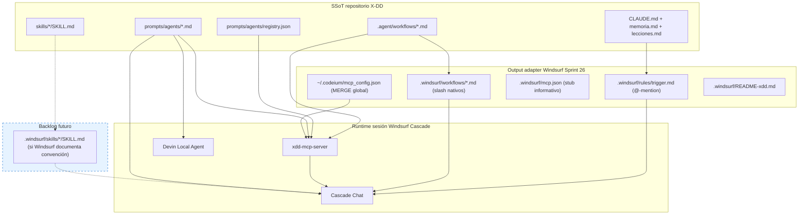
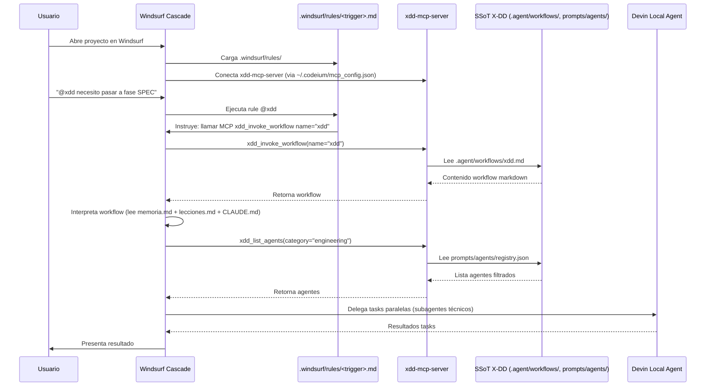

# Guía Windsurf (Codeium) — Agentes, Skills y Workflows compatibles con X-DD

**Proyecto:** `personal/x-dd/` — sistema multi-IDE install-once  
**IDE:** Windsurf (Codeium)  
**Versión doc:** 1.0  
**Fecha:** 2026-05-28  
**Estado adapter:** ✅ Implementación completa (Sprint 26 / ADR-0037) en `scripts/xdd-adapt.sh` (`adapt_windsurf`)  
**Referencias internas:** ADR-0034, ADR-0035, ADR-0036, **ADR-0037**, `docs/IDE_SETUP.md`, `docs/MCP_INTEGRATION.md`

---

## 1. Propósito de este documento

Este documento es la **ficha técnica granular de Windsurf (Codeium)** dentro de la serie multi-IDE de X-DD. Complementa las guías ya recopiladas para:

- Claude Code (slash commands + `.claude/commands/`)
- OpenCode (slash + `AGENTS.md` + `.opencode/command/`)
- Cursor (rules + MCP)
- Antigravity (MCP global + `.agents/skills/`)
- Codex (skills global + orchestrator pattern)
- VSCode + Copilot (prompt files + MCP)

**Audiencia:** agente o desarrollador que diseña/implementa el adapter universal (`xdd-adapt.sh`) y el SSoT de agentes, skills y workflows.

**Objetivo:** que al instalar X-DD en un proyecto, Windsurf funcione **sin pasos manuales** (salvo gaps documentados), con la misma semántica que el resto de IDEs.

---

## 2. Verdad técnica sobre Windsurf (Codeium)

Windsurf **no es** Claude Code ni Cursor. Antes de diseñar el adapter hay que internalizar estas limitaciones y capacidades — no son bugs de X-DD:

| Capacidad | Claude Code / OpenCode / Copilot | Cursor | **Windsurf** |
|-----------|----------------------------------|--------|--------------|
| Slash commands custom (`/workflow`) | ✅ vía archivos en carpetas IDE | ❌ **No existe** | ✅ **SÍ existe** |
| Registro automático de N workflows | ✅ copia a commands/prompts | ❌ **No existe** | ✅ **SÍ existe** (`.windsurf/workflows/`) |
| Catálogo nativo de agentes | ❌ (X-DD lo resuelve) | ❌ | ❌ |
| Rules con @mention | ✅ | ✅ **Mecanismo principal** | ✅ **Mecanismo principal** |
| Skills auto-descubiertas | Vía convención IDE | ✅ `.cursor/skills/` | ❌ **No documentado** |
| MCP tools | ✅ | ✅ `.cursor/mcp.json` | ✅ `~/.codeium/mcp_config.json` |
| Subagents paralelos | Limitado | ✅ Task tool nativo | ✅ Devin Local Agent |
| Workflows system nativo | ✅ | ❌ | ✅ **Windsurf Workflows** |

**Consecuencia de diseño:** Windsurf tiene workflows nativos (`.windsurf/workflows/*.md` invocables con `/name`), lo que lo acerca más a Claude Code/OpenCode que a Cursor. **Sprint 26 / ADR-0037:** `adapt_windsurf()` ahora copia workflows SSoT → `.windsurf/workflows/` (paridad con `adapt_claude_code()`/`adapt_opencode()`) y mergea MCP en `~/.codeium/mcp_config.json` global (paridad con `adapt_antigravity()`).

---

## 3. Arquitectura X-DD → Windsurf (Codeium)



**Principio rector:** escribir **una vez** en SSoT; materializar solo lo que Windsurf exige en su formato nativo; usar **MCP** como API universal para catálogos (workflows, agentes, gates).

**Sprint 26 resuelve los gaps:** Workflows nativos (`.windsurf/workflows/*.md`) ya se generan + MCP merge en config global (`~/.codeium/mcp_config.json`). Backlog restante = skills convention (depende doc oficial Windsurf).

---

## 4. Matriz comparativa multi-IDE (Windsurf en contexto)

| Concepto X-DD | Claude Code | OpenCode | Cursor | **Windsurf** | Codex | Antigravity | VSCode + Copilot |
|---|---|---|---|---|---|---|---|
| **Trigger orquestador** | `/trigger` | `/trigger` | `@trigger` + MCP | **`/trigger` (slash nativo) + `@trigger` + MCP** | `/trigger` (description) | MCP tool | `/trigger` |
| **Workflows materializados** | `.claude/commands/*.md` | `.opencode/command/*.md` | No — SSoT + MCP | **`.windsurf/workflows/*.md` (copia real, Sprint 26)** | `references/workflows-index.md` | No — MCP | `.github/prompts/*.prompt.md` |
| **Agentes indexados** | MCP + prompts | `docs/equipo.md` | MCP + prompts | **MCP + prompts** | `agents-index.json` | MCP | MCP |
| **Skills sincronizadas** | Manual / `.claude/skills` | Manual | `.cursor/skills/` (gap: manual hoy) | **No documentado** | `~/.codex/skills/` global | `.agents/skills/` auto | No |
| **Gobernanza** | `CLAUDE.md` | `AGENTS.md` | `CLAUDE.md` + rule `.mdc` | **`CLAUDE.md` + rule `.md`** | SKILL orchestrator | MCP + skills | `.github/prompts/` |
| **MCP config key** | `mcpServers` | (vía MCP) | `mcpServers` | **`mcpServers`** | N/A | `$typeName` en `~/.gemini/` | `servers` |
| **MCP config path** | `.mcp.json` (project) | (vía MCP) | `.cursor/mcp.json` (project) | **`~/.codeium/mcp_config.json` (global, MERGE — Sprint 26)** | N/A | `~/.gemini/config/mcp_config.json` | `.vscode/mcp.json` |
| **Scope install** | Project-local | Project-local | Project-local | **Global MCP + project rules** | Global skills | Global MCP + project skills | Project-local |

---

## 5. Workflows — diseño SSoT y consumo en Windsurf

### 5.1 SSoT (Single Source of Truth)

**Ubicación canónica:** `.agent/workflows/<nombre>.md`

**Formato obligatorio:**

```markdown
---
description: Resumen corto de qué hace el workflow.
---
# /nombre-workflow

## Pasos
1. ...
```

**Convenciones:**

| Regla | Detalle |
|-------|---------|
| Nombre archivo = ID workflow | `plan-fases.md` → workflow `plan-fases` |
| Frontmatter | Campo `description:` obligatorio |
| Portabilidad | **Prohibidas** rutas absolutas del host (`/home/...`) |
| Catálogo humano | Documentar en `prompts/workflows/03_workflows_catalog.md` |
| Validación | `bash scripts/lint-workflows.sh` antes de commit |

**Diferencia con catálogo descriptivo:**

| | `.agent/workflows/` | `prompts/workflows/` |
|---|---|---|
| Propósito | Ejecutable por orquestador | Documentación legible |
| Invocable | Sí (vía MCP o lectura) | No |

### 5.2 Qué hace Windsurf con los workflows

**Windsurf Workflows (capacidad nativa):**

Windsurf tiene un sistema de workflows nativo almacenado en `.windsurf/workflows/*.md`. Según doc oficial:

- **Storage:** `.windsurf/workflows/` en workspace actual
- **Discovery:** Auto-descubrimiento desde workspace + subdirectorios + hasta git root
- **Invocación:** `/[workflow-name]` como slash command nativo
- **Formato:** Markdown con título + descripción + pasos
- **Limit:** 12000 caracteres por archivo
- **System-level workflows:** OS-specific paths para enterprise

**Referencia oficial:** https://docs.windsurf.com/plugins/cascade/workflows.md

### 5.3 Qué hace el adapter Windsurf (Sprint 26 — paridad completa)

**Estado actual (`adapt_windsurf()` post-ADR-0037):**

```bash
adapt_windsurf() {
  copy_commands "$DEST/.windsurf/workflows" "md"        # 1. Slash nativos
  # WARN si workflow > 12000 chars (límite Windsurf)
  write_file "$DEST/.windsurf/rules/${TRIGGER}.md" ...  # 2. Rule @-mention
  # 3. MCP MERGE en ~/.codeium/mcp_config.json (NO project-local)
  python3 merge $windsurf_cfg ...
  write_file "$DEST/.windsurf/mcp.json" ...             # 4. Stub informativo
  write_file "$DEST/.windsurf/README-xdd.md" ...        # 5. README local
}
```

**Output generado:**
1. ✅ `.windsurf/workflows/*.md` — workflows SSoT copiados, slash nativos `/xdd`, `/fase-requisitos`, etc.
2. ✅ `.windsurf/rules/<trigger>.md` — rule para @mention
3. ✅ `~/.codeium/mcp_config.json` — MCP MERGE no destructivo (key `mcpServers`)
4. ✅ `.windsurf/mcp.json` — stub project-local con comentario explicativo
5. ✅ `.windsurf/README-xdd.md` — doc local arquitectura + uso

**Override portabilidad:** `XDD_WINDSURF_HOME` env var redirige config global (default `$HOME/.codeium`).
**Wrapper global (Sprint 25):** si `~/.local/bin/xdd-mcp-server` instalado → MCP entry usa wrapper sin `cwd` fijo.

### 5.4 Vías de consumo actuales

#### Vía A — MCP (recomendada, implementada)

Tools del `xdd-mcp-server`:

| Tool | Input | Output |
|------|-------|--------|
| `xdd_list_workflows` | `{}` | Lista workflows + `description` del frontmatter |
| `xdd_invoke_workflow` | `{ "name": "plan-fases" }` | **Contenido markdown completo** del workflow |

**Seguridad (T6.3):** `xdd_invoke_workflow` **devuelve texto, NO ejecuta**. El agente Windsurf interpreta y actúa.

#### Vía B — Lectura directa de archivo

El agente lee `.agent/workflows/plan-fases.md` con herramienta Read. Funciona pero es menos discoverable que MCP.

#### Vía C — Rule orquestador

La rule `.windsurf/rules/<trigger>.md` instruye al agente a consultar MCP tools al iniciar sesión.

### 5.5 Anti-patterns workflows en Windsurf

- ✅ ~~Esperar `/plan-fases` como slash nativo hoy~~ **Resuelto Sprint 26** — workflows copiados automático
- ❌ Crear 54 rules `.md` (una por workflow) — satura el rule picker
- ❌ Duplicar workflows fuera de `.agent/workflows/` (SSoT violation)
- ❌ Symlinks en paths de config (Windsurf puede rechazarlos)
- ❌ Editar `.windsurf/workflows/*.md` directo (overwrite en próximo `xdd-adapt`) — edita SSoT en `.agent/workflows/`
- ❌ Workflows > 12000 chars (Windsurf trunca o ignora — adapter WARN al exceder)

---

## 6. Agentes — diseño SSoT y consumo en Windsurf

### 6.1 SSoT

**Archivos de persona:** `prompts/agents/<categoria>/<categoria>-<nombre>.md`

**Ejemplo frontmatter mínimo:**

```yaml
---
name: Backend Architect
description: Senior backend architect specializing in scalable system design...
color: blue
emoji: 🏗️
---
```

**Registry machine-readable:** `prompts/agents/registry.json`

**Entry típica en registry:**

```json
{
  "id": "engineering-backend-architect",
  "name": "Backend Architect",
  "category": "engineering",
  "description": "...",
  "prompt_file": "prompts/agents/engineering/engineering-backend-architect.md",
  "ide_compat": ["claude-code", "opencode", "mcp", "windsurf"],
  "skills": [],
  "constraints": [],
  "triggers": [],
  "fallback_agent": null
}
```

**Pipeline de mantenimiento:**

```bash
# 1. Crear/editar .md en prompts/agents/
python3 scripts/migrate-agents-to-registry.py
python3 scripts/validate-registry.py --strict
bash scripts/generate-equipo.sh   # regenera docs/equipo.md (humano)
```

**Campo crítico para Windsurf:** `ide_compat` debe incluir **`"windsurf"`**. Windsurf no tiene adapter propio de agentes; consume vía MCP.

### 6.2 Qué hace Windsurf con los agentes

Windsurf **no tiene UI de selección de agentes** ni registry nativo. Mecanismos disponibles:

| Mecanismo | Rol en X-DD |
|-----------|-------------|
| **MCP `xdd_list_agents`** | Discovery filtrable (`category` opcional) |
| **Leer `prompt_file`** | Orquestador adopta la persona del agente |
| **`CLAUDE.md` en raíz** | Contexto persistente (Windsurf lo carga como rule/manifest) |
| **Devin Local Agent** | Delegación técnica nativa Windsurf (subagents paralelos) — **runtime Windsurf, no catálogo X-DD** |

### 6.3 MCP `xdd_list_agents` + composition patterns

Tool `xdd_list_agents`:

```json
{
  "name": "xdd_list_agents",
  "inputSchema": {
    "type": "object",
    "properties": {
      "category": {
        "type": "string",
        "description": "Filtrar por categoría (ej: 'engineering', 'design')"
      }
    }
  }
}
```

**Composition patterns** (registry):

X-DD define patrones de composición de agentes en `registry.json["composition_patterns"]`:

```json
{
  "name": "spec-team",
  "lead": "engineering-technical-architect",
  "specialists": [
    "engineering-backend-architect",
    "engineering-frontend-architect",
    "security-security-architect"
  ],
  "orchestration": "parallel_then_sync",
  "description": "Equipo multidisciplinario para fase SPEC"
}
```

**Uso en Windsurf:**

El orquestador X-DD (vía workflow `/xdd`) consulta `xdd_list_agents`, selecciona agentes según fase, y delega tasks usando **Devin Local Agent** de Windsurf para ejecución paralela.

### 6.4 Anti-patterns agentes en Windsurf

- ❌ Esperar UI nativa de selección de agentes (Windsurf no tiene)
- ❌ Crear registry paralelo Windsurf-specific
- ❌ Ignorar `ide_compat: ["windsurf"]` en registry
- ❌ Duplicar prompts de agentes fuera de `prompts/agents/`

---

## 7. Skills — convención nativa + frontmatter + gap adapter

### 7.1 SSoT

**Ubicación:** `skills/<name>/SKILL.md`

**Frontmatter X-DD (mínimo):**

```yaml
---
name: agent-eval
description: Eval-harness para skills/agents/workflows X-DD. 4 grader types...
origin: x-dd
when_to_use: Antes de promover skill via /evolve...
---
```

**Ejemplo completo:** `skills/agent-eval/SKILL.md`

### 7.2 Convención skills Windsurf

**Estado actual:** No hay documentación oficial de Windsurf sobre una convención de skills nativa (a diferencia de Cursor `.cursor/skills/`).

**Investigación realizada:**
- Docs oficiales Windsurf: https://docs.windsurf.com/llms.txt
- No existe sección "Skills" específica
- Windsurf Cascade tiene "Memories & Rules" y "Workflows", pero no "Skills"

**Conclusión:** Windsurf probablemente **no tiene** un sistema de skills nativo similar a Cursor. Los "skills" en Windsurf serían implementados como:
- Rules (`.windsurf/rules/*.md`)
- Workflows (`.windsurf/workflows/*.md`)
- MCP tools externos

### 7.3 Qué hace el adapter Windsurf HOY

**Estado actual:** El adapter NO copia skills X-DD a ningún directorio Windsurf.

**Gap identificado:**
- Windsurf no tiene convención de skills nativa documentada
- Skills X-DD (6 existentes: `agent-eval`, `xdd-ai-review`, `xdd-compact`, `xdd-fs-context`, `xdd-sandbox`, `xdd-talk-compact`) NO se sincronizan
- Si Windsurf agrega convención de skills en futuro, adapter necesitará update

### 7.4 Backlog recomendado (si Windsurf agrega skills)

Si Windsurf documenta una convención de skills en futuro (ej: `.windsurf/skills/`), el adapter debería:

```bash
adapt_windsurf() {
  # ... código actual ...
  
  # Si Windsurf tiene skills:
  if [ -d "$ROOT/skills" ]; then
    copy_skills "$DEST/.windsurf/skills"
  fi
}
```

### 7.5 Anti-patterns skills en Windsurf

- ❌ Inventar convención de skills Windsurf sin documentación oficial
- ❌ Crear directorio `.windsurf/skills/` no soportado
- ❌ Duplicar skills X-DD sin propósito (Windsurf no tiene sistema skills)

---

## 8. Capa Windsurf (Codeium) — detección automática + comando manual

### 8.1 Detección automática en xdd-init (Sprint 26)

**Implementado en `scripts/xdd-init.sh:197`:**

```bash
{ command -v windsurf >/dev/null 2>&1 || [ -d ".windsurf" ] || [ -d "$HOME/.codeium" ]; } \
  && DETECTED="$DETECTED windsurf"
```

Tres triggers de detección (cualquiera dispara adapter):
- CLI `windsurf` en PATH
- Dir `.windsurf/` en proyecto (re-install)
- Dir `~/.codeium/` (Windsurf instalado, sin CLI en PATH — caso común)

**Opt-out:** `XDD_NO_ADAPT=1 bash scripts/xdd-init.sh ...`

### 8.2 Comando manual

**Instalación manual:**

```bash
# Adaptar Windsurf a proyecto específico
bash scripts/xdd-adapt.sh windsurf --dest=/ruta/proyecto

# Con trigger custom
bash scripts/xdd-adapt.sh windsurf --dest=/ruta/proyecto --trigger=helios

# Todos los IDEs
bash scripts/xdd-adapt.sh all --dest=/ruta/proyecto
```

### 8.3 Archivos generados (Sprint 26 — paridad completa)

| Archivo | Contenido | Scope |
|---------|-----------|-------|
| `.windsurf/workflows/*.md` | Workflows SSoT copiados (slash nativos `/xdd`, `/fase-requisitos`, etc.) | Project |
| `.windsurf/rules/<trigger>.md` | Rule para @mention orquestador | Project |
| `.windsurf/mcp.json` | Stub informativo (config real en global) | Project |
| `.windsurf/README-xdd.md` | Doc local arquitectura + uso | Project |
| `~/.codeium/mcp_config.json` | MCP config (key `mcpServers`) — MERGE no destructivo | **Global** |

### 8.4 Backlog futuro

| Archivo | Propósito | Estado |
|---------|-----------|--------|
| `.windsurf/skills/*/SKILL.md` | Si Windsurf documenta convención skills | Pendiente (sin doc oficial) |

### 8.5 MCP config path (Windsurf — Sprint 26 implementación)

**Key:** `mcpServers` (igual que Claude Code/Cursor — NO `$typeName` de Antigravity)

**Path:** `~/.codeium/mcp_config.json` (GLOBAL — adapter mergea ahí, NO en project-local)

**Override portabilidad:** `XDD_WINDSURF_HOME` env var (default `$HOME/.codeium`)

**Config generada (modo wrapper global Sprint 25):**

```json
{
  "mcpServers": {
    "xdd": {
      "command": "/home/<user>/.local/bin/xdd-mcp-server",
      "args": []
    }
  }
}
```

**Config generada (modo legacy sin wrapper):**

```json
{
  "mcpServers": {
    "xdd": {
      "command": "python3",
      "args": ["-m", "xdd-mcp-server"],
      "cwd": "<workspace>/proyecto"
    }
  }
}
```

**Características del MERGE (no destructivo):**

- ✅ Preserva otros `mcpServers` existentes del usuario (otras integraciones MCP)
- ✅ Crea archivo si no existe (`mkdir -p` del dir parent)
- ✅ ABORT con mensaje claro si JSON corrupto (no destruye archivo)
- ✅ Idempotente: ejecuta N veces, resultado consistente
- ✅ Stub `.windsurf/mcp.json` project-local con `_comment` apuntando a config global

**Patrón replicado:** `adapt_antigravity()` (líneas 342+ de `scripts/xdd-adapt.sh`) — misma técnica merge, sin Cascade `$typeName` específico.

**Referencia oficial:** https://docs.windsurf.com/plugins/cascade/mcp.md

---

## 9. MCP server denominador común

Todos los IDEs MCP-capable consumen `xdd-mcp-server` (6 tools):

| Tool | Descripción | Schema input |
|------|-------------|---------------|
| `xdd_validate_phase` | Valida fase (status + checksums + firma HMAC) | `{phase}` |
| `xdd_transition_phase` | Valida transición secuencial | `{from_phase, to_phase}` |
| `xdd_list_workflows` | Lista workflows con `description:` del frontmatter | `{}` |
| `xdd_invoke_workflow` | Devuelve contenido del workflow (no lo ejecuta) | `{name}` |
| `xdd_list_agents` | Lista agentes del registry (filtrable por categoría) | `{category?}` |
| `xdd_get_phase_artifacts` | Lista artefactos en `.xdd/<fase>/` | `{phase}` |

**Config MCP generada apunta a:**

```json
{
  "command": "python3",
  "args": ["-m", "xdd-mcp-server"],
  "cwd": "/ruta/proyecto"
}
```

**Windsurf-specific:** `cwd` es dinámico (MCP arranca en workspace activo). Con wrapper global `xdd-mcp-install-global.sh` (ADR-0035), `cwd` puede omitirse.

---

## 10. Flujo sesión completo



---

## 11. Reglas diseño SSoT multi-IDE

### 11.1 Workflows

| Regla | Detalle |
|-------|---------|
| **SSoT única** | `.agent/workflows/*.md` — NO duplicar |
| **Adapter deriva** | Copia real a formato IDE si IDE soporta |
| **Fallback MCP** | Si IDE no soporta workflows, usar `xdd_invoke_workflow` |
| **Validación** | `bash scripts/lint-workflows.sh` |

### 11.2 Agentes

| Regla | Detalle |
|-------|---------|
| **SSoT única** | `prompts/agents/*.md` + `registry.json` |
| **MCP discovery** | `xdd_list_agents` para todos los IDEs |
| **ide_compat** | Registry declara compatibilidad por IDE |
| **Validación** | `python3 scripts/validate-registry.py --strict` |

### 11.3 Skills

| Regla | Detalle |
|-------|---------|
| **SSoT única** | `skills/*/SKILL.md` (frontmatter Markdown) |
| **NO YAML separado** | Skills como `skills/<id>/skill.yaml` prohibidos |
| **IDE-specific** | Copiar solo si IDE tiene convención nativa |
| **Backlog** | Si IDE agrega skills, actualizar adapter |

### 11.4 Orquestador

| Regla | Detalle |
|-------|---------|
| **Trigger único** | Una sola entry point (workflow principal) |
| **MCP como API** | Tools universales, no IDE-specific |
| **Delegación nativa** | Usar subagents IDE (Devin en Windsurf) |
| **Estado session** | `memoria.md` + `lecciones.md` flight recorder |

### 11.5 Portabilidad

| Regla | Detalle |
|-------|---------|
| **Rutas absolutas prohibidas** | Solo `./` o `../` en contenido versionable |
| **Config paths relativos** | MCP `cwd` = proyecto, NO hardcode |
| **Zero deps host** | No asumir rutas específicas del usuario |

---

## 12. Comparación adapter: Windsurf vs Cursor/Codex/Antigravity

| Aspecto | Cursor | **Windsurf (Sprint 26)** | Codex | Antigravity |
|---------|--------|----------|-------|-------------|
| **Slash commands nativos** | ❌ No | ✅ SÍ (workflows) | ✅ SÍ (description) | ❌ No |
| **Adapter copia workflows** | ❌ No (backlog) | **✅ SÍ (Sprint 26)** | ❌ No (orchestrator pattern) | ❌ No |
| **MCP config path** | `.cursor/mcp.json` (project) | **`~/.codeium/mcp_config.json` (global, MERGE)** | N/A | `~/.gemini/config/mcp_config.json` (global) |
| **MCP config key** | `mcpServers` | **`mcpServers` (estándar)** | N/A | `$typeName` (Cascade) |
| **Skills nativos** | ✅ `.cursor/skills/` | ❌ No documentado | ✅ `~/.codex/skills/` (global) | ✅ `.agents/skills/` (plural) |
| **Adapter copia skills** | ❌ No (backlog) | ❌ N/A (sin convención oficial) | ✅ SÍ (global) | ✅ SÍ (project) |
| **Trigger principal** | `@trigger` + MCP | **`/trigger` + `@trigger` + MCP** | `/trigger` (description) | MCP tool |
| **Rule generada** | ✅ `.cursor/rules/<trigger>.mdc` | ✅ `.windsurf/rules/<trigger>.md` | ❌ No | ❌ No |
| **README local** | ❌ No | **✅ `.windsurf/README-xdd.md` (Sprint 26)** | ✅ `.codex/README-xdd.md` | ✅ `.antigravity/README-xdd.md` |
| **Estado** | Adapter delgado (rule + MCP only) | **Paridad completa con Claude Code + Antigravity** | Skills global con orchestrator | MCP global + skills project |

**Conclusión post-Sprint 26:** Windsurf alcanzó **paridad completa** con Claude Code/OpenCode (workflows nativos) + Antigravity (MCP merge global). Backlog restante = skills (depende doc oficial Windsurf).

---

## 13. Instalación end-to-end

### 13.1 Auto (cuando xdd-init tenga detección Windsurf)

```bash
# Bootstrap proyecto + auto-detect Windsurf
bash scripts/xdd-init.sh /ruta/proyecto --profile=full
# → Detecta ~/.codeium/windsurf → corre adapt_windsurf automáticamente
```

### 13.2 Manual (actual)

```bash
# Adaptar Windsurf a proyecto
bash scripts/xdd-adapt.sh windsurf --dest=/ruta/proyecto

# Con trigger custom
bash scripts/xdd-adapt.sh windsurf --dest=/ruta/proyecto --trigger=helios
```

### 13.3 Config MCP manual Windsurf

**Paso 1:** Configurar MCP en Windsurf

1. Abrir Windsurf
2. Settings → Tools → Windsurf Settings → Add Server
3. Click "View Raw Config" para editar `~/.codeium/mcp_config.json`

**Paso 2:** Añadir entrada X-DD

```json
{
  "mcpServers": {
    "xdd": {
      "command": "python3",
      "args": ["-m", "xdd-mcp-server"],
      "cwd": "/ruta/tu/proyecto"
    }
  }
}
```

**Paso 3:** Click "Refresh" en Windsurf MCP settings

### 13.4 Re-sync

```bash
# Después de editar SSoT (workflows/agents/skills)
bash scripts/xdd-adapt.sh windsurf --dest=/ruta/proyecto
```

---

## 14. Troubleshooting

| Síntoma | Causa | Fix |
|---------|-------|-----|
| MCP tools no aparecen en Windsurf | `~/.codeium/mcp_config.json` no escrito o Windsurf no recargado | Re-ejecuta `xdd-adapt.sh windsurf --dest=<proyecto>` + reinicia Windsurf. Verifica path con `cat ~/.codeium/mcp_config.json` |
| `@xdd` no funciona | Rule `.windsurf/rules/<trigger>.md` no cargada | Re-run `xdd-adapt windsurf` + reiniciar Windsurf |
| Workflows `/xdd` no disponibles como slash | `.windsurf/workflows/` no existe — adapter no corrió o falló | `bash scripts/xdd-adapt.sh windsurf --dest=<proyecto>` y verifica `ls .windsurf/workflows/` |
| Workflow disponible pero no funciona | Excede 12000 chars (Windsurf trunca) | Revisa `[xdd-adapt] WARN` al ejecutar adapter. Split workflow en SSoT |
| MCP server error "module not found" | `xdd-mcp-server` no en PYTHONPATH ni wrapper global instalado | `bash scripts/xdd-mcp-install-global.sh` (instala wrapper en `~/.local/bin`) |
| `xdd-adapt windsurf` falla "JSON corrupto" | `~/.codeium/mcp_config.json` malformado | Adapter aborta sin destruir. Inspecciona + repara manual antes de re-ejecutar |
| Otros MCP servers desaparecen | Tu config tiene formato no estándar | Backup antes de adapter. Reporta issue con sample (anonimizado) |
| Rule @xdd no se carga | Windsurf no descubrió `.windsurf/rules/` | Verificar que archivo existe en workspace root |
| `~/.codeium/` no detectado por xdd-init | Windsurf nunca abierto en máquina | Instala+abre Windsurf una vez → re-ejecuta `xdd-init.sh` |

---

## 15. Checklist agente diseñador

Antes de modificar el adapter Windsurf o el SSoT:

- [ ] **SSoT respetado:** Workflows en `.agent/workflows/`, agentes en `prompts/agents/`, skills en `skills/`
- [ ] **NO arquitectura paralela:** Skills como `skills/<id>/skill.yaml` prohibidos
- [ ] **Registry existente:** Usar `prompts/agents/registry.json`, NO crear nuevo
- [ ] **Stack Python:** Validación con `scripts/lint-workflows.sh`, `scripts/validate-registry.py`
- [ ] **Portabilidad:** Sin rutas absolutas del host en contenido versionable
- [ ] **Windsurf workflows nativos:** Documentar gap de implementación si no se copian
- [ ] **MCP config global:** Windsurf usa `~/.codeium/mcp_config.json`, NO project-local
- [ ] **Backlog honesto:** Gaps documentados, no ocultar limitaciones
- [ ] **Referencias oficiales:** Citar docs.windsurf.com para MCP/workflows/memories

---

## 16. Referencias

### 16.1 Oficial Windsurf (Codeium)

| Topic | URL |
|-------|-----|
| MCP config | https://docs.windsurf.com/plugins/cascade/mcp.md |
| Workflows nativos | https://docs.windsurf.com/plugins/cascade/workflows.md |
| Memories & Rules | https://docs.windsurf.com/plugins/cascade/memories.md |
| Cascade Overview | https://docs.windsurf.com/plugins/cascade/cascade-overview.md |
| Documentation index | https://docs.windsurf.com/llms.txt |
| Install/Uninstall | https://docs.windsurf.com/ |

### 16.2 X-DD interno

| Documento | Path |
|-----------|------|
| ADR-0034 Universal IDE adapter | `docs/adr/0034-universal-ide-adapter.md` |
| ADR-0035 Global install architecture | `docs/adr/0035-global-install-architecture.md` |
| ADR-0036 Codex adapter | `docs/adr/0036-codex-adapter-global-skills.md` |
| IDE Setup matriz | `docs/IDE_SETUP.md` |
| MCP Integration | `docs/MCP_INTEGRATION.md` |
| Adapter script | `scripts/xdd-adapt.sh` |
| Workflows SSoT | `.agent/workflows/README.md` |
| Agents registry | `prompts/agents/registry.json` |
| Registry schema | `prompts/agents/registry.schema.json` |
| Guía Cursor (referencia formato) | `docs/GUIA_CURSOR_AGENTES_SKILLS_WORKFLOWS.md` |

---

## 17. Resumen ejecutivo TL;DR

1. **Workflows nativos copiados (Sprint 26):** `.windsurf/workflows/*.md` generados desde SSoT `.agent/workflows/`. Slash `/xdd`, `/fase-requisitos`, etc. disponibles nativos.

2. **MCP config MERGE global (Sprint 26):** Adapter mergea entry en `~/.codeium/mcp_config.json` (path oficial Windsurf), no destructivo. Stub project-local `.windsurf/mcp.json` con `_comment` explicativo.

3. **Skills nativos:** sin convención documentada en Windsurf (vs Cursor). Adapter NO copia skills X-DD a Windsurf (backlog depende doc oficial).

4. **Triggers múltiples disponibles:** `/trigger` (slash nativo workflows) + `@trigger` (rule mention) + MCP `xdd_invoke_workflow`. Cualquiera activa orquestador.

5. **Override portabilidad:** `XDD_WINDSURF_HOME` env var redirige config global (default `$HOME/.codeium`). Tests CI usan mktemp HOME mock.

6. **Wrapper global Sprint 25:** si `~/.local/bin/xdd-mcp-server` instalado → MCP entry sin `cwd` (workspace dinámico).

7. **Paridad alcanzada:** Adapter Windsurf Sprint 26 = paridad funcional Claude Code/OpenCode (workflows) + Antigravity (MCP merge global). Sin gaps críticos pendientes.

---
*Guía técnica Windsurf X-DD v1.1 — 2026-05-28 (Sprint 26 / ADR-0037 paridad completa)*
