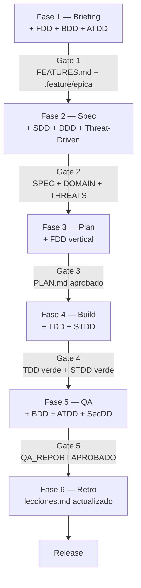

# X-DD — Guia de Integracion

**Version:** 4.0 | **Fecha:** 2026-06-04 | **Gobernanza:** Constitucion X-DD v1.5

> Esta guia es el punto de entrada al ecosistema de disciplinas X-DD. Cada disciplina
> tiene su documento atomico en `docs/disciplinas/`. Este documento contiene la filosofia
> de composicion, el arbol de decision y la tabla de seleccion rapida.
>
> Para implementacion detallada de una disciplina especifica, ir directamente al
> documento correspondiente en `docs/disciplinas/`.

---

## Indice

1. [Disciplinas disponibles](#1-disciplinas-disponibles)
2. [Filosofia de integracion](#2-filosofia-de-integracion)
3. [El pipeline X-DD con todas las disciplinas](#3-el-pipeline-x-dd-con-todas-las-disciplinas)
4. [Arbol de decision](#4-arbol-de-decision)
5. [Tabla de seleccion rapida](#5-tabla-de-seleccion-rapida)
6. [Estructura de carpetas del proyecto](#6-estructura-de-carpetas)
7. [Guia de adopcion progresiva](#7-guia-de-adopcion-progresiva)
8. [Skills y workflows disponibles](#8-skills-y-workflows-disponibles)

---

## 1. Disciplinas disponibles

Cada disciplina ocupa un documento atomico que cubre exactamente un dominio tecnico.

| Disciplina | Documento | Fase principal | Artefacto clave |
|------------|-----------|---------------|-----------------|
| SDD — Spec-Driven Development | [disciplinas/SDD.md](./disciplinas/SDD.md) | Transversal (todas) | `docs/specs/SPEC.md` |
| FDD — Feature-Driven Development | [disciplinas/FDD.md](./disciplinas/FDD.md) | Fase 1 + Fase 3 | `docs/features/FEATURES.md` |
| DDD — Domain-Driven Design | [disciplinas/DDD.md](./disciplinas/DDD.md) | Fase 2 | `docs/specs/DOMAIN.md` |
| BDD — Behavior-Driven Development | [disciplinas/BDD.md](./disciplinas/BDD.md) | Fase 1 + Fase 5 | `tests/features/*.feature` |
| ATDD — Acceptance Test-Driven | [disciplinas/ATDD.md](./disciplinas/ATDD.md) | Fase 1 + Fase 5 | `tests/acceptance/*.acceptance.test.ts` |
| TDD — Test-Driven Development | [disciplinas/TDD.md](./disciplinas/TDD.md) | Fase 4 | `tests/unit/*.test.ts` |
| STDD — Security-Test-Driven | [disciplinas/STDD.md](./disciplinas/STDD.md) | Fase 4 | `tests/security/**/*.security.test.ts` |
| SecDD — Security-Driven Development | [disciplinas/SecDD.md](./disciplinas/SecDD.md) | Fase 5 | `.xdd/qa/QA_REPORT.md` |
| Threat-Driven Development | [disciplinas/THREAT-DRIVEN.md](./disciplinas/THREAT-DRIVEN.md) | Fase 2 | `docs/specs/THREATS.md` |

Ver el indice maestro con diagrama de dependencias: [disciplinas/INDEX.md](./disciplinas/INDEX.md)

---

## 2. Filosofia de integracion

> Principio maestro: las metodologias son capas, no fases nuevas.

El pipeline de 6 fases no cambia. Cada metodologia se embebe en la fase donde mas
aporta. El numero de gates permanece constante; lo que cambia es que cada gate valida
artefactos adicionales producidos por las disciplinas activas.

```
FASE 1 (Briefing)  + FDD catalogo + BDD features + ATDD stubs
FASE 2 (Spec)      + SDD SPEC.md formal + DDD DOMAIN.md + Threat Modeling
FASE 3 (Plan)      + FDD reorganizacion por features verticales
FASE 4 (Build)     + TDD ciclo Rojo-Verde-Refactor + STDD security tests
FASE 5 (QA)        + BDD ejecutable + ATDD + SAST + DAST + Secrets
FASE 6 (Retro)     Sin cambios (Learning Loop)
```

La regla de composicion: cada proyecto define su "nivel X-DD" segun la complejidad.
No todos los proyectos necesitan las 31 disciplinas (9 base + 22 extendidas). El arbol
de decision (seccion 4) determina que camino tomar; el registro canonico con fase, ejecutor
y fuentes esta en [`docs/disciplinas/INDEX.md`](./disciplinas/INDEX.md).

---

## 3. El pipeline X-DD con todas las disciplinas



### Mapa: disciplina a agente a artefacto

| Disciplina | Fase | Agente lider | Artefacto |
|-----------|------|-------------|-----------|
| FDD | Fase 1 + 3 | `Project-Manager` | `docs/features/FEATURES.md` |
| BDD | Fase 1 + 5 | `Rapid-Prototyper` + `Reviewer` | `tests/features/*.feature` |
| ATDD | Fase 1 + 5 | `Architect` + `QA-Reviewer` | `tests/acceptance/*.acceptance.test.ts` |
| SDD | Todas | `Orchestrator` | `docs/specs/SPEC.md` |
| DDD | Fase 2 | `Architect` | `docs/specs/DOMAIN.md` |
| Threat-Driven | Fase 2 | `SecOps` + `Architect` | `docs/specs/THREATS.md` |
| TDD | Fase 4 | `Builder` | `tests/unit/*.test.ts` |
| STDD | Fase 4 | `Builder` + `SecOps` | `tests/security/**/*.security.test.ts` |
| SecDD | Fase 5 | `Reviewer` + `SecOps` | SAST + DAST + Secrets reports |

---

## 4. Arbol de decision

```
Es un proyecto greenfield o feature nueva?
|
+-- SI --> La logica de negocio es compleja?
|         |
|         +-- SI --> Camino COMPLETO: FDD + DDD + SDD + ATDD + BDD + TDD + Threat + STDD + SecDD
|         |
|         +-- NO --> El cliente/usuario define criterios de aceptacion?
|                   |
|                   +-- SI --> Camino ESTANDAR: FDD + SDD + ATDD + BDD + TDD + SecDD
|                   +-- NO --> Camino AGIL: FDD + SDD + TDD
|
+-- NO (mantenimiento/bugfix)
        +-- menos de 10 lineas --> Directo (Art. 8 bypassed)
        +-- mas de 20 lineas   --> Camino MINIMO: SDD + TDD
```

### Arbol de decision de seguridad

```
El proyecto maneja datos de usuarios, pagos o infraestructura critica?
|
+-- SI --> Camino COMPLETO: Threat Model + STDD + SecDD (SAST+DAST+Secrets)
|         + SecOps Red Team antes de cada release a produccion
|
+-- NO --> Camino MINIMO: SAST (Semgrep) + Secrets (Gitleaks)
```

---

## 5. Tabla de seleccion rapida

| Escenario | FDD | DDD | SDD | ATDD | BDD | TDD | Threat | STDD | SecDD |
|-----------|:---:|:---:|:---:|:----:|:---:|:---:|:------:|:----:|:-----:|
| Modulo nuevo con logica compleja | SI | SI | SI | SI | SI | SI | SI | SI | SI |
| Feature con usuario definido | SI | WARN | SI | SI | SI | SI | WARN | SI | SI |
| Tool interna / script | SI | NO | SI | NO | NO | SI | NO | NO | WARN |
| Bugfix mayor a 20 lineas | NO | NO | SI | NO | NO | SI | NO | WARN | NO |
| Refactoring de dominio | NO | SI | SI | NO | NO | SI | NO | NO | WARN |
| Integracion con sistema externo | SI | WARN | SI | SI | SI | SI | SI | SI | SI |
| Infraestructura / DevOps | SI | SI | SI | SI | SI | SI | SI | SI | SI |

> WARN = Opcional segun complejidad. Ver arbol de decision arriba.

---

## 6. Estructura de carpetas

```
PROJ-NombreProyecto/
  CLAUDE.md
  README.md
  memoria.md
  lecciones.md

  .claude/
    settings.json          -- Hook PostToolUse: re-indexa MemPalace tras Write/Edit

  scripts/
    xdd-start.sh           -- Arranque unificado
    hooks/
      post-commit          -- Re-indexa MemPalace tras commit

  prompts/
    agents/                -- Agencia de subagentes (portátil, relativa)

  .agent/
    workflows/             -- Slash commands del pipeline

  docs/
    features/
      FEATURES.md          -- FDD: catalogo de features
    specs/
      SPEC.md              -- SDD: especificacion tecnica
      DOMAIN.md            -- DDD: modelo de dominio
      THREATS.md           -- Threat-Driven: modelo de amenazas
    plans/
      PLAN.md              -- Reorganizado por features (FDD)
    disciplinas/           -- Documentacion atomica por disciplina

  src/

  tests/
    unit/                  -- TDD: tests unitarios (antes de src/)
    features/              -- BDD: archivos .feature
    acceptance/            -- ATDD: tests de aceptacion
    security/              -- STDD: security tests
      injection/
      auth/
      authz/
      disclosure/
      availability/
      audit/
      transport/
    e2e/
    results/
```

---

## 7. Guia de adopcion progresiva

### Para proyectos existentes (no greenfield)

La adopcion de las disciplinas (9 base + las extendidas que apliquen) en un proyecto existente se hace de forma progresiva.
El orden recomendado minimiza la friccion y maximiza el valor inmediato.

| Prioridad | Disciplina | Tiempo de setup | Valor inmediato |
|-----------|-----------|-----------------|-----------------|
| 1 | TDD en Build | 1 dia | Reduce bugs de regresion en nueva logica |
| 2 | SecDD basico (Semgrep + Gitleaks) | 30 minutos | Detecta vulnerabilidades y secretos |
| 3 | DDD — DOMAIN.md retroalimentado | 1-2 dias | Vocabulario compartido; reduce confusion |
| 4 | BDD — convertir criterios en .feature | 1-2 dias por epica | Criterios de aceptacion verificables |
| 5 | STDD para funciones criticas | 2-3 dias | Seguridad verificable en auth/pagos |
| 6 | ATDD + DAST | 3-5 dias | Cobertura completa de aceptacion |
| 7 | FDD en proyectos nuevos | Inmediato | Organización por valor desde el inicio |

### Cronograma de adopcion recomendado

```
Semana 1-2:  TDD en Build + Semgrep + Gitleaks
Semana 3-4:  DOMAIN.md para proyectos activos
Semana 3-4:  THREATS.md para proyectos con datos sensibles
Mes 2:       BDD con archivos .feature
Mes 2:       STDD para funciones criticas (auth, pagos, autorizacion)
Mes 3:       ATDD + DAST (ZAP/Nuclei) en Tier 2
En curso:    FDD al crear FEATURES.md en cada proyecto nuevo
En curso:    SecOps ejecuta /advanced-agentic-pentesting antes de cada release
```

---

## 8. Skills y workflows disponibles

### Skills por disciplina

| Skill | Disciplina | Agente | Proposito |
|-------|-----------|--------|-----------|
| `skill-tdd-coach` | TDD | Builder | Ciclo Rojo-Verde-Refactor |
| `skill-ddd-modeler` | DDD | Architect | Bounded contexts, aggregates |
| `skill-bdd-writer` | BDD | Architect | Convierte requisitos en .feature |
| `skill-atdd-generator` | ATDD | QA-Reviewer | Genera stubs desde criterios |
| `skill-threat-modeler` | Threat-Driven | SecOps | STRIDE sobre DOMAIN.md |
| `skill-stdd-coach` | STDD | Builder + SecOps | Ciclo STDD con payloads adversariales |
| `skill-devsecops-pipeline` | SecDD | SecOps | Integra Semgrep, Gitleaks, Trivy, ZAP, Nuclei |

### Workflows por disciplina

| Workflow | Fase | Disciplina | Proposito |
|---------|------|-----------|-----------|
| `/domain-model` | Fase 2 | DDD | Genera `DOMAIN.md` |
| `/threat-model` | Fase 2 | Threat-Driven | Genera `THREATS.md` |
| `/feature-catalog` | Fase 1 | FDD | Genera `FEATURES.md` con RICE/MoSCoW |
| `/bdd-generate` | Fase 1 | BDD | Convierte REQUIREMENTS.md en .feature |
| `/tdd-cycle` | Fase 4 | TDD | Guia ciclo Rojo-Verde-Refactor |
| `/stdd-cycle` | Fase 4 | STDD | Ciclo STDD para endpoint critico |
| `/atdd-verify` | Fase 5 | ATDD | Ejecuta acceptance tests y genera reporte |
| `/security-scan` | Fase 5 | SecDD | SAST + Secrets + SCA consolidado |

---

> **Mantenido por:** Architect + Orchestrator
> **Gobernado por:** Constitucion X-DD v1.5
> **Documentacion atomica:** [docs/disciplinas/INDEX.md](./disciplinas/INDEX.md)
