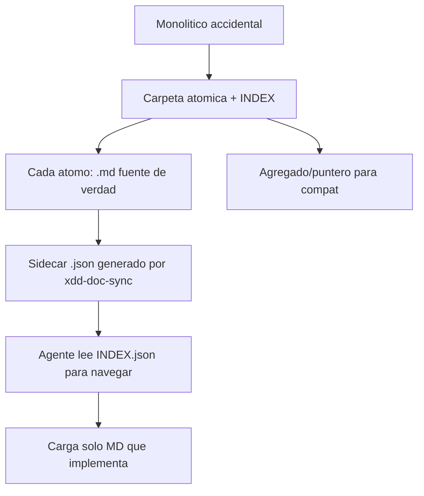

# ADR-0050: Atomicidad total del pipeline + par JSON/MD para ahorro de tokens

**Estado:** Aceptado (en implementacion)
**Fecha:** 2026-06-04
**Sprint:** Megasprint atomizacion (sprint-28)
**Decisores:** Alejandro Placencia + Orquestador X-DD

---

## Contexto

El pipeline X-DD estaba 85% atomico. Las fases briefing, spec (doc-granular) y retro ya
producian estructura atomica (1 carpeta = 1 dominio, 1 doc = 1 subdominio). Quedaban 6
monoliticos accidentales (sprint.md, MEMORY.md, FEATURES.md, DOMAIN.md, PRIVACY.md, QA
report) + 1 monolitico-por-formato (openapi.yaml).

Dos problemas:

1. **Atomicidad incompleta.** Los monoliticos mezclan multiples conceptos en un archivo,
   dificultando que un sub-agente lea solo lo que necesita y que dos agentes trabajen en
   paralelo sin conflicto de merge.

2. **Consumo de tokens.** Documentacion amplia (un proyecto complejo genera 60-120 docs de
   ~2500 tokens cada uno) hace que un agente que necesita "conocer" la estructura gaste
   ~200k tokens solo navegando.

X-DD tiene dos arboles paralelos:

- **GATE TREE** (`.xdd/<phase>/`): artefactos slim que el gate firma con HMAC-SHA256.
  `PHASE_ARTIFACTS` en `xdd-gate.py` apunta SOLO aqui.
- **RICH TREE** (`acuerdos/` + `docs/`): contenido atomico human-facing. Todos los
  monoliticos viven aqui.

## Decision

**1 carpeta = 1 dominio, 1 archivo = 1 concepto.** Cada monolitico accidental se divide en
una carpeta atomica con INDEX. Los monoliticos se conservan solo como:

- **Punteros** (sprint.md → sprints/INDEX.md)
- **Agregados generados** con banner (MEMORY.md, FEATURES.md, DOMAIN.md, PRIVACY.md)
- **Raices de spec** generadas (openapi.yaml — el unico monolitico-por-formato legitimo)

**Par JSON/MD para ahorro de tokens.** Cada `.md` atomico (fuente de verdad, calidad
completa) tiene un `.json` sidecar derivado generado por `xdd-doc-sync.py`. El JSON es la
estructura maxima de ahorro: un agente lee el INDEX.json (~3-5k tokens) para mapear que
existe, y solo carga el MD completo del subdominio que va a implementar. Ahorro ~95%.

**Enforcement via discipline-check, NO via gate.** El `xdd-discipline-check.py` gana
`check_atomic_folder` + `check_json_sidecar`. NO se modifica `PHASE_ARTIFACTS` — las firmas
HMAC existentes siguen validas dia uno.

## Alternativas rechazadas

| Alternativa | Razon de rechazo |
|---|---|
| Modificar PHASE_ARTIFACTS para exigir carpetas | Re-firma todas las fases existentes; rompe HMAC dia uno |
| Borrar los monoliticos | Rompe compat con tooling/grep/imports externos |
| JSON con contenido completo dual | No ahorra tokens al leer; duplica mantenimiento |
| Generar JSON a mano por el agente | Gasta tokens; introduce drift MD<->JSON |

## Consecuencias

- El gate sigue verde sin re-firmar (keystone).
- Agentes navegan proyectos grandes con ~95% menos tokens.
- Backward compat preservada via agregados/punteros.
- Nuevo riesgo: drift JSON/MD si se edita MD sin re-sync. Mitigado por `verify` +
  `check_json_sidecar` que detectan checksum mismatch.
- Enforcement opt-in (`XDD_DISCIPLINE_ATOMIC=1` futuro) para no romper proyectos legacy.

## Referencias

- `scripts/xdd-doc-sync.py` (motor del par JSON/MD)
- `scripts/xdd-discipline-check.py` (check_atomic_folder + check_json_sidecar)
- `docs/DOC_STANDARD.md` seccion 7
- ADR-0051 (openapi fragments — caso monolitico-por-formato)
