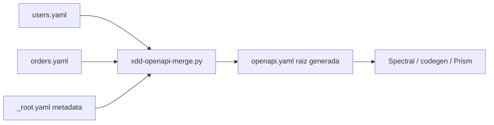

# ADR-0051: OpenAPI fragments por recurso + raiz mergeada generada

**Estado:** Aceptado (en implementacion)
**Fecha:** 2026-06-04
**Sprint:** Megasprint atomizacion (sprint-28)
**Decisores:** Alejandro Placencia + Orquestador X-DD

---

## Contexto

ADR-0050 establece atomicidad total (1 archivo = 1 concepto). El contrato OpenAPI es el
unico caso **monolitico-por-formato legitimo**: el tooling del ecosistema (Spectral para
lint, openapi-generator para codegen, Prism para mock server, Swagger UI) requiere UNA
raiz `openapi.yaml` valida. No se puede atomizar el contrato en N archivos sueltos sin
romper ese tooling.

Al mismo tiempo, un `openapi.yaml` monolitico con todos los endpoints crea conflictos de
merge cuando varios equipos/agentes trabajan en recursos distintos.

## Decision

**Fragmentos atomicos por recurso + raiz generada.** Cada recurso de la API se edita de
forma atomica en `api/openapi/fragments/<recurso>.yaml` (solo sus `paths` + `components`).
La raiz `openapi.yaml` es **generada** por `xdd-openapi-merge.py`, nunca editada a mano.

```
api/openapi/fragments/
  _root.yaml           (metadata: openapi, info, servers — opcional)
  INDEX.md / INDEX.json
  users.yaml           (paths /users + schemas User)
  orders.yaml          (paths /orders + schemas Order)
openapi.yaml           → RAIZ GENERADA (banner, OpenAPI 3.x valida, en raiz del repo)
```

El merge es deep-merge: cada fragmento aporta sus `paths` y `components.schemas`, que se
fusionan en la raiz. La metadata (openapi version, info, servers) viene de `_root.yaml`
o de defaults.



## Alternativas rechazadas

| Alternativa | Razon de rechazo |
|---|---|
| Atomizar sin raiz (N archivos sueltos) | Rompe Spectral/codegen/Prism que necesitan 1 raiz |
| openapi.yaml monolitico editado a mano | Conflictos de merge multi-equipo; viola ADR-0050 |
| redocly/swagger-cli para merge | Dep Node; X-DD es stdlib-first. Documentado como swap opcional |
| $ref a archivos externos en la raiz | Soportado por algunos tools pero no todos; fragil cross-tooling |

## Consecuencias

- Recursos editables de forma atomica sin conflicto de merge.
- La raiz siempre valida (generada + validada por `validate`).
- `xdd-openapi-merge.py` es stdlib + pyyaml (sin Node).
- Nuevo paso en `/api-contract`: tras editar fragmentos, re-mergear antes de Spectral.
- Swap a redocly: reemplazar la llamada a `xdd-openapi-merge.py merge` por
  `redocly bundle`; el contrato de carpetas no cambia.

## Referencias

- `scripts/xdd-openapi-merge.py`
- `.agent/workflows/api-contract.md`
- ADR-0050 (atomicidad total — este es el caso monolitico-por-formato)
