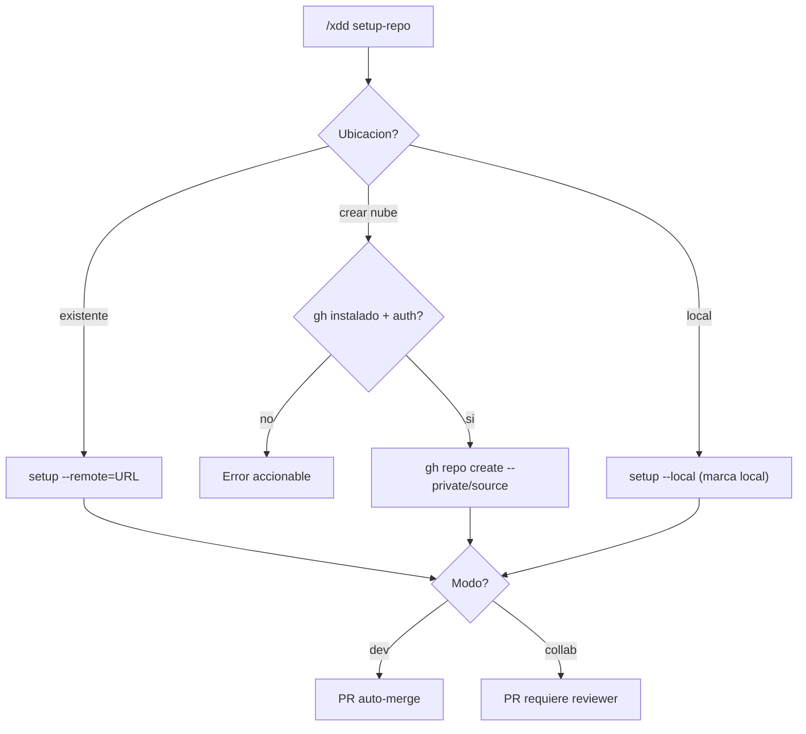

# ADR-0052: Creacion autonoma de repositorio GitHub en setup-repo

**Estado:** Aceptado (en implementacion)
**Fecha:** 2026-06-04
**Sprint:** Megasprint paridad relato (sprint-29)
**Decisores:** Alejandro Placencia + Orquestador X-DD

---

## Contexto

El sistema de referencia (relato) arranca preguntando, como PRIMER paso, donde vive el
repositorio: link existente, crear en la nube de forma autonoma, o solo local. Mas si es
dev-solo o colaborativo. X-DD tenia `xdd-gitflow.sh setup --mode=dev|collab [--remote=URL]`
pero NO podia crear un repo en GitHub autonomamente, ni tenia modo local-only explicito, ni
la pregunta era lo primero (estaba enterrada en la dimension 14 del briefing).

Crear un repositorio en la nube de forma autonoma implica que el agente ejecuta una accion
con efecto externo permanente (crea un repo real en la cuenta GitHub del usuario). Esto es
una frontera de autonomia/seguridad que merece decision explicita.

## Decision

`/xdd setup-repo` (paso 0, antes del briefing) ofrece tres opciones de ubicacion:

1. **Repo existente** — el usuario da la URL, se configura como origin.
2. **Crear en la nube** — `gh repo create <name> --private|--public --source=. --remote=origin`.
3. **Solo local** — sin remoto; se marca `.xdd/gitflow.remote=local` para que sprint-close
   no haga push ni PR.

Mas el modo de trabajo: `dev` (PR auto-merge) o `collab` (PR requiere reviewer).

Guardrails de la creacion autonoma:

- **gh-gated:** requiere `gh` CLI instalado y autenticado. Si falta, error accionable
  (no falla silenciosamente).
- **Private por default:** si el usuario no especifica visibilidad, el repo se crea privado
  para evitar exponer codigo accidentalmente.
- **Confirmacion en el workflow:** el agente confirma nombre + visibilidad con el usuario
  ANTES de ejecutar `gh repo create`.

## Alternativas rechazadas

| Alternativa | Razon de rechazo |
|---|---|
| Solo configurar remoto existente (sin crear) | Menos magico pero el relato pide crear autonomo |
| Crear publico por default | Riesgo de exponer codigo privado accidentalmente |
| Crear sin confirmacion del usuario | Efecto externo permanente sin gate humano |
| Pregunta enterrada en briefing D14 | El relato la pone PRIMERO; es el detonante del setup |

## Consecuencias

- El agente puede crear repos en la nube, pero solo con gh autenticado + confirmacion.
- Modo local-only soportado: desarrollo sin remoto, sprint-close no hace push.
- Private-by-default reduce el riesgo de exposicion.
- `.xdd/gitflow.remote` (nuevo state) distingue remote vs local para downstream.

## Referencias

- `scripts/xdd-gitflow.sh` (cmd_setup, _create_remote_repo, _get_remote_mode)
- `.agent/workflows/setup-repo.md`
- `.agent/workflows/briefing.md` (paso 0 invoca setup-repo)
