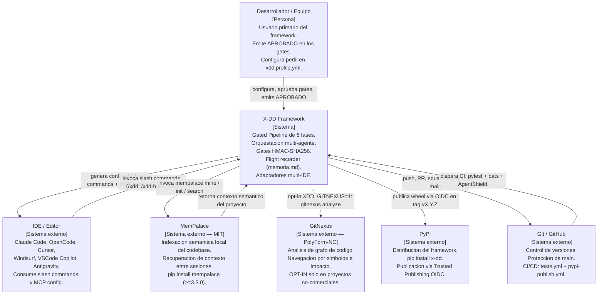
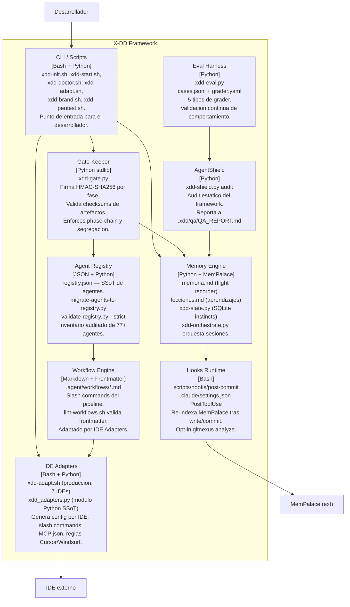
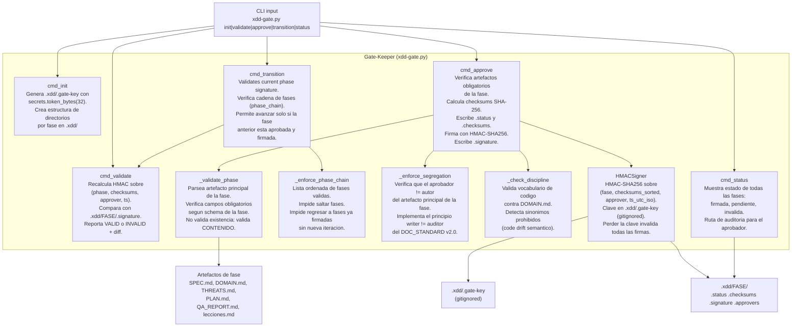

# ARQUITECTURA X-DD

**Version:** 1.0.0
**Fecha:** 2026-06-04
**Gobernanza:** Constitucion X-DD v2.0
**Conforme a:** DOC_STANDARD.md v2.0
**Autores:** Orchestrator X-DD

---

## Indice

1. [Vision general del sistema](#1-vision-general-del-sistema)
2. [Diagrama C4 — Contexto](#2-diagrama-c4--contexto)
3. [Diagrama C4 — Contenedor](#3-diagrama-c4--contenedor)
4. [Diagrama C4 — Componente: gate-keeper](#4-diagrama-c4--componente-gate-keeper)
5. [Decisiones arquitectonicas clave](#5-decisiones-arquitectonicas-clave)
6. [Atributos de calidad](#6-atributos-de-calidad)
7. [Riesgos arquitectonicos activos](#7-riesgos-arquitectonicos-activos)
8. [Restricciones tecnicas](#8-restricciones-tecnicas)

---

## 1. Vision general del sistema

### 1.1 Que es X-DD

X-DD es un framework de desarrollo de software cuya mision es integrar multiples metodologias *-Driven Development* como capas complementarias sobre un Gated Pipeline de 6 fases verificables. El framework unifica Specification-Driven Development (SDD), Feature-Driven Development (FDD), Behavior-Driven Development (BDD), Acceptance Test-Driven Development (ATDD), Domain-Driven Design (DDD), Test-Driven Development (TDD), Security Test-Driven Development (STDD), Security-Driven Development (SecDD) y Threat-Driven Design en una disciplina unica.

El resultado es un sistema que garantiza trazabilidad bidireccional desde el inception hasta el despliegue, con gates criptograficamente firmados entre cada fase para prevenir la ejecucion no autorizada de fases subsiguientes.

### 1.2 Problema que resuelve

| Problema | Consecuencia sin X-DD | Respuesta de X-DD |
|---|---|---|
| Metodologias aisladas sin integracion | Conflictos entre TDD, BDD y ATDD en el mismo proyecto | Pipeline de 6 fases donde cada metodologia se embebe como capa en la fase donde mas aporta |
| Ausencia de gates verificables | Fases marcadas como completas sin evidencia objetiva | HMAC-SHA256 sobre artefactos firmados; cualquier alteracion invalida la firma |
| Perdida de contexto entre sesiones de agentes | El agente repite errores ya documentados y revierte decisiones aprobadas | Flight recorder obligatorio (`memoria.md`) + MemPalace para recuperacion semantica |
| Deuda tecnica no declarada | Hacks invisibles se acumulan sin justificacion ni plan de resolucion | Art. 4 Constitucion: toda deuda debe registrarse en `memoria.md` con sprint de resolucion |
| Lenguaje inconsistente entre dominio y codigo | Code drift semantico; el codigo usa sinonimos no declarados del dominio | `DOMAIN.md` como SSoT del vocabulario; `xdd-discipline-check.py` detecta drift |
| Amenazas de seguridad identificadas tarde | Controles de seguridad como afterthought post-build | Threat Modeling en Fase 2 (antes de Build) + STDD en Fase 4 |
| Configuracion manual por IDE | Friccion al iniciar proyectos; comandos invisibles en algunos IDEs | `xdd-adapt.sh` + `xdd_adapters.py` generan config para 7 IDEs con copia real (no symlinks) |

### 1.3 Stakeholders

| Stakeholder | Rol | Preocupaciones principales |
|---|---|---|
| Desarrollador solopreneur | Usuario primario del framework | Velocidad de bootstrap, cero friccion multi-IDE, memoria persistente entre sesiones |
| Equipo de desarrollo | Usuario primario en contexto de equipo | Consistencia de proceso entre miembros, gates auditables, prevencion de conflictos de merge |
| Orquestador X-DD (agente) | Coordinador del pipeline | Cumplimiento constitucional, instanciacion y retiro de subagentes, escritura exclusiva de `memoria.md` |
| Subagentes especializados | Ejecutores de tareas de nicho | Alcance delimitado, criterio de completitud verificable, retiro obligatorio al completar |
| Aprobador humano | Autoridad del gate | Emision del comando `APROBADO`; ningun agente puede sustituir esta funcion |
| Contribuidor externo | Consumidor del framework via PyPI | Instalacion limpia (`pip install x-dd`), documentacion clara, licencia compatible |
| Proyecto white-label (agentix, Helios) | Instancia derivada del framework | Capacidad de rebrand completo sin modificar el SSoT de workflows |

### 1.4 El pipeline como contrato arquitectonico

El pipeline de 6 fases es inmutable. Ningun agente puede saltar una fase ni omitir un gate de aprobacion. Las metodologias son capas que se embeben dentro de las fases existentes, no fases nuevas.

```
FASE 1 (Briefing)  +FDD +BDD +ATDD     [GATE 1 — APROBADO]
FASE 2 (Spec)      +DDD +Threat Model  [GATE 2 — APROBADO]
FASE 3 (Plan)      +FDD vertical       [GATE 3 — APROBADO]
FASE 4 (Build)     +TDD +STDD          [GATE 4 — APROBADO]
FASE 5 (QA)        +BDD +ATDD +SecDD   [GATE 5 — APROBADO]
FASE 6 (Retro)     Learning loop       [GATE 6 — cierre sprint]
```

Cada `APROBADO` es emitido por el usuario humano y firmado criptograficamente por `xdd-gate.py` con HMAC-SHA256. La firma se calcula sobre el tuple `(fase, checksums_ordenados, aprobador, timestamp_utc_iso)`.

---

## 2. Diagrama C4 — Contexto

El diagrama de contexto muestra X-DD como sistema central y sus relaciones con los actores externos y sistemas de soporte.



### Notas del diagrama de contexto

- La linea punteada hacia GitNexus indica dependencia opt-in. Por defecto `XDD_GITNEXUS=0`. Ver ADR-0049.
- MemPalace es dependencia externa MIT; X-DD degrada elegantemente si no esta instalado (guards `command -v mempalace` en hooks).
- El IDE no es un sistema monolitico; cada adapter genera el formato especifico de cada IDE. Ver seccion de contenedores.
- PyPI es el canal de distribucion para `pip install x-dd`; el canal de instalacion alternativo es clonacion directa del repositorio.

---

## 3. Diagrama C4 — Contenedor

El diagrama de contenedores muestra los bloques funcionales internos de X-DD y sus responsabilidades.



### Responsabilidades de cada contenedor

| Contenedor | Tecnologia | Responsabilidad principal | Artefacto SSoT |
|---|---|---|---|
| CLI / Scripts | Bash | Punto de entrada; bootstrap, arranque, diagnostico, branding | `scripts/xdd-init.sh` |
| Gate-Keeper | Python 3.9+ stdlib | Firma criptografica de aprobaciones; enforcement de cadena de fases | `scripts/xdd-gate.py` |
| Agent Registry | JSON + Python | Inventario auditado de agentes; prevencion de duplicados | `registry.json` |
| Workflow Engine | Markdown + YAML frontmatter | Slash commands del pipeline; logica de cada fase | `.agent/workflows/*.md` |
| Memory Engine | Python + SQLite | Flight recorder; continuidad de contexto; instincts acumulados | `memoria.md`, `~/.xdd/state.db` |
| Hooks Runtime | Bash | Re-indexacion automatica de MemPalace; trigger post-commit y post-write | `scripts/hooks/post-commit` |
| IDE Adapters | Bash + Python | Generacion de config por IDE; copia real (no symlinks); rebrand de trigger | `scripts/xdd-adapt.sh` |
| Eval Harness | Python | Validacion continua del comportamiento del framework con casos estructurados | `evals/*/cases.jsonl` |
| AgentShield | Python | Auditoria estatica del framework; detecta drift de gobernanza | `.xdd/qa/QA_REPORT.md` |

---

## 4. Diagrama C4 — Componente: gate-keeper

El gate-keeper es el contenedor mas critico del framework. Implementa el enforcement del pipeline mediante firma criptografica. A continuacion se detallan sus componentes internos.



### Invariantes del gate-keeper

| Invariante | Descripcion | Consecuencia de violacion |
|---|---|---|
| Firma HMAC obligatoria | Toda aprobacion produce una firma; sin firma no hay aprobacion valida | El gate de QA rechaza la fase como no aprobada |
| Cadena de fases secuencial | No se puede aprobar Fase N+1 sin Fase N firmada | `cmd_transition` lanza error; la fase bloqueada no avanza |
| Segregacion aprobador/autor | El aprobador no puede ser el mismo que produjo el artefacto | `_enforce_segregation` rechaza con error descriptivo |
| Artefactos de contenido, no de existencia | El gate parsea y valida el contenido del artefacto, no solo su existencia | Un artefacto vacio o con campos faltantes falla el gate |
| Clave gitignored | `.xdd/.gate-key` nunca se versiona | Rotacion documentada en SECURITY.md; backup es responsabilidad del equipo |

---

## 5. Decisiones arquitectonicas clave

La siguiente tabla resume los ADRs de mayor impacto arquitectonico. El catalogo completo se encuentra en `docs/adr/`.

| ADR | Titulo | Estado | Consecuencias principales |
|---|---|---|---|
| ADR-0003 | Python como runtime del gate-keeper | Aceptado | Gate con HMAC, JSON Schema y datetime via stdlib; Python >=3.9 requerido (ya dep transitiva por MemPalace) |
| ADR-0004 | MemPalace como dep externa MIT, no fork | Aceptado | Ownership claro; degradacion elegante si no instalado; breaking changes de MemPalace requieren version constraint en xdd.config.yml |
| ADR-0006 | Gate-keeper con firma HMAC-SHA256 | Aceptado | "APROBADO" es auditable y no editable sin invalidar la firma; perder `.gate-key` invalida historial de firmas |
| ADR-0034 | Universal IDE adapter (copia real + 6 IDEs) | Aceptado | Symlinks eliminados; `/helios` visible en Claude Code; 7 IDEs configurados automaticamente por `xdd-init`; commands duplicados (copia real) — re-correr adapter tras editar SSoT |
| ADR-0042 | Protocolo Git hibrido trunk-based por defecto | Aceptado | Ley alineada con practica real (31 sprints trunk-based); GitFlow opt-in via ADR + `.xdd/gitflow.mode`; tests verdes son gate ejecutable en CI, no verbal |
| ADR-0046 | Modulo Python de adapters IDE — aditivo, no reemplaza shell | Aceptado | `xdd_adapters.py` disponible como modulo Python empaquetable; `xdd-adapt.sh` sigue siendo el camino de produccion hasta v0.2.0 |
| ADR-0047 | Publicacion en PyPI via Trusted Publishing OIDC | Aceptado | `pip install x-dd` disponible tras tag vX.Y.Z; cero secretos de PyPI en el repo; primer publish requiere configuracion del trusted publisher en PyPI (manual unico) |
| ADR-0049 | GitNexus opt-in por licencia PolyForm-NC | Aceptado | GitNexus no corre por defecto; opt-in con `XDD_GITNEXUS=1`; MemPalace (MIT) cubre continuidad de contexto; uso comercial de X-DD no dispara GitNexus sin consentimiento |

---

## 6. Atributos de calidad

| Atributo | Escenario | Tacticas aplicadas |
|---|---|---|
| Auditabilidad | El aprobador humano necesita verificar que la Fase 2 fue aprobada hace 3 sprints y que los artefactos no fueron modificados despues | Firma HMAC-SHA256 sobre checksums de artefactos; `cmd_status` muestra VALID/INVALID; historial de commits Git |
| Continuidad de contexto | Un agente inicia una nueva sesion despues de agotar tokens; debe recuperar el estado del proyecto sin perdida | `memoria.md` como flight recorder obligatorio (Art. 3); MemPalace semantic index; `xdd-start.sh` ejecuta `mempalace mine` al arranque |
| Portabilidad | Un desarrollador instala X-DD en un nuevo proyecto en un IDE distinto y necesita que los slash commands funcionen sin pasos manuales | `xdd-adapt.sh` genera config para 7 IDEs; copia real (no symlinks); MCP auto-config; trigger custom propagado |
| Modularidad | Un equipo necesita adoptar solo TDD + SecDD sin el pipeline completo | Arbol de decision en `X-DD_Integration_Guide.md`; perfil minimo en `xdd.profile.yml`; metodologias son capas opcionales sobre el pipeline |
| Seguridad del proceso | Ningun agente puede marcar una fase como aprobada sin intervencion humana | `_enforce_segregation`: aprobador != autor; comando `APROBADO` solo emitible por usuario humano (Art. 2 Constitucion) |
| Trazabilidad | Un auditor externo necesita rastrear desde un bug en produccion hasta el requisito que lo origino | Cadena BDD(.feature) → ATDD(acceptance test) → TDD(unit test) → DOMAIN.md → SPEC.md → THREATS.md; todos vinculados por FEATURES.md |
| Distribuibilidad | Un equipo necesita instalar X-DD en un entorno sin acceso al repositorio de GitHub | `pip install x-dd` via PyPI; Trusted Publishing OIDC; wheel incluye scripts y workflows |
| Rebrand / White-labeling | Un cliente necesita distribuir X-DD bajo su propia marca sin fork | `xdd-brand.sh` + `xdd.profile.yml`; trigger custom (`/helios`); `.claude/branding.json` + orchestrator-persona; ADR-0011 |

---

## 7. Riesgos arquitectonicos activos

| Riesgo | Probabilidad | Impacto | Mitigacion |
|---|---|---|---|
| Perdida de `.xdd/.gate-key` | Baja | Alto — invalida todas las firmas del proyecto | Documentar rotacion en SECURITY.md; hacer backup en gestor de secretos del equipo; procedimiento de re-firma en caso de perdida |
| Breaking change en MemPalace API | Media | Medio — hooks y `xdd-start.sh` dejan de funcionar | Version constraint `>=3.3.0` en `xdd.config.yml`; Renovate alerts; degradacion elegante con guard `command -v mempalace` |
| Coexistencia de `xdd-adapt.sh` y `xdd_adapters.py` (ADR-0046) | Alta (es el estado actual) | Bajo — dos rutas temporales pueden divergir en comportamiento | Consolidar en v0.2.0 migrando los 29 bats de shell a pytest sobre el modulo Python; `xdd-adapt.sh` sigue siendo el camino de produccion hasta entonces |
| Falso positivo en `_enforce_segregation` | Baja | Medio — bloquea un gate valido en contexto solopreneur | Modo solopreneur documentado; `--bypass-segregation` con flag explicito y registro obligatorio en `memoria.md` |
| Drift semantico no detectado | Media | Medio — el codigo usa vocabulario fuera de DOMAIN.md sin que el gate lo detecte | `xdd-discipline-check.py` corre en Fase 5; Tier 3 LLM-Judge verifica coherencia con DOMAIN.md |
| Acumulacion de agentes efimeros activos | Baja | Bajo — riesgo de seguridad operativa | Art. 5 Constitucion: orquestador registra y retira agentes; auditoria en `memoria.md` al cierre de sesion |
| Colision de `.github/prompts/` en IDE adapter | Media | Bajo — sobreescribe prompts existentes del proyecto en VSCode Copilot | Documentado en ADR-0034; `xdd-adapt.sh` advierte antes de sobrescribir; el usuario puede usar `XDD_NO_ADAPT=1` |
| Falso positivo de auto-detect de IDEs | Media | Bajo — genera config inerte para un IDE no instalado | Aceptable segun ADR-0034; el desarrollador puede limpiar manualmente; `XDD_NO_ADAPT=1` para control total |

---

## 8. Restricciones tecnicas

| Restriccion | Razon | Consecuencia |
|---|---|---|
| Python >=3.9 requerido para el gate-keeper | HMAC-SHA256, JSON Schema y datetime ISO 8601 requieren stdlib moderna; ya dep transitiva de MemPalace (ADR-0003) | `xdd-doctor.sh` verifica version; la ausencia de Python bloquea `xdd-gate.py` y `xdd-state.py` |
| Sin rutas absolutas del host en ningun artefacto | Portabilidad absoluta (Directriz de Calidad 1 en CLAUDE.md); el framework debe funcionar en cualquier maquina sin reconfiguracion | Toda ruta es relativa (`./` o `../`); los scripts usan `$PWD` o `$(dirname $0)` |
| Sin symlinks en config de IDEs | Claude Code y VSCode Copilot rechazan symlinks en `.claude/commands/` y `.github/prompts/` — el comando queda invisible (ADR-0034) | `xdd-adapt.sh` usa copia real; `xdd_adapters.py` usa `copy_real()`; los commands son derivados materializados del SSoT en `.agent/workflows/` |
| Sin push directo a `main` | Invariante de proteccion de rama (Art. 7 Constitucion v2.0; ADR-0042) | La unica via de integracion es PR con aprobacion humana; violacion requiere reversion inmediata y registro en `lecciones.md` |
| MemPalace acoplado solo via CLI estable | No fork, no vendor, no reimplementacion (ADR-0004) | `mempalace init|mine|search|wake-up` son las unicas interfaces permitidas; breaking changes en MemPalace se mitigan con version constraint |
| GitNexus opt-in, default OFF | Licencia PolyForm Noncommercial incompatible con uso comercial (ADR-0049) | Los hooks de `post-commit` y `xdd-start.sh` solo ejecutan `gitnexus analyze` si `XDD_GITNEXUS=1`; MemPalace cubre continuidad de contexto por defecto |
| Conventional Commits obligatorios en todos los commits | Gate de CI ejecuta linter de commits; mensajes no conformes son rechazados (Art. 7.2 Constitucion) | Formato `tipo(alcance): descripcion` con tipos `feat|fix|docs|chore|refactor|test|perf|ci`; no hay squash de mensajes no conformes |
| Aprobador != autor en cada gate de fase | Principio de segregacion (Art. 5 Constitucion; invariante en `_enforce_segregation`) | En contexto solopreneur el bypass debe ser explicito con flag y registro obligatorio en `memoria.md` |
| Cero emojis en documentacion | DOC_STANDARD.md v2.0 prohibe emojis | Los linters de documentacion rechazan archivos con codepoints de emoji; el CI (`lint-workflows.sh`) valida el frontmatter y el contenido |
| Artefactos firmados son append-only | Editar un artefacto despues de la firma HMAC invalida los checksums (Art. 2.2 Constitucion) | Si un artefacto firmado requiere modificacion, el procedimiento correcto es abrir una nueva iteracion con su propio gate; no existe "re-firma sobre el mismo gate" |

---

## Trazabilidad de este documento

| Campo | Valor |
|---|---|
| Producido por | Orchestrator X-DD siguiendo DOC_STANDARD.md v2.0 |
| Fuentes primarias | `docs/constitucion.md` v2.0, `docs/X-DD_Integration_Guide.md` v3.0, `docs/adr/` (ADR-0003 a ADR-0049) |
| Gobernado por | Constitucion X-DD v2.0 Art. 4 (Ingenieria de Ciclo de Vida) |
| Proxima revision | Al cerrar cada sprint mayor o al ratificar un ADR que afecte la arquitectura de contenedores |
| Auditor | Agente distinto al autor (invariante DOC_STANDARD v2.0 writer != auditor) |

---

*X-DD System — Excelencia Operativa*
