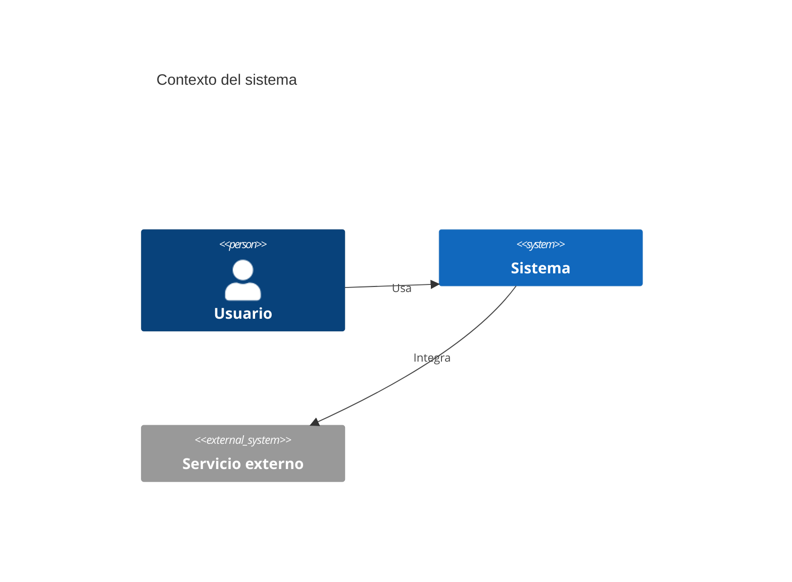
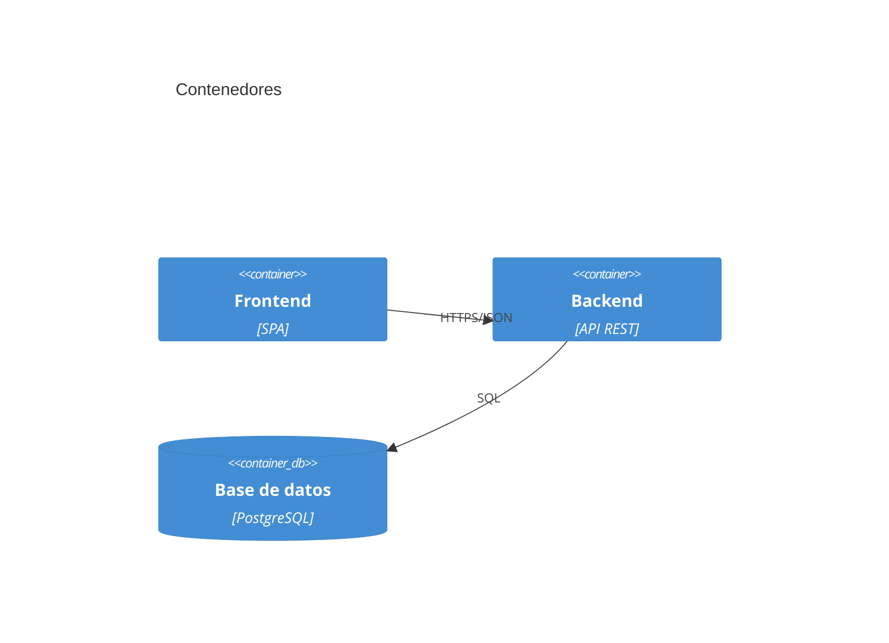
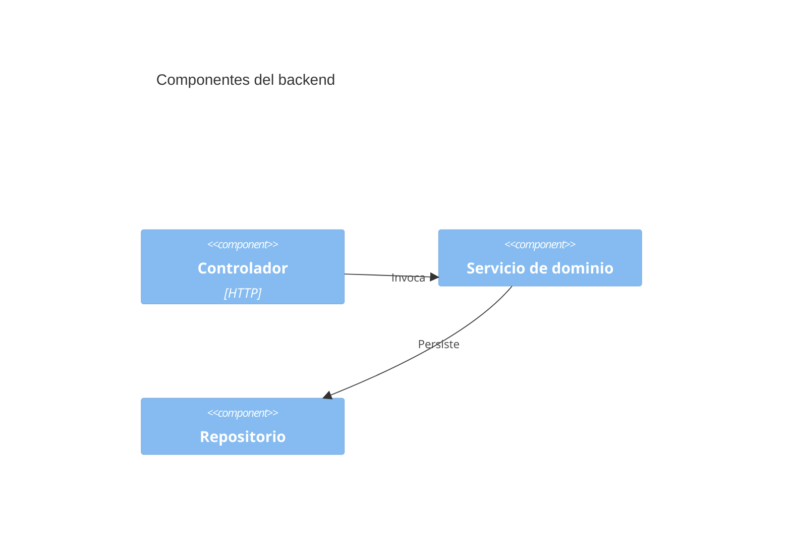

# ARQUITECTURA.md — Vision Arquitectonica (C4)

> Producido por `/technical-documentation` o `/project-architecture-gsd`.
> Cumple `docs/DOC_STANDARD.md`.

## 1. Vision general del sistema

<CONFIGURAR: que hace el sistema, para quien, valor principal.>

## 2. Diagrama C4 - Contexto

## 3. Diagrama C4 - Contenedor

## 4. Diagrama C4 - Componente (contenedores criticos)

## 5. Decisiones arquitectonicas clave

| ADR | Decision | Estado |
|-----|----------|--------|
| ADR-NNNN | <decision> | Aceptada |

## 6. Atributos de calidad

| Atributo | Como se satisface | Metrica/umbral |
|----------|-------------------|----------------|
| Disponibilidad | <mecanismo> | 99.9% |
| Rendimiento | <mecanismo> | p95 < 200ms |

## 7. Riesgos arquitectonicos

| Riesgo | Probabilidad | Impacto | Mitigacion |
|--------|--------------|---------|------------|
| <riesgo> | Media | Alto | <mitigacion> |

## 8. Definition of Done

- [ ] C4 Contexto + Contenedor + Componente incluidos
- [ ] Decisiones referencian ADRs
- [ ] Cero emojis (ver `docs/DOC_STANDARD.md` seccion 2.1)
