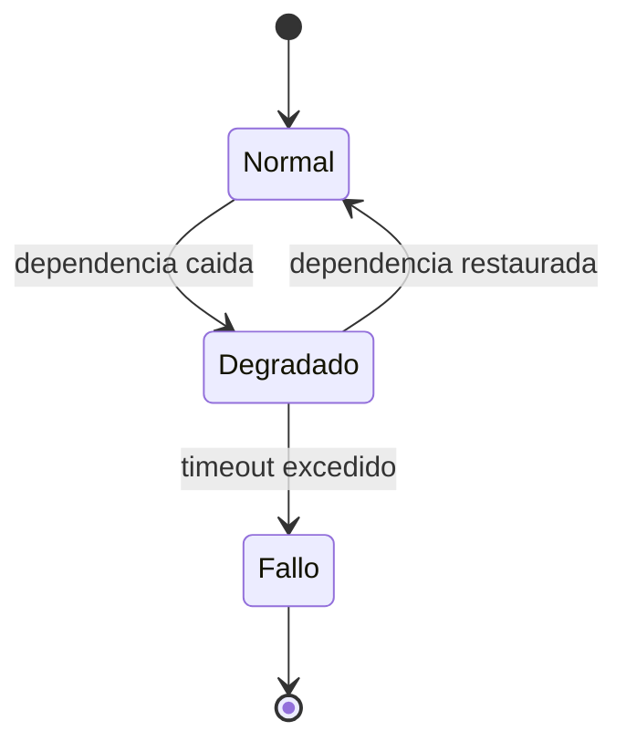

# CASOS_BORDE.md — Casos Borde y Condiciones Limite

> Producido por `/qa-review` o `/stress-test`. Cumple `docs/DOC_STANDARD.md`.

## 1. Catalogo de casos borde

| ID | Escenario | Precondicion | Entrada | Resultado esperado | Prioridad |
|----|-----------|--------------|---------|--------------------|-----------|
| TC-101 | Entrada vacia | Sistema en reposo | "" | Error de validacion | Alta |
| TC-102 | Limite superior | Cuota al maximo | N+1 | Rechazo con codigo 429 | Alta |
| TC-103 | Concurrencia | Dos escrituras simultaneas | misma clave | Una gana, otra reintenta | Media |

## 2. Clases de equivalencia y valores limite

| Variable | Rango valido | Limite inferior | Limite superior | Fuera de rango |
|----------|--------------|-----------------|-----------------|----------------|
| <variable> | 1..100 | 1 | 100 | 0, 101 |

## 3. Escenarios de fallo y recuperacion

## 4. Definition of Done

- [ ] Cada variable de entrada con valores limite cubiertos
- [ ] Escenarios de concurrencia y fallo documentados
- [ ] Cada caso trazable a requisito
- [ ] Cero emojis (ver `docs/DOC_STANDARD.md` seccion 2.6)
