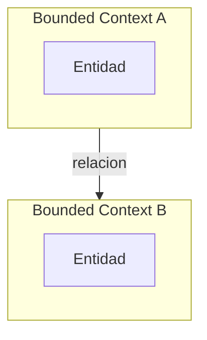
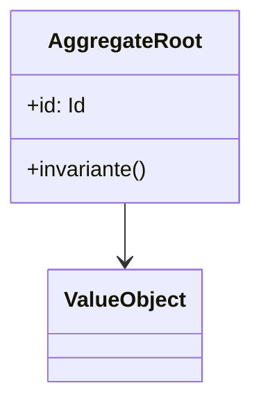

# DOMAIN.md — Modelo de Dominio (DDD)

> Producido por `/project-architecture-gsd`. Cumple `docs/DOC_STANDARD.md`.
> Los nombres definidos aqui son INMUTABLES. Cambiarlos requiere un ADR.

## 1. Ubiquitous Language

| Termino | Definicion | Sinonimos prohibidos |
|---------|------------|----------------------|
| <Termino> | <definicion precisa> | <sinonimos a evitar> |

## 2. Bounded Contexts

## 3. Context Map

| Contexto upstream | Contexto downstream | Relacion (Customer-Supplier / Shared Kernel / ACL) | Contrato |
|-------------------|---------------------|----------------------------------------------------|----------|
| <BC A> | <BC B> | Customer-Supplier | Domain Event / DTO |

## 4. Agregados

### 4.1 <Nombre del agregado>

- **Aggregate Root:** <entidad>
- **Invariantes:** <reglas que siempre se cumplen>
- **Entidades:** <lista>
- **Value Objects:** <lista>
- **Repositorio:** <interfaz>

## 5. Domain Events

| Evento | Emisor | Consumidores | Efecto |
|--------|--------|--------------|--------|
| <Evento> | <agregado> | <lista> | <efecto> |

## 6. Diagrama de clases del dominio

## 7. Definition of Done

- [ ] Ubiquitous Language completo (ver `docs/DOC_STANDARD.md` seccion 2.2)
- [ ] Cada agregado con invariantes y repositorio
- [ ] Diagrama de clases incluido
- [ ] Cero emojis
