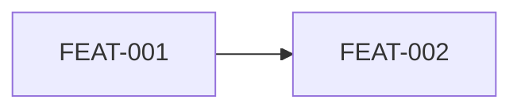

# FEATURES.md — Catalogo de Features (FDD)

> Producido por `/fase-requisitos`. Cumple `docs/DOC_STANDARD.md`.

## 1. Catalogo de features

Formato de nombre FDD: `[accion] [resultado] [objeto]`.

| ID | Nombre | Beneficio | Prioridad (RICE/MoSCoW) | Estimacion | Estado |
|----|--------|-----------|-------------------------|------------|--------|
| FEAT-001 | <accion resultado objeto> | <beneficio> | Must | 1d | Pendiente |

## 2. Criterios de aceptacion por feature

### FEAT-001

| Criterio | Caso Gherkin (TC-NNN) |
|----------|------------------------|
| <criterio> | TC-001 |

## 3. Mapa feature a entidad de dominio

| Feature (FEAT-NNN) | Entidad/Agregado (DOMAIN.md) |
|--------------------|------------------------------|
| FEAT-001 | <agregado> |

## 4. Dependencias entre features

## 5. Definition of Done

- [ ] Cada feature mapeable 1:1 a un archivo .feature
- [ ] Cada feature referencia su entidad de dominio
- [ ] Cero emojis (ver `docs/DOC_STANDARD.md` seccion 2.4)
