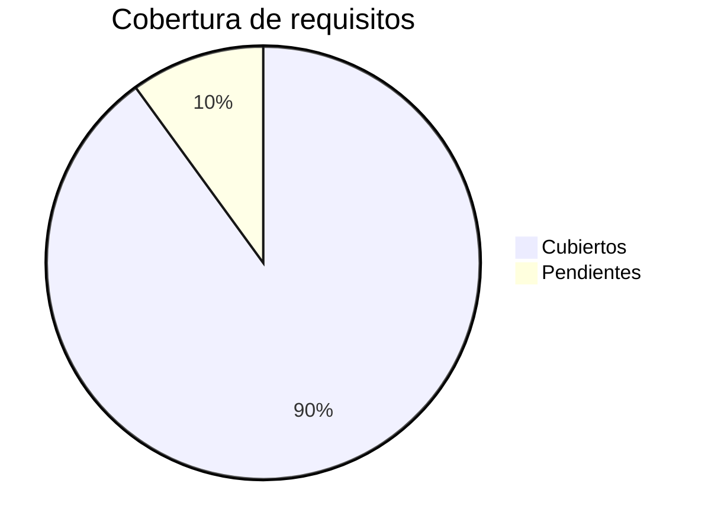

# MATRIZ_TRAZABILIDAD.md — Matriz de Trazabilidad (RTM)

> Producido por `/qa-review`. Cumple `docs/DOC_STANDARD.md`.
> Trazabilidad bidireccional: cada requisito a su caso de prueba y viceversa.

## 1. Requisitos a casos de prueba

| Requisito (REQ-NNN) | Feature (FEAT-NNN) | Caso de prueba (TC-NNN) | Tipo (unit/integracion/E2E/seguridad) | Resultado | Cobertura |
|---------------------|--------------------|-------------------------|----------------------------------------|-----------|-----------|
| REQ-001 | FEAT-001 | TC-001 | unit | Pass | 100% |

## 2. Requisitos no funcionales a verificacion

| NFR (NFR-NNN) | Metrica | Umbral | Metodo de verificacion | Resultado |
|---------------|---------|--------|------------------------|-----------|
| NFR-001 | latencia p95 | < 200ms | benchmark | Pass |

## 3. Amenazas a controles a tests

| Amenaza (THR-NNN) | Control | Test de seguridad (TC-NNN) | Resultado |
|-------------------|---------|----------------------------|-----------|
| THR-001 | <control> | TC-050 | Pass |

## 4. Cobertura global

## 5. Definition of Done

- [ ] Cada REQ tiene al menos un TC
- [ ] Cada TC referencia su REQ origen
- [ ] Cada amenaza critica/alta tiene test
- [ ] Cero emojis (ver `docs/DOC_STANDARD.md` seccion 2.6)
