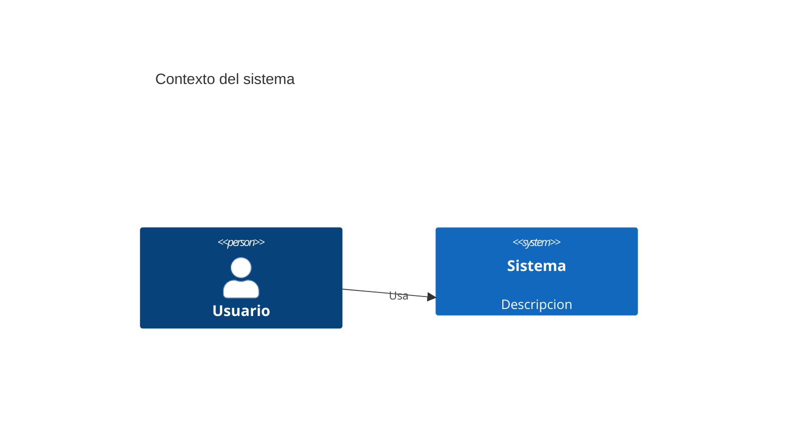

# SPEC.md — Especificacion Tecnica

> Producido por `/project-architecture-gsd`. Cumple `docs/DOC_STANDARD.md`
> (sin emojis, Mermaid obligatorio, tablas, secciones minimas, trazabilidad).

## 1. Resumen ejecutivo

<CONFIGURAR: objetivo tecnico en 3-5 lineas, alcance, fuera de alcance.>

## 2. Contexto y restricciones

| ID | Restriccion | Tipo (tecnica/negocio/legal) | Impacto |
|----|-------------|------------------------------|---------|
| CON-001 | <ejemplo> | tecnica | <ejemplo> |

## 3. Arquitectura propuesta

### 3.1 Diagrama de contexto (C4)

### 3.2 Componentes principales

<CONFIGURAR: descripcion de cada componente con su responsabilidad.>

## 4. Requisitos de seguridad derivados (de THREATS.md)

| ID | Requisito | Amenaza origen (THR-NNN) | Control |
|----|-----------|--------------------------|---------|
| SEC-REQ-001 | <ejemplo> | THR-001 | <libreria/tecnica> |

## 5. Decisiones tecnicas

<CONFIGURAR: stack, patrones, trade-offs. Referenciar ADRs cuando aplique.>

## 6. Trazabilidad

| Requisito (REQ-NNN) | Componente | Caso de prueba (TC-NNN) |
|---------------------|-----------|-------------------------|
| REQ-001 | <componente> | TC-001 |

## 7. Definition of Done

- [ ] Todas las secciones completas (ver `docs/DOC_STANDARD.md` seccion 2.1)
- [ ] Diagrama C4 incluido
- [ ] Cada SEC-REQ trazable a una amenaza
- [ ] Cero emojis
