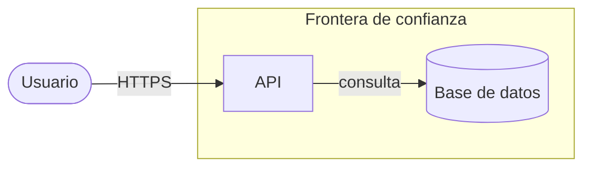

# THREATS.md — Modelo de Amenazas (STRIDE)

> Producido por `/project-architecture-gsd` o `/security-audit`. Cumple `docs/DOC_STANDARD.md`.

## 1. Activos y actores adversarios

| Activo | Criticalidad (Confidencial/Restringido/Publico) | Actor adversario | Perfil de ataque |
|--------|-------------------------------------------------|------------------|------------------|
| <activo> | Confidencial | <actor> | <perfil> |

## 2. Diagrama de flujo de datos con fronteras de confianza

## 3. Analisis STRIDE por componente

| ID | Componente | Categoria STRIDE | Vector | Probabilidad | Impacto | Riesgo |
|----|-----------|------------------|--------|--------------|---------|--------|
| THR-001 | <componente> | Spoofing | <vector> | Media | Alto | Alto |

Categorias STRIDE: Spoofing, Tampering, Repudiation, Information Disclosure,
Denial of Service, Elevation of Privilege.

## 4. Controles y mitigaciones

| Amenaza (THR-NNN) | Control | Libreria/tecnica exacta | Estado |
|-------------------|---------|-------------------------|--------|
| THR-001 | <control> | <ejemplo: argon2id> | Pendiente |

## 5. Requisitos de seguridad derivados

| ID | Requisito | Amenaza origen | Copiado a SPEC.md |
|----|-----------|----------------|-------------------|
| SEC-REQ-001 | <requisito> | THR-001 | Si |

## 6. Verificacion

- [ ] Cada agregado de DOMAIN.md tiene >=1 amenaza analizada
- [ ] Amenazas criticas/altas tienen control verificable + test
- [ ] Cero emojis (ver `docs/DOC_STANDARD.md` seccion 2.3)
